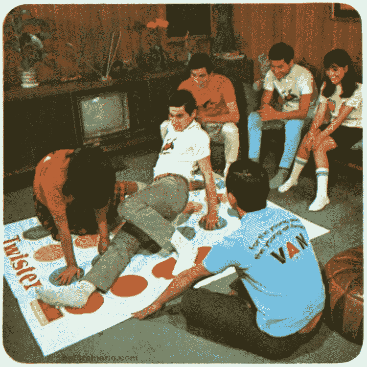
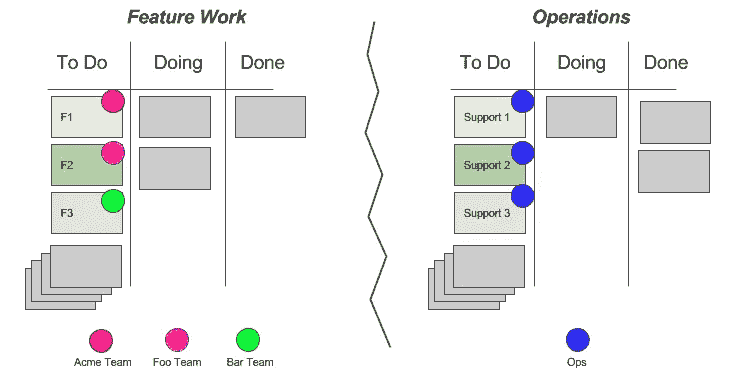
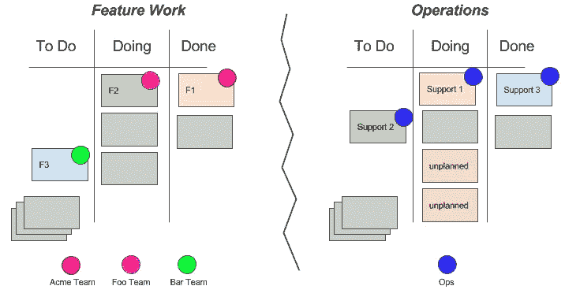
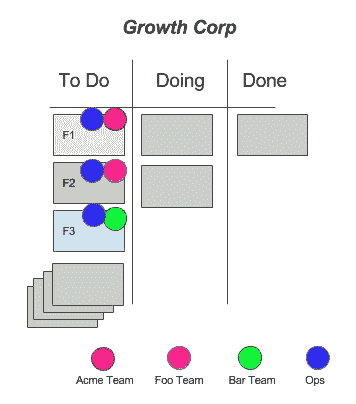
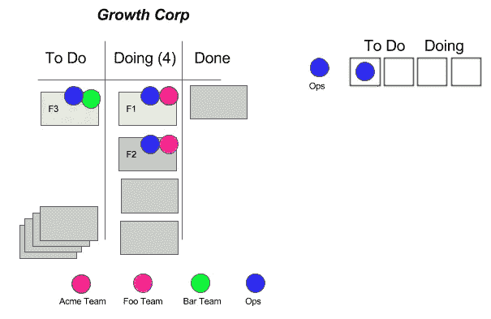
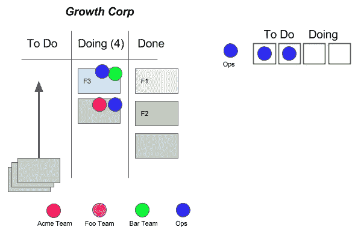

# 赢得依赖性扭转游戏

> 原文：<https://medium.com/hackernoon/winning-at-dependency-twister-d499c198aec5>

我最近写了关于[季度规划](https://hackernoon.com/surviving-quarterly-planning-7d571fb5b034)的文章。从那以后，我收到了一堆关于季度计划和依赖管理的问题。

我想更深入地探讨这个问题。

简单，简单的例子…

GrowthCorp 有三个高优先级的新功能计划(F1、F2 和 F3)。一个共享运营团队(Ops)将负责支持这些计划以及其他关键任务工作。像往常一样，运营部面临着压力…资源不足，不被信任，工作过度。

季度规划尘埃落定后，Ops 创建卡片来支持功能工作(支持 1、支持 2 和支持 3)。有两个董事会:功能工作，和一个私人操作董事会(因为当 Ops 公开他们的董事会，它得到微观管理。)

在季度初，它看起来像这样:

快到季度末了，事情看起来是这样的:

## **废话！**

**杠队**还没开始 F3，Ops 已经完成支援 3。如果 Bar 的 F3 需要改变呢？Acme 团队正在等待 Ops 完成支援 1。F2/Support 2 两队都远远落后于计划。与此同时，Ops 不得不为上个季度的劣质功能实施提供生产支持(“计划外”)。还有…当然…Acme，Foo，Bar 都在抱怨 Ops。**拿不准的时候怪 OPS。**

运营领导多年来一直倡导员工人数，但总有人打流程和效率牌。

> 走吧。无处不在的低效率！运营团队需要更好地进行预先规划和评估。你们行动组的人脾气太坏了，而且不合作。让我们先解决这些问题，然后再考虑人数。

## 好的。让我们解决这个问题。

首先，让我们将所有这些放在一块板上，并添加 Ops 作为 F1、F2 和 F3 的协作团队。我们可以将他们的任务表示为子任务或相关故事(未显示)。

接下来，让我们指出，在任何给定的时间，我们实际上只能让 Ops 做两件事(正在做),并致力于待办事项中的两件事。请注意，Ops 为待办事项准备了一块备用磁铁。我们将我们的两个功能项目(F1 和 F2)转移到 do 中，团队一起工作。

你瞧，特性问题悄悄出现了(“计划外”)。Ops 有一份工作协议，要求他们转移到生产问题上。考虑到他们不能在 F1 和 F2 上合作，特性团队蜂拥在计划外的工作上来帮助解决这个问题。

事情继续滚动…

## 概括起来

团队在努力“穿针引线”和寻找效率的每一个细节时，会遭受各种各样的自虐。这种情况在运营、UX、数据科学、研究等共享团队中时有发生。

但是在尝试进行这种优化的过程中(通常作为季度计划的一部分)，他们降低了透明度，建立了计划库存，增加了返工和罐装工作，并使大批量计划周期制度化。

如果没有一个统一的视图，共享团队将总是难以证明人数的合理性，或者将他们自己嵌入到功能团队中(或者工具化、自动化等等)。).不知何故，我们说服自己，我们可以从他们身上得到更多。

所以…重点是:

1.  试着在同一块板上想象工作(特别是当你怀疑组织的某个部分是瓶颈的时候)。
2.  朝着一个目标努力的两个团队是临时团队。让他们像一个团队一样行动。
3.  除了列的 WIP 限制之外，考虑为高度共享的团队增加 WIP 限制。
4.  减轻季度规划的影响。在最后负责的时刻处理依赖关系，减少团队猜测/预加载的数量。