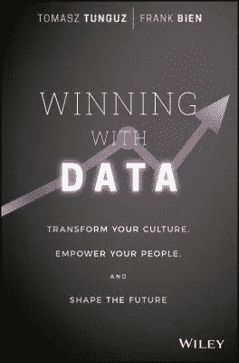
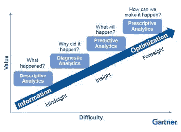

# 用数据取胜—数据驱动世界指南。

> 原文：<https://medium.com/hackernoon/winning-with-data-your-guide-to-the-data-driven-world-9369d2cada20>

几个月前，我在 AWS 峰会上与 Looker 团队进行了一次对话。我们谈了很多关于数据分析、现有解决方案和方法的问题，在我离开之前，他们的代表送给我一本书，我今天想回顾一下这本书。这本书名叫[《用数据取胜》](https://www.amazon.com/Winning-Data-Transform-Culture-Empower/dp/1119257239)，它很棒，因为它给了你一条清晰的道路，告诉你如何开始使用你拥有但可能不知道如何正确使用的数据。

这是我如此喜欢这本书的另一个原因——它来得正是时候，因为在 Scentbird，我们已经到了拥有大量可操作数据的阶段，知道从一开始就搞砸它很重要。这是作者在开头强调的问题之一。确切地说，[数据](https://hackernoon.com/tagged/data)存在四个重大问题:

1.  **数据贫乏者的数据面包线**——许多部门因为难以获取数据而遭受损失；
2.  **数据晦涩** —没有简单的方法去了解什么样的数据适合你；
3.  **数据碎片问题** —大中型组织往往会创建大量不一致的独立数据集；
4.  **数据争斗** —不同的团队以不同的方式对待相同的数据。

这些问题对于不同的组织来说都是一样的，所以这就是为什么我们可以在整个[互联网](https://hackernoon.com/tagged/internet) :
- Google 与 [Sawzall](http://research.google.com/archive/sawzall.html) 和 [Dremel](http://research.google.com/pubs/pub36632.html)
-脸书与 [HiPal](https://www.facebook.com/note.php?note_id=89508453919)
- [AWS 红移](https://research.neustar.biz/2013/05/16/aws-redshift-how-amazon-changed-the-game/)
等等。

但是你不应该在那个规模上成为数据驱动的。这里有一些来自中小型企业的例子:
-[real real](https://www.therealreal.com/)每天都使用报告来了解他们的运营和收入情况，以及他们应该如何调整他们的营销和商品计划来改善这种情况。
- [ThredUp](https://www.thredup.com/) 被评为美国最有前途的公司之一，拥有非常复杂的运营，每天需要处理和编目数以千计的商品，因此数据驱动的方法有助于他们的团队实现 KPI，了解客户参与度并了解总体趋势。还有更多来自 Zendesk、Warby Parker、HubSpot 和 DonorsChoose 的例子。

那么，如何才能成为一家数据驱动的公司呢？通常，有一些基本步骤:

1.  **问工程师**——每次你的业务团队想要什么，他们都会问一个开发人员
2.  **访问原始数据** —您的开发团队创建了一个简单的解决方案，允许导出原始数据(例如以 CSV 格式)
3.  **自带 BI (BYOBI)** —用于解决数据问题的内部解决方案(听起来是个不错的解决方案，但仍需要技术和业务团队密切合作)
4.  **数据结构** —下一级 BI，帮助业务团队以或多或少方便的方式访问数据(如 [Looker](https://looker.com/) 、 [RJMetrics](https://rjmetrics.com/) 、 [Chartio](https://chartio.com/) 等)。)

但即使是最好的工具也只是工具，你应该非常小心避免数据偏差。最常见的是“生存偏差”

> 第二次世界大战期间，统计学家亚伯拉罕·瓦尔德在考虑如何尽量减少敌人炮火造成的轰炸机损失时，将幸存偏差纳入了他的计算中。海军分析中心的研究人员对从任务中返回的飞机的损坏进行了研究，并建议在损坏最严重的地方增加装甲。沃尔德指出，这项研究只考虑了完成任务后幸存的飞机——被击落的轰炸机没有出现在损害评估中。返回的飞机上的洞，代表了轰炸机可能遭受损坏但仍能安全返回的区域。沃尔德建议海军加强返航飞机毫发无损的区域，因为这些区域如果被击中，会导致飞机失事。([维基百科](https://en.wikipedia.org/wiki/Survivorship_bias))

在脸书有一个对抗“生存偏见”的有趣案例。

避免这种情况的一个方法是像在 Zendesk 中一样教导你的所有团队:

*   **SQL** —人们学习询问数据问题的最基本语言
*   **数据架构** —在哪里可以找到所有不同的数据集
*   **数据字典** —对关键指标及其定义的回顾
*   **案例研究** —对以前问题的描述以及这些问题是如何解决的
*   **基本统计概念**
*   **用数据讲故事** —如何用数据和视觉化构建论点
*   **可操作性** —确定该数据分析是否会导致公司运营方式的切实改变

当这些步骤完成后，最后到了最有趣的部分——问正确的问题。

[https://logianalytics.com/definitiveguidetoembedded/the-future-of-embedded-analytics/](https://logianalytics.com/definitiveguidetoembedded/the-future-of-embedded-analytics/)

在 Gartner 数据复杂性之旅的第 2 步和第 3 步之间，我们可以找到这一点。这个缺失的步骤被称为[探索性数据分析](https://www.amazon.com/Exploratory-Data-Analysis-John-Tukey/dp/0201076160)由 John W. Tukey 在大约 40 年前描述。探索性数据分析最重要的一点是，很容易理解你的问题有多好，只需回答“该分析将为哪些决策提供信息？”所以，无论你做什么样的分析，都应该遵循正确的行动。

最后但并非最不重要的一点是，你应该知道如何展示你的数据，这样它就容易理解，不枯燥，而且可操作。我计划在下一篇关于数据可视化的[书评](https://www.amazon.com/gp/product/1119002257/ref=oh_aui_detailpage_o02_s00?ie=UTF8&psc=1)中讨论这个主题。

《用数据取胜》是一本很棒、很有趣的书，我推荐你阅读。

附:这本书有很多有用信息的链接，我想分享其中一些:

*   [脸书的数据仓库和分析基础设施](http://borthakur.com/ftp/sigmodwarehouse2010.pdf)
*   [使用亚马逊红移固态硬盘，查询 1tb 的数据不到 10 秒](https://www.flydata.com/blog/with-amazon-redshift-ssd-querying-a-tb-of-data-took-less-than-10-seconds/)
*   [企业如何决策以及如何做得更好](http://www.datascienceassn.org/content/decisive-action-how-businesses-make-decisions-and-how-they-could-do-it-better)
*   [领先的组织如何采用数据驱动的文化](https://hbr.org/resources/pdfs/tools/17568_HBR_SAS%20Report_webview.pdf)
*   [为什么谷歌有 2 亿个理由将工程师置于设计师之上](https://www.theguardian.com/technology/2014/feb/05/why-google-engineers-designers)
*   [为什么 Intuit 创始人斯考特·库克希望你不要再听老板的话](https://www.fastcompany.com/3020699/bottom-line/why-intuit-founder-scott-cook-wants-you-to-stop-listening-to-your-boss)
*   [通过讲故事让数据更有意义](https://www.youtube.com/watch?v=6xsvGYIxJok)
*   [引起共鸣:呈现改变观众的视觉故事](https://www.amazon.com/Resonate-Present-Stories-Transform-Audiences/dp/0470632011)

> [黑客中午](http://bit.ly/Hackernoon)是黑客如何开始他们的下午。我们是阿妹家庭的一员。我们现在[接受投稿](http://bit.ly/hackernoonsubmission)并乐意[讨论广告&赞助](mailto:partners@amipublications.com)机会。
> 
> 如果你喜欢这个故事，我们推荐你阅读我们的[最新科技故事](http://bit.ly/hackernoonlatestt)和[趋势科技故事](https://hackernoon.com/trending)。直到下一次，不要把世界的现实想当然！

