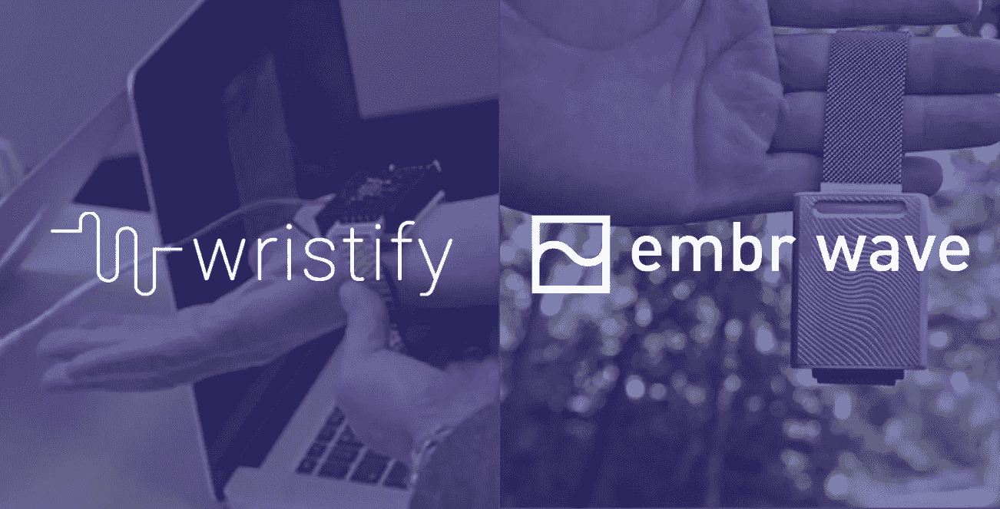
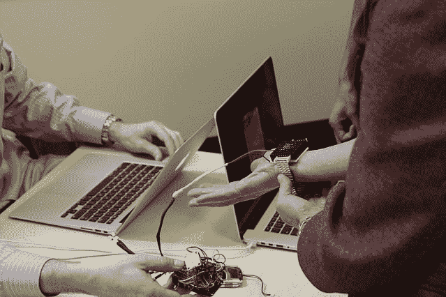
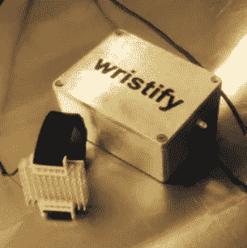

# 《连线》报道了我们的产品名称。这就是为什么我们仍然决定改变它。

> 原文：<https://medium.com/hackernoon/wired-covered-our-product-name-heres-why-we-still-decided-to-change-it-b4181fb31e49>

在过去的四年里，我一直在开发一款名为 Wristify 的产品，它有幸得到了来自 [Wired](https://www.wired.com/2013/10/an-ingenious-wristband-that-keeps-your-body-at-the-perfect-temperature-no-ac-required/) 、[科普](http://www.popsci.com/article/gadgets/bracelet-could-shrink-your-energy-bill)和[今日秀](https://www.today.com/video/today/57117329)的媒体报道。尽管有这个名字和数百万的印象，我们的团队还是决定取消 Wristify 这个名字。

**在这篇博文中，我想告诉你‘Wristify’这个名字从出生到死亡的故事，以及从它的灰烬中诞生的产品名称。**

该产品将于今年 9 月推出，但让我们从头开始。

# “Wristify”这个名字于 2013 年在麻省理工学院诞生。

我和我的联合创始人聚集在 Muddy Charles 酒吧，为我们的 [MADMEC 项目创意](http://news.mit.edu/2013/madmec-design-competition-1017) **想出一个团队名称，通过直接为人们供暖和制冷来帮助建筑物节约能源**。我们的原型可以戴在你的手腕上，所以我们厚脸皮地决定称之为 Wristify。

*Proof of Concept 1.0 (Fall 2013)*

自从我们在那家酒吧聚会以来的近四年里，Wristify 进化了如此之多，以至于我们意识到它本质上是一个新物种。一个新物种需要一个新名字。

当 Wristify 项目赢得 MADMEC 竞赛时，博客和记者们写下了 Wristify 将如何取代空调的故事。因此，大多数听说过 Wristify 的人仍然认为这是我们腕带的设计目的。与此同时，对于第一次听说这个名字的人来说,“Wristify”这个名字并没有传达出太多有用的信息，只不过它是戴在手腕上的。

与此同时，我们发现，我们的本地化加热和冷却技术解决了一个比帮助建筑节能更私人的问题:当你感觉比周围其他人更热或更冷时，它会帮助你感到舒适。

正是这种优势，我们花了两年时间来设计和制造我们的产品。我们开始与舒适科学领域的专家(T1，T2)合作(T3，T4，T5 ),并爱上了触觉(T7 ),最终的产品提供了个性化的散热需求(T8，T9)——与 Wristify 最初的想法相去甚远。

Proof of Concept 1.5 (Spring 2014)

# 一旦我们意识到我们正在制造的产品不是人们所说的 Wristify，我们知道我们必须改变名称。

给一个产品命名就像给一个孩子命名一样(这是我的联合创始人大卫在 4 月份和他的第一个儿子一起做的)，所以我们做的第一件事就是列出一个产品名称创意的清单。

我们在会议上回顾我们的清单，进行场外头脑风暴来创造新的想法，并向我们的朋友、家人和其他重要的人征求反馈。

最终，答案就在我们面前，而且我们已经用了好几年了:

**Embr 波。**

Embr Wave 是我们过去两年在内部称之为本地化加热和冷却技术的技术。它让人想起灰烬的温暖和海浪舒缓的节奏。这也让我想起了大热天把脚趾浸在海里的清爽感觉。

‘Embr Wave’这个名字我们一大声说出来就觉得对了，2017 年 8 月 16 日美国东部时间上午 10:57 Wristify 这个名字就传了过去。我们将永远记得这个 MADMEC 学生项目和原型，它催生了 Embr 实验室和 Embr Wave。

# 随着“Wristify”这个名字的消失，Embr Wave 诞生了。

我们非常高兴能够帮助每个人通过 Embr Wave 体验**按需个性化散热**的强大功能。

**我们将于今年 9 月推出 Embr Wave。**

## [*加入我们的邮件列表，以便获得关于特别产品发布价格的通知。*](https://embrlabs.com)