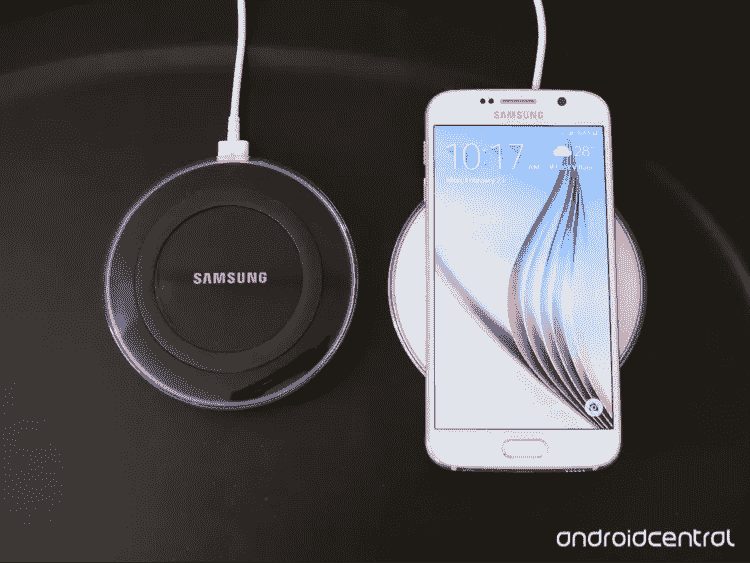
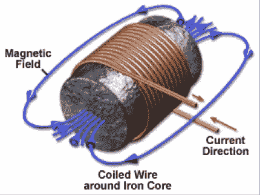

# 无线充电:没有电线的世界

> 原文：<https://medium.com/hackernoon/wireless-charging-a-world-without-wires-2ee2a33fb3e2>

“这是什么爷爷？”一个小女孩问道，她手里拿着一个白色塑料小方块，上面有一根长长的拖绳，在一个满是灰尘的旧鞋盒里翻找着。“为什么那是旧 iPhone 的充电器，”她的祖父伤感地回答，“我们已经很多年没用过它了。”

众所周知，我们正走向无线的未来。几十年来一直是这样发展的。

第一部[无绳电话](https://en.wikipedia.org/wiki/Cordless_telephone)开发于 1964 年。

第一部[手机](https://en.wikipedia.org/wiki/History_of_mobile_phones#Handheld_mobile_phone) : 1973 年。

[笔记本电脑](https://en.wikipedia.org/wiki/Epson_HX-20) : 1982 年。

[无线音乐音箱](http://www.nytimes.com/1999/09/20/business/patents-new-wireless-systems-try-away-with-tangle-restrictions-speaker-cables.html) : 1999 年。

当然还有 2016 年的 [AirPods](http://www.apple.com/airpods/) 。

所以现在我们正在寻找切断设备充电线的方法。我们朝着这个方向迈出了第一步，那就是使用可充电电池。这给了我们几个小时的时间来笨拙地将我们的设备连接到难看的电线上。但是是时候结束了。

自 2015 年以来，三星生产了一款大众市场[无线充电系统](http://www.samsung.com/us/mobile/mobile-accessories/phones/fast-charge-wireless-charging-pad-black-sapphire-ep-pn920tbegus/?cid=us_pla_google-8875160598-cam=US_IMECOM_PLA_Buy_MobilePhones)。它本质上是一个可以放手机的垫子。

但是要插在墙上……？让我们直截了当地说吧，我们用冰球代替了电线，冰球需要自己的电线。

嗯…

苹果，你有什么发现吗？

 [## 苹果最早将于 2017 年开发无线充电 iPhone

### 苹果公司正在与美国和亚洲的合作伙伴一起开发新的无线充电技术，这种技术可以…

www.bloomberg.com](https://www.bloomberg.com/news/articles/2016-01-29/apple-said-developing-wireless-charged-phone-for-as-soon-as-2017-ijz3i4si) 

听起来好多了！所以现在我们拭目以待。[苹果](https://hackernoon.com/tagged/apple)已经公开他们打算将无线充电集成到他们的设备中，他们刚刚[加入了](https://www.engadget.com/2017/02/13/apple-joins-wireless-power-consortium/)无线电力联盟，大概是为了这个行业的标准技术而工作。接下来的问题只是时间和功能。苹果今年会给我们带来比三星更多的冰球吗？我们将不得不等等看。但是这个行业正朝着正确的方向发展。在未来，由于环境充电，我们将能够只需走进房间就能给手机充电。

这很好，但是它是如何工作的呢？我想是科学。

在最基本的层面上，无线充电只需要两样东西:磁铁和电线。当这根电线缠绕在磁铁上时，它会产生运动电荷。

这种现象被称为磁场，它允许手机在没有物理连接的情况下充电。现在，三星采用冰球方法的原因是因为电荷强度随着衬垫和手机之间距离的平方而下降……我会让更聪明的人来解释这一点。

 [## 无线充电是如何工作的？

### 如果你曾经解开过电线和绳索的死结，或者见过你 2 岁的孩子吮吸你的笔记本充电器，你…

www.livescience.com](http://www.livescience.com/50536-what-is-wireless-charging.html) 

因此，需要克服的最大障碍是制造足够强的电磁场来为远距离设备充电的相关成本。但是这个基本的想法已经存在了 100 多年了。尼古拉·特斯拉创造了[第一个大规模的尝试](https://en.wikipedia.org/wiki/Wardenclyffe_Tower)命名为沃登克利夫大厦。然而，令人惊讶的是，由于资金原因，它被放弃了。不过，在小范围内，这些被称为特斯拉线圈的线圈确实在工作。

因此，我们只能等待无线充电技术变得足够好，价格足够低，才能让环境充电成为现实。但是我们正朝着一个不可思议的地方前进。想象一下无线充电变得像今天的 Wi-Fi 一样无处不在。请记住，在 Wi-Fi 出现之前，我们必须使用以太网电缆(电线)将设备接入互联网。有了环境充电，无论你在家里的什么地方，你的手机都可以从口袋里充电。一辆优步会载着你，环境充电会包围你。想象一下，城市街区的路灯配备了无线充电设备，当你走在街上时，你的手机会充电。

这样的例子不胜枚举，但最终结果都是一样的:我们再也不会给手机充电了。为什么仅仅停留在电话上？想想任何家用电器，汽车，公共汽车等。现在，如果我们能找出电池…

 [## 特斯拉超级工厂|特斯拉

### 位于内华达州斯帕克斯附近的特斯拉超级工厂到 2020 年将年产 35 千兆瓦时的电池。

www.tesla.com](https://www.tesla.com/gigafactory) 

点击这里关注马修·比金斯或者 T2 的 LinkedIn 了解更多

> [黑客中午](http://bit.ly/Hackernoon)是黑客如何开始他们的下午。我们是 [@AMI](http://bit.ly/atAMIatAMI) 家庭的一员。我们现在[接受投稿](http://bit.ly/hackernoonsubmission)并乐意[讨论广告&赞助](mailto:partners@amipublications.com)机会。
> 
> 如果你喜欢这个故事，我们推荐你阅读我们的[最新科技故事](http://bit.ly/hackernoonlatestt)和[趋势科技故事](https://hackernoon.com/trending)。直到下一次，不要把世界的现实想当然！

