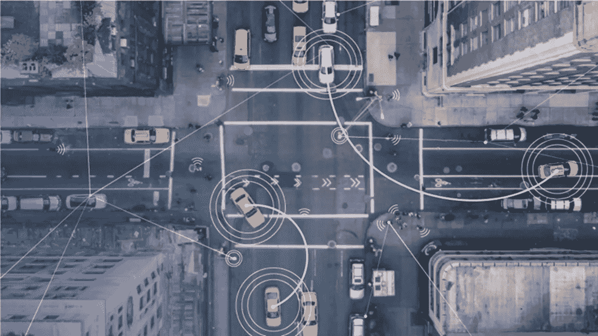
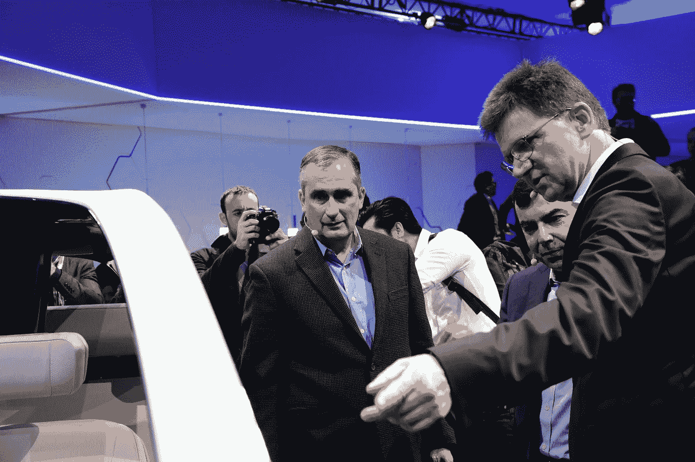
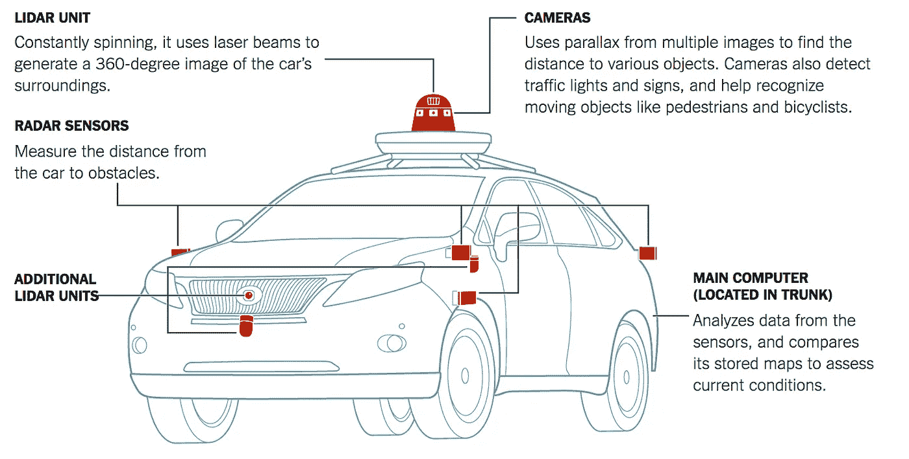
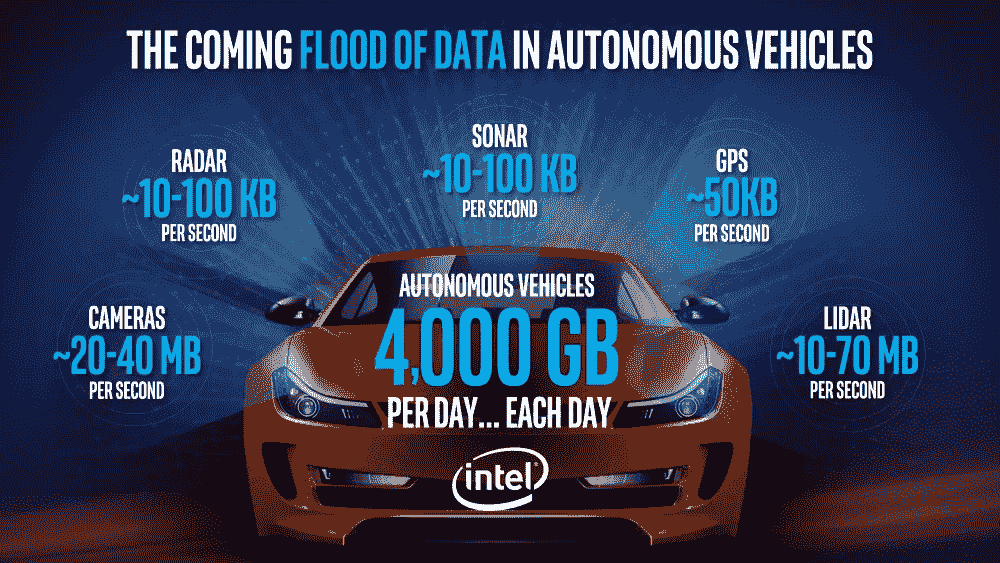

# 借助英特尔+ Mobileye，世界各地的行业基础设施都在发生变化

> 原文：<https://medium.com/hackernoon/with-intel-mobileye-industry-infrastructure-everywhere-is-changing-65fb888d148b>

## 这个故事是由 Comet Labs 的创始人 Saman Farid 撰写的。

Image source: [Intel & Mobileye Acquisition Announcement](http://intelandmobileye.transactionannouncement.com/)

# **TLDR；**

英特尔对 Mobileye 的收购提醒人们，汽车行业基础设施的根本性转变正在进行中——这主要是由计算能力的大幅提高引起的，计算能力可以**感知、理解、**和**作用于物理世界。在以前大公司占主导地位的地方，新的创业公司正在涌现，挑战我们对汽车公司的看法。其中一些将有机增长(如特斯拉)，一些将被现有公司收购。Comet Labs 相信，在接下来的几年里，将会有更多的人加入到解决堆栈的每一部分——这一趋势将会复制到每一个主要行业——农业、专业服务、零售、建筑等。换句话说…未来就在眼前。**

因此，150 亿美元是一大笔钱。

当英特尔收购 Mobileye 的消息公布时，许多技术社区(乃至整个世界)的人都对这个价格嗤之以鼻。尤其是紧随英特尔收购 nerv ana(4 亿美元)和 Movidius(据报道也约 4 亿美元)之后。英特尔一直在烧钱。

尽管许多投资者和汽车领域的资深人士表示震惊，但我(以及 Comet Labs 团队的其他成员)认为，英特尔的前瞻性思维值得认可。

事实上，我们相信我们刚刚看到了开始。为这个新的人工智能生态系统建立的第一批公司才刚刚进入青春期——在这个阶段，你不知道自己应该做什么，而是整天玩视频游戏。但互联网革命和移动革命做不到的，人工智能会做到。它将彻底改变每个行业的运作方式，从农业到建筑，从零售到运输，从安全到物流。到处都在建造公司，要么被现有公司收购，要么成为下一批财富 500 强。

Intel CEO Bryan Krzanich & Mobileye CTO Amnon Shashua | Source: [Intel & Mobileye Acquisition Announcement](http://intelandmobileye.transactionannouncement.com/)

**基础设施和应用:技术跷跷板**

在每一次技术革命中，我们都会看到**基础设施**首先建成:TCP/IP、移动通信、芯片组、浏览器、智能手机摄像头等等。开发这些技术的公司倾向于合并，导致少数大公司主导技术开发。整合通常是高开发和生产成本、标准激增以及开发者社区的必要性的结果，初创公司无法与之竞争。(例如高通、英特尔、谷歌、AWS)通往盈利的道路往往很漫长，而建立有意义的企业的机会很少。大多数将在早期获得。其他人将不幸失败。然而，当技术发展出现翻天覆地的变化时，就像目前人工智能的情况一样，许多新公司有机会在成立之前“拥有】堆栈*的某些部分。然后，估值飙升，现任者渴望收购新的“业务部门”，担心自己可能会错失良机。*

随着基础设施开发的浪潮，出现了基于基础设施的**应用**热潮。因为应用程序公司通常是为挑剔的客户构建的(你的产品必须工作！)，死亡率迅速增加，并经常被认为是一个高风险的业务开始。然而，由于壁垒没有那么高，应用公司通常比基础设施公司多 100 到 1000 倍。对于合适的创始人来说，机会是巨大的，他们了解自己的市场，知道如何构建解决方案(而不是产品)并知道如何分发它们。

直到基础设施再次改变。

Image Source: [NY Times Guilbert Gates](https://www.nytimes.com/interactive/2016/12/14/technology/how-self-driving-cars-work.html) | Source: Google | Note: Car is a Lexus model modified by Google.

**Mobileye 有机会成为基础设施供应商。这与英特尔的定位非常契合。**

自从个人电脑和服务器发明以来，英特尔一直是它们的基础设施供应商。然而，随着高通在移动领域领先，英伟达的 GPU 主导了机器学习云平台，英特尔必须找到一种方法来确保它不会错过下一场重大革命:**智能机器**。Movidius 和 Nervana 都为下一代计算提供了机会，无论是在边缘还是在云中。

但是 Mobileye 提供了他们两个都不能提供的东西。

除了芯片技术，Mobileye 还拥有向汽车制造商销售的信誉、渠道和独特性。他们是唯一一家商业规模的自动驾驶或驾驶辅助技术供应商。更重要的是它在过去几年中苦心经营的信任社区和供应商关系(理解:整合)。

与此同时，英特尔拥有基础设施，几十年来一直生产世界上最好的计算机芯片，这使其成为 Mobileye 满足不断增长的需求的理想合作伙伴。他们的成功依赖于两个团队在全球范围内的有效合作。

那么，我们如何实现一切自主呢？

Mobileye 和英特尔只是一个开始。他们的统治力肯定会是一股不可忽视的力量。英特尔的生产能力和管理能力与 Mobileye 的算法和供应商关系相结合，使他们成为任何试图制造自动驾驶汽车的人的动力。但是比赛还远没有结束。

构建更专业化解决方案的创业公司(未来可能会在 Mobileye 的堆栈上)会慢慢开始发现，通用平台或解决方案并不适合每个用例。渐渐地，新一代的技术公司将会出现，提供更加专业化的“基础设施”层，你可以打赌，英特尔不会很快再支付 150 亿美元。英特尔最好趁现在还能给 R&D 打气。

Source: [Intel & Mobileye Acquisition Announcement](http://intelandmobileye.transactionannouncement.com/)

**从投资者的角度来看，这次收购意味着什么？会吓跑创业公司吗？**

因为我们交通实验室的应用程序已经全面启动了几个月，我们一直在与初创公司和潜在的企业合作伙伴会面，以更好地了解他们的个人目标以及围绕自动驾驶汽车的基础设施是如何发展的

不久前，当自动驾驶汽车刚刚进入主流时，初创公司正在尝试全栈式自主解决方案，这意味着他们已经开发了整个系统。大型原始设备制造商(如福特、通用、奥迪等)很快将此视为启动内部工程团队的机会，并尽快收购了这些初创公司。现在，我们感觉到一种趋势，即原始设备制造商将放缓(如果不是完全停止)收购全栈初创公司，而是瞄准高度专业化的初创公司。如果他们的团队已经在开发自己的解决方案，他们为什么还要收购另一家全栈创业公司呢？

输入英特尔和 Mobileye。从一开始，Mobileye 就只有一个重点，那就是完全掌握汽车内部实现计算机视觉的芯片。他们现在看到他们的专业化战略真的，真的，真的有了回报。

英特尔不是原始设备制造商，但他们确实能从基础设施领域获益良多。他们也可以使用 Mobileye 的分销渠道分销他们的其他产品。

我们认为这次收购将向其他创业公司(湾区已经有很多了)发出一个信号，即专注于一个特定的组件或功能是大多数机会所在。值得注意的是，英特尔不是原始设备制造商——收购者的范围已经超出了汽车品牌。我们最近采访的主要汽车零部件供应商现在对创业公司比以往任何时候都更感兴趣。他们知道，如果他们能够利用初创公司已经取得的成就，他们就可以利用现有的基础大规模推广该技术，并通过他们的 OEM 客户赚大钱。

展望未来，期待看到更多专注于智能组件的初创公司。汽车零部件供应商和供应链上游的其他公司将寻求收购并加入竞争。在这个过程中，随着我们越来越接近自动驾驶汽车，我们将看到汽车基础设施的重大重新设计。

如果这个故事引发了一些想法，点击推荐按钮，订阅[Comet Labs 时事通讯](http://eepurl.com/bHt88L)获取更多有趣的人工智能和机器人故事。

> [黑客中午](http://bit.ly/Hackernoon)是黑客们开始他们下午的方式。我们是 [@AMI](http://bit.ly/atAMIatAMI) 家庭的一员。我们现在[接受提交](http://bit.ly/hackernoonsubmission)并很高兴[讨论广告&赞助](mailto:partners@amipublications.com)机会。
> 
> 如果您喜欢这个故事，我们建议您阅读我们的[最新科技故事](http://bit.ly/hackernoonlatestt)和[趋势科技故事](https://hackernoon.com/trending)。直到下一次，不要把世界的现实视为理所当然！

