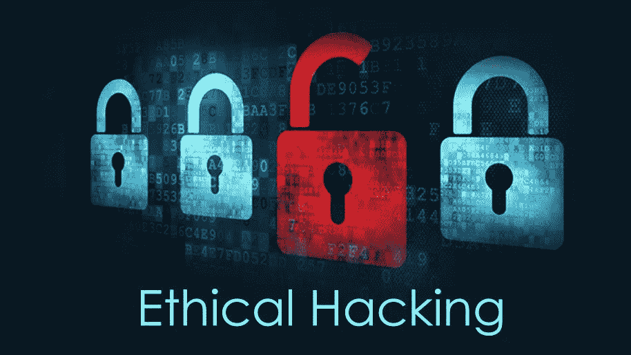

# 信息安全领域的女性:Isly

> 原文：<https://medium.com/hackernoon/women-in-information-security-isly-740200227abc>

[Ethical Hacking graphic by Snnysrma](https://commons.wikimedia.org/wiki/File:Ethical-hacking.jpg), [CC SA 4.0](https://creativecommons.org/licenses/by-sa/4.0/)

去年秋天，我采访了六名女性和非男性，他们在网络安全领域有着令人兴奋的职业生涯。这些文章都发表在 [Tripwire 的安全博客](https://www.tripwire.com/state-of-security/)上。

理想情况下，我们这个领域的所有人，无论性别、种族、民族、年龄、国籍和性取向，都会被简单地视为“从事信息[安全](https://hackernoon.com/tagged/security)工作的人”不幸的是，我们在一个男性主导的领域工作，有时处理性别歧视会影响我们的职业生涯。

我认为鼓励更多女性和跨性别者考虑从事网络安全职业尤为重要。因此，我的采访系列聚焦于我们领域中一些最聪明的头脑——他们只是碰巧不是男性。

我的系列很受欢迎。所以，当春天到来时，我决定继续下去。在我写这篇文章的时候，大部分新的采访已经完成了，他们相应的文章也已经发给了我在 Tripwire 的编辑。你可以期待它们在未来几周发布在 Tripwire 的博客上，可能从四月份开始。

在那之前，我决定在这里重新发布我去年秋天的采访系列。请享用它们！

如果你能拿出一些钱，请考虑为我的 Patreon 捐款。我在媒体上发表的文章没有报酬，我从慷慨的赞助人那里收到的零星的钱帮助我继续前进。谢谢大家！

还有一种方法可以帮助我，而且一点也不花你钱。如果你喜欢我的文章，点击绿色小心脏，它会帮助我的知名度。最欣赏！

信息安全领域的女性作为少数群体，理应受到关注。之前，我采访过目前在美国工作的苏格兰安全分析师 Tiberius Hefflin 和从图书馆科学转到信息安全领域的女性 Tracy Maleeff，她现在是 PVCSec 播客的主持人，经营着自己的信息安全业务。

近年来，那些不完全认同二元性别(男性或女性)的人变得更加引人注目。我认为公开的非二进制的人在我们的领域比二进制的女性更不显眼。Isly 是一名非二进制女性，她是国防工业的渗透测试员。

**金·克劳莱**:嗨，伊斯利！你如何描述你的工作和头衔？

Isly: 我是一家国防承包商土木部门的渗透测试员。

听起来相当激烈！

我:我们都很放松。

十多年前，我的(现已是前夫的)丈夫为加拿大军队做过测试。你有最喜欢的测试套件吗？

我:如果不是公务员而是政府，我肯定会毫不犹豫地去那里工作。我们有些人仍然是现役预备役军人。

套房？嗯。取决于订婚，真的。我刚做了一个新的约定，我们利用了马尔特戈。我大多坚持使用 Kali，有时使用 Metasploit。我坚持使用 Linux。

那有很多插件吗？我最熟悉的是 OpenVAS。

我:嗯，我们不做扫描，真的。我们有另一个团队。大多数情况下，我们做黑盒和模糊，然后跟进 Nessus 的任何我们可能已经错过了。我们中的一些人专门研究[工业控制系统](https://www.tripwire.com/solutions/industrial-control-systems/) (ICS)/SCADA，所以他们有自己的工具。事实上，我们下周要学德拉迪斯。

我认为 Kali 的最早版本在包和特性方面都是不完整的。但是最新的版本有了很大的改进。

是的，我也是这么听说的。挺有用的。

你做过大量的 SCADA 工作吗？如何看待有人炒作 SCADA IoT？我认为 SCADA 系统应该只连接到私有的内部网络。

我:我没有做过，但我的导师和同事做过，我相信我会在明年内做到。如果他们正在考虑基于 SCADA 的物联网，这让我感到紧张。它们非常容易受到攻击，当一个多米诺骨牌在 ICS 布局中倒下时，它们都会倒下。

**KC:** 我们这些了解信息安全的人很担心，但那些官员通常不听。

**I:** 还有，很多使用 SCADA 的人把横向网络上的所有东西都连接到它上面。那很成问题。

**KC:** 您见过公用事业公司因此而经历停机吗？

我:我个人没有，但我的一些朋友在过去几年中已经意识到订婚的必要性。他们是我的同事，所以我相信消息来源。

KC: 当它影响到像核能和消毒水这样的东西时，这尤其可怕。

我:是的，那些事情很恐怖，我同意。这可以安全地完成，但是需要仔细的计划。

**KC:** 那么，你是怎么进入 infosec 的？

**我:**我一开始是一名 Linux 系统管理员，我的公司需要滥用部门的帮助。我在那里干得不错，然后进入了虐待部门的管理层。

但后来我太喜欢这项工作的技术含量了，所以我转向了信息安全的其他领域。

所以，一定有什么事情让你首先进入了系统管理。

我:我在一个完全不相关的领域工作了十年。我搬家了，而且不允许我保留我的工作。我被解雇了。在七个月没有工作后，我终于申请了 sysadmin 工作的技术支持，所以是最底层的。

事实证明，我有这方面的诀窍，在五年内从最低级别升到了行政管理和技术管理。

KC: 从一个 helpdesk 后台，我一直以为*是 IT 的最底层。我认为系统管理可能会更有压力，但一般来说报酬会更高。*

*是的，服务台、呼叫中心、聊天……都是很低级的。我很高兴我的公司给了我一个获得系统管理员的机会。更复杂的问题也有好的一面:账单和人们在我耳边大喊大叫的问题减少了。*

*你的雇主意识到你的性别身份了吗？*

***我:**是的。我在行政部门的职位越高，女性越来越少。*

*你有没有感觉到你不得不与电影中的性别歧视作斗争？*

*我是行政部门第一个非男性的技术领导，是公司有史以来的第一个行政主管。所以是的，我做到了。我觉得我必须加倍证明自己。我格外努力地工作。扮演这个角色的男人并没有尽自己的本分。*

***KC:** 在你进入公共部门之前，你有很多私营部门的经验吗？*

*我:没有，我没有在私营部门工作的经验。我的雇主很少，因为一旦我喜欢某个地方，我就会留下来。这有点违背人们现在的做法，为了更好的生活，每一两年就换一份工作。现在人们期望这样做。*

*我想你在这方面算是幸运的。除了我长期的服务台工作，我所有的信息安全工作都在收缩。*

*我:我是一名全职顾问，幸运的是我没有签合同，我的很多同事已经在这家公司工作了好几年，并且很享受这份工作。很适合家庭生活。那也可以让你旅行。*

***KC:** 好的。你看，我在写 CISSP 和 CEH 项目的学习材料，我不得不自学。我用那种方式学习那些考试，那是倒退。*

***I:** 自学也是一样，我上一份做安全系统管理员的工作只是浅尝辄止。除了安全+之外，他们不想为任何东西付费，与外面的东西相比，安全+是垃圾。*

*你认为信息安全公司的雇主会变得越来越吝啬吗？*

***我:**我真的说不上来。那个雇主不是信息安全公司的雇主。他们只是需要一些对安全性的关注，所以这不是他们的主要关注点。如果你想要 RHCSA/RHCE，他们会付钱给你并给你升职。*

*在这个雇主这里，他们真的很在乎。我签约了 OSCP 一家支付 90 天费用的实验室，因为他们认为这是一个很好的认证。我们每年都有一次付费培训或证书。他们还参与了更大的安全会议。*

*你应该数一数你的福气。*

*我:我真的喜欢。我在 Twitter 上的一位女性朋友被要求每年在四次大会上发言，但我不知道 certs 的情况。我肯定他们也提供，但他们是她工作的大公司。*

*你认为你对社会进步产生了影响吗？*

*我:哦，是的。也就是说，这些年来，我一直在做技术工作。所以一直很少有女性或非男性。*

*也就是说，我有纹身，一些小的面部穿孔和有色头发。我让后两个看得见，但端庄，穿长袖。在我得到现在的工作之前，我申请了大约 20 份工作，那只是因为一个在那里工作的朋友介绍我来的。所以，是的，我很难接受我现在的样子。*

*你不能仅仅证明你可以对一个恶意软件进行逆向工程(这显然不是 Stuxnet？)*

***我:**我不知道怎么逆向工程！我申请了 SOC 分析师的职位，因为我不认为我能做任何更复杂的事情，因为我只是一个读取日志的系统管理员。但有了这家店，我申请了一个 SOC 分析师的职位，他们觉得我有能力进行测试，所以我来了。一天下来我没有太多的自信。*

***KC:** 我认为如果你没有一堆度量监视器和日志分析软件，所有这些日志分析都会伤害你的眼睛。但是接下来，如果日志分析软件出现了灾难性的 bug 怎么办？*

*我:我在以前的工作中没有使用软件的特权。我已经非常习惯使用“less”、“grep”和“regex”来提取我找到的内容。*

*哇，我对你格外尊重。但是回到女性在信息安全领域的想法，当我们 99%的人似乎都是男性时，你认为这对这个领域有害吗？缺乏多样性？*

*I: 是的，但这可能会蔓延到 IT 世界的很大一部分。我认识的女性和非男性开发人员比我在信息安全领域认识的还要多。我想，在一个 26 人的团队中，我可能只是三个非男性成员之一。在我以前的管理员工作中，这个比例更低。对技术支持来说更糟。尽管那里有很多女性从事非技术性工作，比如销售和记账。*

*对于一个对信息安全职业感兴趣的年轻女孩来说，如果她正在读这篇文章，你会说些什么？*

*我会引用 Dual Core 对他自己的歌词的解释，说:“找到所有的线索，破解所有的东西。”*

***KC:** 让物联网芭比说“数学是*而不是*难”*

***我:**哈，物联芭比！我忘了它的存在。*

*如果你喜欢我的文章，有两种方法可以帮助我。*

*首先，你可以点击小绿心来推荐我的文章。*

*其次，你可以给我的病人捐一点钱。谢谢大家！*

******

> *[黑客中午](http://bit.ly/Hackernoon)是黑客如何开始他们的下午。我们是 [@AMI](http://bit.ly/atAMIatAMI) 家庭的一员。我们现在[接受投稿](http://bit.ly/hackernoonsubmission)并乐意[讨论广告&赞助](mailto:partners@amipublications.com)机会。*
> 
> *如果你喜欢这个故事，我们推荐你阅读我们的[最新科技故事](http://bit.ly/hackernoonlatestt)和[趋势科技故事](https://hackernoon.com/trending)。直到下一次，不要把世界的现实想当然！*

**