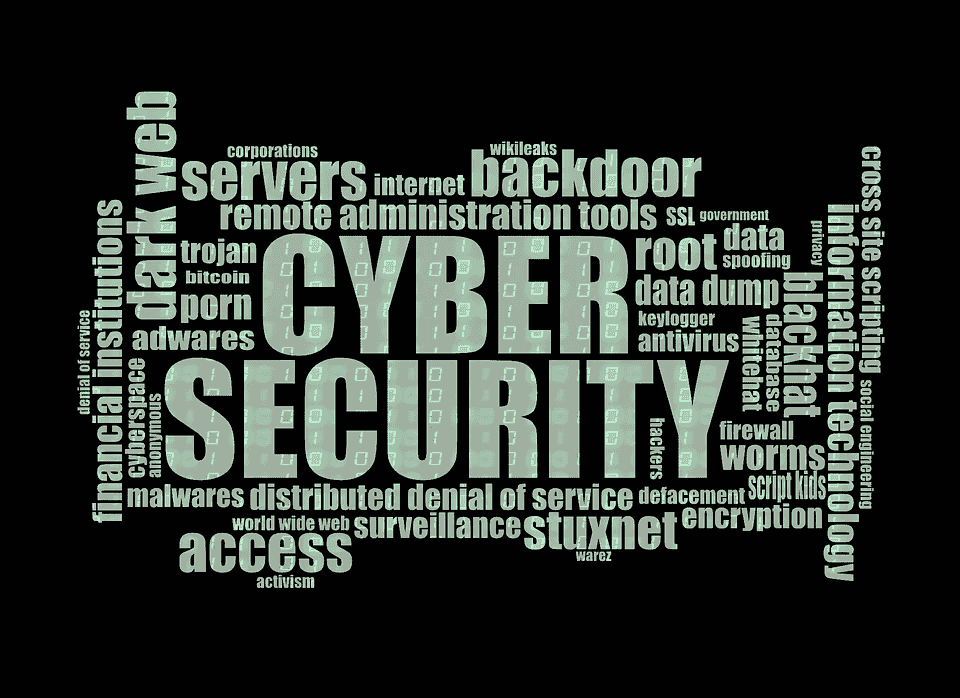

# 信息安全中的女性:提比略·赫夫林

> 原文：<https://medium.com/hackernoon/women-in-information-security-tiberius-hefflin-929778676a50>

This image is public domain. Hooray for public domain!

去年秋天，我采访了六名女性和非男性，他们在网络安全领域有着令人兴奋的职业生涯。这些文章都发表在 [Tripwire 的安全博客](https://www.tripwire.com/state-of-security/)上。

理想情况下，我们这个领域的所有人，无论性别、种族、民族、年龄、国籍和性取向，都会被简单地视为“从事信息[安全](https://hackernoon.com/tagged/security)工作的人”不幸的是，我们在一个男性主导的领域工作，有时处理性别歧视会影响我们的职业生涯。

我认为鼓励更多女性和跨性别者考虑从事网络安全职业尤为重要。因此，我的采访系列聚焦于我们领域中一些最聪明的头脑——他们只是碰巧不是男性。

我的系列很受欢迎。所以，当春天到来时，我决定继续下去。在我写这篇文章的时候，大部分新的采访已经完成了，他们相应的文章也已经发给了我在 Tripwire 的编辑。你可以期待它们在未来几周发布在 Tripwire 的博客上，可能从四月份开始。

在那之前，我决定在这里重新发布我去年秋天的采访系列。请享用它们！

如果你能拿出一些钱，请考虑为我的 Patreon 捐款。我在媒体上发表的文章没有报酬，我从慷慨的赞助人那里收到的零星的钱帮助我继续前进。谢谢大家！

还有一种方法可以帮助我，而且一点也不花你钱。如果你喜欢我的文章，点击绿色小心脏，它会帮助我的知名度。最欣赏！

信息安全是 IT 发展最快的领域。它以前所未有的方式影响着更多的人。它不仅影响我们的公共记录、公用事业、白领工作和娱乐。现在，我们在口袋里和汽车里携带小型电脑，物联网的说法也开始成为现实。这可不是闹着玩的。物联网可能是信息安全面临的最大挑战。

尽管信息安全的发展，我们实际上已经看到女性计算机科学毕业生的下降。根据 T2 德勤公司的数据，1985 年，37%的美国计算机科学毕业生是女性。虽然微型计算机或个人电脑从 1976 年左右就出现了，但那时仍有许多办公室没有它们。但是比雅尼·斯特劳斯特鲁普出版了第一版的 C++编程语言*。麻省理工学院媒体实验室成立。事情正在好转！*

快进到 2013 年。大多数成年人现在都拥有触摸屏智能手机，这在 2007 年还是一种相对奢侈的东西。英特尔已经生产 22 纳米处理器两年了。发达国家的大多数家庭多年来一直享受着互联网接入，这诱使年轻一代开始切断固定电话和有线电视。

但是，美国计算机科学毕业生中女性的比例是多少呢？百分之十八。这还不到 1985 年数字的一半！

事实很清楚:我们必须让更多的女性进入信息安全领域。我们也必须得到更多非二元性别的人。我是一名写信息安全的女性，我认为与其他女性交流是一个很好的起点。他们是怎么进入领域的？对他们来说是什么样的？

我采访的第一位女性是 Tiberius Hefflin，她是一名安全保障分析师，在开源桥、PyConAu、PyDX、BSidesPDX 和其他行业会议上发表过演讲。

**KC:** 你是怎么进入计算行业的？

**TH:** 我爸是网络架构师。他保证我从小就有电脑，我在成长过程中帮了他很多。不过，我实际上是在 25 岁的时候才上大学的。高中毕业后，我一直在做焊接学徒，最终在决定做这份工作之前，我进入了人力资源部门。

除了你父亲的足迹，你可能还有其他的动机？

在 IT 行业，我可以帮助更多的人。不仅如此，这也是我真正喜欢的事情。我喜欢它的技术方面。即便如此，跟随我父亲也是其中的一大部分。他对我的生活很有启发。他很擅长网络，所以我在网络专业读了 HND。我讨厌它。我确信我在这么晚的时候冒这个险去上大学是一个巨大的错误。然后我跌跌撞撞的进了 infosec，爱上了。从此再也没有回头。

**KC:** 你到底是怎么偶然进入 infosec 的？

我有一项与安全相关的任务。它改变了我的一切。我一直对与安全相关的新闻感兴趣，所以我认为这是一种自然的倾向。还有，哪个 90 后的孩子不爱电影*黑客*？

**KC:** 耶！你可以描述一下你的安全任务的性质吗？

**TH:** 当时是超低级的。我的团队正在创建一个网络提案，必须考虑安全因素。第二年夏天，我在苏格兰警察服务局实习，并和他们的安全团队一起工作。那确实加强了我的兴趣。

KC: 所以有数字取证的成分？元数据之类的东西？

我认为这种分配主要是指防火墙和用户组权限。直到上大学，我才开始做数字取证的工作。不过，我真的很享受这种安全感。太迷人了。我的数字取证课程是全国最早的课程之一，所以我们不得不同意很多条款，这些条款是关于我们会和不会用我们的知识做什么的。这有点像绝地训练。

KC: 那真的很酷。学校的性别平衡是怎样的？

大约 40 名学生中有两名女性。我的课程负责人是一位女性，但我认为她觉得自己需要证明很多东西。我认为作为男性主导领域的女性，我们被要求超越他人。我还认为，那些感觉有冒名顶替综合症的女性比我们需要的更努力地逼迫自己。我的意思是意识到我们被不同地看待，可以说我们是与众不同的。所以我们更加努力去适应。

你完全正确。

你可以在推特上关注提比略·赫夫林，地址是[@ whatiberius](https://twitter.com/WhataTiberius)。

如果你喜欢我的文章，有两种方法可以帮助我。

首先，你可以点击小绿心来推荐我的文章。

其次，你可以给我的病人捐一点钱。谢谢大家！

> [黑客中午](http://bit.ly/Hackernoon)是黑客如何开始他们的下午。我们是 [@AMI](http://bit.ly/atAMIatAMI) 家庭的一员。我们现在[接受投稿](http://bit.ly/hackernoonsubmission)，并乐意[讨论广告&赞助](mailto:partners@amipublications.com)机会。
> 
> 如果你喜欢这个故事，我们推荐你阅读我们的[最新科技故事](http://bit.ly/hackernoonlatestt)和[趋势科技故事](https://hackernoon.com/trending)。直到下一次，不要把世界的现实想当然！

