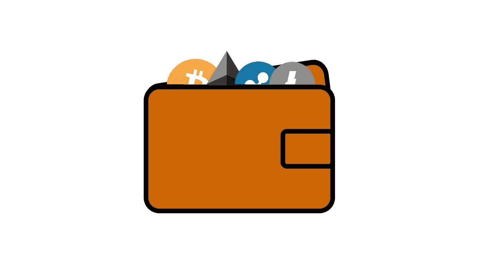
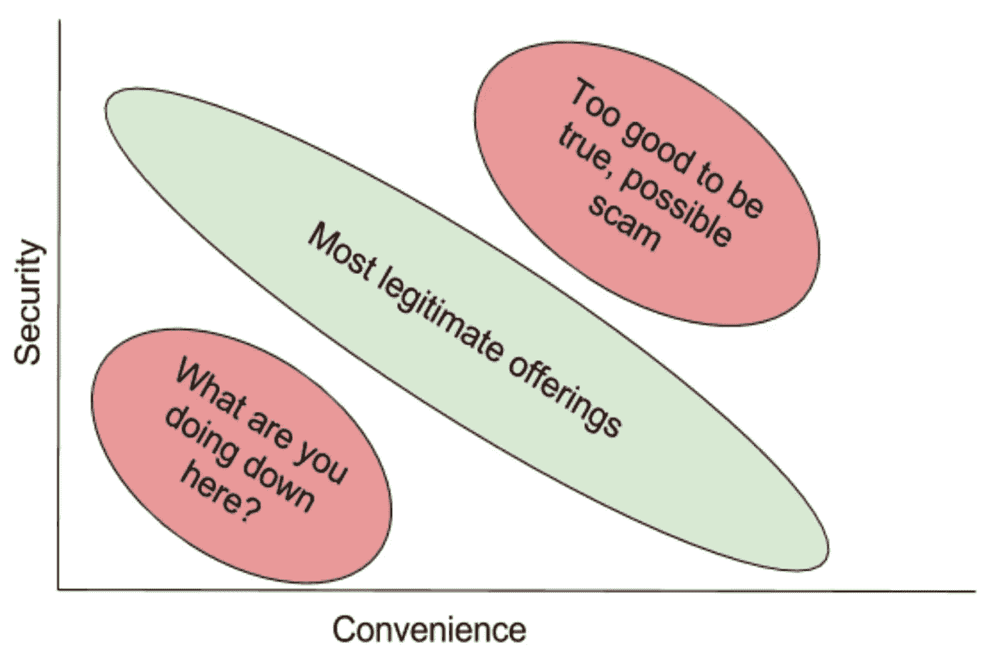
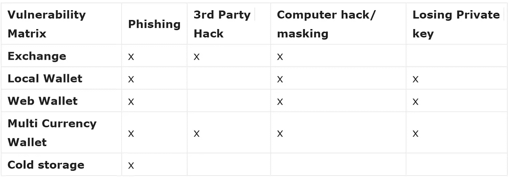
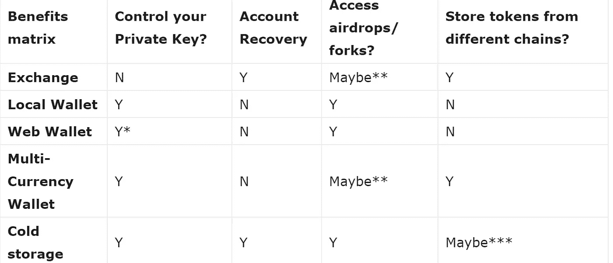

# 钱包、交易所和攻击媒介——您应该如何存储您的加密资产？

> 原文：<https://medium.com/hackernoon/word-origin-and-history-for-wallet-c46704650228>

*“钱包”一词的由来和历史*

1.  *14c 晚期。“袋子，背包”，来源不明，可能来自古法语，也可能来自原始日耳曼语*wal- "roll。"意思是“携带纸币的扁平盒子”，首次记录于 1834 年，美国英语。*

随着加密货币的普及已经超越了那些对协议有深刻理解的人所独有的技术好奇心领域，对可用工具和实用程序的误解也越来越多。最近，向投资者、交易者和“持有者”提供的服务激增，虽然自从你必须下载整个区块链并使用命令行访问令牌持有量的时代以来，已经有了很大的改进，但在使用这些工具时，你到底得到了什么，似乎还有很多困惑。

随着选择的增加，混乱和错误的可能性也随之增加。人们很容易对技术和潜力感到兴奋，但也更容易因为误解而犯错误。不幸的是，错误会导致代币丢失或被盗。您可以将各种服务放入几个桶中，这些桶都提供安全性和便利性的某种组合，但是这些变量通常是负相关的。如果你能决定你到底想从使用服务中得到什么，那么你应该能找到适合你的东西。

如果你正在读这篇文章，你可能至少听一个人说过，你必须拥有并保护你的私钥。我希望提供一些背景来理解为什么以及什么算“拥有”和“保护”。

一个[加密货币](https://hackernoon.com/tagged/cryptocurrency)钱包提供了效用——它是一种工具。它不“持有”您的令牌，而只是提供一个与您的资产进行交互和管理的界面。你的私人钥匙可以让你进入一个帐户。你需要两者来从你的代币中获得任何价值/效用。如果您没有访问权限或者没有工具来执行操作，则与该帐户相关联的令牌是无用的。把钱包软件想象成手机，把你的私人钥匙想象成 SIM 卡。这两者本身都没什么用，sim 卡只是让你能够获得账户中的价值。

当你评估一个钱包的时候，你需要知道你是把你的资产存放在链子上还是存放在第三方。你怎么知道的？第三方包括所有交易所(Poloniex、GDAX、Bittrex)和其他服务，如比特币基地和凯西。你使用用户名/密码登录吗？你从来没有提供一个私人密钥来存储吗？对其中任何一个回答“是”都可能意味着你在使用第三方并且信任他们。

# 交易所和第三方

将代币放在交易所或由第三方持有就像去赌场一样。你交出你的钱，并得到一张借据(在这个例子中是筹码)作为回报。你必须从交易所提取代币，才能在交易所外与代币交易，就像你离开赌场时需要兑现筹码一样。如果有人偷了赌场的所有现金，那么你的筹码就没用了。因此，虽然记住密码和利用第三方的密码恢复服务更容易，但您还是要依靠它们来保护您的资产。

> 当你将[比特币](https://hackernoon.com/tagged/bitcoin)存入交易所时，你不再拥有该比特币。交易所有它，你相信它会在那里，如果你去撤回它。你只是拿着借条到处走，直到你把它兑现。

黑客攻击或监管机构关闭可能会让你陷入困境，但你也不必担心自己的电脑被黑客攻击或丢失钥匙。尼克·萨博的《可信第三方是安全漏洞》中更多关于可信第三方的危险。

 [## 可信第三方是安全漏洞|中本聪研究所

### 商业安全是指解决商业关系中的实际问题，如隐私、诚信…

nakamotoinstitute.org](http://nakamotoinstitute.org/trusted-third-parties/) 

# 连锁账户

如果你没有使用第三方来存储你的资产，你可能会将它们存储在 chain 上:这对你有好处！链上存储是指将您的交易直接记录在区块链上。这种情况不会发生在交换环境中，因为每个人都只是来回移动交换借据。以以太坊为例，任何人都可以下载必要的工具直接与区块链互动——不需要网络界面或钱包。一旦安装了工具包并下载了区块链的副本，您就可以从命令行运行命令，在 chain 上的最终操作与使用 [**MyEtherWallet**](https://www.myetherwallet.com/) 或任何其他以太坊钱包的前端接口没有什么不同。例如，运行 **$ geth account new** 将在以太坊区块链上创建一个新帐户。一旦你这样做了，同样简单的命令可以运行，以检查令牌余额或发送以太或其他令牌到其他地址。

*Satoshi Nakihobo*

拥有一个“连锁”账户实际上就是拥有一对私有和公共密钥。需要私钥来证明所有权和发送交易或对帐户执行其他操作。公钥可用于检查余额或接收令牌。您应该非常小心地保护您的私钥，而您的公钥可以自由地共享。大多数钱包服务所做的是提供一个良好的界面来运行所有这些相同的命令。你不用直接下载整个区块链并自己运行命令，而是得到一个漂亮的按钮来点击“创建帐户”或“发送令牌”。像 MyEtherWallet 这样的服务非常适合这个。您可以轻松地执行所有您想要的操作，并且您的私钥不会存储在任何中央位置。听起来不错，但是现在你要对你的私钥负责。你愿意把它存储在你的电脑上，一张纸上，或者一个 u 盘上吗？如果账户里有价值 100 美元的代币呢？$100,000?这些都是你需要思考的问题。如果您丢失了它或有人获得了它，所有的价值都可能消失。社交黑客(网络钓鱼)比在代码中发现漏洞更容易，也更突出，这意味着你犯错误使你的资产面临风险的可能性比有人在你使用的软件中发现漏洞的可能性更大。有无数这样的故事，人们在他们跟随链接的虚假网站上键入他们的私人密钥，或者陷入某种电子邮件骗局。

# 多币种钱包

一个受欢迎的中间点是多货币钱包( [**Jaxx**](https://jaxx.io/) 和 [**Exodus**](http://www.exodus.io/) 是最受欢迎的几种)。这些服务使您可以控制自己的私钥，但这是一个跨多个区块链使用的私钥。在这两者之间有一个抽象层，它使最终用户更容易操作；你不需要不断地输入你的私人密钥，你可以到一个地方用多个链上的多个代币进行交易。不过，这额外的一层也带来了另一个漏洞。今年早些时候，本地 Jaxx 钱包中的一个问题被利用，导致人们丢失令牌，并且已经有多个问题导致奇偶钱包软件被黑客攻击，导致数亿美元的令牌价值丢失。让事情变得更复杂会让它更脆弱。我的钱包很棒，因为它很简单，而且你知道它的风险。多币种钱包软件正在努力使其易于使用，但这些进步也可能带来漏洞。这就是软件开发的本质。Jaxx 有一个很棒的移动应用，使得在日常生活中使用 crypto 更加容易。MyEtherWallet 并不适合在旅途中进行快速交易，因为它没有针对移动设备进行优化。

*Perils of adding too much complexity to a wallet*

想想你口袋或钱包里的钱包。它很适合携带现金——可能是一些优惠券、奖励卡、信用卡——但有一个非常标准的大小可以舒适地放置。银币或金条不太适合放在钱包里，如果你试图在里面放太多不同的东西，你就会有问题。但它确实提供了便利和控制。你可以随身携带，想放什么就放什么。考虑保险箱。也许你家里有一个。你可以在里面放任何你想要的东西，但是它真的安全吗？交易或交易您在保险箱中的资产不太方便。你可以使用银行的保险箱，但它仍然只有一定的大小。银行可能会被抢劫，你需要通过一整套繁琐的手续才能取出里面的任何东西。你可以把任何你想要的东西放在储物柜里，但是如果你有钻石或者珍贵的邮票收藏，你可能会想增加一层来存放它们，这样它们就不会丢失。就像实物资产一样，你需要考虑你的意图是什么——它有多大价值？您有多信任第三方选项？您真正需要多久访问一次令牌？

# 存储选项

**交易所/第三方**

可以在多个链上交易多个代币。使用用户名/密码访问。您不拥有自己的私钥，资金全部存放在中央交换钱包中。

**多币种钱包**

您拥有自己的私钥，但是软件允许您使用同一个根密钥来保护跨多个链的令牌。例如:杰克斯，出埃及记

**网络钱包**

特定于链的网络托管钱包。有些将您的私钥保存在密码后面( [**元掩码**](https://metamask.io/) )，有些则要求您在对帐户执行任何操作之前保存并上传您的私钥(MyEtherWallet)

**本地钱包**

本地安装的软件，用于对特定的区块链执行操作。私钥仍然需要存储在钱包可以访问的地方

**硬件钱包**

私钥存储在物理离线设备中。与钱包软件/网络钱包集成。例如: [**纸钱包**](https://www.coindesk.com/information/paper-wallet-tutorial/) ， [**莱杰纳米斯**](https://www.ledgerwallet.com/) ， [**特雷佐**](https://trezor.io/)

# 攻击媒介

**网络钓鱼**

基本上是欺骗你放弃访问你的帐户所需的信息。例如:发送到一个链接的电子邮件，用于输入您的私钥或交换用户名和密码。

**第三方黑客**

恶意方利用漏洞并耗尽资金。例如:奇偶多重签名黑客/ Mt. Gox

**电脑黑客/屏蔽**

在你的计算机上采取的行动被跟踪，所以你的关键或密码被盗，因为你输入他们。有人访问您的计算机并找到保存有密码/密钥的文件。

**丢失钥匙/密码**

丢失存储的私钥或忘记密码和种子短语。

# 利益

**控制私钥**

这意味着您可以随时使用另一个软件或甚至通过直接与链交互来获取您的密钥和令牌。

**账户恢复**

如果您忘记了密码或丢失了私钥，有一项服务可以帮助您恢复访问权限

**进入空投/货叉**

当硬分叉发生或一个令牌被空投给另一个令牌的持有者时，如果您拥有自己的私钥，则您只能访问这些新令牌。

**存储来自不同链的令牌**

以太坊和比特币是不同的区块链。你不能在以太坊区块链上发送比特币，也不能在比特币区块链上发送以太。您可以在区块链上发行新代币，并使用同一帐户访问它们。

*您可能需要进行一些转换，以使您的钱包钥匙作为链上钥匙使用

* *取决于 exchange/wallet 软件是否集成了它。

***Ledger Nano 和 Trezor 都支持来自多个链的令牌，但使用不同的软件钱包。

为了找到适合自己的平衡点，你需要诚实地说出你对每个选项的舒适程度。你对技术了解多少？如果你知道你桌子抽屉里的 USB 驱动器控制着你的数字资产的访问，而一旦你丢失了它们，你晚上还能睡得着吗？如果你没有收到每一个空投或 hardfork 代币，你会感到被冷落吗？最终会有更好的产品，但如果很容易，现在就不会有这么多好处。仔细阅读，四处询问，当尝试一个新的选择时，总是，总是，总是先用一个保守的量来测试。