# Word2Vec(第一部分)

> 原文：<https://medium.com/hackernoon/word2vec-part-1-fe2ec6514d70>

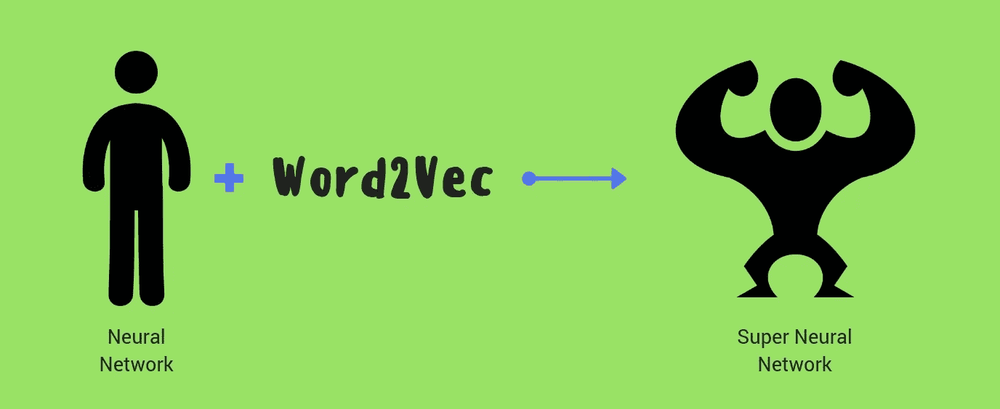

> Word2Vec 自然语言处理的类固醇

让我们从基础开始。

# 词向量

**问)什么是词向量？**

**Ans)** 用数字表示文字。

**问)为什么用词向量？**

**Ans)** 我总结一下三个主要原因:

1.计算机不能对字符串进行计算。

2.字符串本身并不包含太多明确的信息。

3.单词向量通常是密集向量表示。

**问)那么什么是显性信息呢？**

**Ans)** 是的，这个词本身并没有说太多它在现实生活中代表了什么。示例:

字符串“cat”只是告诉我们它有三个字母“c”、“a”和“t”。

它没有关于它所代表的动物、数量或使用它的上下文的信息。

**问)密集矢量表示？**

**Ans)** 简而言之(就目前而言)，相对于它们的大小，这些向量可以容纳巨大的信息。

**问)词向量的类型？**

a)有两个主要类别:

*   **基于频率的**:使用 stats 来计算一个单词与其相邻单词共现的概率。
*   **基于预测的**:使用预测分析对与其相邻单词共现的单词进行加权猜测。

预测有两种类型:

*   **语义**:试着根据上下文猜测一个单词
*   **句法**:根据文本的句法猜一个单词

**问)基于语法和上下文的向量之间的区别？**

**Ans)** 我们来看一个例子:

考虑下面的句子“牛顿不喜欢苹果”

*   语义向量关心的是‘**一个文本是关于谁或什么的实体？**’。在这个例子中是“牛顿”和“苹果”
*   句法向量关注的是'**那些实体是怎么说的？**’。在这种情况下“不”和“喜欢”

# Word2Vec

*是最广泛使用的词向量表示形式之一。最早由谷歌杜撰于* [*米科洛夫等人*](http://papers.nips.cc/paper/5021-distributed-representations-of-words-and-phrases-and-their-compositionality.pdf) *。*

它有两种变体:

1.  **CBOW(连续单词包)**:这个模型试图根据一个单词的邻居来预测这个单词。

2. **SkipGram** : 这个模型试图预测一个单词的邻居。

> 从统计上看，CBOW 平滑了大量分布信息(通过将整个上下文视为一个观察)。在很大程度上，这对于较小的数据集来说是很有用的。然而，skip-gram 将每个上下文-目标对视为一个新的观察，当我们有更大的数据集时，这往往会做得更好。
> 
> -张量流

用更简单的话来说， **CBOW** 倾向于找到一个单词在一个邻域(上下文)中出现的概率。所以*概括了一个词可以被使用的所有不同的语境*。

而**skip program**倾向于*分别学习不同的上下文*。所以 SkipGram 需要足够的数据。因此 [SkipGram](https://hackernoon.com/tagged/skipgram) 需要更多的数据来训练，并且 SkipGram(给定足够的数据)包含更多关于上下文的知识。

**注意**:这些技术不需要带标签的数据集(尽管带标签的数据集可以用来包含额外的信息，我们将在后面看到)。因此，任何大型文本语料库实际上都是一个数据集。因为要预测的标签是文本中已经存在的单词。

我们将关注 SkipGram 作为足够大的数据集(维基百科，Reddit，Stackoverflow 等。)可供下载。

# SkipGram

首先，我们根据什么将是我们的**目标单词**(待预测)、什么将是**源单词**(在此基础上我们进行预测)以及**我们寻找上下文有多远**(窗口的大小)来决定我们要寻找什么上下文。

示例:

*考虑窗口大小为 3*

## 类型 1

将中间的单词视为源单词。下一个和上一个单词作为目标单词。

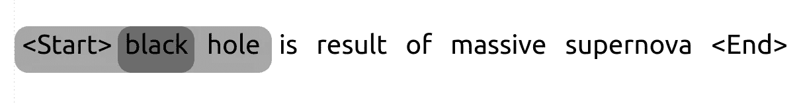

fig no. 1

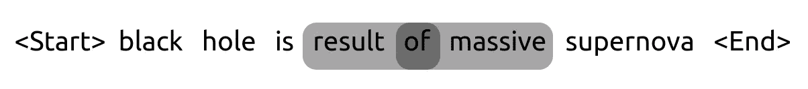

fig no. 2

## 类型 2

将第一个单词视为源单词。下面两个词作为目标词。

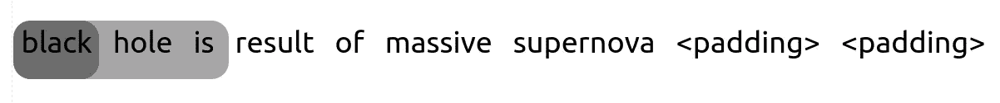

fig no. 3

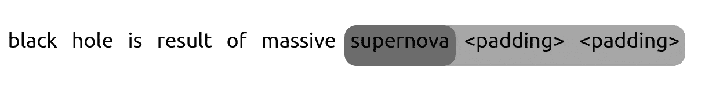

fig no. 4

在这两种类型中，源单词被与该源单词的上下文相关的单词所包围。像‘梅西’一般会被与‘足球’相关的词语包围。因此，在看到一些例子后，“梅西”的词向量将开始结合与“足球”、“进球”、“比赛”等相关的上下文。

在“苹果”的情况下，它的词向量会做同样的事情，但是对于公司和水果(见图 6)。

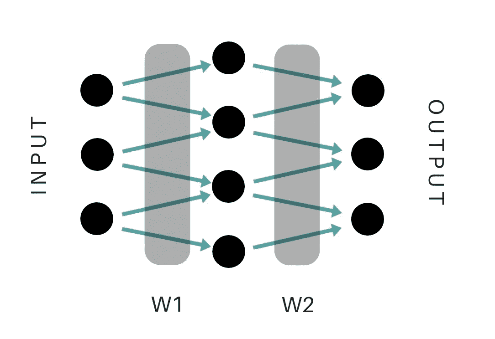

fig no. 5 Word2Vec’s Neural Network

W1(s)和 W2(s)包含关于单词的信息。W1 和 W2 中的信息被组合/平均以获得 Word2Vec 表示。

假设 W(s)的大小是 400，那么“苹果”的 Word2Vec 表示看起来就像这样

```
array([
-2.56660223e-01,  -7.96796158e-02,  -2.04517767e-02,-7.34366626e-02,   3.26843783e-02,  -1.90244913e-02,7.93217495e-02,    4.07200940e-02,  -1.74737453e-01,.....1.86899990e-01,    -4.33036387e-02,  -2.66942739e-01,-1.00671440e-01],   dtype=float32)
```

现在像“苹果落在牛顿身上”这样包含 4 个单词的简单句，借助 Word2Vec，可以转换成 4*400 (1600)个数字；*每个****【1】****包含明确的信息*。所以现在我们也知道这篇课文在谈论一个人，科学，水果等等。

***【1】****:因此是密集矢量表示*

# (英)可视化(= visualization)

直接可视化 Word2Vec 目前对人类来说是不可能的(因为像 400 这样的高维度)。相反，我们使用*降维*技术，如[多维标度](http://en.wikipedia.org/wiki/Multidimensional_scaling)、 [sammon 映射](https://en.wikipedia.org/wiki/Sammon_mapping)、[最近邻图](http://en.wikipedia.org/wiki/Nearest_neighbor_graph)等。

最广泛的算法是 [t 分布随机邻居嵌入](http://jmlr.csail.mit.edu/papers/volume9/vandermaaten08a/vandermaaten08a.pdf) (t-SNE)。克里斯托弗·奥拉有一个关于降维的惊人博客。

t-SNE 在 Word2Vec 上的最终结果类似于

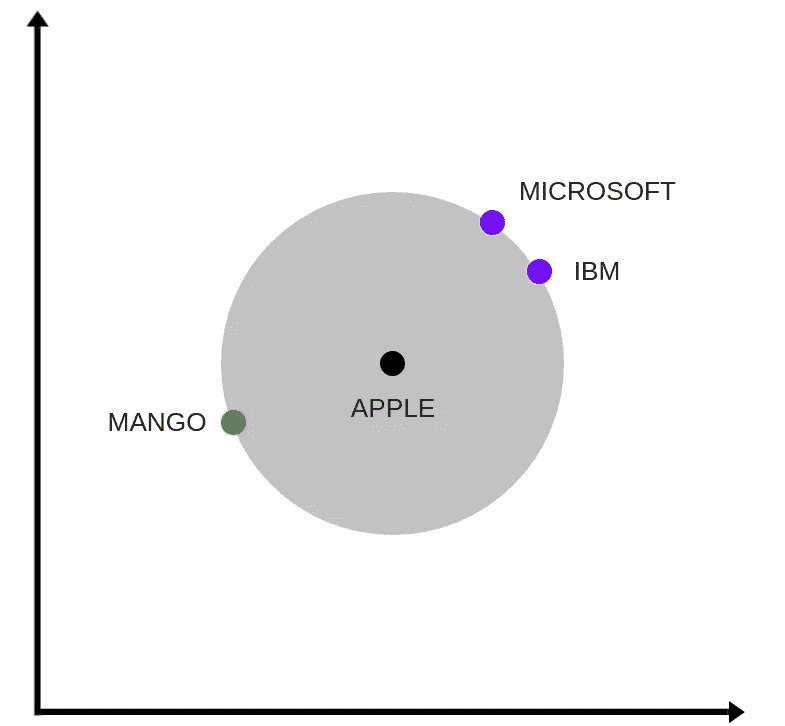

fig no. 6 Multiple contexts of Apple

这个图说明苹果介于公司(IBM，微软)和水果(芒果)之间。

这是因为苹果的 Word2Vec 表示包含了苹果公司和苹果公司的信息。

间距

*   苹果和芒果:0.505
*   苹果和 IBM : 0.554
*   芒果和 IBM : 0.902

和

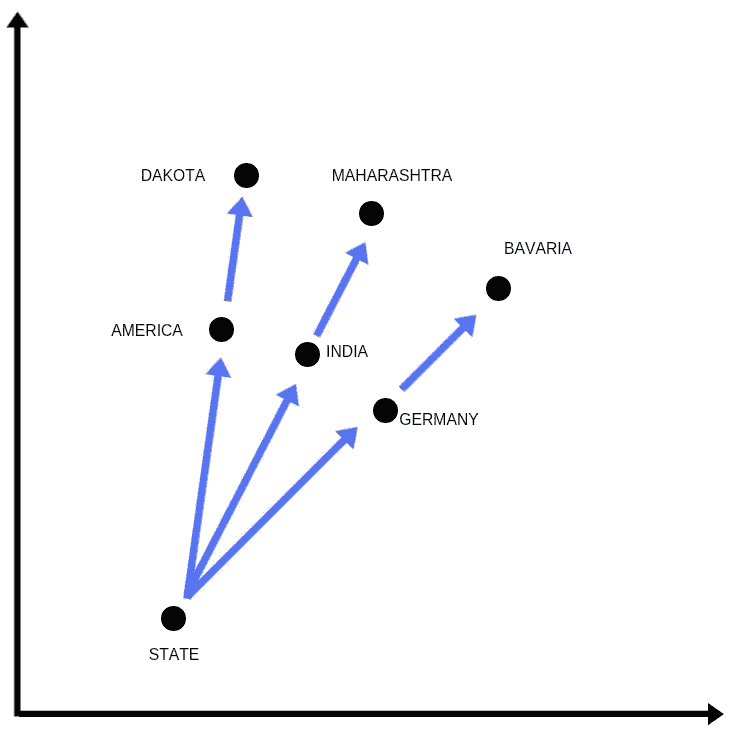

fig no. 7 Combining contexts of multiple words

该图显示，通过组合两个向量“State”和“America”的方向，合成向量“Dakota”与原始向量相关。

如此有效

*   州+美国=达科他州
*   州+德国=巴伐利亚

其他例子有:

*   德国+航空公司=汉莎航空
*   国王+女人——男人=王后

# 履行

Gensim 和 Tensorflow 都有令人印象深刻的 Word2Vec 实现。

这是 [Gensim](https://radimrehurek.com/gensim/index.html) 实现的优秀[博客](http://textminingonline.com/training-word2vec-model-on-english-wikipedia-by-gensim)和 [Tensorflow](https://www.tensorflow.org/) 有[教程](https://www.tensorflow.org/versions/r0.11/tutorials/word2vec/index.html)。

# 问题

默认情况下，Word2Vec 模型每个单词有一个表示。向量可以尝试累积所有的上下文，但这最终至少在某种程度上概括了所有的上下文，因此每个上下文的精度都受到损害。这对于具有非常不同的上下文的单词来说尤其是一个问题。这可能会导致一个情境，过度驱动其他情境。

比如:“苹果”公司和“苹果”水果只有一个单词 2Vec 表示。

**例一:**

“少女”可用于女子、乐队(铁娘子)、体育等。

当你试图找到与“少女”最相似的词时

```
[(u'odi_debut', 0.43079674243927),
 (u'racecourse_debut', 0.42960068583488464),
 .....
 (u'marathon_debut', 0.40903717279434204),
 (u'one_day_debut', 0.40729495882987976),
 (u'test_match_debut', 0.4013477563858032)]
```

*显而易见，与“运动”相关的语境已经压倒了其他。*

即使把“铁”和“少女”结合在一起，也不能解决问题，因为现在“铁”的语境压倒了一切。

```
[(u'steel', 0.5581518411636353),
 (u'copper', 0.5266575217247009),
 .....
 (u'bar_iron', 0.49549400806427)]
```

**例 2**

一个词可以用作动词和名词，但意思完全不同。比如‘铁’这个词。作为动词，它通常用于用电熨斗使东西光滑，但在名词中，它主要用于表示金属。

当我们找到“铁”的最近邻居时

```
[(u'steel', 0.5581518411636353),
 (u'copper', 0.5266575217247009),
 .....
 (u'bar_iron', 0.49549400806427)]
```

*动词对应物的引用可以忽略不计。*

# 变体

## 变体 1:基于复合名词的 Word2Vec

通过在训练集中用复合名词(如‘iron _ maiden’)替换名词(如‘iron _ maiden’)。

> *《铁娘子是一支了不起的乐队》*

成为

> ****铁娘子*** *是一支令人惊叹的乐队**

*所以复合名词的上下文非常突出，而且非常准确！*

***结果:***

*与“铁娘子”最相关的词是:*

```
*[(u'judas_priest', 0.8176089525222778),
 (u'black_sabbath', 0.7859792709350586),
 (u'megadeth', 0.7748109102249146),
 (u'metallica', 0.7701393961906433),
 .....*
```

***那是硬核，字面意思！***

*下面是一个 Python 代码，用于将名词转换为复合名词(*以及形容词-名词配对*)，以便为训练 Word2Vec 创建训练集。*

*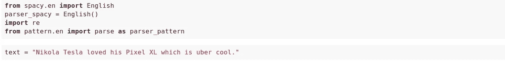**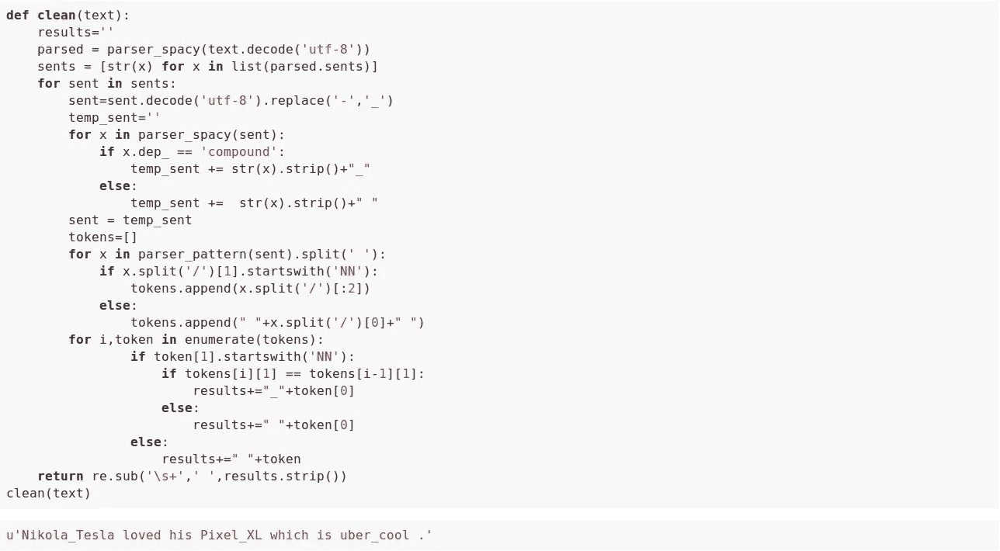*

*fig no. 8*

*这个 Python 代码用于将名词转换成复合词(*仅名词-名词配对*)。*

*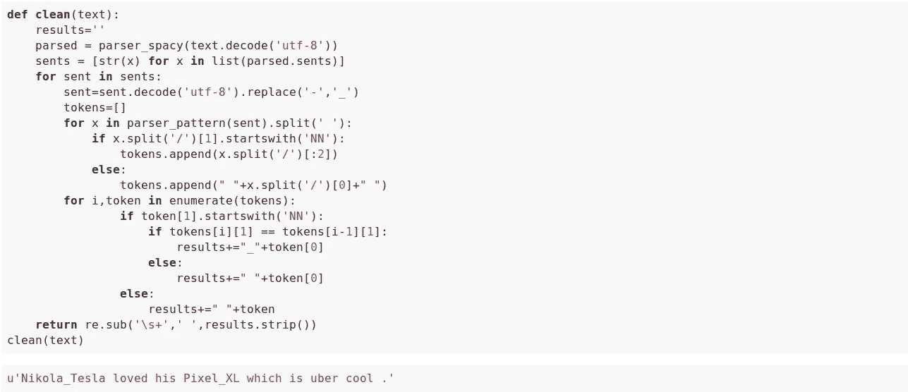*

*fig no. 9*

## *变体 2 : Sense2Vec*

**(注:Sense2Vec 的非 NER 实现)**

*通过将词性(P.O.S)标签添加到训练集中，将上述变体更进一步。*

*示例:*

> **“我上课熨衬衫”**

*成为*

> **“我****/PRP****铁****/VBP****我****/PRP****衬衫****/NN****同****/在*** *班*T72*/。**

**或者**

> **“我**/名词**铁**/动词**我的 **/ADJ** 衬衫**/名词**带 **/ADP** 类**/名词**。 **/PUNCT****

**结果:**

**现在最相关的单词是:**

```
**[(u'ironing/VERB', 0.818801760673523),
 (u'polish/VERB', 0.794084906578064),
 (u'smooth/VERB', 0.7590495347976685),
 .....**
```

***(参见“问题”部分的“示例 2”进行比较)***

**下面是*sense 2 vec*的可视化**

**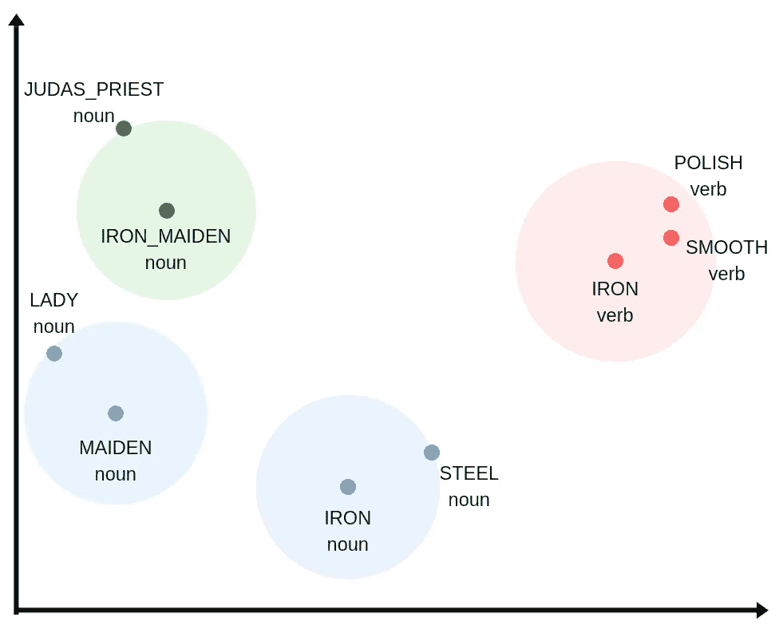**

**fig no. 10**

**下面是为 Sense2Vec 准备训练数据集的 Python 代码**

**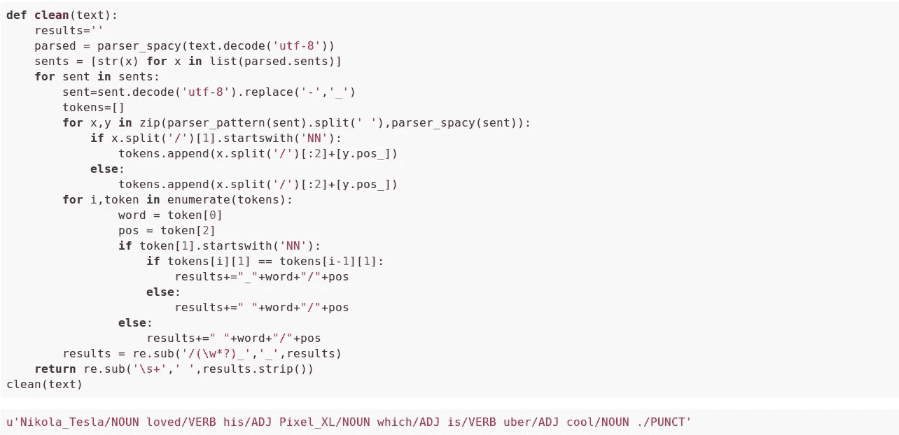**

**fig no. 11**

**这些代码可从 [github](https://github.com/mukulmalik18/preprocessing) 获得。**

# **结论**

*   **与它们的大小相比，Word2Vec 可以容纳大量的信息！**
*   **他们可以学习语义和句法**
*   **一个问题是对多个上下文的概括，但这也可以通过对训练文本的额外修改来解决**
*   **它们是计算友好的，因为它们都是数字数组**
*   **向量之间的关系可以用线性代数来发现**

****接下来:** Word2Vec(第二部分)用例**

****上一页:** [自然语言处理](/@mukulmalik/natural-language-processing-nlp-933cb7162932#.280sgl482)**