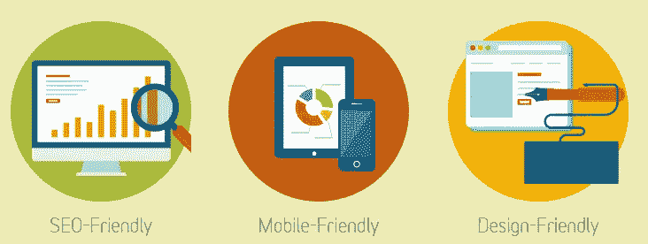
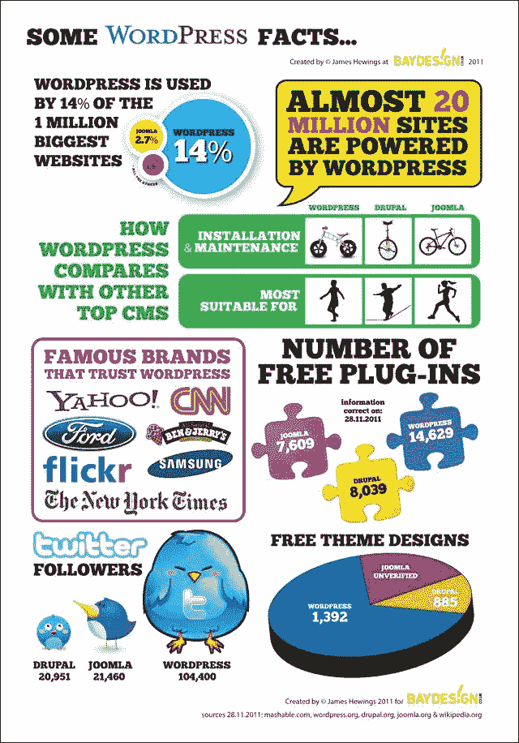
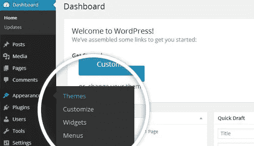
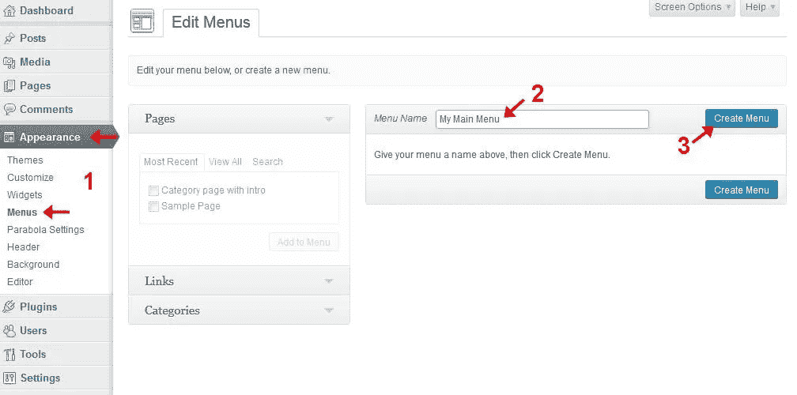
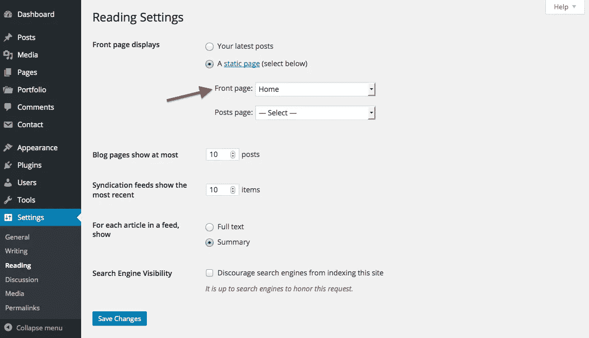
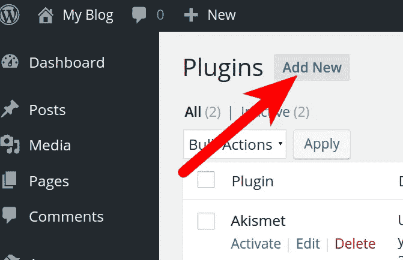

# WordPress 变得简单:逐步指南

> 原文：<https://medium.com/hackernoon/wordpress-made-easy-step-by-step-guide-75e73f5f508c>

Picture source : [www.inkthemes.com](https://www.inkthemes.com/why-use-wordpress/)

## ***为什么是 WordPress？***

*   WordPress 是一个基于 PHP 和 MySQL 的强大的计算机应用程序，有着共同的用户界面，但是你不需要在那里输入任何代码。
*   它是一个免费的开源软件，可以安装在 web 服务器上。
*   这是一个非常容易的平台，拥有非常有吸引力的用户界面的网站。
*   非常容易管理(即使对于非技术人员)。
*   它是 SEO(搜索引擎优化)友好的。
*   支持基于组的权限系统。
*   有能力在瞬间创建网站。

## ***WordPress world wide***

*   在所有使用内容管理系统的网站中，有 59.5%使用 WordPress。
*   内容管理系统是一种软件，可以跟踪网站上的每一条内容。
*   总的来说，全球有 26.5%的网站在使用 WordPress。

Picture source: [https://www.techlila.com](https://www.techlila.com)

## wordpress 指南—

1.  安装主题。
2.  创建页面/帖子。
3.  编辑页面/帖子。
4.  向菜单添加页面/帖子。
5.  定制您的网站。
6.  设置静态主页。
7.  安装插件。

## ***1。安装主题***

Installing Themes on WordPress

*   首先你需要在服务器上安装 WordPress。
*   登录你的 cPanel，它是你通过服务器管理获得的。
*   在应用程序安装程序行中查找 WordPress 图标。
*   在安装过程中提供适当的选项，并仔细创建用户和密码，以便记忆。
*   是时候用 url/wp-admin 登录你的 WordPress 仪表盘了。
*   从仪表板菜单中，选择外观->主题->添加新项
*   默认情况下，WordPress 安装时会安装一个主题，但是现在你可以从成千上万个主题中选择。
*   你可以预览你的网站将会是什么样子，并通过点击细节链接阅读文档和常见问题。
*   很少有主题有预建的模板/演示，所以通过安装模板/演示你的网站将开始看起来像演示中显示的附件。
*   要安装演示/模板，选项可能会因主题而异。但一般来说，这些选项会出现在外观或设置选项中，甚至出现在主题设置选项中。
*   也可以安装付费主题。为此，您需要首先下载主题文件。你可以很容易地从各种常见的网站上获得有吸引力的 WordPress 主题。
*   你可以从 http://themeforest.net/那里得到主题，他们有一个非常好的支持团队。
*   现在，从您的仪表板菜单，选择外观->主题->添加新的->上传主题
*   上传主题的 zip 文件，然后激活主题。

## **②*。创建页面/帖子***

*   要在 WordPress 网站上添加页面，请转到仪表板，转到页面->添加新页面。
*   页面通常是静态的，包含的信息不会经常改变。
*   您的页面中可以有子页，从而创建页面的层次结构。
*   要添加文章，请遵循上述相同的过程。
*   帖子是让你的博客成为博客的原因——它们是在你的博客首页上按时间倒序排列的内容服务(你可以使用[这些指令](https://en.support.wordpress.com/show-your-posts-in-chronological-order/)改变默认顺序来按时间顺序排列帖子)。
*   创建您的页面/帖子后，您将被要求输入页面/帖子的标题，然后在下面您必须写下将在您的网站上显示的实际内容。
*   内容界面将看起来像 MS-Word。
*   创建帖子/页面后，您可以将其保存为草稿或用于审阅。
*   如果一切正常，然后，点击发布，它将开始显示在您的网站上，并将有特定的 URL，通过它任何人都可以看到该页面/帖子。
*   如果您想轻松编辑，也可以编辑该链接。

## ***3。编辑页面/帖子***

有两种方法可以编辑你的页面/文章。

第一种方式—

1.  转到仪表板，然后单击编辑您想要编辑的页面。
2.  完成编辑后，单击更新。
3.  然后查看页面。

第二种方式—

1.  访问您想要编辑的页面。
2.  然后点击最上面的编辑页面链接，包括 WordPress 菜单。
3.  完成编辑后，单击更新。
4.  然后查看页面。

相同的步骤适用于编辑文章。

## ***4。向菜单添加页面/帖子***

菜单是用来导航你的站点的链接列表。

*   从您的仪表板，点击外观->菜单->创建一个新菜单。
*   输入菜单名称，然后单击创建菜单。
*   勾选复选框以添加页面和文章。
*   您也可以添加自定义链接到菜单(即。你仍然可以添加不属于你的 WordPress 网站的链接。
*   单击添加到菜单。
*   页面/文章出现在菜单结构中。
*   你可以根据你的方便和你想要的排列方式来拖动列表。
*   保存菜单。
*   如果你想删除现有的菜单，你也可以删除它。
*   现在，要使用您创建的菜单，请转到管理位置。
*   根据您的选择选择主菜单和页脚菜单。
*   保存更改(立即访问网站)。

## ***5。定制您的网站***

*   转到外观->自定义。
*   你可以选择各种各样的选项来定制你的网站，包括网站标识，字体，标题，背景图片。

## **⑥*⑥。设置静态主页*和**

Setting up a Static homepage

*   进入你的仪表盘，点击设置->阅读
*   选择静态页面。
*   选择要作为主页的页面。
*   保存更改后，您就可以访问网站了。

## ***7。安装插件***

Installing new Plug-Ins

*   在您的仪表板上，插件->添加新插件->浏览并从数以千计的可用插件中进行选择。
*   插件是扩展和增加已经存在于 WordPress 中的功能的方法。
*   然后插件提供定制的功能和特性，这样每个用户都可以根据他们的具体需求定制他们的网站。

要了解我们即将举办的所有活动的最新消息，请注册我们的 [**时事通讯。**](http://www.hellomeets.com/subscribe)

我们即将举办的一些活动包括:

1.  [**安卓设计库**](http://www.hellomeets.com/android-design-support-library/#android-design-support-library-1)**—2016 年 7 月 2 日**
2.  [**解析工作坊**](http://www.hellomeets.com/parseios/#new-page-70)**—2016 年 7 月 10 日**

博客署名— [维斯瓦·拉吉](https://www.facebook.com/qwertyasvishwa) & [阿南德·普拉卡什](https://www.facebook.com/anand.host?fref=ts)

> [黑客中午](http://bit.ly/Hackernoon)是黑客如何开始他们的下午。我们是这个家庭的一员。我们现在[接受投稿](http://bit.ly/hackernoonsubmission)并乐意[讨论广告&赞助](mailto:partners@amipublications.com)机会。
> 
> 如果你喜欢这个故事，我们推荐你阅读我们的[最新科技故事](http://bit.ly/hackernoonlatestt)和[趋势科技故事](https://hackernoon.com/trending)。直到下一次，不要把世界的现实想当然！

