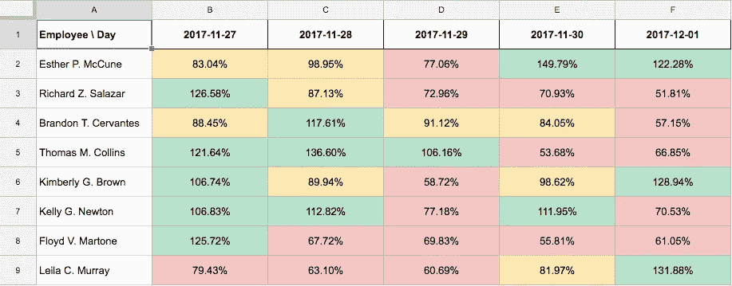
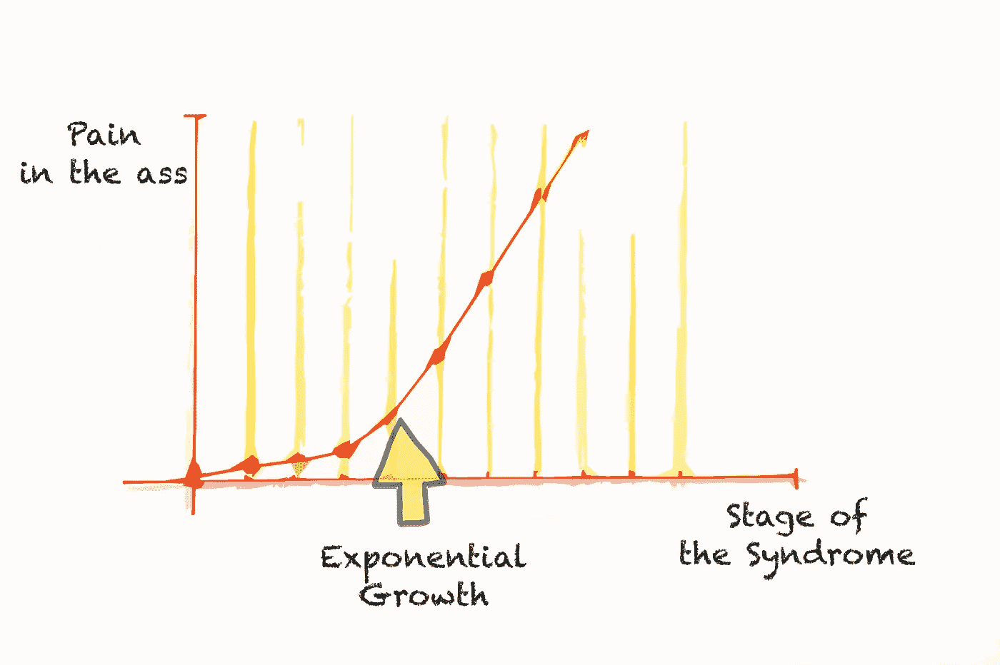
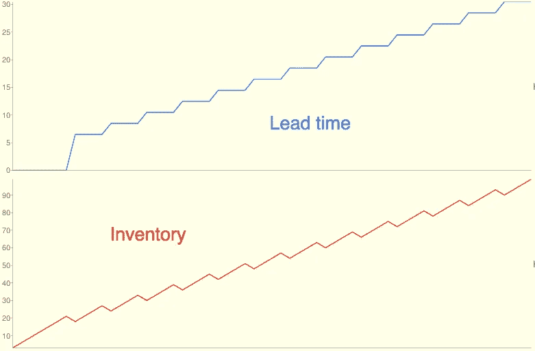
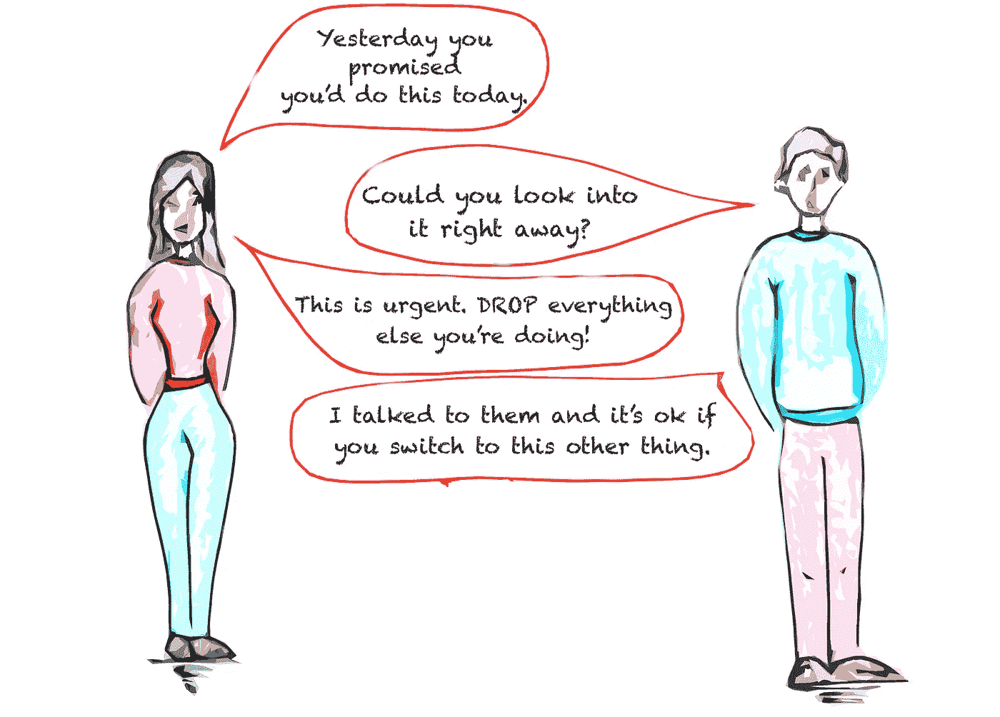

# 努力工作，你将一事无成

> 原文：<https://medium.com/hackernoon/work-hard-enough-and-you-wont-finish-anything-d631d65e7478>

## “软件创业中的约束理论”系列的第 2 部分

> 这是系列文章的第二篇。如果你还没有读过第一本书，我建议你在这里查看一下，否则有些想法可能没有意义。

了解了我们的系统，它的目标和度量，我们就知道我们*不应该做什么样的工作:*对目标没有帮助的工作。下一步是找出如何让我们*应该做的工作*更加高效和可靠。

我更喜欢用我尝试过的不起作用的技巧开场。从最常见的开始。

## 美国梦综合症

> 如果每个人都一直尽可能努力工作，我们就能完成更多的工作。

这是我在经理中发现的最普遍的信念。这是我的一个朋友的故事，我们叫他蒂姆吧。

Tim 是工程团队领导。合并后，他工作的公司结构发生了变化。他的新上司有独特的管理方法。他们在一对一会议上使用的主要文档是一个电子表格，看起来像这样(我没有实际的文档，我是从他的话中复制的):

Employee load spreadsheet. Data is made up.

行中是员工，列中是工作日。该电子表格的单元格表示员工在每个特定日期的工作量。相对于他们一天有多少小时，分配给他们多少工作。

Tim 的经理希望我的朋友确保电子表格上的数字不会低于 120%。每个员工每天都应该有超过他们所能处理的 20%的工作分配给他们。你知道，以防他们提前结束。

我认为心理学还没有发现我称之为“美国梦综合症”的紊乱。经理们总是成为它的受害者。好消息是，这很容易诊断，坏消息是——很难治愈。以下是症状:

*   你的经理经常在你身边酸酸的；
*   他们比平时更好奇你的团队在做什么，什么时候能完成；
*   他们给你发送冗长的电子邮件或松散的信息，谈论你应该如何推动你的团队全力以赴。
*   他们经常使用诸如“责任”、“成功”和“竞争”等复杂的概念。例如“我们*不能*坐以待毙，我们会被*竞争对手*打败的！!"
*   换句话说，你的经理是个讨厌鬼。

Obligatory graph for a management article. Drawing by [Cristina Amate](http://www.crisamate.com/).

在这篇文章中，我不会深入讨论我们如何治疗这种综合症。但是我会试着说明为什么全力以赴的工作不利于商业。

## 努力工作模拟

我们来模拟一下。假设我们正在管理一个初创公司的团队。团队的目标是满足频繁变化的业务需求。我们有一个产品负责人(PO)写规范，四个工程师实现规范，一个 QA 人员验证特性是否按预期工作。

*   PO 每天可以做 *3 个规格；*
*   工程人员可以并行处理 *4 项任务*(每人 1 项任务)，实现一项功能大约需要 *2 天；*
*   QA 每天可以验证 *2 个特性；*
*   在我们完成至少 5 个任务后，QA 花一天时间测试一个发布候选(RC)。一旦 RC 被清除，票证将进入“完成”状态。

模拟在完美的条件下运行，没有 QA 拒绝，人的表现没有变化，没有中断。任务以先进先出的方式处理。

我们将使用[上一篇文章](/@flpvsk/systems-thinking-in-management-c3ed049e8d91#cba5)中的指标来衡量团队的绩效:

*   *每项任务的交付周期—* 从 PO 开始处理票据到其发布的天数。
    由于团队的目标是快速响应业务需求，我们可以将交付周期作为*吞吐量的衡量标准。*团队流程工作越快，产出就越高。
*   *库存*又名*在制品*随时间推移；
*   团队的运营费用是不变的，我们不会去衡量它。

这里有一张[模拟幻灯片](https://www.slideshare.net/flpvsk/hard-working-team-simulation):

Hard-working team simulation on a Trello board

一些观察结果:

*   在最初的 8 天加速期后，团队稳定下来，每 4 天发布一次；
*   在制品在整个期间都在增长。第 10 天:我们有 24 张票正在处理中。第 20 天:37 张票；
*   每个版本的交付周期都在增长。在第一版中，每张票平均花费 6.5 天，在最后一版中，每张票平均花费 13.5 天。几乎是两倍的时间！
*   如果我们不间断地运行模拟，交付周期和库存将接近无穷大。

> 每个人都 100%的忙碌，从长远来看，效率是无限的。

Lead time and Inventory over 60 days

请记住，这个团队是“完美的”。每个人都全力以赴地工作。尽管如此，我们所有的指标随着每个版本的发布而变得越来越差。这是怎么回事？

## 你忙不起

首先，让我们解决消失的日子的问题。如果发布时间表不变，为什么我们会有更长的交付周期？

看看最快的(#4)和最慢的(#21)任务。

最快(#4)花费:

*   *采购订单进行中*阶段:1 天
*   *开发等待* : **0 天**
*   *开发正在进行* : 2 天
*   *QA 等待* : **0 天**
*   *进行中的质量保证* : 1 天
*   *QA 等待 RC* : 1 天
*   *QA RC* : 1 天
*   *总共* : 6 天

花费最慢的(#21):

*   *采购订单进行中* : 1 天
*   *开发等待* : **4 天**
*   *开发正在进行* : 2 天
*   *QA 等待* : **3 天**
*   *进行中的质量保证* : 1 天
*   QA 等待 RC : 1 天
*   *QA RC* : 1 天
*   *总计* : 13 天

这是我们的答案。最慢的票花了 *7 天*多*等待*工程和 QA 变得可用。我们让系统超负荷运转，增加了它可以处理的工作量。

## 我们生活在一个模拟世界里吗？

我们在一个部门内模拟工作，因为很容易在一个 Trello 板上显示。当然，同样的原则也适用于整个公司。

> 在组织的规模上，部门是系统的“工作中心”，客户的订单/项目/请求是在系统中移动的“任务”。

我在我工作过的每家公司都见过超负荷的问题。有时候是我造成的。过去，作为团队领导，我要确保每个人都有工作要做。这种类型的管理通常会导致以下结果:

1.  我们优化数量，所以质量下降；
2.  团队变得不可靠，预测变得不可能。每一项工作都需要几天到几个月的时间；
3.  团队领导和高级管理层介入游说、施加压力和微观管理。优先事项每天都在变化；
4.  团队成员根据优先级的变化在不同的任务之间切换。多任务导致更多的延迟；
5.  等到延迟的任务得到处理时，之前完成的工作很可能已经过时了。例如，客户的需求可能已经改变，或者开发人员需要在最近的改变的基础上重新构建代码。那就损失了更多的时间；
6.  从会计的角度来看，困在系统中的工作就像是回报期不断延长的投资。估算一下未来的趋势，看看你的初创公司什么时候会把所有资金都积压在库存里。我们可以从数学上证明这样的公司会倒闭，这多酷啊？

“Lobbying at a workplace” by [Cristina Amate](http://www.crisamate.com/)

现实世界中的事情总是比模拟中的更具戏剧性。

如果我们让每个人尽可能努力工作，完成项目会变得越来越难。管理层通常会将其误判为资源分配问题，并会要求雇佣更多的人或花费更多的钱。如果他们得到了他们认为需要的资源，这可能会有所帮助…暂时的。一旦库存达到足够高的水平，等待时间将会增加，项目将再次陷入系统，公司将回到起点。

雇佣人员或花费更多资源不会解决这个问题。

## 以前有人解决过

这是我当工程师时用过的口头禅之一。当我们遇到问题时，很有可能有人已经解决了它。要是经理们有一个[堆栈流](http://stackoverflow.com)就好了…

在制造业，大野泰一和他的同事在 80 年代建立了丰田生产系统。TPS 中使用的实践之一是[看板](https://en.wikipedia.org/wiki/Kanban)。它解决了我们在模拟中面临的相同问题—库存和交付周期增长、生产过剩、质量低下。

在[的下一篇文章](/@flpvsk/i-bet-you-look-good-on-the-plant-floor-b0c335212eca)中，我们将在我们的模拟环境中试用看板，看看它有什么好处和坏处。我们还将一瞥看板之外的想法，帮助我们管理无限复杂系统中的工作流。

我要感谢那些与我分享经验和有用见解的人。他们的投入是这个系列的基础。排名不分先后的这些人是:[斯特凡·威鲁达](/@stefan.willuda)，[里卡多·j·门德斯](http://numergent.com/)，[埃德·希尔](http://www.synchronoussolutions.com/about-us/)，[阿迪娅·莫尔](https://twitter.com/adiyathemighty)，[康尼·彼得罗维奇](https://twitter.com/produktgestalt)，[戈兰·ојkić](https://twitter.com/najgoricovek)。

特别感谢 [Cristina Amate](http://www.crisamate.com/) 的插图，以及她的支持和对演讲和文章的早期反馈。

我在寻找机会谈论创业中的约束理论。如果您想推荐一个会议或邀请我发言，请联系:[https://flpvsk.com](https://flpvsk.com/)