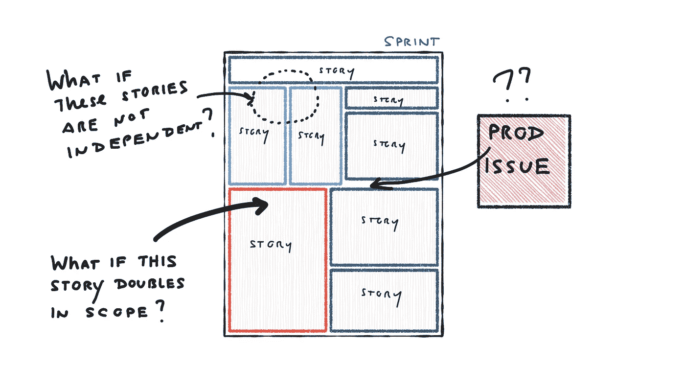
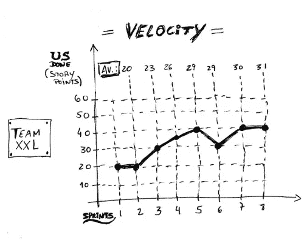

# 缩小工作规模(即使毫无意义)

> 原文：<https://medium.com/hackernoon/work-small-even-if-it-makes-no-sense-6bd1f401fc3a>

为什么有些团队一次又一次的冲刺都没有达到他们的 sprint " *承诺*(讨厌那个词)？在这篇文章中，我认为这种疗法正在发挥作用*极其有效，而且违反直觉的小*，但是我们的偏见(和直觉)让这变得困难。有一些深刻的人性因素在起作用。

# 目标

思想实验…

团队 Acme 被要求设定一个目标。目标包括完成**自选的工作量。**

以下是这个目标的要求。作品的产出必须:

*   做点什么(即使那件事非常简单)
*   可部署到生产中(在功能标志后面是可以的)
*   可练习/可测试/可演示
*   无害
*   **不超过五个工作日**
*   产生一些学习/商业价值(少量即可)

**对于工作的最小规模/数量/时间绝对没有要求。当团队结束时，他们会反思他们的工作，并设定另一个目标。**

# 嗯嗯

面对这些约束，团队(以及那些团队中的个人)倾向于自己思考:

*   如果我们把目标定得太小，那么就没有足够的工作给每个人。我们将不能分割工作，这将使人们感到厌烦(并且管理层想知道人们为什么无所事事)。
*   *一个小目标意味着几天后我们会回到同样的情况。我们应该试着设定一个能带我们走一段路的目标。*
*   我们需要每个人都能做出贡献的东西，但不要太大。在单独的任务中思考，然后从中制定一个目标，这可能更好吗？谁做什么？谁擅长什么？
*   一周的工作不可能真正有价值。我的意思是，这有点愚蠢，因为任何团队都可以用一个超级小的东西做到这一点。证明这一点有什么价值？ ***项目的其余部分呢？***
*   我们被告知要设定积极的目标。如果我们想确保满足这些准则，我们将被迫放弃。那是蹩脚的。
*   如果我们失败了怎么办？这将是一个尴尬的局面，尤其是考虑到目标是如此的灵活。
*   哦，这是浪费。这是对我们智力的侮辱。这是一个愚蠢的测试。

# 会发生什么？

你明白是怎么回事了吗？你看到动态变化了吗？基于这种内部对话，接下来会发生什么？

*   团队提倡两周冲刺，这样他们可以处理有意义的大块工作。他们完全拒绝了 5 天的目标。
*   任务被外包给个人。团队对目标的责任转变为个人对任务的责任。个人承担足够多的任务，让他们在整个街区都很忙。
*   目标缺乏凝聚力(它代表多个个体目标串在一起)，但在团队眼中它比一个小目标更有意义。
*   由于各种原因，目标往往是*大*。为什么？小目标是危险的。大目标意味着你在努力。大目标让人们忙个不停。如果事情出错，大目标会给你一个合理的借口。大目标会耽误下一个目标的设定。大目标不会侮辱你的智力。大目标不会强迫你煞费苦心地把工作分解成小块。哦，冲刺阶段是两周。
*   团队接受高利用率，并试图“填满”冲刺(从而基于类似俄罗斯方块的单个任务的积累建立目标)。
*   **不知何故，团队未能实现目标，并且有很多合理的原因(干扰、范围蔓延、新知识、新团队成员、工具等)。)**
*   尽管他们尽了最大努力去反映/适应，这种模式仍在继续

可以说，他们没有设定三天的目标。

# 为什么？

概括一下…对于团队中的个人和他们的经理来说，这些都是合理的。尽管团队拥有最大的灵活性(例如，他们可以进行微小的前端更改)…但出于各种原因，他们没有选择这条路线。为什么？

*   害怕失败
*   因为害怕遭人
*   害怕我们的成功与队友的成功联系在一起。掌控我们自己命运的需要
*   意识到“更多的时间”总是意味着更少的压力
*   厌恶被“放在显微镜下”/过度审查
*   骄傲(“这侮辱了我们的智力”或者“我已经这样做了二十年了……我可以一个人待着了”)
*   渴望做到最好，应对有意义的挑战
*   厌恶任何无所事事的人
*   直觉上，较小的批量会导致较高的“设置”成本(在这种情况下，包括规划、上下文切换等)。)…这相当于更多的会议，更少的时间“完成工作”

这是一些深刻的东西。令人惊讶的是，这一切是如何体现在我们如何设定目标和计划我们的工作。

# 那又怎样？

运动员如何掌握一项新技能？他们掌握动作。他们致力于技术。他们从小规模开始，然后逐渐扩大。

组织倾向于如何采用敏捷？团队设定一个冲刺长度(通常根据他们无法控制的全球发布节奏)，然后开始玩游戏。他们玩俄罗斯方块游戏:

“进展”是以每次冲刺交付的工作量(“速度”)来衡量的……而不是以实现有意义的目标为基础。

问题是团队经常不能掌握小规模的工作，和一起工作。上面“为什么”下面的深层人类项目仍然存在。他们陷入了一个“失败冲刺”的循环中…有很多看似合理的原因来解释为什么会发生这种情况。或者它们变得教条式地可预测，无法交付成果。

这一切的替代方案似乎非常可怕(原因如上所述)。如果敏捷被推销为“走得更快”，那么疯狂地慢和工作效率极低(表面上效率低下)的想法是令人厌恶的。

> 这太疯狂了。你怎么能有 5 天冲刺，3 天冲刺，1 天冲刺，可变长度冲刺，或者根本没有冲刺？那对我们队来说太高级了！我们永远不会被允许做这么极端的事情！工作需要继续！

然而，我认为这正是我们必须挑战的直觉和偏见。对于你组织中的一个团队来说，用三天的时间完成上述目标需要什么，即使这意味着他们需要聚集在一起互相帮助？怎样才能把工作做得非常小？

今天到此为止。时间盒命中。想法？