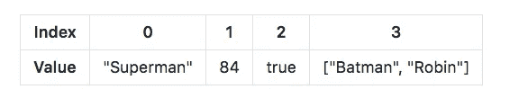
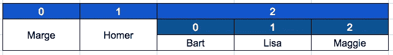
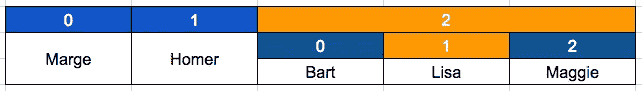

# 像老板一样使用 JavaScript 数组

> 原文：<https://medium.com/hackernoon/work-with-javascript-arrays-like-a-boss-97207a042e42>

## 彻底了解如何索引、添加和删除数组中的元素


Steinar Engeland — [https://unsplash.com](https://unsplash.com)

JavaScript[中的数组](https://hackernoon.com/tagged/javascript)是一个全局对象，包含一个项目列表。

它类似于任何变量，因为您可以用它来保存任何类型的数据。然而，它有一个重要的区别:它可以一次保存多项数据。

数组**是值**的有序集合:每个值称为一个**元素**，每个元素在数组中有一个数字位置，称为其**索引**。

数组内部的元素可以是任意类型，同一数组的*不同元素可以是不同类型* : string、 [boolean](https://hackernoon.com/tagged/boolean) ，甚至 objects 或者其他数组。这意味着可以创建一个数组，第一个位置是字符串，第二个位置是数字，第三个位置是对象，依此类推。

Javascript 中的数组是**从零开始的**，这意味着第一个元素的索引是 0。这非常重要，因为这意味着总会有一个单位的偏移量:第一个元素的索引为 0，第二个元素的索引为 1，依此类推。

下面是一个包含不同类型元素的数组的示意图:



在这里，索引 0 是一个字符串，索引 1 是一个整数，索引 2 是一个布尔值，索引 3 是另一个数组。当您需要在一个地方存储数据集合时，这非常方便；现在让我们看看如何创建和使用数组。

# 声明一个数组

数组非常有用，因为**你可以在一个数组中存储任意多的数据项**(在语言的限制下，这是 2^(32 元素)。

那么如何创建一个数组呢？您需要用`var`关键字声明一个变量，但是定义数组值的语法非常具体:您必须告诉 Javascript 您希望它是一个数组。

为此，您有两个选择:数组文本`[]`或`new`关键字。

## 简短语法:使用数组文字符号`[]`

数组文字符号只是方括号内逗号分隔的数组元素列表。

```
var myArray = [ "Jack", "Sawyer", "John", "Desmond" ];
```

数组的内容在左括号和右括号之间定义，每个值用逗号分隔。

值的引入方式与简单变量相同，这意味着字符串必须在引号之间声明。

要定义一个新的空数组，只需使用空括号:

```
var myArray = [];
```

## 长语法:使用`Array()`构造函数

```
var lostArray = new Array("Jack", "Sawyer", "John", "Desmond" );
var twinPeaksArray = new Array("Laura", 2, ["Bob", "Leland", "Dale"]);
```

这个语法的关键字 *new* 要求 Javascript 定义一个新的数组，数组的条目作为参数传递。

如果您预先知道数组将包含多少个元素，您可以将计数作为参数传递给构造函数，数组将自动创建，并包含该数量的元素槽(每个元素将用值`undefined`初始化) :

```
var myArray = new Array(80);
```

这将创建一个带有 80 个槽的空数组，用值`undefined`初始化。

要定义一个没有特定项数的新空数组，只需初始化一个没有参数的新数组:

```
var myArray = new Array();
```

# 访问数组的元素

每个元素的索引值允许你引用数组中的每个数据；你可以使用`[]`操作符来访问它；

```
var myArray = ["Jack", "Sawyer", "John", "Desmond"];console.log(myArray[0]); // Prints “Jack”
console.log(myArray[3]); // Prints “Desmond”
```

请记住，索引值从 0 开始，而不是从 1 开始。这意味着数组索引从 0 开始，一直到元素数减 1。所以，我们的四个元素的数组有从 0 到 3 的索引。

正如我们所见，数组可以有多个维度，这意味着数组元素可以包含数组，数组的元素可以包含数组，等等。那么我如何访问数组内部的数组，或者多维数组呢？

让我们以表示一个家族的数组为例，其中家族的子代包含在主数组中它们自己的数组中:

```
var familyArray = ["Marge", "Homer", ["Bart", "Lisa", "Maggie"]];
```

我们可以这样表示这个数组:



如果我想访问值“Lisa ”,我该怎么做呢？



我们可以用橙色显示“Lisa”的位置:嵌套数组中的索引 1，嵌套数组本身位于主数组的索引 2:

为了访问“Lisa”值，我将编写:

```
var lisa = familyArray[2][1];console.log(lisa); // Prints "Lisa"
```

这几乎可以无限地继续下去，并允许我们存储组织得非常好的嵌套在一起的数据集合，可以通过它们的索引进行访问。

# 向数组中添加项目

## 添加索引

我们看到你可以通过调用相应的索引来访问数组中的每个元素。这也允许我们通过声明来添加(或修改)元素，例如:

```
var myArray = [ "Kate", "Sun"];
myArray[2] = "Juliet";console.log(myArray); // Prints "Kate, Sun, Juliet"
```

这里我只是在数组的索引 2 处添加了一个元素，这个元素以前不存在，但现在包含了值“Juliet”。

如果我在给定的索引处声明了一个元素，而中间没有元素，会发生什么？数组将创建所有的元素，并用`undefined`初始化那些没有值的元素:

```
var myArray = ["Kate", "Sun"];myArray[5] = "Juliet";
console.log(myArray.length); // Prints "6"
console.log(myArray); // Prints ["Kate", "Sun", undefined, undefined, undefined, "Juliet"]
```

您可以使用名为`length`的数组属性来查找数组的长度:这里我们可以看到数组现在有六个元素，三个没有赋值的元素是未定义的。

## `push()`方法

方法允许在一个数组中添加一个或几个条目。`push()`方法可以接收无限数量的参数，每个参数代表一个要添加到数组末尾的项。

```
var myArray = [ "Kate", "Sun"];myArray.push("Juliet"); // Adds "Juliet" at the end of the array
myArray.push("Libby", "Shannon");// Adds "Libby" and "Shannon" at the end of the array.console.log(myaArray); // Prints ["Kate", "Sun", "Juliet", "Libby", "Shannon"]
```

## `unshift()`法

`unshift()`方法的工作方式类似于`push()`，除了条目被添加到数组的开头。

```
var myArray = [ "Kate", "Sun"];myArray.unshift("Juliet"); // Adds "Juliet" at the beginning of the array
myArray.unshift("Libby", "Shannon");// Adds "Libby" and "Shannon" at the beginning of the array.console.log(myaArray); // Prints ["Libby", "Shannon", "Juliet", "Kate", "Sun"]
```

# 隐藏数组中的项目

`pop()`和`shift()`方法

它们分别从数组中移除最后一个和第一个元素:

```
var myArray = ["Jack", "Sawyer", "John", "Desmond", "Kate"];myArray.pop(); // Removes "Kate"
myArray.shift(); // Removes "Jack"console.log(myArray); // Prints ["Sawyer", "John", "Desmond"]
```

# `splice()`方法

`splice()`方法允许我们在一个数组中添加/删除条目，并明确指出需要添加/删除的元素的索引:

在下面的示例中，`splice`从索引 2(第三个元素)开始添加两个元素:

```
var fruitArray = ["apple", "peach", "orange", "lemon" ,"lime", "cherry"]; 
fruitArray.splice(2, 0, "melon", "banana");console.log(fruitArray); // Prints ["apple", "peach", "melon", "banana", "orange", "lemon", "lime", "cherry"]
```

*   第一个参数是索引:它指定在数组的什么位置添加/移除项。这里我们选择了索引 2(值为“橙色”)。
*   第二个参数是要删除的项目数。这里我们将其设置为 0，因此不会删除任何项目。
*   以下可选参数是要添加到数组中的新项目。这里我们想从索引 2 开始添加“甜瓜”和“香蕉”。

例如，要仅删除索引 2 处的一个元素(“orange”)，我必须编写:

```
var fruitArray = ["apple", "peach", "orange", "lemon" ,"lime", "cherry"]; 
fruitArray.splice(2,1);console.log(fruitArray); // Prints ["apple", "peach", "lemon", "lime", "cherry"]
```

还可以查看另一种从数组中移除项目的方法`slice()`，但是这一次将返回一个新的*数组，而不是修改原来的数组。*

想了解更多？查看我关于 [JavaScript](https://hackernoon.com/tagged/JavaScript) 基础的其他文章:

*   [**JavaScript 中的提升:快速指南**](https://hackernoon.com/hoisting-in-javascript-a-quick-guide-cc4d9597bbd7)
*   [**轻松理解 JavaScript 变量作用域**](https://hackernoon.com/understand-javascript-variable-scope-with-ease-221a6d41dc43)
*   [](https://hackernoon.com/get-your-head-around-this-73c23653b102)**搞清楚“这个”**
*   **[**如何自信地使用 JavaScript 闭包**](https://hackernoon.com/how-to-use-javascript-closures-with-confidence-85cd1f841a6b)**
*   **[**掌握 JavaScript**](https://hackernoon.com/grasp-by-value-and-by-reference-in-javascript-7ed75efa1293) 中的“按值”和“按引用”**
*   **[**JavaScript 中的日期快速手册**](https://hackernoon.com/a-quick-handbook-for-dates-in-javascript-7b71d0ef8e53)**

**我希望您喜欢这篇关于在 JavaScript 中使用数组的快速概述。**

**请随意评论并喜欢这篇文章，以便其他人可以在 Medium 上轻松找到它！**

**[](http://eepurl.com/dvio9L)**