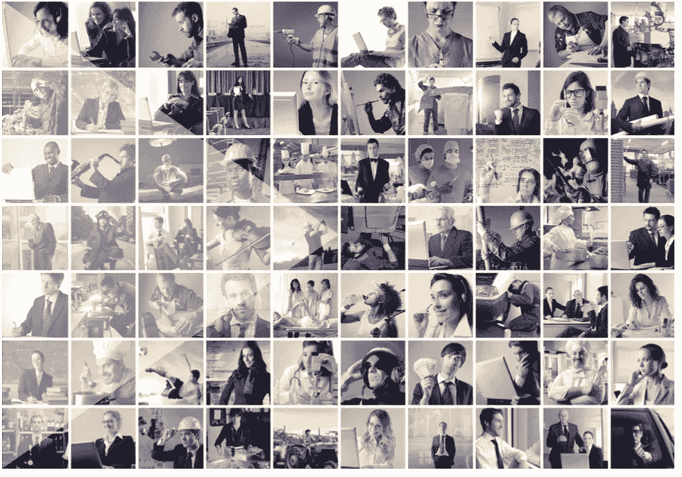
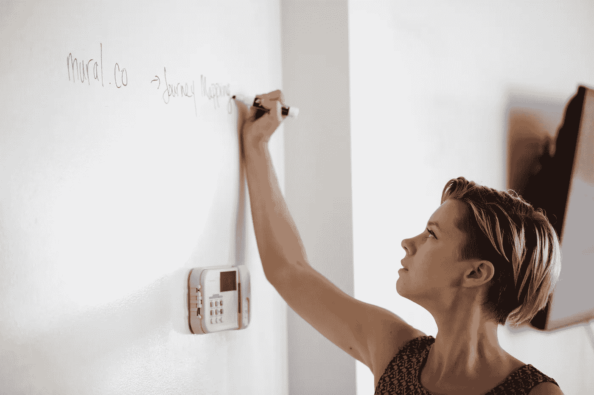
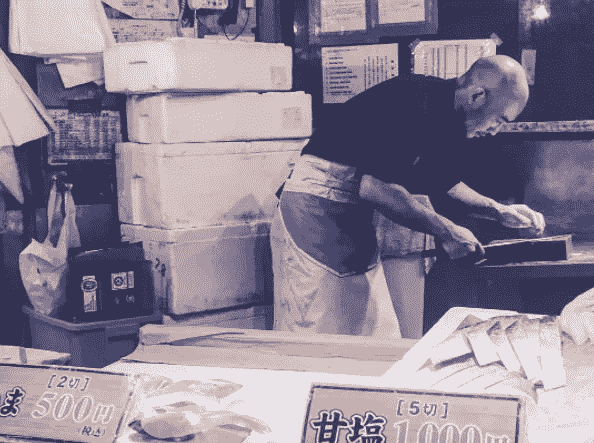
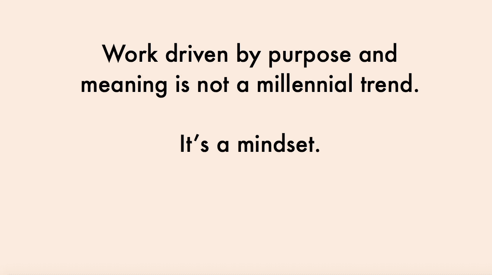
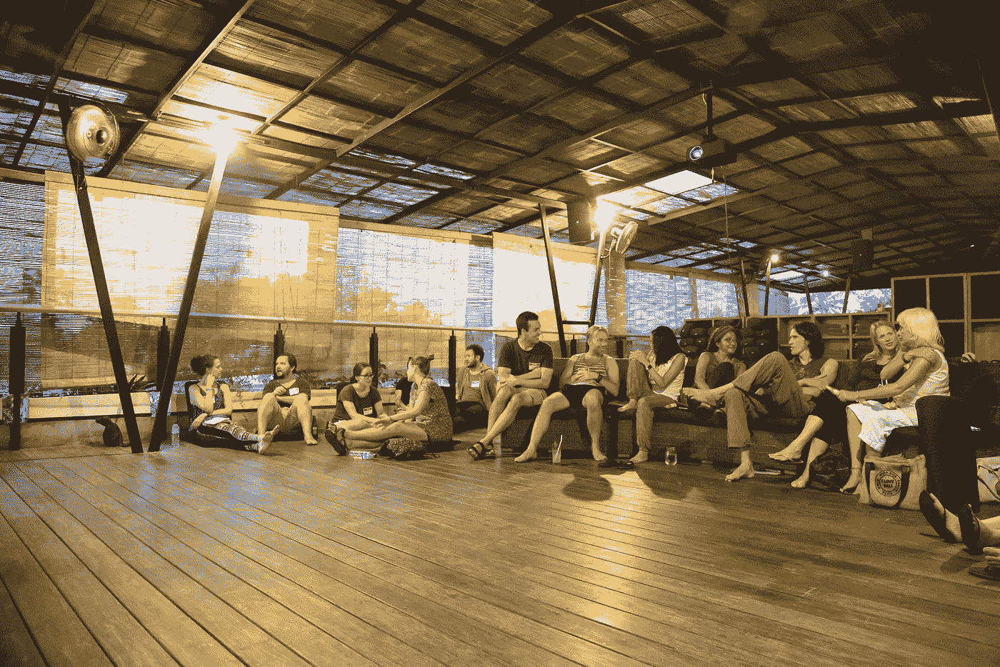

# 工作。工作。工作。工作。工作。工作。

> 原文：<https://medium.com/hackernoon/work-work-work-work-work-work-f1ea110e3d71>

安静的文艺复兴

瑞典沃尔沃的顶级工程师、圣保罗耐克的创意总监和雅加达 EY 的高级顾问有什么共同点？他们都是我最近遇到的实现了飞跃的人。

> 他们放弃了轻松的工作，去追求未知的、令人兴奋的东西。

在当今复杂的商业世界中，在不确定的情况下导航的能力是一项资产，也是指导自己职业生涯的绝对必要条件。在永恒的好奇心和方形思维 的驱动下，这位新的万花筒野心家融合了她所有的专业知识和经验。

问我，我应该知道。相当荒谬的是，我为工作所做的就是思考、写作和谈论工作。融合我的经验和专业知识——我帮助人们、团队和组织做到最好。

# 随处工作者

工作应该基于一个活动而不是一个地点的想法是基于活动的工作的前提(ABW)。这个概念，25 年前由[**Erik Veldhoen**](http://www.veldhoencompany.com/en/media/rise-rise-activity-based-working/)**首次提出，现在已经不再是一个新奇的概念。**

**然而，当我们今天谈论灵活性时，我们不仅仅是从位置的角度来说的。我们越来越多地从时间的角度考虑这个问题。在任何地方，员工的节奏和流动性都取决于不间断的工作时间，以完成最佳工作。**

**没有比她想去的地方更好的办公室了。因此，随着越来越多的人选择自己，劳动力的平衡将向有利于他们的方向倾斜。宏观趋势表明，整个工作世界正朝着更精简、更自由的方式发展。研究表明，到 2020 年，超过 65%的专业工作人员将成为独立合同工。**

**换句话说，有限的全职员工人才库只会越来越小，而临时外部劳动力却在增长。随着工作的不断变化和发展，动力将从成为劳动力的一部分转移到属于一个社区。**

# **不稳定的职业**

****

**From [Colony](https://blog.colony.io/visions-of-the-future-e8bb374575cd#.e8ma9pl5g) & downloadable for non-commercial use [Here](https://farm9.staticflickr.com/8005/28558896463_f6e72b3629_o_d.jpg)**

**随处工作者想要许多企业根本无法提供的东西:**自主、掌握和目标。因此，大量新贵正在迎合这一新兴市场。 [**Vestd**](https://vestd.com/) 允许专家为初创公司做出贡献，以换取企业的股权。 [**Colony**](http://colony.io/) 采用区块链技术(实现比特币交易的同一个平台)来实现一种新型的创造性集体主义。其他帮助独立人士蓬勃发展的著名平台包括**[**Toptal**](https://www.toptal.com)[**The Backscratchers**](https://thebackscratchers.com/)[**10x Management**](https://www.10xmanagement.com/)[**Lystable**](https://www.lystable.com/)[**Bonsai**](https://www.hellobonsai.com/)。他们养活的替代劳动力——*零工经济—* 反过来刺激组织无限收缩和扩张。******

****从许多方面来说，形势已经从公司挑选一些人作为未来的雇员，转变为那些现在自己决定在哪里工作以及如何工作的人。当我凝视那些已经做出这一飞跃的人们的眼睛时，他们眨了眨，透露出:“*我选择了自己*”。****

********

****[Charles Handy](http://www.goodreads.com/book/show/74628.The_Age_of_Unreason), organisational theorist who coined the ‘Portfolio Worker’, said this 35 years ago****

****平衡在一起，独立人士正在创造一个工作的更新。下一波组织、就业和价值创造的浪潮将从他们那里产生——我们都应该为这一旅程感到兴奋。****

# ****生产力的小块区域****

********

****From [WEF’s](http://reports.weforum.org/future-of-jobs-2016/) Future of Jobs****

****“那你是做什么工作的？”改成了“你在忙什么？”每个人都有副业。幸运的是那些把兼职作为主要工作的人。一个直接的后果是:*工作不再像工作。*****

****这也意味着今天的工人需要过多的纪律和注意力。数字工作——在电脑上用你的数字工作——带来了各种自由、追求、奢侈、机会等等。随之而来的是一种第一世界风格的负担——知道何时、何地、如何做好工作。在这个注意力分散的时代，你用时间做什么比在哪里做更重要。****

****作为一名随处工作的 WIFI 支持者，还意味着知道*何时*和*如何*关闭。这是新的*工作智能*。时间管理的谬误在于，如果我们能在更短的时间内完成更多的工作，那么我们就应该积累更多的工作。奥利弗·伯克曼最近的一篇文章解释道:****

> ****时间管理承诺了一种控制感，在这个世界里，个人——越来越少地依靠宗教或社区的社会纽带——似乎缺乏这种控制感。在一个就业不稳定的时代，我们必须不断地通过狂热的行为来证明我们的有用性，时间管理可以给你一个宝贵的优势。事实上，如果你是越来越多的个体户，比如自由职业者或所谓零工经济中的工人，提高个人效率可能对你的生存至关重要。如果你沉溺于‘游手好闲’，唯一遭受经济损失的人..就是你。”****

****个人生产力的主观本质意味着知道(在某些情况下，推动)你自己的极限。虽然凯恩斯的 15 小时工作周可能已经成为一种惯例，但最近的研究表明，超过 25 小时的工作周会让我们中的一些人变得愚蠢。****

********

> ****下一波工人将需要卓越的自我管理能力来做创新经济所要求的**的深度工作。有了敢干的态度、 [**成长的心态、**](https://www.farnamstreetblog.com/2016/11/workplace-mindset/) 和随时学习的多才多艺——这一代人将在新的工作环境中茁壮成长。******

# ********工作不是工作********

************

******观察任何一个日本工人，不管他是寿司厨师、银行家还是机场清洁工，你都会注意到他的迷人之处。******

******与西方同行形成鲜明对比的是，几乎每个工人都精神抖擞。工作中的自豪感随处可见。现在,[***Shokunin***](http://www.dnabizbuilder.com/shokunin.html)(看起来已经民主化)无处不在。日本作家、雕塑和教师 Tasio Odate 对此做了最好的解释:******

> ******“日语单词 shokunin 在日语和日英词典中都被定义为‘工匠’或‘工匠’，但这样的字面描述并不能完全表达更深层次的含义。日本学徒被告知，shokunin 不仅意味着拥有技术技能，还意味着一种态度和社会意识..shokunin 人有社会义务尽最大努力为人民谋福利。这种义务既是精神上的，也是物质上的，因为不管是什么，shokunin 的责任就是满足这一要求。”******

******日本工作文化中存在令人担忧的隐忧(****s**[**缺乏反馈**](http://www.bbc.com/capital/story/20160822-why-you-dont-give-praise-in-japan)[**不解雇不称职员工**](http://www.pwc.com/jp/en/cas-newsletter/wmn-vol02-tpc3.html)**[**AI 接管白领工作**](http://qz.com/875491/japanese-white-collar-workers-are-already-being-replaced-by-artificial-intelligence/) 以及老板不受约束的权力等等)。但对于像我这样的外国人来说，他们都被工人独特的态度和社会义务所掩盖。工作与其说是工作，不如说是实践；艺术形式。**********

************

******From [Victoria Stoyanova’s](https://twitter.com/vicky_stoyanova) Deck @ Future of Work #6******

******当你在某件事上不断进步并接近精通时，你会自动投入其中。你在工作中有意义。尽管这份工作本身可能并不总是那么迷人，但日本的文化规范让你和其他人重视你的谋生之道。******

******西方的 [**可以从日本的**](http://www.nytimes.com/2016/12/13/magazine/what-the-west-can-learn-from-japan-about-the-cultural-value-of-work.html)****中学到很多东西，要是我们能抓住这个线索，做点什么就好了。可悲的是，除了阅读备忘录，我们很可能需要一场比大衰退更严重的经济危机来采取任何有意义的行动。**********

# ********论集体主义********

****************

********Making Work, Work @ [ROAM](https://www.roam.co/), Ubud********

********现代集体主义的例子比比皆是。以免费、开源的 Apache 软件为例，它运行在超过 3500 万台服务器上，为世界上一半的网页提供动力(让微软相形见绌)。像 P&G 这样的公司使用一个名为“连接和发展”的开放创新平台，自由职业者使用亚马逊的机械土耳其人市场在他们想做的时候做他们想做的事情，任何有兴趣和时间的人都可以向维基百科投稿。********

********通过技术共享放大的人类冲动正在以前所未有的规模促成开放合作和集体主义。根据定义，在这些分布式网络中，个人的自由以及合作的力量都得到了优化。Youtube 每月有超过 10 亿用户制作和观看源源不断的视频。跟踪开源项目的 [**Black Duck Open Hub**](http://www.openhub.net/) 拥有近 400 万贡献者在超过 70 万个项目上工作的记录。个人不再仅仅是用户，而是系统中积极的利益相关者。********

******这也发生在线下，规模较小，但明显更具社会凝聚力——社区吸引了具有创造力、智力和冒险倾向的成员。现代的过渡性工作方式将会继续传播，因为工人们可以在任何地方找到做好工作的自由。这些短暂的地方将允许行业合并，学科融合，创造力蓬勃发展，创新发生。******

******如果你不知道这类新兴的同居或度假方式，看看下面这些:******

****** [## 共处与合作|漫游

### Roam 是一个共享生活和工作空间的全球社区。签一份租约，住在有趣的地方…

www.roam.co](https://www.roam.co/)  [## 不稳定:住在任何地方，一次住一个月。

### Unsettled 提供在世界各地逐月生活和工作的能力。一切都需要…

beunsettled.co](https://beunsettled.co/)  [## 韦利弗

### 建立在社区基础上的新生活方式。纽约和华盛顿特区配有家具的公寓和灵活的租赁服务，配有…

www.welive.com](https://www.welive.com/)  [## 合作的企业家

### 20 位富有冒险精神的企业家在异国他乡经营他们的生意，同时在一个鼓舞人心的…

www.projectgetaway.com](http://www.projectgetaway.com/)  [## 在伦敦共同生活、共同工作——集体

### 集体是一种新的物业公司，我们创造创新的共同生活和共同工作的空间为…

www.thecollective.co.uk](https://www.thecollective.co.uk/)  [## 遥远的一年

### Remote Year 汇集了来自全球各地的 75 名数字游牧民，让他们用一年的时间工作、旅行…

www.remoteyear.com](http://www.remoteyear.com/)  [## 黑客天堂

### 黑客天堂--一个创意型的旅游社区。

www.hackerparadise.org](http://www.hackerparadise.org/)  [## 冲浪办公室|西班牙和葡萄牙的高效公司静修

### 打破常规，让你的员工走出办公室，准备好迎接一次能给你带来提升的经历…

www.thesurfoffice.com](https://www.thesurfoffice.com/)  [## SunDesk:在摩洛哥 Taghazout 共同工作。工作。冲浪。连接！

### 加入我们在 Taghazout 的共同工作空间，从跨国同事那里获得灵感，发现摩洛哥文化并探索…

sun-desk.com](http://sun-desk.com/) 

一部新电影记录了许多推动这些组织的人； [**单程票**](http://digitalnomaddocumentary.com/) 。TLDW？这种游牧式的工作方式与其说是一种新的动力，不如说是网络世界促成的一种自然的动力。这是一种长期存在的现象。

走进从多伦多到东京的任何一家潮人咖啡店，伴着撩人的音乐、浓浓的手工咖啡，甚至更强的无线网络——自己去看看吧。比随处工作者的激增更令人震惊的是，观察这些忙碌的工作者，揭示了一些看起来更像是快乐而不是劳动的事情。

作为与全球大脑协同工作的个体，我们共同的进步可能是非凡的。今天的知识工作者正在成长为下一个文艺复兴*艺术家*。她的画笔她的手指，她的签名风格她的多才多艺，还有她的画布，网络。我们看到未来的自己，嫉妒得脸色发青。

# 加入对话

我欢迎你在下面的评论区发表意见

请参加我的下一次未来工作会议，在此 注册信息

# ****想让书呆子多出来一些？****

**一些附加阅读..**

** [## 这是我们的工作方式

### 我们为什么以这种方式工作？我们未来的工作将更多地是一个地方还是一种实践？一天的工作是什么样的…

hackernoon.com](https://hackernoon.com/its-how-we-work-b38d90255e2c)  [## 为什么你需要不断学习，以及如何做到这一点

### 孩子们绝对喜欢问问题:如果我能看到所有的星星，它们真的会那么远吗？谁最快…

www.shutterstock.com](http://www.shutterstock.com/blog/why-you-need-to-constantly-keep-learning-and-how-to-make-it-happen)  [## 我们未来的工作会成功吗？

### 投资组合工作者的出现以及它如何改变我们做生意的方式。

creator.wework.com](https://creator.wework.com/how-to-guides/will-future-work-work/)  [## 突发工作

### 外部力量在这个时刻达到了顶点，导致了工作领域的一个彻底的范式转变，而且…

www.huffingtonpost.co.uk](http://www.huffingtonpost.co.uk/jonas-altman/burst-working_b_7142752.html) 

* *本文的一个版本首先出现在超岛* [***这里***](http://www.hyperisland.com/community/news/building-a-fluid-career)

** *如果你喜欢这篇文章，请表现出一些爱心&点击下面的小* ***💚***

> [黑客中午](http://bit.ly/Hackernoon)是黑客如何开始他们的下午。我们是 [@AMI](http://bit.ly/atAMIatAMI) 家庭的一员。我们现在[接受投稿](http://bit.ly/hackernoonsubmission)，并乐意[讨论广告&赞助](mailto:partners@amipublications.com)机会。
> 
> 如果你喜欢这个故事，我们推荐你阅读我们的[最新科技故事](http://bit.ly/hackernoonlatestt)和[趋势科技故事](https://hackernoon.com/trending)。直到下一次，不要把世界的现实想当然！

********