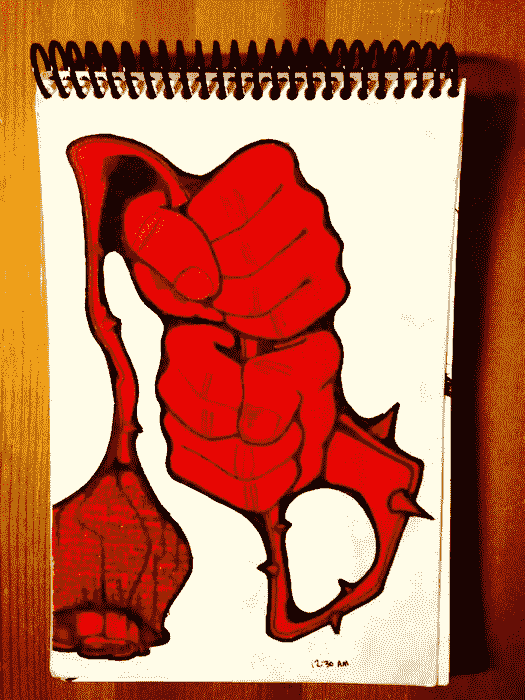

# 为英寸工作

> 原文：<https://medium.com/hackernoon/working-for-inches-f78a2a995708>

成长是我们为之努力的过程，而不是交给我们的。

*   一个伟大的艺术家就是通过她首先展示的成千上万糟糕的、不吸引人的作品变成这样的。
*   一个伟大的机修工会通过成百上千的问题变成那样，这些问题是关于哪个做什么，什么去哪里。
*   一位出色的摄影师首先学习照明光源，以及在需要完全静止时如何正确呼吸。**(提示:当你慢慢呼气时，你是最平静的——这适用于你需要放松的任何事情(画直线等)。] )**
*   一个重量训练者只有在生活的几乎每一个领域都通过严格的纪律才能实现他们的目标**(在健身房锻炼肌肉只占 20%——其余的在我们的营养/睡眠习惯中)**
*   一个出色的滑板手首先通过一次又一次的尝试，年复一年地把自己踢得屁滚尿流。

如果很容易，每个人都会去做。当然，任何事情都很容易开始，但是当新鲜感消失时，真正的挑战就来了，我们只剩下一个问题“我有多想要这个？”

# "重要的不是你赚了什么，而是你保留了什么。"

# - mos def (hiphop 艺术家)

当然，最初的收获有很多，但是保持下去呢？这本身就是一个完全不同的游戏。守住赌注是一门艺术。

当我坚持做我的工作时，我做得最好——任何工作，真的。无论是艺术、健身、滑板、写作——当我工作的时候有一个模式，而不是拿起铅笔的一些随机事件，就是当[学习](https://hackernoon.com/tagged/learning)过程开始，灵感开始发挥作用，如果我没有提前一两天工作，这些灵感永远不会出现。

在投入工作的过程中，我们会发现一些小金块，这些金块我们真的必须挖掘才能得到。如果我们没有早一两天挖掘，今天的挖掘就不会挖掘到灵感/动机/关键/代码/想法的微小金块。

我们每天都在工作，我们为英寸工作。不是英尺，不是英里，不是英寸。随着时间的推移，这些英寸加起来就是英里，但是一英里有多少英寸呢？很多。仅仅想到这一点就能让我们疯狂地思考未来——所以最好理解任何正在完善的工艺都是——你已经听说过——一场马拉松**而不是短跑。**

# 这是马拉松，不是短跑。

也许这是互联网上最古老的陈词滥调之一，但这是真的吗？上帝是的。

在一个我们现在就想要一切(最好是昨天)的世界里，一门完美的手艺需要时间、鲜血、汗水、泪水、焦虑、努力、纪律、呕吐、做我们完全不想做的事情，以及牺牲——所有这些都是为了从表面开始。

对于真正的增长(不是类固醇，不是商店购买)…

我们每天为英寸而工作。

> [黑客中午](http://bit.ly/Hackernoon)是黑客如何开始他们的下午。我们是 [@AMI](http://bit.ly/atAMIatAMI) 家庭的一员。我们现在[接受投稿](http://bit.ly/hackernoonsubmission)，并乐意[讨论广告&赞助](mailto:partners@amipublications.com)机会。
> 
> 如果你喜欢这个故事，我们推荐你阅读我们的[最新科技故事](http://bit.ly/hackernoonlatestt)和[趋势科技故事](https://hackernoon.com/trending)。直到下一次，不要把世界的现实想当然！

