# 纱线和非织造布的加工

> 原文：<https://medium.com/hackernoon/working-of-yarn-and-npm-974b79f10341>

作为一个 Ember 开发者，发现脸书的纱线包管理器是我能遇到的最好的事情。

每当我的开发伙伴遇到“花椰菜插件失败……”时，我会说“rm -rf node_modules”，这是我的前辈告诉我的，我延续了这个传统。

这是非常令人沮丧的，作为一个初学者，我过去常常把这一切归咎于 Ember，因为我不明白发生了什么。随着时间的推移，我意识到 npm 是罪魁祸首。但是几个月前，我发现了这个纱线包经理。当我找到它时，我读到它承诺解决最常见的“npm 安装”错误。它声称它更好，因为它是:

确定性不同于 npm。

并行安装的网络性能。

与 npm 相同的软件包安装(它使用相同的注册表)。

Yarn 使用校验和来验证包的完整性。

因为它缓存了所有的软件包，所以即使在脱机状态下也可以运行。

Its 最近获得了很多关注，所以它的功能可以在互联网上找到。你在互联网上不容易找到的是它如何实现这些伟大的功能。我最初并没有太注意 npm 装置是如何工作的，但随着我对纱线的了解，我变得很好奇，所以我决定深入研究，找出它们是如何工作的。希望有助于初学者更好的理解事物。

作为一个 npm 世界的初学者，我不知道下面的几个术语，所以我决定在这里添加它们，这样新来的人就不必谷歌每个单词，然后来回跳转。

## 1.包装

它们是一种软件，可以从网上下载来完成某项任务。它们可能依赖于其他包。

## 2.属国

它们指定了应用程序使用的包。它们在像 package.json 这样的清单文件中指定。以下依赖关系可能表示如下:

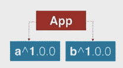

“依赖项”:{
“a”:“1 . 0 . 0”，
“b”:“1 . 0 . 0”
}

他们使用语义版本控制，即

I .给定版本号 MAJOR.MINOR.PATCH

二。主要版本当您进行不兼容的 API 更改时，

三。当您以向后兼容的方式添加功能时，次要版本。

四。补丁版本当你做向后兼容的 bug 修复。

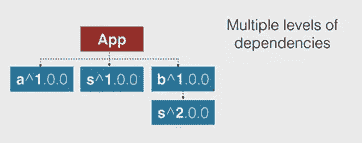

它们遵循平面命名空间，这意味着所有不同的包被赋予相同的层次结构，除非它们有多个版本，那么在这种情况下，它们将在命名空间中被分配较低的级别，就像上面例子中的's^2.0.0'。

所以让我们从一个 npm 安装的例子开始，然后是 yarn 安装。我将保持这个例子简单但非常详细。

## 假设

这将是我们第一次安装 package.json

二。目前没有 node_modules 文件夹。

三。没有预先缓存的包。

## 软件包安装有三个阶段

**一、依赖关系解析**

向注册表发出请求，递归地查找依赖项，并确定依赖项文件夹中软件包安装的位置。

**二。获取包**

获取压缩格式的包，并将它们放在全局缓存中。

**三世。链接包**

将文件从全局缓存复制到本地 node_modules 文件夹。

也就是说，让我们看看当我们进行“npm 安装”时，上述事情实际上是如何发生的。

现在考虑一个清单文件(package.json ),它包含以下简单的假设包。

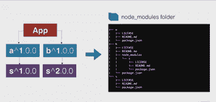

"依赖项":{
"a" : "1.0.0 "，
"b" : "1.0.0"
}

我们将通过删除次要版本和补丁版本，只保留主要版本来使它变得更简单。留给我们的是:

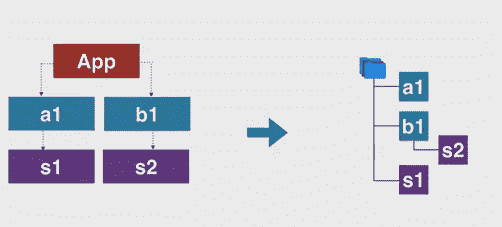

当我们对上述 package.json 文件进行“npm 安装”时，npm 会执行以下操作:

## 1.加载包:

a.如果 node_modules 文件夹已经存在(即，您之前使用了“npm install”来创建 npm_modules 文件夹)，则使用它通过从光盘加载来创建理想树。

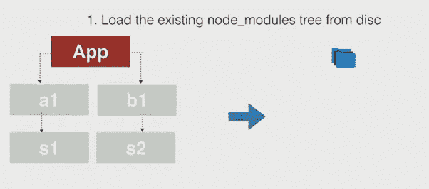

b.克隆现有的树，以建立理想的树，这作为我们的应用程序的最终树。

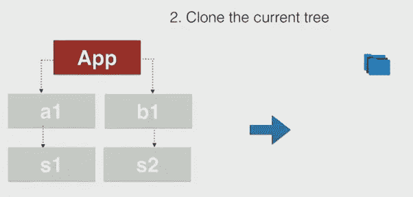

c.使用克隆树构建理想树，它将用于在 node_modules 文件夹中构建包文件夹。这可以在下面的快照中看到。

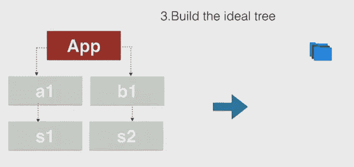

首先，我们遇到“a1”包，它有另一个对“s1”的依赖，因为这是我们第一次看到它，所以我们遵循扁平结构，并将其作为“a1”和“b1”的公共依赖。这种结构允许我们将这个包重新用于可能依赖于“s1”的另一个包。

现在，当我们遇到“s2”时，它是同一个包的版本 2，那么我们就不能遵循平面结构，因为同一个包不能驻留在同一个目录中。因此，我们认为它是“b1”的子文件夹，并且在“b1”中创建了“s2”的文件夹。

这也告诉我们，当我们需要重用一个包的时候，我们需要把它放在另一个同名但版本不同的包的最上面，这个包可能不会被其他包重用。

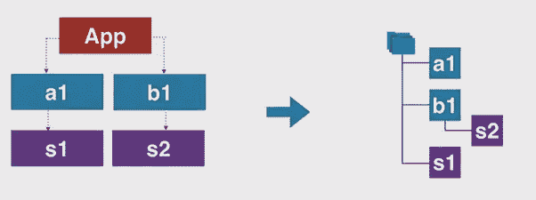

## 2.依赖关系解析:

a.基于理想树，npm 检测哪些包需要安装，哪些已经安装。对于我们的情况，因为没有理想的，因为我们从零开始安装。

b.它还解析子包和平面目录路径中使用的版本。

c.在这一步，npm 知道哪些包需要安装在哪些文件夹中。

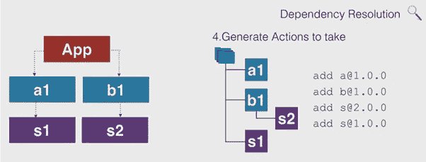

## 3.包获取和链接

a.在这里，npm 实际上是从 npm registry 获取包，并将它们安装在包的相应文件夹中。

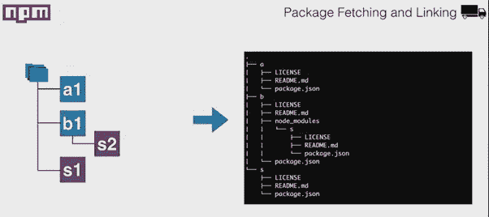

这就是 npm 一直以来的做法，现在让我们来看看我们的新人 Yarn 要做些什么来让事情变得更好。

## 1.依赖关系解析:

a.Yarn 为清单文件创建了一个包请求列表。它首先检查包，然后将所需的版本添加到列表中。依赖性解析是一个包一个包地完成的。对于这个例子，它考虑“a1”。

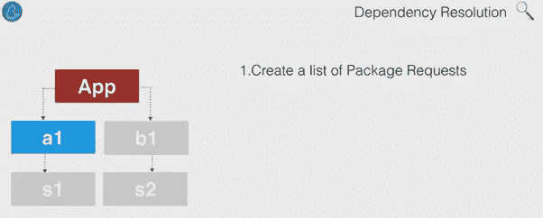

b.现在我们已经有了包名和它的版本号，Yarn 继续到 npm 存储库(Registry ),寻找与清单文件中提到的相同或更高版本的包。我们可以在 package.json 或 manifest 文件中提到需要获取的包。以下是用于指示需要获取哪个版本的符号。

i. '~ ':它修复了主版本号和次版本号，同时匹配任何补丁号。《出埃及记》~2.1.0 意味着获取高于 2.1.0 但低于 2.2.0 的任何内容。

二。'^':它锁定主要版本，并寻找次要版本和补丁版本的最新版本。Ex ^2.1.0 表示获取高于 2.1.0 且低于 3.0.0 的任何数据

三。*:它根据使用位置锁定大调或小调。例 2。*表示低于版本 3.0.0 和 2.0 的任何版本。*表示小于 2.1.0 的任何值

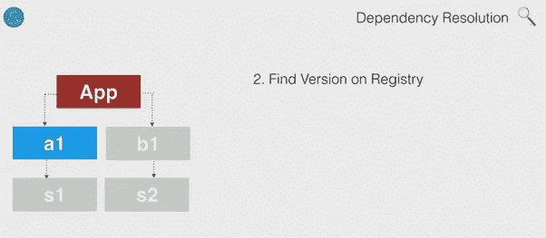

c.现在，Yarn 在向注册表发出实际请求之前检查本地缓存。如果需要安装的包已经被其他包使用了，那么就没有必要再请求它了，因为它已经被 yarn 缓存起来以备后用。

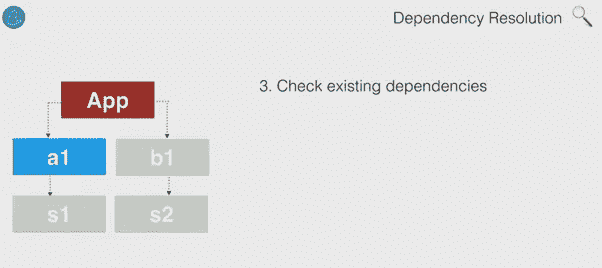

d.对每个包执行上述过程，然后具有需要提取的包的列表，因为它知道哪些包先前被提取并且被缓存。

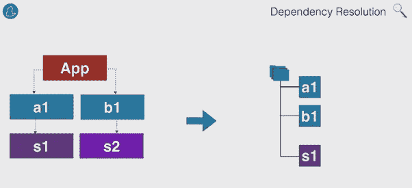

## 2.获取和链接

a.现在，对包的请求已经发出，并从注册表中获取。以同样的方式，纱线获取其他包装。

一旦获取了所有需要的包，Yarn 就会像“npm”一样链接这些包。但是这里的链接有点复杂，因为 Yarn 需要链接缓存的和新获取的包。它需要将缓存的包复制到新的链接路径中。

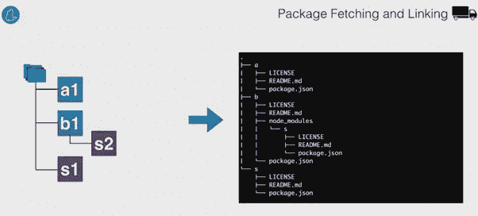

## 3.保存锁定文件

a.它用于准确地存储每个依赖项安装了哪个版本。它类似于 npm 的 npm-shrinkwrap.json，但是它没有损耗，并且创建了可重复的结果。在 Rails 中，您有 bundler 来做类似的事情。它由 Yarn 管理，并在您每次添加/删除/更新现有包时进行更新。

b.这个文件总是需要提交，因为它是 Yarn 能够跨系统维护包的完整性和一致性的唯一原因。所以是谁提交了这个文件，以及用这个文件提交了什么，这是很难做到的。破包提交可能导致在每个团队成员的机器上安装相同的破包。

c.它还起诉每个包的校验和，这有助于确保您的数据完整性得到维护。

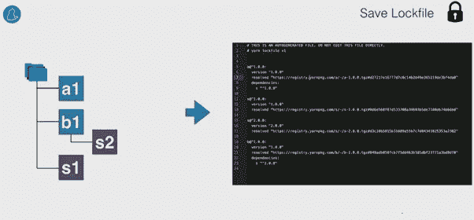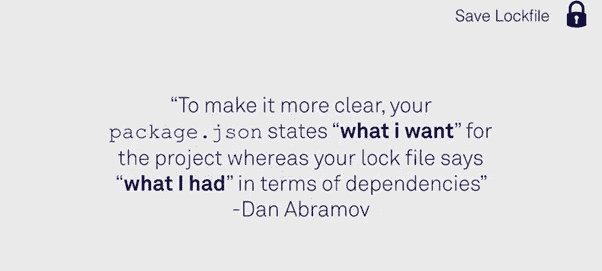

现在我们知道了 yarn 是如何工作的，我想展示一下 npm 的一个主要缺点，并告诉你 Yarn 是如何解决它的。

我想展示在不同的机器上安装相同的包如何在 npm 中产生不同的 node_modules 文件夹，以及 yarn 如何通过维护一个锁文件来解决这个问题。

现在假设，Yehuda 使用 npm 如下安装软件包

考虑他决定将包“a”升级到“a2”。运行“npm 安装”时，它会产生以下结构。

现在假设耶胡达想与世界分享他的代码，人们开始使用上述软件包的“npm 安装”。

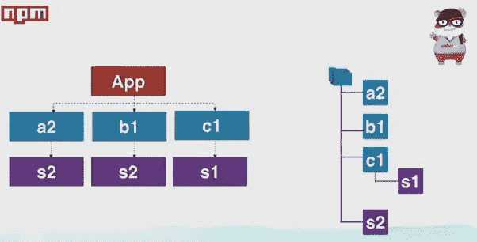

因此，正如我们所看到的，npm 并没有跨系统维护一致的结构，但是 Yarn 就是为了解决这个唯一的问题而构建的。其余的功能只是一个插件。

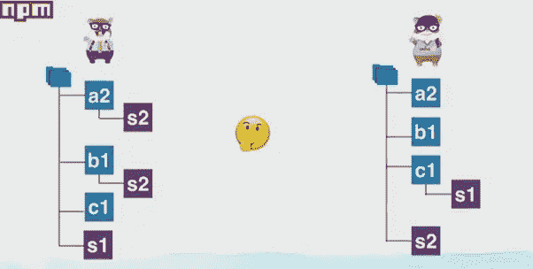

这可以通过清除“node_modules”文件夹来解决，但这不是最好的方法。事实上，重新安装软件包需要很长时间。

包覆救援…..但是我在哪里能找到它？？？

它已经有 npm，但默认情况下是禁用的，是有损耗的。所以即使是 npm 的人也不信任你。

现在耶胡达发现了纱线，所以他决定试一试。

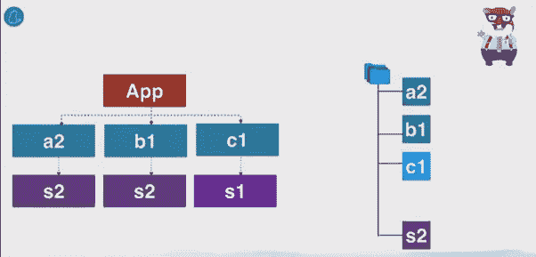

还有一个锁文件，即使在你运行“yarn install”时，它也能保持这种依赖关系。结果在每台机器上都是一致的。

现在，无论是谁进行“yarn install ”,他都会得到相同的依赖项，并且顺序完全相同，因为锁文件会被传送给每个人。

专业提示:永远不要忘记提交你的锁文件，因为它是所有用户的唯一真实来源。

我们知道 Yahuda 非常聪明，所以他决定让 Ember 和 Yarn 之间的整合更加紧密。

烬 2.13 现在是纱线意识，这意味着它生成锁文件，并鼓励你使用纱线。

> [黑客中午](http://bit.ly/Hackernoon)是黑客如何开始他们的下午。我们是 [@AMI](http://bit.ly/atAMIatAMI) 家庭的一员。我们现在[接受投稿](http://bit.ly/hackernoonsubmission)并乐意[讨论广告&赞助](mailto:partners@amipublications.com)机会。
> 
> 如果你喜欢这个故事，我们推荐你阅读我们的[最新科技故事](http://bit.ly/hackernoonlatestt)和[趋势科技故事](https://hackernoon.com/trending)。直到下一次，不要把世界的现实想当然！

