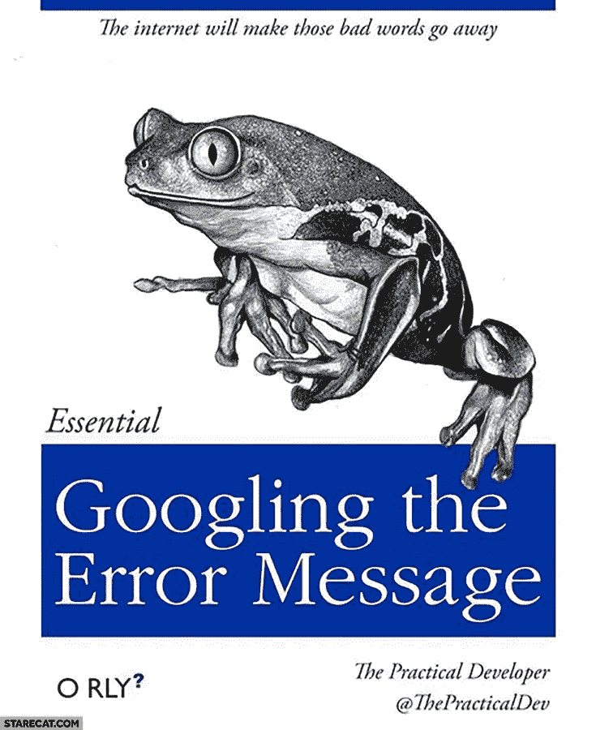
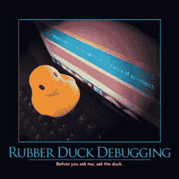

# 跨越障碍——新程序员指南

> 原文：<https://medium.com/hackernoon/working-through-roadblocks-a-guide-for-new-programmers-826c2aa455a2>

这是我给许多新手开发者的建议，也是我希望能够在刚入门时给自己的建议(尽管有些建议提到了当时不存在的资源——唉)。如果你觉得它有用，请考虑与你认识的人分享，他可能也会从中受益。

# 障碍

作为一名程序员或软件开发人员，有时你可能会试图解决一个问题，但事情并没有按照你的方式发展。你在状态中，不停地编码，完成任务，感觉很好。然后有些东西就不管用了。“没问题，”你对自己说，“我就试试这个稍微不同的方法……”但那也不管用。或者接下来的事情。或者下一个。很快，你会发现自己变得越来越沮丧。对于程序员来说，这是如此常见的事情，以至于它有自己流行的迷因:

振作起来:面对一个你很难诊断的阻塞问题是每个程序员都会遇到的事情(如果你从未遇到过，请评论)。希望这个事实能帮助你在考虑做什么的时候避免一些天生的冒名顶替综合症(如果你想知道编程是否真的是你想做的事情，这可能会有所帮助)。当你陷入困境时，当你在原地打转时，这里有一些事情可以帮助你尽快回到正轨。记住，程序员的时间往往是昂贵的，你的时间是你拥有的最有价值的资产。不要浪费，或者你的公司或者客户的钱！回到富有成效的状态(并且更快乐！)尽快陈述。

# 面包屑(或线索)

汉瑟和葛丽特的故事描述了两个孩子如何在森林里迷路，因为他们留下了面包屑的痕迹，但这条痕迹被鸟吃了，所以他们找不到回家的路。可悲的是，虽然这个故事表明面包屑是一种可怕的找到安全位置的方法，但这个术语仍然被用来描述这个功能。一个更好的文学类比是[阿里阿德涅的线程](https://en.wikipedia.org/wiki/Ariadne)，但这是不太知名的。在任何情况下，当你发现自己遇到问题时，你应该考虑的第一件事是确保你有办法回到已知的良好状态。显然，最好的方法是使用源代码控制。理想情况下，当你最后一次发现自己在 KGS 的时候，你已经承诺了(至少在当地)。如果你遵循 TDD，当你这么做的时候，试着也遵循[红绿重构提交(或者 RGCRC)](https://ardalis.com/rgrc-is-the-new-red-green-refactor-for-test-first-development) 。即使你不写测试，[经常检查](http://www.weeklydevtips.com/episodes/ebe28760/002-check-in-often)。这会救你。让它成为一种习惯。如果你卡住了，在你开始把你正在做的东西拆开或者把东西扔在墙上看看是什么卡住了之前，确保你有一份处于工作状态(或者非常接近工作状态，如果那艘船已经航行了)的代码副本。至少(如果你现在仍然不相信使用源代码控制)，应用[复制文件夹版本控制反模式](http://deviq.com/copy-folder-versioning/)，为你正在处理的文件夹制作一个备份副本(或 ZIP)。

# 时间拳击

“If we don’t ever take time, how will we ever have time?”

要记住的下一个技巧叫做*时间框*。如果你不熟悉这个术语，它只是指预先设定你在某项活动上花费的最大时间。在解决问题时，给自己最多 10 到 15 分钟的时间来解决问题可能会有所帮助。设置一个计时器，并坚持下去。如果你能抽出时间来解决问题，那太好了！拍拍自己的背，奖励自己一份零食，尽你所能帮助自己回到状态，然后继续工作(别忘了签到)。如果你的计时器停止计时，而你仍然停滞不前，那么继续下一个技巧。

# 寻找答案

这很难想象，但曾经有一段时间，人们不得不在无法访问 Google 或 Stack Overflow，甚至是即时通讯程序和 Slack(或 IRC)的情况下编写软件。谢天谢地，现在不是时候。你生活在 21 世纪。你可以轻而易举地接触到世界知识的总和。如果你被困超过几分钟，你应该停止转动你的轮子或用你的头撞墙或任何看起来最合适的比喻，开始利用你手头的线索寻找答案。

从谷歌搜索(或者你可以用 Bing 搜索)错误信息开始。这也是激发幽默迷因和书籍封面的一个原因——它在很多时候都有效。

添加一些与您正在使用的技术相关的关键词。你会惊讶于有一点搜索经验的人能多快找到答案(注意:*这些不是他们自己知道的答案*)。这是你应该发展的一项技能，提高这项技能的一个好方法就是去做。你已经被卡住了，你已经尽力尝试了几分钟，看看别人以前是否遇到过这个问题并从他们的经验中学习没有什么不好意思的。

当然，寻找答案的回报也是递减的。你也应该*时间盒*这一阶段的故障诊断。我建议把这个时间限制在 10 到 15 分钟。记住，你只有一个人，一次只能用一种方法来解决你的问题。如果你已经花了 30 分钟完全被封锁，你仍然不知道为什么事情没有进展，是时候寻求帮助了。

# 利用他人的经验

如果您还没有这样做，请专门针对您的问题搜索 StackOverflow(或一个合适的 Stack Exchange 站点)(而不是依赖 Google 从该站点获得答案)。假设这不能产生一个解决方案，花点时间为 StackOverflow (SO)自己写一个问题。在花些时间尝试自己解决问题之前，不要跳到这一步。通过展示你所付出的努力来表达对他人的尊重，比起每隔 5 分钟就寻求帮助，而你自己显然没有在这个问题上付出太多努力，你更有可能得到一个好的回应。

一旦你把你的问题张贴到 SO，**世界的其他地方正在帮助你解决你的问题，同时你自己也在努力！**这是个大问题，但是如果有必要，你可以通过各种方式寻求你问题的答案来进一步帮助(还是不要经常这样做，否则你会耗尽别人对你的好感)。发布您的问题的简要概述以及您为解决问题所采取的步骤，并使用您所在的任何一个社区链接到 SO 问题:

*   同事和内部帮助邮件列表
*   Slack-公共社区或您公司的私有 slack
*   Twitter——使用适当的散列标签
*   其他在线社区和邮件列表

很多时候，你甚至不会把问题提出来，因为仅仅提出问题就能帮助你解决问题。这被称为[橡皮鸭调试](http://deviq.com/rubber-duck-debugging/)。

“Before you ask me, ask the duck.”

在你问你的同事之前，试着向一只橡皮鸭解释你的问题，大部分时间只是问这个问题(最好是大声问)会帮助你找到答案。

# 休息一会儿

如果你做了以上所有的事情，你仍然没有找到答案，那就休息一下吧。根据具体情况，这可能意味着上床睡觉、吃午饭、吃零食，甚至只是查看电子邮件或做其他工作活动。然而，在这一点上，世界的其他地方正在帮助你解决这个问题，所以即使你休息一下，你仍然(可能)离答案越来越近。你的潜意识也依然强大。当你回到这个问题时，你可能会注意到一些你以前忽略或认为理所当然的东西，这解决了整个问题(或者帮助你意识到你实际上是在解决错误的问题，这也经常发生)。

# 运用科学方法

当你遇到障碍，不确定潜在的原因是什么时，花一小段时间尝试一下，看看什么有效，这有助于重组，变得更有条理。用科学的方法来解决这个问题。就根本原因可能是什么提出一个理论。确定证明(或反驳)的方法！)你的理论是正确的。这是一个实验。运行您的实验并获取结果。希望这个结果能帮助你确定你的理论是否能解释你所看到的行为。如果没有，继续通过重复减少问题的可能来源。当你遵循这个过程时，确保你一次只改变一件事。这是好的源代码控制能够真正帮助你的又一次机会。如果可能的话，这也是考虑将你正在进行的一些实验自动化的好时机。编写一些代码，断言应用程序的一部分在特定条件下以特定方式运行——对我来说，这听起来非常像单元测试或集成测试。如果您认为将来能够运行相同的测试可能是有价值的(可能通过一个构建服务器，每一次都推送到您的源代码控制)，考虑将您的实验编码为一个测试。或者更好的是，首先尽可能多地写下那些实验，就像测试一样，这将引导我们…

# 使用自动化

使用测试、构建脚本、构建服务器和其他自动化技术，最大限度地提高您解决问题后的诊断速度，并确保您的“修复”没有引入新的问题。自动化测试的价值不在于告诉你当你写代码的时候你的代码是如何运行的，而是告诉你你的代码在将来的某个时候仍然是那样运行的。更有价值的是，当一个测试能够告诉你，你的代码不再像你刚刚引入一个变化**时那样，你甚至不知道这个变化会影响测试覆盖的代码**。如果您对测试的唯一重视是验证您的代码是否如您今天所想的那样，那么您就错过了进行这种测试的大部分意义。当你发现自己被阻塞时，你的测试可以很好的帮助你发现所有没有被破坏的东西。如果它们中的任何一个坏了，它们可能通过向你显示问题的根源来帮助你变得畅通。

# 摘要

你会被卡住的。这很令人沮丧，但它发生在每个人身上。确保你以一种积极的方式对待它，并运用策略来最大限度地减少你陷入困境的时间。作为开发人员，我们不断地尝试在软件之上构建以前没有人构建过的东西，而这些东西至多几年前还不存在。事实上，任何一种方法的效果都是如此的令人惊讶。事实上，你认为应该是一个相对简单和直截了当的任务，有时会导致花费数小时试图找出为什么它。只是。不会。工作。只是这一行的一部分。这不是你的错，也不只是你的错。通过应用上面的想法，尽量减少你花在尝试畅通无阻上的时间，如果你有任何自己的想法要分享，请在下面的评论中发表。

*最初发表于*[T5【ardalis.com】](https://ardalis.com/working-through-roadblocks-a-guide-for-new-programmers)*。如果你觉得这个有用，留点掌声，考虑加入我的* [*每周 dev tips 简讯*](https://ardalis.com/tips) *或者* [*播客*](http://weeklydevtips.com/) *。*