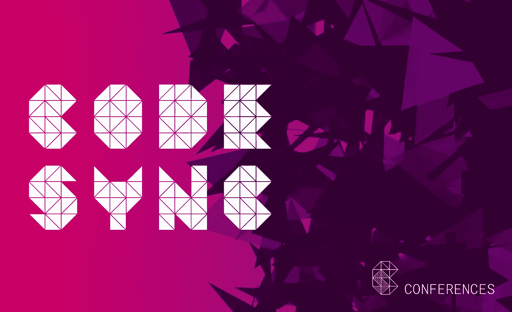
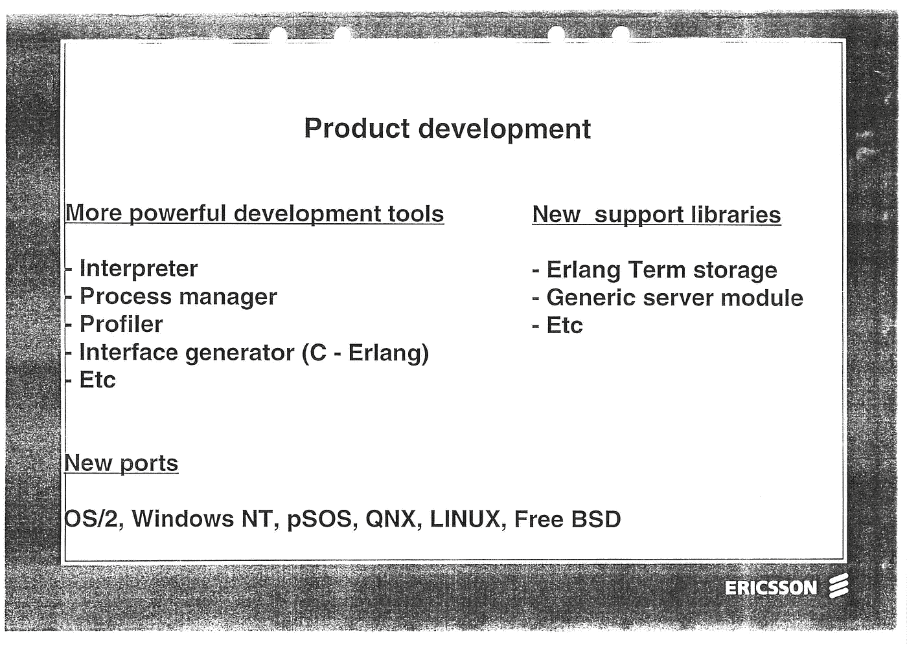
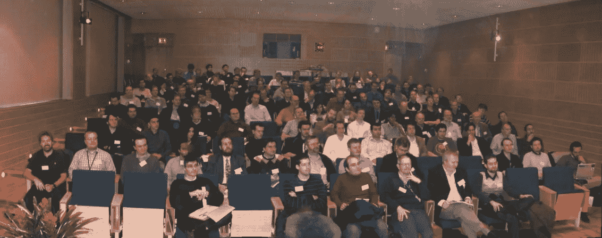
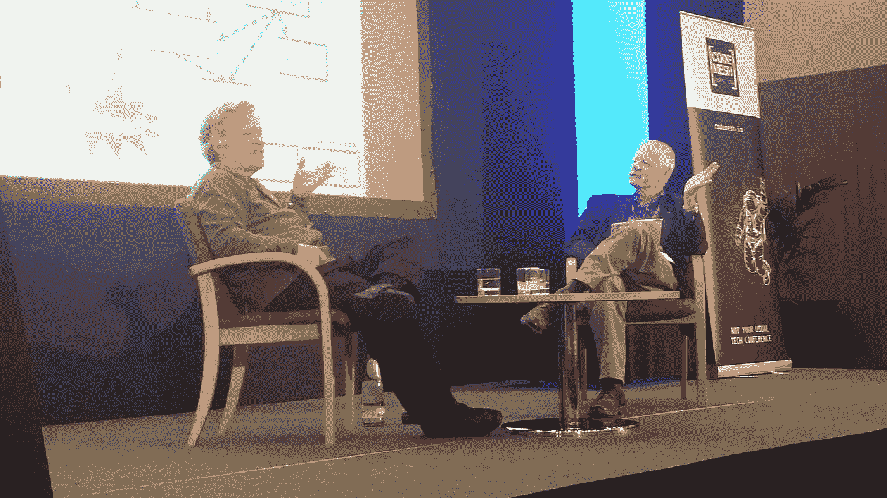

# 世界，遇见代码同步会议

> 原文：<https://medium.com/hackernoon/world-meet-code-sync-conferences-6f5ca0126c77>

弗朗切斯科·塞萨里尼

我在 1995 年参加了我的第一次 Erlang 用户大会。这是我第一次参加会议。我当时在计算机科学实验室实习，和乔·阿姆斯特朗一起写硕士论文。会议由 Erlang System 的经理 Roy Bengtson 主持开幕，他是我未来的老板。在他的开幕演讲中，他宣布了两个新的库，即 **Erlang Term Storage** 和**通用服务器模块**，以及最终被合并为观察者**的工具**。当与会者抱怨缺少这些工具的文档时，CS 实验室的 Klacke 建议他们自己写。

这次为期两天的会议的人数比前一年首次举办时增加了一倍，来自计算机科学实验室、Erlang Systems、爱立信和世界各地大学的代表参加了会议。这是你不常经历的事情的开始。

*Opening slide from the proceedings of the Second Erlang User Conference 1995*

# **启动代码同步的旅程**

到 2009 年，会议的规模已经超出了位于 lvsj 的爱立信会议中心，OTP 团队也不具备扩展活动所需的基础设施和灵活性。我们 Erlang Solutions 在 2008 年运营了 Erlang eXchange，并于 2009 年初在帕洛阿尔托运营了第一家 Erlang 工厂，积累了丰富的活动经验。爱立信要求我们提供帮助，所以我们接管了后勤工作，并与他们合作，共同完成了这个项目。

你能在 2006 年 Erlang 用户大会上见到我吗？

从这些不起眼的开始，一个专注于 Erlang 的会议扩展到了 OTP。分布式系统中权衡的用例。在云基础设施、流程编排和微服务这些术语被发明出来之前就开始讨论了。试图让 Erlang OO(不是 Alan Kay 想要的方式)被描述和遗忘。走廊上的讨论是关于 C++不适合某些类型的问题，以及一种叫做 Java 的新兴语言。

快进到 2017 年，焦点已经从 Java 转移到 JVM 及其生态系统。分别是 Scala，Akka，Groovy，Grails，Clojure 和 Spring。同样的事情也发生在。NET，给了它一个 C#、F#和 Visual Basic 茁壮成长的生态系统。Erlang 的自然发展也不例外。随着时间的推移，光束出现了，新的语言在其上运行。Tony Arcieri 的 Reia 是第一个(谁说过 Ruby 风味的 Erlang 是个坏主意？)Efene 是一种 C 语言，由 Mariano Guerra 于 2008 年在 Erlang Exchange 上首次提出，至今仍在生产中使用！

这些会议从一个语言会议演变成了一个关于 Erlang 生态系统的会议，在这个会议上，BEAM 和 OTP 被用来构建可伸缩的、有弹性的系统。社区交流经验、相互启发和学习的会议。当我们开始在 Erlang 生态系统之外寻找时，我们的活动扩展到了函数式编程、并发性、多核和分布式系统。

因此，Erlang 用户大会、Erlang 工厂和 Code Mesh 已经发展成为一个全球性的 Erlang、Elixir 和替代技术大会，并日益壮大。谁能忘记 Mike，Joe 和 Robert 在舞台上一起斗嘴，Martin Odersky 开 Scala 如何影响 Erlang 的玩笑，西蒙·佩顿·琼斯谈论 Erlang 和 Haskell，两个从小一起长大的朋友或者乔·阿姆斯特朗采访 Alan Kay！到目前为止，我们每年组织五次 tentpole 会议，以及许多卫星会议，并与 ElixirConf 和 Lambda Days 建立了良好的合作伙伴关系。

*Joe Armstrong and Alan Kay in conversation at Code Mesh 2016*

上个月我们第一次带着 Erlang Factory Lite 去了印度次大陆！这得益于今年 3 月在布宜诺斯艾利斯的一次成功活动和在罗马一场售罄的 Factory Lite。与此同时，我们举办了一些最好的会议，从旧金山的 Erlang 和 Elixir 工厂，斯德哥尔摩的 Erlang 用户会议，伦敦的 Code Mesh，到巴塞罗那的 ElixirConf EU。

# 代码同步简介

在 2018 年的前夕，我们第一次活动的十周年纪念日，我们已经为下一阶段做好了准备。我很高兴地宣布，我们所有的会议都加入了新推出的全球会议大家庭，名为 [**代码同步**](http://www2.erlang-solutions.com/l/23452/2017-12-06/56rz47) 。每个会议都将保留自己的个性，并坚持一个愿景，即创造一个空间，让开发者和创新者聚集在一起，作为一个社区来分享他们的想法和经验，相互学习，创造未来。新的名称和品牌，新的同事和演讲者加入我们现有的贡献者、演讲者和与会者名单。

要了解我们明年的计划，请访问 www.erlang-solutions.com。

*原载于*[*www.erlang-solutions.com*](http://bit.ly/2nBAPsM)*。*