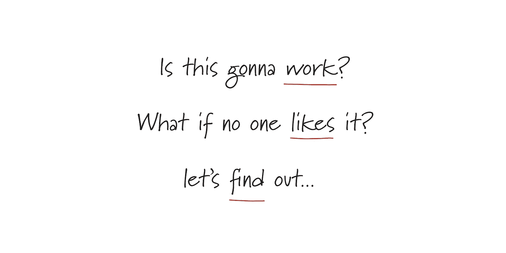

# 会有帮助吗？

> 原文：<https://medium.com/hackernoon/would-it-help-37e009228691>

我最近和我最喜欢的演员之一汤姆·汉克斯一起看了电影《间谍之桥》。在这部电影中，汉克斯扮演一名律师，他的任务是在美国为一名被指控的苏联间谍辩护。

《T2》中让我印象深刻的场景之一是他们在法庭上，汉克扮演的角色问他的当事人“*你从不担心吗？*“在告诉他的客户辩护进行得有多糟糕后，被指控的间谍回答说”*这会有帮助吗？*”。

写这篇文章的时候，我还有几天就要向我们的测试版用户发布[了。几年工作的高潮，一些意想不到的事件和一年远离技术。](https://pingly.com)

随着发射越来越近，对抗担忧的思想变得越来越普遍。想法:*它有足够的功能推出吗？人们会喜欢它吗？有多少虫子是我不知道的？会不会只是惨败？*

现在，看完电影后，我用“*来抵消这些想法，会有帮助吗？*”。担心会有帮助吗？我必须在某个时候启动，我需要用户来验证这个想法，我需要他们平静地引导[到真正有用的地方。](https://pingly.com)

所以别担心了，没用的！用行动和积极的想法取代担忧。担心功能不够用？和一些朋友或者 alpha 用户测试一下。担心人家不喜欢？你必须在某个时候发射它才能找到答案！

最后，尽你所能，把它展现出来。如果你开始担心，就对自己说:“*会有帮助吗？*

> [黑客中午](http://bit.ly/Hackernoon)是黑客如何开始他们的下午。我们是 T21 家庭的一员。我们现在[接受投稿](http://bit.ly/hackernoonsubmission)并乐意[讨论广告&赞助](mailto:partners@amipublications.com)机会。
> 
> 如果你喜欢这个故事，我们推荐你阅读我们的[最新科技故事](http://bit.ly/hackernoonlatestt)和[趋势科技故事](https://hackernoon.com/trending)。直到下一次，不要把世界的现实想当然！

