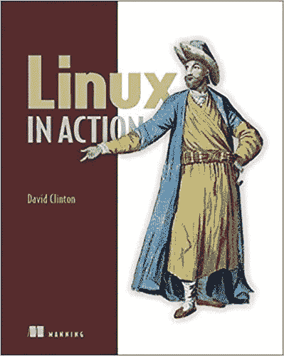

# 你会雇佣具备这些技能的初级 Linux 管理员吗？

> 原文：<https://medium.com/hackernoon/would-you-hire-a-junior-linux-admin-with-these-skills-b215deb40180>

聪明而有经验的管理员是物有所值的，但是他们中有多少人在开始时就有这样的价值呢？建立一个坚实可靠的 IT 团队来为您的运营服务就像规划一项高风险的长期投资一样。因此，最好的招聘经理会非常清楚自己现在需要什么，以及一两年后想要达到什么样的目标。

当然，您会希望年轻的管理员已经掌握一些核心技能，而且能够利用他们已经掌握的知识来构建这些技能。毕竟，不仅任何一个人都不可能熟悉目前所有的 Linux 工具和最佳实践，我们甚至不能确定*五年后它们会是什么样子。*

那么，现在哪些核心技能既有用*又能让未来的学习更有效呢？嗯，我没有垄断真相，我很乐意听到来自社区的反馈。*

但我认为这是可行的。我设计了我的 Manning [Linux in Action](https://www.manning.com/books/linux-in-action?a_aid=bootstrap-it&a_bid=4ca15fc9) 一书，将现实世界的项目作为教学工具。运行 Linux 系统所需的每一项核心技能都将被涵盖，但只是在实际项目需要时。

My [Linux in Action](https://www.manning.com/books/linux-in-action?a_aid=bootstrap-it&a_bid=4ca15fc9) book. You can also work through the content in [Linux in Motion](https://www.manning.com/livevideo/linux-in-motion?a_aid=bootstrap-it&a_bid=0c56986f&chan=motion1) — a hybrid course made up of more than two hours of video and around 40% of the text of Linux in Action.

我们的目标是，当读者阅读完的时候，他们将已经从传统资源中学到了所有的东西。但是，通过使用关键的研究工具(如 man、info 和在线搜索技术)完成十几项真正的按需管理任务，他们将有望开始获得信心和独立性。

为了让尽可能多的读者受益，这本书将一些基本的生存技能融入了第一章。这些包括 Unix 文件系统层次结构标准、导航、文件管理、一些技巧(如制表符补全和文件打包)和 sudo。但是从那以后，你就可以去比赛了。

在项目规划阶段，我将关键的 Linux 管理技能分为 15 个领域。然后，我将每个域与初级管理员期望使用的特定工具相关联。这些领域和工具(如下图所示)是围绕这本书构建的整体课程期望。

The base material from which my book was built

但是这本书的*结构*将围绕以下项目展开:

*   配置常规远程文件系统备份和归档操作
*   建筑回收系统设备
*   构建安全的基于 LAMP 的文件共享服务
*   建立持续的系统监控协议

下面是完整的目录(至少在这个过程中的这一点上):

1.  Linux 基础知识
2.  Linux 虚拟化:构建安全简单的 Linux 工作环境
3.  远程连接:安全访问联网机器
4.  归档管理:备份或拷贝整个文件系统
5.  自动化管理:配置自动化异地备份
6.  应急工具—构建系统恢复设备
7.  web 服务器:构建一个 MediaWiki 服务器
8.  网络文件共享:构建 Nextcloud 文件共享服务器
9.  保护您的 web 服务器
10.  保护您的网络连接:创建 VPN 或 DMZ
11.  系统监控:使用千兆大小的日志文件
12.  通过专用网络共享数据
13.  故障排除:系统性能问题
14.  故障排除:网络问题
15.  故障排除:外围设备
16.  DevOps 工具:使用 Ansible 部署脚本化的服务器环境

这个想法是，当你完成这本书的项目时，你将已经使用过每一个领域和工具至少一次。希望你最终会成为一名有用的管理员。

这就是我要说的，现在轮到你了。你认为我这本书的“毕业生”会成为一名称职的行政人员吗？少了什么？

*这篇文章显然与我的* [*曼宁《Linux 在行动》一书*](https://www.manning.com/books/linux-in-action?a_aid=bootstrap-it&a_bid=4ca15fc9) *有关。这本书在曼宁的网站上打折:使用代码****hackernoonlinux 50****可以打五折。除了这本书，你还可以通过*[*Linux in Motion*](https://www.manning.com/livevideo/linux-in-motion?a_aid=bootstrap-it&a_bid=0c56986f&chan=motion1)*来学习——这是一门混合课程，由两个多小时的视频和大约 40%的 Linux in Action 文本组成。从这来的地方有更多的乐趣。谁知道呢……你可能也会喜欢我最近出版的《在一个月的午餐中学习亚马逊网络服务》***。**