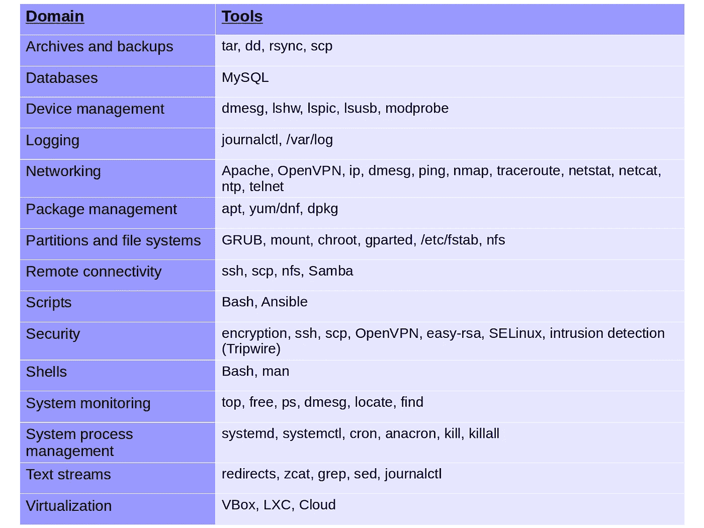

# 你会雇佣具备这些技能的初级 Linux 管理员吗——第 2 部分

> 原文：<https://medium.com/hackernoon/would-you-hire-a-junior-linux-admin-with-these-skills-part-2-5f566f19b413>

几周前，我写了“[你能雇佣一个具备这些技能的初级 Linux 管理员吗](https://hackernoon.com/would-you-hire-a-junior-linux-admin-with-these-skills-b215deb40180)”来看看我是否能利用一些 Linux 社区的智慧。具体来说，我想知道有经验的 Linux 人对我为我的[曼宁】**Linux In Action**](https://www.manning.com/books/linux-in-action?a_aid=bootstrap-it&a_bid=4ca15fc9)书建立的课程有什么想法。

在 Reddit 上的活跃讨论和 Medium 上对原始文章的一些评论之间，回应是明智和广泛的。所以我想我应该花些时间从反馈中组织更大的主题，以便更容易地与社区分享。

但是对于上下文，我将很快提醒您，我的“Linux In Action”一书是围绕实际项目组织的，贯穿整本书，将涵盖图表中所示的技能:

所以我会这么做。但是现在忘记我吧:从现在开始，我将努力准确而忠实地呈现其他人不得不说的事情。

## 实践经验

一个好的管理人员是喜欢学习新技能的人。对你来说，知道自己是否有能力胜任这项工作的最好方法是实际尝试一下。如果鞋子合脚，它可能就是你应该穿的那一双。

Reddit 上有人是这样解释的:

> “一本书可以教你很多东西，但书不能教给你的是多年的经验。如果你在你的台式机或笔记本电脑(或家庭服务器或小型 VPS)上运行 Linux，你每天都会接触到它。你肯定会面临问题，并且必须以某种方式克服它们。一旦你解决了这些问题，你会因此变得更好，并能够在未来从这些经历中吸取经验。如果你真的想学习 Linux 并学好它，那么尽可能多地让自己沉浸其中是有意义的。”

## 批判性思维技能

这个很难教。但是成熟和大量的实践经验会改善你解决问题的方式。也许通过专注于解决复杂的、多部分的、多工具的问题，这种思考的路径可以变得顺畅。这里有几个快速和肮脏的例子:

> “创建一个压缩日志文件的 crontab，并将它们推送到一个 samba 服务器，他必须使用 fstab 来安装该服务器”

还有…

> “重定向到只解析错误流并把它们扔进 MySQL 服务器”

经验还可以帮助你有效地过滤自己对问题的反应，从而缩小选择范围:

> “人们经常会做出不正确的假设，最重要的是要知道什么时候可以做出假设，什么时候不能。”

## 了解您的工具

了解当前的最佳实践和趋势会有很大的不同。例如，与其花费数小时构建一个脚本来解析日志流数据、认证和打开远程连接，以及将文件写入远程服务器；一个简单的 rsync 调用可以做同样的事情，只需要一点点复杂性。

只要意识到 Bash shell 是可编程的，或者理解像 Puppet 这样的编排工具潜在的简单性和强大功能，就可以打开新的可能性世界。

## devo PS/容器

说到编排工具，不止一个评论者认为，如果不熟悉虚拟化平台(尤其是 Docker)和管理工具(如 Kubernetes、Puppet 和 Ansible ),任何 Linux 管理员的教育都是不完整的。

## Windows 管理员

由于具有使用其他操作系统经验的管理员可能是 Linux 管理培训的潜在消费者，所以考虑他们现有的优势和劣势是很重要的…特别是考虑到自从 PowerShell 推出以来，许多人已经非常熟悉命令行了。

## 更多工具

如果没有关于哪个工具集*是最好的*的争论，关于 Linux 的对话是什么？所以，为了完整起见，我不能忽视那些提倡 PostgreSQL、Nginx、KVM 和 Kubernetes 作为平衡的 Linux 教育的一部分的评论。

*这篇文章显然与我的* [*曼宁《Linux 在行动》一书*](https://www.manning.com/books/linux-in-action?a_aid=bootstrap-it&a_bid=4ca15fc9) *有关。这本书在*曼宁的网站上打折:使用代码 **hackernoonlinux50** 可以打五折。*这里有更多的乐趣，包括一个名为*[*Linux in Motion*](https://www.manning.com/livevideo/linux-in-motion?a_aid=bootstrap-it&a_bid=0c56986f&chan=motion1)*的混合课程，它由两个多小时的视频和大约 40%的 Linux in Action 文本组成。谁知道呢……你可能也会喜欢我的* [*在一个月的午餐中学习亚马逊网络服务*](https://www.manning.com/books/learn-amazon-web-services-in-a-month-of-lunches?a_aid=bootstrap-it&amp;a_bid=1c1b5e27) *。*