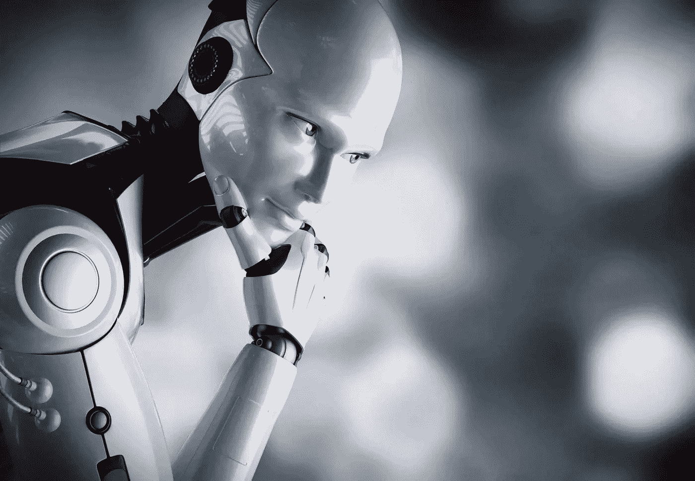
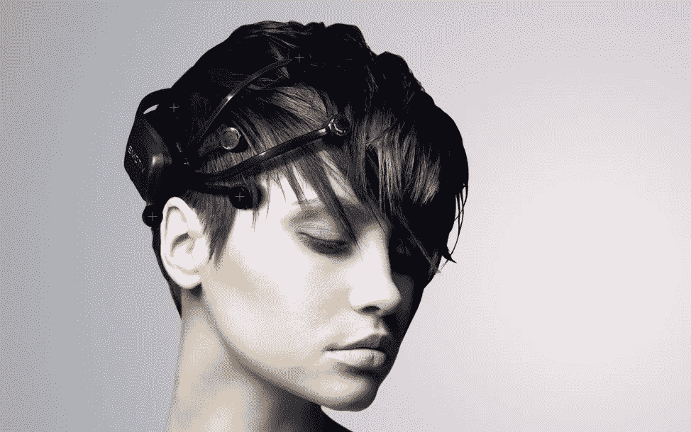
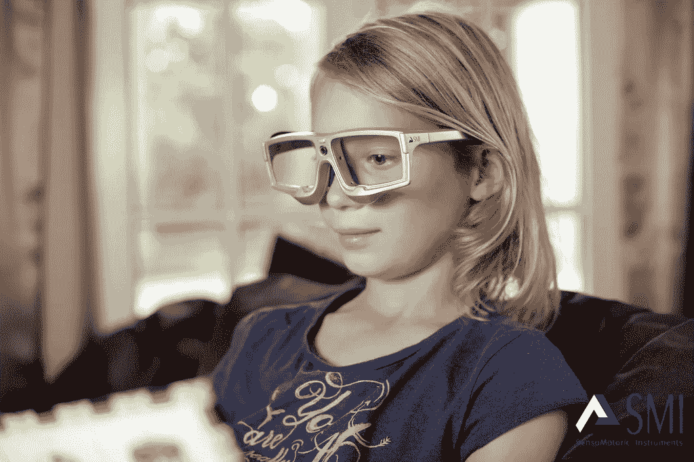

# 你会让人工智能读取你的想法吗？

> 原文：<https://medium.com/hackernoon/would-you-let-an-ai-read-your-mind-a564483852cf>

## 作家 Hannu Rajaniemi 在 Wired 的[播客](http://www.geeksguideshow.com/)中解释道:“《白雪公主死了》就是我们最后所说的‘神经小说’。"这是一个互动的虚构作品，但没有有意识的选择."

这位 38 岁的芬兰科幻小说作家和他的数据科学家朋友 Samuel Halliday 拿到了[一台简单的可穿戴大脑扫描仪](https://www.emotiv.com/epoc/)，并开始思考如何利用这项技术讲述更多引人入胜的故事。

因此，在 2012 年，他们想出了一个可以戴着无线耳机阅读的故事，并根据读者是否对生命或死亡图像表现出更大的亲和力而分支和变化。

把它想象成 70 年代后期纯文本互动游戏的现代版本，或者一本 [*选择你自己的冒险*](https://en.wikipedia.org/wiki/Choose_Your_Own_Adventure) *e* 书，但是你大脑的电活动决定了你的选择。

该项目[已经开源](https://github.com/fommil/neurofiction)以鼓励创新，这意味着凭借 400 美元的硬件、一些机器学习和写作技能，每个人都可以冒险进入新兴脑机接口技术创造的设计空间的深处。

*The EMOTIV Epoc wireless EEG is an off-the-shelf brain scanner sold for $300 US. © EMOTIV*

# 通往你灵魂的窗户

虽然这些天围绕我们能否让人工智能(或 AI)真正智能有很多争论，但给机器“大脑”可能并不总是足够的。例如，没有眼睛的大脑对周围环境的感知要少得多。

这就是将机器*连接到我们的大脑*变得极其强大的地方，不仅仅是为了医学。自 2010 年以来，随着“神经技术”专利数量的飙升，可以肯定地说，许多公司都这么认为。让机器更好地理解我们思考和感受的方式，可能会给它们一种人工形式的情商。

几十年来，脑电图(EEG)本身已被用于诊断和研究诸如癫痫、睡眠障碍和脑死亡等疾病。然而，最近，它的使用已经扩展到医学领域之外，进入了盈利性领域。

脑波测量设备和可穿戴技术的兴起带来的第一个应用是神经营销，志愿者将在一个 [*发条橙*](http://www.imdb.com/title/tt0066921/) 类型的实验中戴上一顶覆盖着传感器的笨拙的游泳帽，以测量-或多或少地准确-对广告的认知和情感反应。

现在，如果消费者的附加价值可能有点难以通过营销看到，那么总体而言，讲故事可以从打开心灵之窗中受益匪浅。

# 讲述更好的故事

自从 Rajaniemi 的*白雪公主*以来，更加复杂——也不那么笨拙的*智能头盔*已经出现，利用[性能指标](http://nevermindgame.com/)、[精神指令](http://thecreatorsproject.vice.com/blog/artist-manipulates-48-pools-of-water-with-her-mind)和[面部表情](http://uploadvr.com/emteq-facial-tracking/)。

在娱乐界，这给了电影和游戏制作者等故事讲述者一系列全新的可能性。根据观众的反应开发适应性和个性化的故事情节不再是幻想。

你能想象自己，几年后，去电影院看同一部电影三次，每次都发现不同的结局，因为观众的感受不一样？

同样，像 [Lisa Park](http://www.thelisapark.com/#/eunoia-ii/) 这样的艺术家一直在探索如何将大脑和机器连接起来，从而产生美丽而真实的音乐作品:*“我开始使用 EEG 耳机，因为我质疑，‘我如何才能将这种无形的能量和情感变得可见？”*朴在接受采访时说。

*This gave me the chills, no need for a headset to confirm!*

除了娱乐，教育是另一个可以从这些成为主流的技术中受益的领域。我不知道你，但作为一个孩子，一旦我明白老师要去哪里，我会很快离开。当时的教育意味着降低到最低的共同标准，结果是，让不安的头脑感到非常困惑。

今天，教育已经吸取了教训，出现了许多新的理念，使学习更加体验式，并使用讲故事来吸引和鼓励创造力。

就像市场营销一样，商学院现在正试图通过提供独特的体验来让自己与众不同。Pierre-Majorique Léger 等人通过分析大量生物生理数据，如眼球运动和瞳孔反应，致力于改进教育应用程序。

这些数据是在用户与产品或应用程序交互时生成的，用于确定体验是直观有趣，还是过于复杂而难以理解。例如，缺少光线并不是导致瞳孔扩大的唯一因素；高难度的脑力工作也会产生同样的效果，并且可以很容易地用眼球追踪眼镜来测量。

*SMI’s eye tracking glasses can help design better learning apps © SensoMotoric Instruments*

随着虚拟现实和可穿戴技术进入讲故事的世界，未来几年可能会看到*真正的*以观众为中心的内容的黎明，从娱乐到教育……等等。

[奥黛丽·拉比](https://www.linkedin.com/in/audreyraby)是一位战略家、说书人、演说家和母亲。她还是蒙特利尔创新咨询公司 Nash 的首席运营官。

> [黑客中午](http://bit.ly/Hackernoon)是黑客如何开始他们的下午。我们是 [@AMI](http://bit.ly/atAMIatAMI) 家庭的一员。我们现在[接受投稿](http://bit.ly/hackernoonsubmission)并乐意[讨论广告&赞助](mailto:partners@amipublications.com)机会。
> 
> 如果你喜欢这个故事，我们推荐你阅读我们的[最新科技故事](http://bit.ly/hackernoonlatestt)和[趋势科技故事](https://hackernoon.com/trending)。直到下一次，不要把世界的现实想当然！

