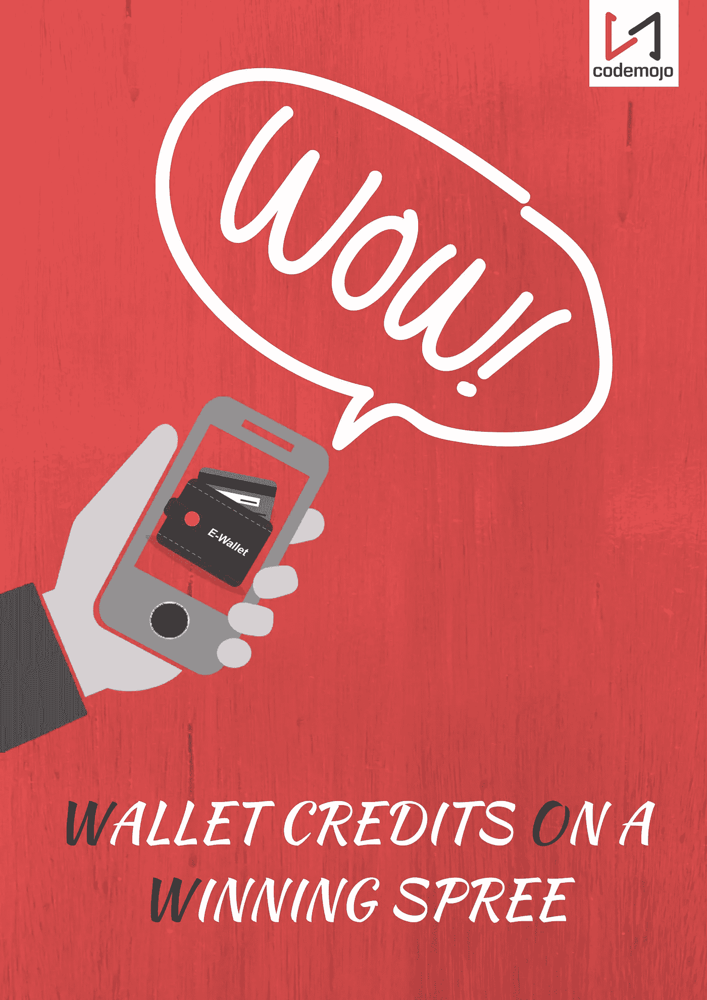
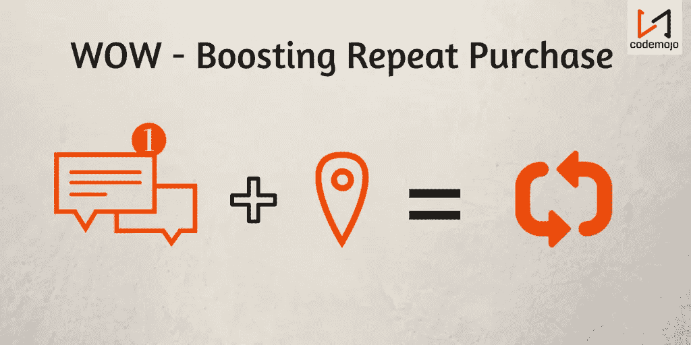
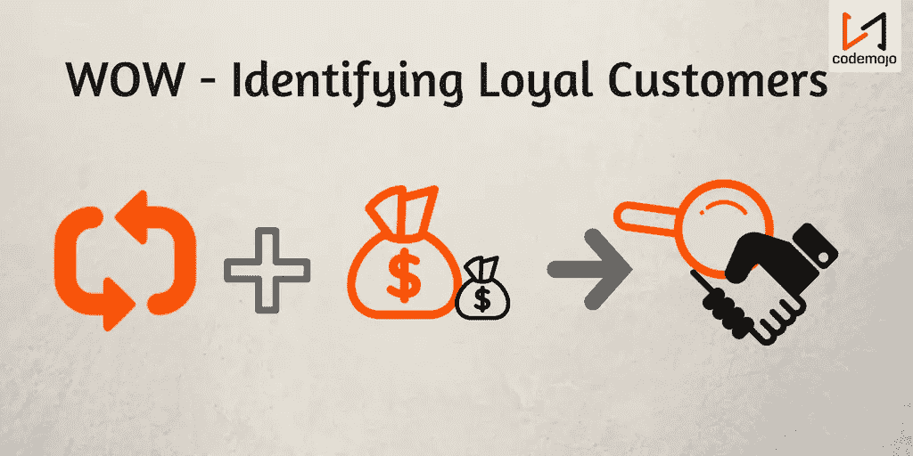

# 哇(大获全胜的钱包积分)！

> 原文：<https://medium.com/hackernoon/wow-wallet-credits-on-a-winning-spree-6b9cada90206>

*Caption: WOW*

钱包，一个迷你的便携式储物柜，可以保存我们的钱和其他个人证件的安全。虚拟钱包和实体钱包没什么区别。事实上，数字钱包有助于个人从额外服务中受益，如现金返还、奖励积分、快速交易等。在去货币化之后，印度开始增加对数字钱包服务的依赖。报道称，知名的数字钱包平台如 [Paytm](https://paytm.com/) 、 [Freecharge](https://www.freecharge.in/) 、 [Mobikwik](https://www.mobikwik.com/) 等。，见证了最大的现金紧缩时期的大幅上涨。PayTm 受益最大，交易价值和应用下载量分别增长了 250%和 200%。但是，商业马拉松怎么看**哇**，挺有意思的！

# 哇，先睹为快

*Caption: The Sneak-peek*

[数字钱包](https://en.wikipedia.org/wiki/Digital_wallet) space 通过将[忠诚度和参与度](http://blog.codemojo.io/customer-engagement/3-keys-to-unlock-true-customer-loyalty-with-gamification/)相结合，正在为数字交易的下一个层次做准备。因此，企业发现这是一个消除阻碍他们识别忠诚客户的障碍的机会。在**数字钱包**的帮助下，商家可以跟踪实时客户数据(如购买次数、利息、消费金额)并向他们的客户提供有趣的机会以增加**重复购买**。

# 哇，促进重复购买

*Caption: Boosting Repeat Purchase*

随着钱包**通过**位置感知信息和短信通知**最大化赎回**，企业很容易帮助客户提醒和鼓励他们通过他们的平台进行更多购买。与旧方法不同，wallet 通过**自动短信通知触发器**和设置里程碑，弥合了沟通鸿沟，增加了购买次数，并提高了客户的兴奋程度，从而提高了[客户亲和力](https://en.wikipedia.org/wiki/Affinity_marketing)/重复购买和参与度。

# 哇识别忠诚的顾客

[“免费赠送顾客可能会购买的东西并不是真正顾客忠诚的关键”——盖布·兹彻曼](https://www.entrepreneur.com/video/224176)

*Caption: Identifying Loyal Customers*

有了**钱包系统**，商家就有可能通过跟踪他们顾客的**重复购买率**来创造一种令人惊叹(哇——惊叹某样东西太棒了)的显著效果。通过实时数据跟踪，**数字钱包**可以帮助筛选忠诚客户，并触发**特殊促销、优惠券、奖励和返现**供客户在特定时期内挑选和使用。最终的效果是，顾客不会感到支付或花费更多的约束，企业被鼓励建立一个忠诚的顾客群体。

因此，钱包帮助企业识别**购买行为和客户忠诚度**，为客户和企业创造双赢局面。你期待利用钱包系统吗？选择[代码魔咒](http://www.codemojo.io/)的[钱包魔咒](https://codemojo.io/products/wallet-mojo)。

# 什么是[钱包魔咒](https://codemojo.io/products/wallet-mojo)？

[Wallet Mojo](https://codemojo.io/products/wallet-mojo) 是一个闭环的白色标签奖励组件，其中[忠诚度](https://codemojo.io/products/loyalty-mojo)、[游戏化](https://codemojo.io/products/gamification-mojo)甚至交易货币都可以存储为积分，以影响客户的重复购买。在不到 10 分钟的集成和 10 行代码中，我们帮助您为您的业务创建一个基准。

随着 **Wallet Credits 大获全胜**(哇)，准备好通过集成 Codemojo 的即插即用组件 **Wallet Mojo** 来提高忠诚度和参与度。您只需点击一下[即可开启客户互动](https://codemojo.io/publishers)。

> [黑客中午](http://bit.ly/Hackernoon)是黑客如何开始他们的下午。我们是 [@AMI](http://bit.ly/atAMIatAMI) 家庭的一员。我们现在[接受投稿](http://bit.ly/hackernoonsubmission)，并乐意[讨论广告&赞助](mailto:partners@amipublications.com)机会。
> 
> 如果你喜欢这个故事，我们推荐你阅读我们的[最新科技故事](http://bit.ly/hackernoonlatestt)和[趋势科技故事](https://hackernoon.com/trending)。直到下一次，不要把世界的现实想当然！

