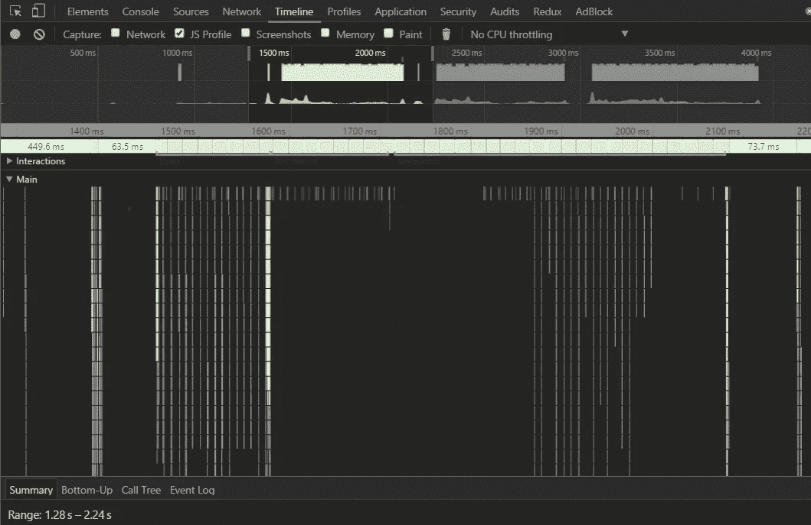

# 用 Angular 2 组件包装任何 jQuery 插件—案例研究。

> 原文：<https://medium.com/hackernoon/wrap-any-jquery-plugin-with-angular-2-component-case-study-8b00eacec998>

Angular 像当今大多数前端框架一样，在比普通 JavaScript 更高的抽象层次上工作。因此，在某个时候，你会发现自己处于这样一种情况，你需要将一些 jQuery 或普通的 JavaScript 库转移到 Angular world 中。这样做有很多原因:

*   **表现**

当你的 lib 主动使用像 mousemove 这样的事件时，你可能会遇到麻烦——我们稍后会谈到这一点。

*   **门面格局**

你隐藏了 jQuery 插件的一些讨厌的配置细节，并向外界暴露了漂亮优雅的组件。

*   **可重用性**
*   **更好的架构**

如果你将你的库包装成所谓的“虚拟组件”,你将从单向数据流编程中获益良多。

# **那么让我们开始一些编码**

我们将把 s [点击传送带](http://kenwheeler.github.io/slick/)包装成角形组件。Slick carousel 是许多 slider 实现中的一个，也是我最喜欢的一个。如果你还不知道，我强烈推荐你试一试。

第一件事，我们应该开始定义，什么是我们想象的组件的 API。我认为下面的东西将是一个很好的起点。

```
<slick-carousel class="carousel">
  <div  *ngFor="let slide of slides" class="slide">{{slide.caption}}</div>
</slick-carousel>
```

那么我们的实现看起来就像下面的代码片段。

```
**import** { Component, ElementRef} from *'@angular/core'*;
**import** $ from *"jquery"*;
require(*'slick-carousel'*);

@Component({
  selector**:** *'slick-carousel'*,
  template**:** *`<ng-content></ng-content>`* })
**export class** SlickCarouselComponent {
  **constructor**(**private** el**:** ElementRef) {
  }

  $carousel**:** JQuery **|** any;

  *ngAfterViewInit*() {
    **this**.$carousel **=** $(**this**.el.nativeElement).slick({});
  }
}
```

我们的组件模板将只包含一个 ng-content 元素。所有幻灯片都将被注入到这个元素中。我们正在等待 Angular 渲染组件，然后使用 ngAfterViewInit()生命周期钩子，我们只是简单地初始化我们的插件。差不多就是这样。但是我们可以做得更好一点。

# **性能**

我们可以改进的一点是该解决方案的性能。我们的代码订阅的每个事件都会触发角度变化检测机制。在我们的例子中，我们使用的是 JQuery 插件，当我们滑动幻灯片时，它会主动监听每个 mousemove 事件。这导致多次调用变更检测，正如您在下面的屏幕上看到的。



如果在我们的组件中有这样的代码`<footer [class]="getClass()"></footer>`，那么当我们在 carousel 中浏览元素时，getClass()方法将被调用几十次。这也是为什么我们应该避免绑定到方法，而是在 ngOnChanges 的 life hook 中映射到 ViewModel 一次，但这是另一回事了。为了忽略这个问题，我们可以使用 angular 中的 NgZone 类，并将 slick carousel 移到 angular 世界之外。

```
*ngAfterViewInit*() {
  **this**.zone.*runOutsideAngular*(()**=>**{
    **this**.$carousel **=** $(**this**.el.nativeElement).slick({});
  });
}
```

当我们用 runOutsideAngular 块包装一些代码时，Angular 将停止监听来自该代码的事件。如果我们想让 Angular 对鼠标移动事件充耳不闻，但是我们想对滑动事件做出反应，我们可以通过`this.zone.run(()=>),`返回到 angular zone，如下例所示。

```
*ngAfterViewInit*() {
  **this**.zone.*runOutsideAngular*(() **=>** {
    **this**.$carousel **=** $(**this**.el.nativeElement).slick({});
    **this**.$carousel.on(*'swipe'*, (event, slick, direction) **=>** {
      **this**.zone.*run*(() **=> ++this**.counter);
    });
  });
}
```

# 内容更改

到目前为止，我们还没有讨论转盘幻灯片动态变化的可能性。在我们的实现中，我们只初始化 carousel 一次。当我们更新幻灯片列表时，我们的 carousel 组件对此一无所知，slick carousel 也不会添加新创建的幻灯片。这是因为在我们的例子中*ngFor 是负责创建幻灯片的指令，它不与`<slick-carousel>`通信。有许多技术，如何通知父组件关于其内容组件的变化。一种选择是使用依赖注入，用`@Host()`装饰器在子组件构造函数中获得父组件。另一种选择是实现您自己的*ngFor 逻辑，并基于组件用户提供的模板动态创建子组件。另一种选择是在父母控制器中安装`@ContentChildren()`，从那里监控你的孩子。我们将和`@Host()`装饰者讨论今天的选项。

首先，我们需要开始为每张幻灯片创建指令。

```
@Directive({
  selector**:** *'[slick-carousel-item]'*,
})
**export class** SlickCarouselItem {
  **constructor**(**private** el**:** ElementRef, @Host() **private** carousel**:** SlickCarouselComponent) {
  }
  *ngAfterViewInit*() {
    **this**.carousel.*addSlide*(**this**);
  }
  *ngOnDestroy*() {
    **this**.carousel.*removeSlide*(**this**);
  }
}
```

在这个指令中，我们通过`@Host()`装饰器注入父组件。当指令被初始化时，我们通知父组件关于新的项目，并且当 ngOnDestroy 发生时，我们从父组件移除。我们的 Carousel 实现现在看起来如下。

```
@Component({
  selector**:** *'slick-carousel'*,
  template**:** *`<ng-content></ng-content>`* })
**export class** SlickCarouselComponent {
  **constructor**(**private** el**:** ElementRef, **private** zone**:** NgZone) {
  }

  $carousel**:** JQuery **|** any;

  initialized **= false**;

  *initCarousel*() {
    **this**.zone.*runOutsideAngular*(() **=>** {
      **this**.$carousel **=** $(**this**.el.nativeElement).slick({});
    });
    **this**.initialized **= true**;
  }

  slides **=** [];

  *addSlide*(slide) {
    **!this**.initialized **&& this**.*initCarousel*();
    **this**.slides.*push*(slide);
    **this**.$carousel.slick(*'slickAdd'*, slide.el.nativeElement);
  }

  *removeSlide*(slide) {
    **const** idx **= this**.slides.*indexOf*(slide);
    **this**.$carousel.slick(*'slickRemove'*, idx);
    **this**.slides **= this**.slides.*filter*(s **=>** s **!=** slide);
  }
}
```

我们现在有了使用 JQuery 插件的 angular 组件。我们可以动态地添加和删除幻灯片，我们的组件不会降低角度变化检测的速度。

你可以在这里找到工作代码的 plunker:[http://plnkr.co/edit/5lF3QCfzYp3owRRlOpk5?p=preview](http://plnkr.co/edit/5lF3QCfzYp3owRRlOpk5?p=preview)

[](http://bit.ly/HackernoonFB)[](https://goo.gl/k7XYbx)[](https://goo.gl/4ofytp)

> [黑客中午](http://bit.ly/Hackernoon)是黑客如何开始他们的下午。我们是 [@AMI](http://bit.ly/atAMIatAMI) 家庭的一员。我们现在[接受投稿](http://bit.ly/hackernoonsubmission)并乐意[讨论广告&赞助](mailto:partners@amipublications.com)机会。
> 
> 如果你喜欢这个故事，我们推荐你阅读我们的[最新科技故事](http://bit.ly/hackernoonlatestt)和[趋势科技故事](https://hackernoon.com/trending)。直到下一次，不要把世界的现实想当然！

