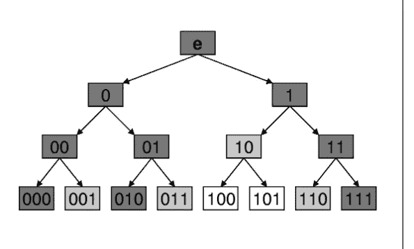

# 与区块链可扩展性角力

> 原文：<https://medium.com/hackernoon/wrestling-with-blockchain-scalability-a1295e47962f>

安德鲁·巴里瑟

我一直在纠结如何扩大区块链科技的规模。这是房间里所有围绕加密货币的兴奋的大象；可伸缩性问题没有解决。最有前景的解决方案闪电网络(lightning networks)未经证实，似乎依赖于可疑的担保，例如在链上赎回集合资金的能力。它还引入了具有潜在集中化动态的轴辐式模型。这是可行的。我不知道。但是我们不应该满足。

简而言之，可扩展性问题是限制我对区块链技术感兴趣的主要原因。八年来，我们进展甚微。除了闪电网络之外，唯一的进展就是对块大小和高度膨胀的网络(以太坊)的争论。

另一个在可伸缩性问题上做了真正有趣尝试的团队是 IOTA。它们的缠结可以支持潜在的无限容量；事实上，它随着使用而增强。然而，它目前是一个通过使用“协调者”节点的集中式系统。Iota 纠结背后的想法耐人寻味；您应该检查一下，因为它将挑战您关于 A)可验证性和 B)可伸缩性的假设。但是使用协调器节点只是欺骗，破坏了系统的可信度。他们声称最终会回滚。但在那之前，它不是一个有效的、分散的系统。无论如何都要去看看。

因此，我对处理区块链可扩展性的选项太少感到不满。可伸缩性是至关重要的，因为分散的、不可信的系统的真正应用是在机器之间。机器需要在不可信的环境下高频通信；这是区块链真正的未来:机器与机器的协调。不受可扩展性限制的区块链可以驱动数十亿台机器进行大规模数据交换。

## **老双花问题**

比特币区块链就是为了解决双花问题而发明的。交易背后的加密技术并不新鲜。事务内部的语义并不特别新颖。但是对于不受约束的事务，必须在事务之间建立一个*优先顺序*，以确定哪些事务在历史上*有效。可能有任意多的*语法上*有效的交易，即 A 发送 1 个比特币给 B，或者 A 发送给 C，或者 A 发送给 D；根据交易的语法，所有这些都是有效的。但是对于任何给定的硬币，历史上只有 1 是有效的。为了建立优先顺序，我们必须使事件的顺序在数学上不证自明；区块链解决了这个问题。*

**如何在现有区块链中排除重复支出**

让我们来解构这个问题，通过调查到底需要什么才能知道一个交易是有效的，与传统的区块链，如比特币。我们不需要描述完整的协议，只需要知道(不可信地)我收到的特定交易没有被其他人重复花费。

*   在比特币区块中发布交易。
*   我验证了事务在内部是一致的。
*   我验证块解决方案和标题。我还确定这是最长的嵌段分支，即主链。用一个轻便的钱包，我可以只验证比特币块头。这只能给予部分信任，因为它不排除矿工们对我撒谎的可能性，但它确实验证了工作证明算法。
*   我验证了事务属于发布的块(通过检查块的 merkle 根)。
*   我对每个单独的块重复上述过程。
*   我为整个地址空间和整个历史中所有未用完的比特币输出建立了一个全局状态。对于每个块，我必须处理并保留整个全局状态。

但是实际 *bare* 验证一笔交易的最低限度是检查输入的有效性。每一个比特币输入都是前一次交易的输出，或者说是挖矿块奖励。因此，为了验证给定的输入，我必须做两件事之一:

*   始终维护全局状态，以确保正确性(在任何地方)。

或者

*   只验证我要验证的事务中的事务。只有那些需要是有效的。理论上，我可以回溯交易，直到我发现它们的源头是大宗奖励。
*   问题#1 是，由于输入可能在事务中合并，当我回溯时，我必须跟踪的输入数量呈指数增长。
*   问题#2，更严重的一个，是我必须检查*整个块*到*，排除我已经考虑的交易输入的*重复花费的存在。换句话说， ***为了排除重复花费，我必须对所有交易有一个全局的看法。***

这才是问题的关键。要知道一项投入是有效的，我必须排除它已被用于其他地方的可能性。要排除某个事物的存在，我必须对所有事物有全局观。问题是，重复花费一项投入的交易可能在任何地方，因此我必须到处寻找。据我所知，这是区块链可扩展性问题的根源。

但是，如果有某种方法来排除双重花费的存在，而不检查整个块并维护全局状态，会怎么样呢？如果只有一个地方可以找呢？如果消费交易只能在一个地方有效会怎样？

## 硬币树

我一直在纠结一个不同的想法，在这个想法中，只有一个地方可以去寻找。不需要排除重复花费的存在，因此需要一个全局的观点，将只有*一个语法上有效的地方来改变特定硬币的状态*。因此，根据定义，只有一个地方可以寻找。

## 无限时间戳

通过引用块发布的 merkle 根的“Merkle 路径”,可以演示几乎无限数量的数据点的时间戳。彼得·托德在许多演讲中称之为出版证明。演示证明基本上是免费的，并且不受现有区块链理工大学的限制。这应该让你暂停；这暗示着更多的可能性。

## 出版证明树中的地址空间

出版证明的工作范围几乎是无限的。我们可以在出版证明 Merkle 树的叶子中创建一个*地址空间*，其中每个唯一的叶子都有一个唯一的标识符。这直接对应于从 Merkle 根到该叶的 Merkle 路径中的左和右的二进制表示。这都是众所周知的密码学。

Non-Interactive Zero-Knowledge Proofs of Non-Membership, Olivier Blazy, Celine Chevalier, Damien Vergnaud

为了表示给定的不可分割令牌的事务，我可以提供两件事情:该令牌的一组有效事务，包括所有的权利所有权签名，以及一系列这些事务随时间的发布证明。验证将以下列方式进行:

*   验证所有块标题
*   每个令牌传输都由一个事务和相关的发布证明来表示。后一项是一个 Merkle 路径，从我的事务的散列指向一个发布的历史块中的一个发布的 Merkle 根。这证明了时间戳。

上述方法的优点是不需要对事件有一个全局的看法。只有一个地方可以查看，即对应于所考虑的特定令牌的 Merkle 树的叶节点。没有其他位置是有效的，因此我不需要排除它们。

## 问题是

以上工作解决了一个重大问题。我称之为“胡言乱语攻击”。如果一个 miner 只是发布一个 merkle root，其中包含与我的令牌的有效事务事件不对应的节点，那该怎么办？问题在于:

*   我拥有我所有有效历史交易的出版证明
*   这些证明很简洁，不需要查看块中的所有事务，也不需要查看其他地址或其他令牌。
*   然而，我 ***不*** 拥有我未进行交易的块中未发布的证明。

因此，我们可能会遇到如下问题:我可以简洁地证明，在块#10 处，一个令牌被发送给我，其中包含一个有效的事务。我可以证明我发布了一个交易，在第 25 块把硬币发给你。我还可以证明，在第 10 块和第 25 块中，发布的事务是接收者需要检查的唯一事务。但是我*不能*证明*在第 11-24 块之间没有*花费那枚硬币的交易。

在上面的例子中，对于第 11-24 块，我看到了一连串的 Merkle 根。但是我甚至不能辨别它们是否有效。

# 潜在的解决方案

上述问题并没有真正解决。虽然我认为基于出版证明的方案展示了有趣的特性，但它们本身是不够的。

以下解决方案是推测性的。

## 签名的非成员证明

为了处理上述问题，我需要证明，在不需要验证整个区块的情况下，我在区块#10 收到的硬币在中间区块 11-24 期间从未花费。如果有一种简洁的方法来证明一个大集合中的某个值不属于某个成员，那么我们就可以解决这个问题。我们可以将转账交易签名分解成几个部分。输入签名的组成部分之一可以是固定的不变量，其应该在所有块中保持相同，但是除了签名者之外的所有人都不知道，直到花费发生。我们可以修改协议，要求两件事:如上所述，在 merkle 树中证明交易的发布，同时在单独的数据结构中“显示”支出签名。

因此，举例来说，如果有某种方法以某种方式揭示 N 个字符串(其中 N 是大的),以提供一些简洁的证明 P，从而证明 N 在 P 中存在或不存在是微不足道的，那么我们将解决这个问题。在我们上面的例子中，你会在第 10 和 25 区收到我的出版证明，以及签名的转让交易。您还可以验证块 10 和 25 中使用的签名是否存在。最后，你将检查来自第 11-24 块的证明，对于其中的每一个，*证明来自第 10 块的签名从未在任何这些块中出现过*。如果这个证明能够简洁地完成，我们就完成了。

以上不知道怎么实现，但这是我正在思考的事情。如果你知道一个解决方法，请让我知道。

## zk-SNARKS 证明树

一种更加投机的方法是使用零知识 SNARK 证明的递归树。假设我有一系列真断言 N，我可以为每个断言创建一个 zkSNARK，形成一组 N 个证明。zk-SNARK 验证算法本身就是一个可验证的断言。因此，我可以构建一棵树，在这棵树里，我最初的断言和它们的证明就像树叶一样位于底部。每个父节点都是另一个 zkSNARK 证明，证明其子节点 zkSNARKS 是有效的。zkSNARK 验证简洁明了。我们最终形成一个根节点。这个节点递归地证明了树中的所有语句都是真的，即使它们是未知的。我们想要创建的是一个方案，其中我们可以做两件事:通过 Merkle 路径提供发布证明，但也证明这个树中的所有内容都是正确的，即使我不知道这个树中的所有内容。

上面的目的是简明地证明一个挖掘者没有在出版证明 Merkle 树中填充垃圾，也就是所谓的“胡言乱语攻击”。如果我们能够做到这一点，就不需要其他核查方案。

## 最后

最后，我一直在努力思考一些方案，在这些方案中，不需要网络的全局状态来验证单个输入事务的正确性。我相信这是可伸缩性的关键。出版证明几乎无限的可伸缩性表明，这种效果是可能的。

任何上述方案的一个限制是，即使可以找到防篡改算法，挖掘者也必须将所有信息聚集在一个块中，以构建必要的 Merkle 树、证明等。这引入了它自己的可伸缩性问题，尽管比当前的最新技术要有利得多

## 反馈、想法和纠正

所有这些想法都还不成熟。如果有任何明显的缺陷，或改进，或任何其他有用的意见，请让我知道。

推特:【https://twitter.com/abarisser 