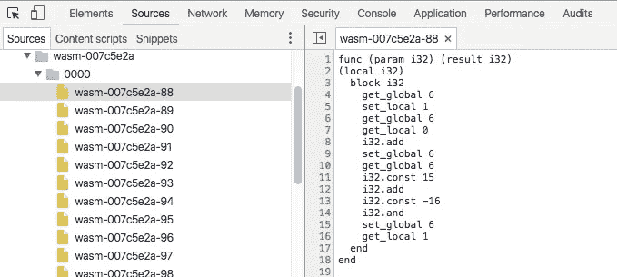
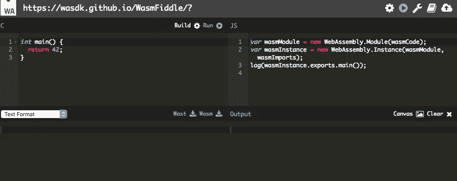
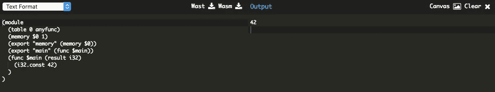
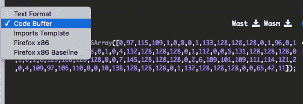
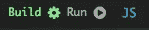
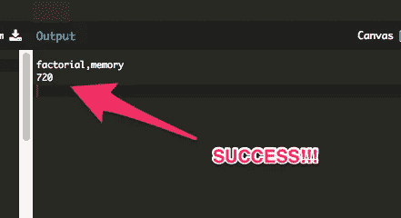

# 用 WasmFiddle 在浏览器中编写并运行 WebAssembly！

> 原文：<https://medium.com/hackernoon/write-and-run-webassembly-in-your-browser-today-77b39c92ead0>


几周前，我写了一篇关于 WebAssembly 将如何从根本上改变网络，甚至可能[扼杀 app store](https://hackernoon.com/webassembly-the-death-of-the-app-store-c9bc3f9557c8) 的文章。

今天我将快速介绍一下什么是 WebAssembly，以及如何在您的 web 浏览器 JSFiddle 风格中直接编写它。

## 为什么 WebAssembly 很重要

首先，简要介绍什么是 WebAssembly，以及为什么它需要引起每个 web 开发人员的注意。

> WebAssembly 或 *wasm* 是一种新的可移植的、大小和加载时间有效的格式，适用于**编译到 web** 。

一般不会直接写 WebAssembly，但是会**把程序编译成 wasm** 。如果你曾经使用过像 C 或 C++这样的编译语言，你就会知道你不能坐在那里写汇编代码——你要用编译成汇编的高级语言来写。

当与 WebGL 配对时，**wasm**中已经在构建一些令人惊叹的东西。如果你在使用桌面 Chrome 或 Firefox(或者甚至是 Android 版 Chrome([)现在就去看看](http://caniuse.com/#feat=wasm)[时髦卡丁车](https://www.funkykarts.rocks/demo.html)!

[](https://www.funkykarts.rocks/demo.html)

wasm wawesome!

时髦卡丁车的开发者甚至好心地记录了整个过程。这是一篇非常有趣的文章，但是格式有点奇怪——我建议从底部的文章开始。

## Devtools 中的 Wasm

这是 wasm 在 Chrome 开发者工具中的样子:



(btw, I’ve created [devtools course](https://www.udemy.com/master-google-chrome-developer-tools/?couponCode=INSIDEJOB15) if you’re interested)

这是来自时髦的卡丁车游戏本身。不幸的是，还没有回到 C++的源代码映射，所以这是一个学习的死胡同。

## 直接在网络浏览器中编写 wasm

编译器、工具链和脚本，天啊！刚开始时，所有这些事情都可能令人生畏。但是如果有一种方法可以在你的浏览器中直接编译成 wasm 呢？

如果你记得一点 C++，你可以在 30 秒内上手。首先，导航到 [WasmFiddle](https://wasdk.github.io/WasmFiddle/) (！！！).



the wasmfiddle interface

然后点击“构建”编译，点击“运行”运行。

下面是底部面板的样子，包括我们的“42”输出:



the true meaning of life

如果你想变得有趣，你可以点击下拉菜单中的“文本格式”并改变视图。



现在让我们试试更复杂的东西:

用这个阶乘程序替换左侧面板中的 C++代码:

```
int factorial(int n)
{
  if (n == 0)
    return 1;
  else
    return n * factorial(n-1);
}
```

并将 JS 面板中的日志语句更改为:

```
log(instance.exports.factorial(6))
```

建造并运行！



是啊！



如果你不想输入代码，这是我完成的阶乘函数:[https://wasdk.github.io/WasmFiddle/?xk3e1](https://wasdk.github.io/WasmFiddle/?xk3e1)

## 网络组装革命开始了

这 Wasm 小提琴工具是真棒！不幸的是，没有一个好的其他人制作的小提琴目录，但是我将联系这个工具的作者 [Michael Bebenita](https://medium.com/u/7c070d9f607b?source=post_page-----77b39c92ead0--------------------------------) 来看看其他人制作了什么。

如果你有什么好东西，请请[发微博](https://twitter.com/theroccob)给我或者回复这篇文章。我很想去看看。

嘘…我正在用 WebAssembly & WebGL 构建**一些非常酷的东西。想第一个知道吗？加入[我的名单](https://upscri.be/1c08e9/)！**

## 课程

想用最简单的方法编译成 WebAssembly 吗？可以用 Unity 游戏引擎！如果你是开发浏览器游戏的新手，可以看看我刚刚发布的课程！WebAssembly 上有一两个小节:-)。

## 编辑！

我的朋友，乔纳森·波特制作了这个演示，演示如何在 https://wasdk.github.io/WasmFiddle/?ttxwx 制作分形。

*请💚如果你今天学到了新的东西，就跟着学吧！这给了我很大的动力继续写这样的文章。*

[](http://bit.ly/HackernoonFB)[](https://goo.gl/k7XYbx)[](https://goo.gl/4ofytp)

> [黑客中午](http://bit.ly/Hackernoon)是黑客如何开始他们的下午。我们是 T21 家庭的一员。我们现在[接受投稿](http://bit.ly/hackernoonsubmission)并乐意[讨论广告&赞助](mailto:partners@amipublications.com)机会。
> 
> 如果你喜欢这个故事，我们推荐你阅读我们的[最新科技故事](http://bit.ly/hackernoonlatestt)和[趋势科技故事](https://hackernoon.com/trending)。直到下一次，不要把世界的现实想当然！

