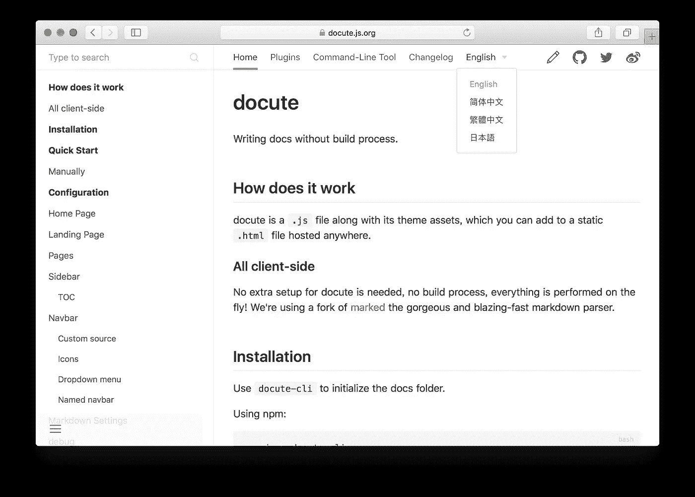

# 使用降价和/或 Vue 组件编写文档，无需构建流程

> 原文：<https://medium.com/hackernoon/write-documents-using-markdown-and-or-vue-component-8724bbee5d55>

这是 [docute@2.11](https://docute.js.org/#/) (beta 版)中的新特性，你可以通过:

```
<script src="https://unpkg.com/docute@next"></script>
```

Docute 简介:

> 它是一个 JavaScript 文件，可以将你的 markdown 文件动态地转换成 docs 网站，用 Vue.js 构建并标记



如果你知道 [**Flatdoc**](https://github.com/rstacruz/flatdoc) 你就已经知道 **Docute** 了，除了 Docute 支持多页，还有更多特性。

(顺便说一句，我是在制作 docute 之后从[插件系统](https://medium.com/u/3ba9db42812d#/plugins)。)

所以在这里我要介绍另一个特性，**结合了 Markdown & Vue 组件**的力量:

example docute app

[https://gist . github . com/egoist/f 4 f 590 a 1 e 9d 4 a 0 af C2 d 62 ea E6 db 8789 f](https://gist.github.com/egoist/f4f590a1e9d4a0afc2d62eae6db8789f)

基本上,`nav`选项类似于许多路由器库中的`routes`,它定义了用户如何进入页面，默认情况下，它通过`path`选项获取匹配的 markdown 文件，例如`path: '/get-started'`将为您获取`get-started.md`,但是如果您的网站不是很大，您也可以使用`markdown`选项来编写内联 markdown。

获取的内容将由标记为的[解析，并呈现为简单的 HTML 字符串。但是如果你使用简单 Vue 组件对象的`component`选项，解析后的 HTML 字符串将被用作组件的`template`值，我们最终将 Vue 组件作为应用程序的一部分呈现。](https://github.com/chjj/marked)

# 把它包起来

Docute 是一个文档框架:

*   在没有构建过程的情况下编写文档(即，使网站快速运行！)
*   一个强大的插件系统
*   一种简洁优雅的设计
*   编写带有降价和 Vue 组件选择加入的文档

相关链接:

*   Docute 的网站:[https://docute.js.org](https://docute.js.org)
*   Docute 的源代码:[https://github.com/egoist/docute](https://github.com/egoist/docute)
*   如何在 Markdown 中运行代码块:【https://github.com/egoist/docute-iframe 

[](http://bit.ly/HackernoonFB)[](https://goo.gl/k7XYbx)[](https://goo.gl/4ofytp)

> [黑客中午](http://bit.ly/Hackernoon)是黑客如何开始他们的下午。我们是 [@AMI](http://bit.ly/atAMIatAMI) 家庭的一员。我们现在[接受投稿](http://bit.ly/hackernoonsubmission)并乐意[讨论广告&赞助](mailto:partners@amipublications.com)机会。
> 
> 如果你喜欢这个故事，我们推荐你阅读我们的[最新科技故事](http://bit.ly/hackernoonlatestt)和[趋势科技故事](https://hackernoon.com/trending)。直到下一次，不要把世界的现实想当然！

