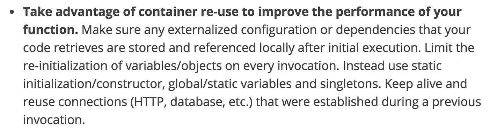
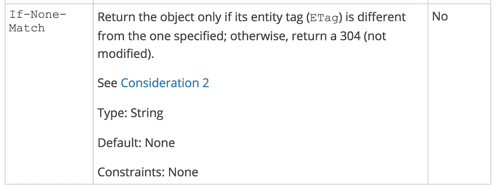

# 以正确的方式编写递归 AWS Lambda 函数

> 原文：<https://medium.com/hackernoon/write-recursive-aws-lambda-functions-the-right-way-4a4b5ae633b6>

## 您可能没有意识到，您可以用递归方式编写 AWS Lambda 函数来执行长时间运行的任务。这里有两个建议可以帮助你做好这件事。

AWS Lambda [将](http://docs.aws.amazon.com/lambda/latest/dg/limits.html)单次调用的最大执行时间限制为 **5 分钟**。虽然这个限制在将来可能会提高，但是您可能仍然需要考虑任何长时间运行的任务的超时。出于这个原因，我个人认为对于许多长时间运行的任务来说，电流限制太低是一件好事——它迫使你尽早考虑边缘情况，避免陷入“it *应该*足够长以执行 X”的思维陷阱，而不考虑可能的故障模式。

相反，你应该把执行长时间运行任务的 Lambda 函数写成**递归函数**——例如[处理一个大的 S3 文件](https://hackernoon.com/yubls-road-to-serverless-part-4-building-a-scalable-push-notification-system-62b38924ed61)。

 [## Yubl 的无服务器之路——第 4 部分，构建可伸缩的推送通知系统

### 我们构建了一个集成了 BigQuery 结果的系统，能够在一个月内发送数百万条推送通知

hackernoon.com](https://hackernoon.com/yubls-road-to-serverless-part-4-building-a-scalable-push-notification-system-62b38924ed61) 

这里有两个小贴士可以帮你做好这件事。

## 使用上下文**。** getRemainingTimeInMillis()

当您的函数被调用时，`context`对象允许您找出当前调用还剩多少时间。

 [## 上下文对象(Node.js) - AWS Lambda

### 当 Lambda 函数执行时，它可以与 AWS Lambda 交互以获得有用的运行时信息，例如:

docs.aws.amazon.com](http://docs.aws.amazon.com/lambda/latest/dg/nodejs-prog-model-context.html) 

假设您有一个昂贵的任务，它可以被分解成可以批量处理的小任务。在每批结束时，使用`context.getRemainingTimeInMillis()`检查是否还有足够的时间继续加工。否则，`recurse`并沿着当前位置传递，以便下一个调用可以从它停止的地方继续。

## 使用本地状态进行优化

虽然 Lambda 函数在设计上是短暂的，但容器仍然被重用来进行优化，这意味着您仍然可以利用通过调用持久化的内存状态。

您应该利用这个机会避免在每次递归中加载相同的数据——例如，您可能正在处理一个大的 S3 文件，缓存 S3 文件的内容会更有效(也更便宜)。

我注意到 AWS 也更新了他们的 Lambda 最佳实践页面，建议你利用容器重用:

然而，由于 Lambda 可以在递归之间回收容器，所以从一个调用到另一个调用，您可能会丢失缓存的状态。因此，您不应该假设缓存状态在递归期间总是可用的，并且总是首先检查是否有缓存状态。

此外，在处理 S3 对象时，您需要保护自己免受内容更改的影响。S3 对象被替换，但是容器实例仍然被重用，因此缓存数据仍然可用。当您调用 S3 的 [GetObject](http://docs.aws.amazon.com/AmazonS3/latest/API/RESTObjectGET.html) 操作时，您应该用缓存数据的`ETag`设置可选的`If-None-Match`参数。

以下是你如何应用这种技术。

看看这个[例子](https://github.com/theburningmonk/lambda-recursive-s3-demo/blob/master/batch-processor.js) Lambda 函数，它递归地处理一个 S3 文件，使用了本文中概述的方法。

 [## burning monk/lambda-递归-S3-演示

### 演示用于处理大型 s3 文件的递归 AWS Lambda 函数

github.com](https://github.com/theburningmonk/lambda-recursive-s3-demo/blob/master/batch-processor.js) 

喜欢您正在阅读的内容，但需要更多帮助？我很乐意作为独立顾问**提供我的服务**并帮助您完成您的无服务器项目——架构审查、代码审查、构建概念验证，或者提供关于领先实践和工具的建议。

我在**伦敦，英国**目前唯一的英国 [**AWS 无服务器英雄**](https://aws.amazon.com/developer/community/heroes/yan-cui/) 。我有近 **10 年**的[经验](https://www.linkedin.com/in/theburningmonk/)在 AWS 中大规模运行生产工作负载。我主要在英国开展业务，但我愿意出差一周以上。要了解我们如何合作，请在这里告诉我更多关于您试图解决的问题的信息。

我还可以在举办一个**内部研讨会，帮助您的无服务器架构做好生产准备**。您可以在这里找到关于为期两天的研讨会[的更多信息，该研讨会将带您从 AWS Lambda 的基础一直到日志聚合、分发跟踪和安全最佳实践的通用操作模式。](https://theburningmonk.com/workshops/)****

如果你喜欢按照自己的进度学习，那么你也可以找到所有与我为曼宁制作的**视频课程相同的研讨会内容。我们将讨论的主题包括:**

*   **认证 *&* 授权与 API 网关 *&* 认知**
*   **本地测试 *&* 运行功能**
*   **CI/CD**
*   **日志聚合**
*   **监控最佳实践**
*   **X 射线分布式跟踪**
*   **跟踪相关 id**
*   ***性能&成本*优化**
*   **错误处理**
*   **配置管理**
*   **金丝雀部署**
*   **VPC**
*   **安全**
*   **Lambda、Kinesis 和 API 网关的最佳实践**

**你还可以用代码 **ytcui** 获得**票面价格的 6 折优惠**。不过，这个数字只有在我们参加曼宁的早期访问计划(MEAP)时才有效。**