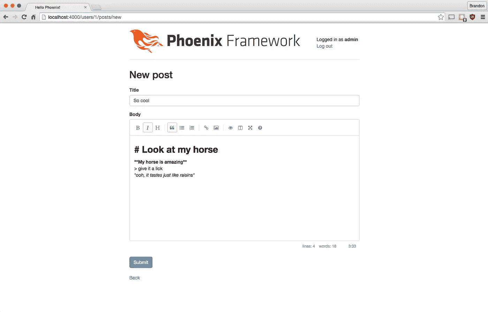

# 用 Phoenix 和 Elixir 编写博客引擎:第 6 部分，降价支持

> 原文：<https://medium.com/hackernoon/writing-a-blog-engine-in-phoenix-and-elixir-part-5-markdown-support-fde72badd8e1>


He really should at least turn the screen on

**最新更新:**2016 年 8 月 2 日

## 本系列的前一篇文章

[第五部分:添加 ExMachina](/@diamondgfx/mixology-exmachina-92a08dc3e954)

## 当前版本

在撰写本文时，我们应用程序的当前版本是:

*   **仙丹** : v1.3.1
*   凤凰城:1.2.0 版
*   **Ecto:** v2.0.2
*   **ExMachina** : v1.0.2
*   **指定用途** : 1.0.1

如果你正在读这篇文章，而这些不是最新的，请告诉我，我会相应地更新这篇教程。

## 我们离开的地方

我们现在已经向我们的博客平台添加了角色、用户和帖子，修复了一些错误，升级了一些依赖项，并修复了我们的种子。我们的平台真的很好，很稳定，有一套很好的基本功能。如果你没有跟上或者错过了一个步骤，你可以继续 https://github.com/Diamond/pxblog 的“11092015”分支。

## 实施降价支持

鉴于我们是技术人员，正在创建一个博客，我们可能会使用，也可能不会使用，我们可能应该允许人们以其他方式写帖子，而不是明文支持。Markdown 恰好是一种非常适合写博客的语言，并且在 Elixir 中支持起来非常简单，所以让我们使用一个名为[dearm](https://github.com/pragdave/earmark)的第三方库来实现 Markdown 支持。我们首先简单地在 **mix.exs:** 的 **deps** 函数中为我们的应用程序添加一个依赖项

```
{:earmark, "~> 1.0.1"}
```

然后我们将运行 **mix do deps.get，编译**以确保我们成功地将它添加到我们的应用程序中。如果一切顺利，我们可以继续向模板和视图中添加支持。

## 更新我们的观点

我们将从提供一个方便的方法来将帖子转换成 Markdown 开始。我们不想到处写**dearm . to _ html(data)**，如果我们决定支持任何其他特性和选项，我们就必须一遍又一遍地重写代码。相反，我们将在 **web/views/post_view.ex** 中实现一个函数，如果我们想改变它，它将为我们提供一个单一的修改位置。打开文件并添加以下函数:

```
def markdown(body) do
  body
  |> Earmark.to_html
  |> raw
end
```

我们有输入文本 body，我们正在把它输入到 Earmark 的“to_html”函数中。因为我们希望 html 可以放入我们的帖子中，所以我们在这里使用 **raw** 。我知道你在想什么:“哎呀，生的不是很不安全吗？”答案是肯定的，绝对是。问题是，我们需要从圈存中输出原始的 html，所以我们需要渲染这些数据。我们也不想每次渲染时都要去掉相同的标签，所以让我们进入 **web/models/post.ex** 并添加一些代码来去掉它:

```
def changeset(struct, params \\ %{}) do
  struct
  |> cast(params, [:title, :body])
  |> validate_required([:title, :body])
  |> strip_unsafe_body(params)
end

defp strip_unsafe_body(model, %{"body" => nil}) do
  model
end

defp strip_unsafe_body(model, %{"body" => body}) do
  {:safe, clean_body} = Phoenix.HTML.html_escape(body)
  model |> put_change(:body, clean_body)
end

defp strip_unsafe_body(model, _) do
  model
end
```

我们在这里添加了相当多的代码，所以让我们来讨论一下我们在做什么。我们做的第一个更改在顶部，在我们的 changeset 函数中。我们增加了一个新的称呼， **strip_unsafe_body(model，…)** 。这将模式匹配成三个可能函数之一。第一个包含一个为零的主体参数；第二个是包含一个体参数的方法，我们必须把它去掉，第三个是最终的总括。

我们使用 **put_change** 函数将 body change 替换为一个剥离的版本，该版本调用 Phoenix。HTML 的“html_escape”函数。这个函数接受文本，然后在成功时返回一个元组 **{:safe，cleaned_up_body}** 。

不经过测试就写这段代码让我感到不安，尤其是我们在这里做的事情，所以让我们来测试一下吧！

## 为我们的代码剥离器编写测试

由于我们依赖这些模型动作来保证代码的安全，我们需要做的第一件事就是确保它们得到适当的测试！

```
defmodule Pxblog.PostTest do
  use Pxblog.ModelCase

  alias Pxblog.Post

  @valid_attrs %{body: "some content", title: "some content"}
  @invalid_attrs %{}

  test "changeset with valid attributes" do
    changeset = Post.changeset(%Post{}, @valid_attrs)
    assert changeset.valid?
  end

  test "changeset with invalid attributes" do
    changeset = Post.changeset(%Post{}, @invalid_attrs)
    refute changeset.valid?
  end

  test "when the body includes a script tag" do
    changeset = Post.changeset(%Post{}, %{@valid_attrs | body: "Hello <script type='javascript'>alert('foo');</script>"})
    refute String.match? get_change(changeset, :body), ~r{<script>}
  end

  test "when the body includes an iframe tag" do
    changeset = Post.changeset(%Post{}, %{@valid_attrs | body: "Hello <iframe src='http://google.com'></iframe>"})
    refute String.match? get_change(changeset, :body), ~r{<iframe>}
  end

  test "body includes no stripped tags" do
    changeset = Post.changeset(%Post{}, @valid_attrs)
    assert get_change(changeset, :body) == @valid_attrs[:body]
  end
end
```

我们首先要修改的是顶部的 **@valid_attrs** 声明。当我们从控制器接收数据时，它将是基于字符串的键的形式，而不是原子，这将导致我们的测试失败，除非我们修改它。

接下来，我们导入 **Ecto。变更集**，但是只有 **get_change/2** 函数，我们需要从变更集中提取转换后的值。最后，我们编写四个测试:

1.  当我们的身体有一个脚本标签
2.  当我们的身体有一个 iframe 标签时
3.  当我们的身体里没有任何无效标签时

重新运行我们的测试套件，我们应该没问题。我们还有一个测试要写，然后一些基本的用户界面变化，然后我们就完成了！

## 为 Markdown 助手编写测试

我们还应该为我们在 Post View 模块中编写的 markdown helper 函数编写一个快速测试。好消息是这应该是一个非常简单的测试。

创建**test/view/post _ view _ test . exs**并用以下内容填充它:

```
defmodule Pxblog.PostViewTest do
  use Pxblog.ConnCase, async: true

  test "converts markdown to html" do
    {:safe, result} = Pxblog.PostView.markdown("**bold me**")
    assert String.contains? result, "<strong>bold me</strong>"
  end

  test "leaves text with no markdown alone" do
    {:safe, result} = Pxblog.PostView.markdown("leave me alone")
    assert String.contains? result, "leave me alone"
  end
end
```

运行我们的测试，验证一切都是绿色的，我们完成了对这个新功能的测试更新！

## 更新我们的 UI

现在，我们有能力写完整的帖子，但是 UI 并不真正支持我们编辑任何大于一行的内容。我们将修改标准表单，使其包含一个文本区域，而不是文本框，我们还将为它提供一个更好的编辑器。

打开**web/templates/post/form . html . eex**，添加一个 **id** 参数，给它一个 id“body-editor”。完成的行应该如下所示:

```
<%= textarea f, :body, class: "form-control", id: "body-editor" %>
```

最后，将以下代码添加到表单模板的底部(**web/templates/post/form . html . eex**):

```
<link rel="stylesheet" href="//cdn.jsdelivr.net/simplemde/latest/simplemde.min.css">
<script src="//cdn.jsdelivr.net/simplemde/latest/simplemde.min.js"></script>
<script>var simplemde = new SimpleMDE();</script>
```

重新加载我们的用户界面，我们应该看到一个非常干净的界面来写新帖子！这开始看起来像一个适当的博客平台和一切！



最后，打开**web/templates/post/show . html . eex**，更改显示文章正文的行，并使用我们在视图中定义的 markdown(body)函数。

```
<%= markdown(@post.body) %>
```

## 结论

我们现在有一个更好的方法来编辑/格式化我们的帖子，编辑器看起来也更好了！我们可能还想在某个时候修改布局，但是仍然没有办法添加评论，但是评论实际上是实现对频道支持的一种有趣的方式，所以我们现在将推迟，直到我们准备好内置这种支持！

如果你想看这段代码的完整版本，只需抓取我们 repo 的“add_markdown_support”分支。

## 本系列的下一篇文章

[在 Phoenix 和 Elixir 中编写博客引擎:第 7 部分，添加评论支持](/@diamondgfx/writing-a-blog-engine-in-phoenix-and-elixir-part-7-adding-comments-support-7dfc17dd474e)

# 看看我的新书！

嘿大家好！如果你喜欢你在这里读到的东西，并且想和我一起学习更多，可以看看我的新书《长生不老药和凤凰网开发》:

[](https://www.packtpub.com/web-development/phoenix-web-development) [## 凤凰网开发| PACKT 图书

### 学习使用 Elixir 和……从头开始构建投票 web 应用程序的高性能功能原型

www.packtpub.com](https://www.packtpub.com/web-development/phoenix-web-development) 

我真的很兴奋终于可以把这个项目推向世界了！它的写作风格与我的其他教程一样，我们将从头到尾构建一个完整项目的框架，甚至涵盖一些更棘手的主题，如文件上传、Twitter/Google OAuth 登录和 API！

[](http://bit.ly/HackernoonFB)[](https://goo.gl/k7XYbx)[](https://goo.gl/4ofytp)

> [黑客中午](http://bit.ly/Hackernoon)是黑客如何开始他们的下午。我们是阿妹家庭的一员。我们现在[接受投稿](http://bit.ly/hackernoonsubmission)并乐意[讨论广告&赞助](mailto:partners@amipublications.com)机会。
> 
> 如果你喜欢这个故事，我们推荐你阅读我们的[最新科技故事](http://bit.ly/hackernoonlatestt)和[趋势科技故事](https://hackernoon.com/trending)。直到下一次，不要把世界的现实想当然！

[](https://goo.gl/Ahtev1)