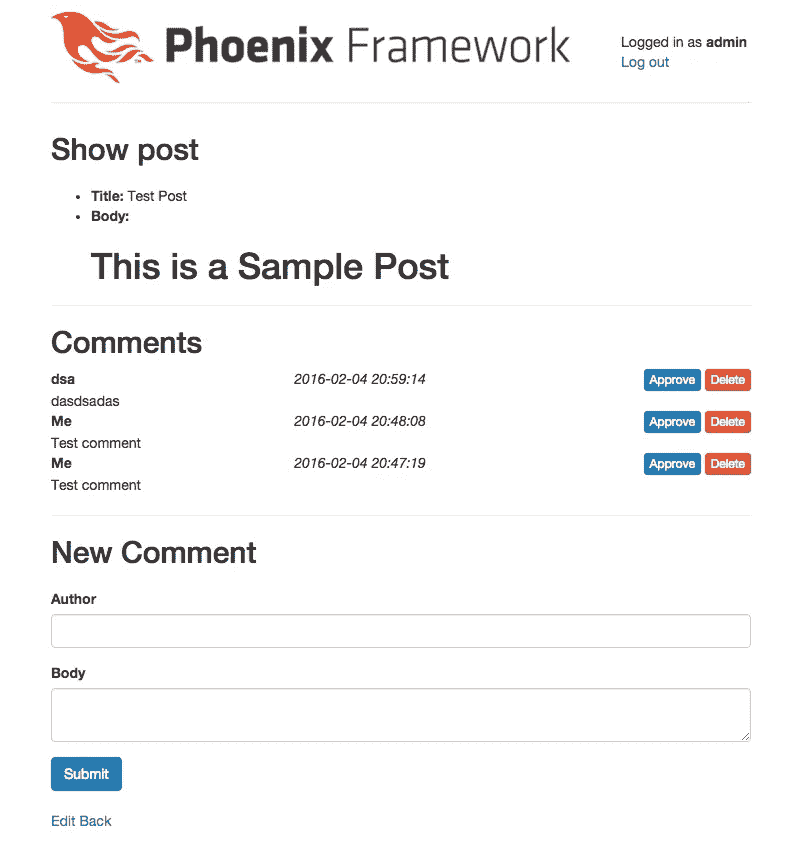

# 用 Phoenix 和 Elixir 编写博客引擎:第 7 部分，添加评论支持

> 原文：<https://medium.com/hackernoon/writing-a-blog-engine-in-phoenix-and-elixir-part-7-adding-comments-support-7dfc17dd474e>


Let me tell you what I thought of that last post of yours!

**最新更新**:2016 年 8 月 2 日

## 本系列的前一篇文章

[](/@diamondgfx/writing-a-blog-engine-in-phoenix-and-elixir-part-5-markdown-support-fde72badd8e1) [## 用 Phoenix 和 Elixir 编写博客引擎:第 6 部分，降价支持

### 最新更新:2016 年 8 月 2 日

medium.com](/@diamondgfx/writing-a-blog-engine-in-phoenix-and-elixir-part-5-markdown-support-fde72badd8e1) 

## 当前版本

*   **仙丹** : v1.3.1
*   **凤凰:** v1.2.0
*   **Ecto:** v2.0.2

## 我们离开的地方

我们的博客应用程序现在支持使用一个漂亮的小 markdown 编辑器来使我们的帖子更加漂亮，所以它真的开始看起来像一个功能齐全的项目了！然而，我们没有的一件事是，我们写的任何帖子都无法获得任何形式的反馈。好消息是，这是一个非常简单的东西添加，只是建立在我们已经建立了大量的关联工作！

我们将从这个简单的初始方法开始。我们不会担心要求用户注册；相反，我们将有新的评论被添加到“待定”状态。评论不会显示在帖子上，除非它们已经被批准脱离待定状态，除非访问我们博客的用户勾选了“显示未批准”按钮。

## 添加我们的评论模型

让我们首先为我们的评论添加一个模型。我们希望收到以下评论:

*   作者(我们将使用字符串)
*   正文(我们将为此使用文本)
*   批准标志(我们将使用布尔值，默认为 false)
*   评论所针对的帖子(我们将使用引用)

我们不想创建完整的模板套件和所有东西，所以我们将坚持使用 **mix phoenix.gen.model** 来实现这一点。

```
mix phoenix.gen.model Comment comments author:string body:text approved:boolean post_id:references:posts
```

然后我们将迁移我们的数据库:

```
mix ecto.migrate
```

## 将评论与帖子相关联

如果你打开 **web/models/comment.ex** 你可以看到评论现在已经与帖子相关联，但是我们没有做任何事情来反向设置。

在 **web/models/post.ex** 中，将以下内容添加到您的“posts”模式定义中:

```
has_many :comments, Pxblog.Comment
```

现在，为了确保一切如我们预期的那样工作，运行**混合测试**以验证一切仍然是绿色的(应该是在这一点上)！现在让我们稍微修改一下我们的测试，这样我们就可以测试文章和评论之间的关联。

首先打开**test/support/factory . ex**添加一个注释工厂。将以下内容与我们的别名声明一起添加到顶部:

```
alias Pxblog.Comment
```

并在项目底部添加以下内容:

```
def comment_factory do
  %Comment{
    author: "Test User",
    body: "This is a sample comment",
    approved: false,
    post: build(:post)
  }
end
```

因此，我们需要添加一些测试来利用这个新工厂。打开**test/models/comment _ test . exs**并将以下内容添加到文件中:

```
import Pxblog.Factory# ...test "creates a comment associated with a post" do
  comment = insert(:comment)
  assert comment.post_id
end
```

再次运行我们的测试，我们应该保持绿色！

## 添加我们的路线以供评论

我们将从设置初始路线开始，我们将使用这些路线来征求意见，这将有助于我们创建各种初始技术设计。打开 **web/router.ex** :

```
resources "/posts", PostController, only: [] do
  resources "/comments", CommentController, only: [:create, :delete, :update]
end
```

评论只在文章的上下文中有意义，所以我们将把评论嵌套在文章下面。然而，在其他路由中，我们已经定义了嵌套在 users 下的 Posts 资源！我们不想公开一堆仅发布的路由，所以我们使用仅**:[]**代码来锁定任何根级别的发布路由。然后我们添加评论资源，但是现在，我们只允许**:创建**、**:删除**，以及**:更新**。“创建”将是匿名用户用来创建评论(最初未被批准)的工具。删除将用于帖子的作者或管理员删除帖子，而更新将用于允许管理员或作者将评论更新为已批准，以便公众可以看到。

## 添加我们的注释控制器和视图

既然我们的模型已经设置好了，我们需要构建一个带有几个动作的控制器。大多数显示/查看评论将通过 Posts 控制器，但我们需要能够及时从这个控制器中删除/更新/创建评论。我们将从创建**web/controllers/comment _ controller . ex**开始:

```
defmodule Pxblog.CommentController do
  use Pxblog.Web, :controller
end
```

我们还将创建一个视图来让菲尼克斯满意。创建**web/views/comment _ view . ex**:

```
defmodule Pxblog.CommentView do
  use Pxblog.Web, :view
end
```

现在我们回到控制器，从我们三个动作的基本结构开始，**创建**、**更新**和**删除**。

```
def create(conn, _), do: conn
def update(conn, _), do: conn
def delete(conn, _), do: conn
```

接下来，我们需要一个评论表单模板，可以在 Show Post 页面上使用。创建一个新目录供我们使用:

```
$ mkdir web/templates/comment
```

## 允许用户发表评论

我们将从创建**web/templates/comment/form . html . eex**开始:

```
<%= form_for @changeset, @action, fn f -> %>
  <%= if @changeset.action do %>
    <div class="alert alert-danger">
      <p>Oops, something went wrong! Please check the errors below.</p>
    </div>
  <% end %> <div class="form-group">
    <%= label f, :author, class: "control-label" %>
    <%= text_input f, :author, class: "form-control" %>
    <%= error_tag f, :author %>
  </div> <div class="form-group">
    <%= label f, :body, class: "control-label" %>
    <%= textarea f, :body, class: "form-control", id: "body-editor" %>
    <%= error_tag f, :body %>
  </div> <div class="form-group">
    <%= submit "Submit", class: "btn btn-primary" %>
  </div>
<% end %>
```

很标准的形式，所以我们不需要讨论太多。现在让我们前往展示帖子模板**web/templates/post/show . html . eex**，在这里我们将添加对评论表单的引用。请注意，在上面的模板中，我们定义了 **@changeset** 和 **@action** ，所以我们稍后需要循环回到**web/controllers/post _ controller . ex**。

现在，让我们继续使用**web/templates/post/show . html . eex**。在帖子的属性列表后，添加以下行:

```
<%= render Pxblog.CommentView, "form.html", changeset: @comment_changeset, action: post_comment_path(@conn, :create, @post) %>
```

我们需要在我们的 **CommentView** 视图中引用“form.html”呈现，所以我们将它指定为“render”调用的第一个参数。我们需要给它传递一个 **@comment_changeset** (我们还没有设置，但是很快就会设置)和一个 action，评论应该发布到这个 action。

现在我们将前往**web/controllers/post _ controller . ex**以使其全部工作。您需要更改“show”函数，如下所示:

```
def show(conn, %{"id" => id}) do
  post = Repo.get!(assoc(conn.assigns[:user], :posts), id)
  comment_changeset = post
    |> build_assoc(:comments)
    |> Pxblog.Comment.changeset()
  render(conn, "show.html", post: post, comment_changeset: comment_changeset)
end
```

现在让我们回到我们的 comment controller(**web/controllers/comment _ controller . ex**)并进一步充实 create 函数。对于一个标准的 create 函数，我们需要在顶部添加一些东西，所以我们将从在顶部添加以下内容开始(就在我们的函数之前):

```
alias Pxblog.Comment
alias Pxblog.Postplug :scrub_params, "comment" when action in [:create, :update]
```

我们在 scrub_params 调用中包含了“update ”,因为我们以后无论如何都需要它。现在，我们将跳到 create 函数，并用以下内容替换它:

```
def create(conn, %{"comment" => comment_params, "post_id" => post_id}) do
  post      = Repo.get!(Post, post_id) |> Repo.preload([:user, :comments])
  changeset = post
    |> build_assoc(:comments)
    |> Comment.changeset(comment_params) case Repo.insert(changeset) do
    {:ok, _comment} ->
      conn
      |> put_flash(:info, "Comment created successfully!")
      |> redirect(to: user_post_path(conn, :show, post.user, post))
    {:error, changeset} ->
      render(conn, Pxblog.PostView, "show.html", post: post, user: post.user, comment_changeset: changeset)
  end
end
```

首先，我们只想在获得 comment params 和 post_id 后尝试创建一个注释，因为没有这两个参数，我们就无法创建新的注释。接下来，我们获取相关的帖子(记住预加载用户和评论，因为我们的模板将开始引用这两者！)并开始创建新的关联变更集。我们从 post 开始，通过管道将它发送到 **build_assoc** ，后者通过原子指定关联来构建关联模式。在这种情况下，我们想要构建一个关联的**评论**。然后，我们将它通过管道传输到 Comment.changeset 函数中，并使用我们模式匹配的 comment_params。除了一个例外，其余的都是正常的:

错误情况有点复杂，因为我们再次尝试使用另一个视图的渲染。我们首先传递连接，然后使用合适的视图( **Pxblog)。在我们的例子中是 PostView** ，我们想要呈现的模板，然后由于该模板使用了 **@post** 、 **@user** 和 **@comment_changeset** ，我们需要提供这三个。现在您可以测试它了:如果它发布了错误，您将在页面上看到评论的错误列表。如果它发布没有错误，你会得到一个蓝色的闪光消息在顶部！进步很大！

## 向我们的帖子添加评论显示

接下来，我们需要创建它，这样我们就可以实际看到模板上的帖子。我们将创建一个共享模板，如果我们希望在其他地方显示不同内容的评论，可以使用该模板，因此我们将创建**web/templates/comment/comment . html . eex**并用以下内容填充它:

```
<div class="comment">
  <div class="row">
    <div class="col-xs-4">
      <strong><%= @comment.author %></strong>
    </div>
    <div class="col-xs-4">
      <em><%= @comment.inserted_at %></em>
    </div>
    <div class="col-xs-4 text-right">
      <%= unless @comment.approved do %>
        <button class="btn btn-xs btn-primary approve">Approve</button>
      <% end %>
      <button class="btn btn-xs btn-danger delete">Delete</button>
    </div>
  </div>
  <div class="row">
    <div class="col-xs-12">
      <%= @comment.body %>
    </div>
  </div>
</div>
```

这里不多解释了。批准/删除按钮尚未连接；我们将在本系列的下一篇教程中解决这个问题。我们还需要修改控制器来预加载评论，并修改帖子的显示模板来包含评论列表。首先，我们将处理控制器更新。在**web/controllers/post _ controller . ex**中，在 **show** 函数中，我们将在获取帖子的行中添加一行(我已将新行加粗):

```
post = Repo.get!(assoc(conn.assigns[:user], :posts), id)
 **|> Repo.preload(:comments)**
```

这只是确保我们的评论作为帖子的一部分被加载。最后，我们将打开**web/templates/post/show . html . eex**，并添加模板中显示评论的部分:

```
<div class="comments">
 <h2>Comments</h2>
 <%= for comment <- @post.comments do %>
   <%= render Pxblog.CommentView, "comment.html", comment: comment %>
 <% end %>
</div>
```

## 添加用于注释的控制器测试

我们还不能离开，因为我们还有一些条件没有通过测试！我们应该涵盖控制器的创建功能，我们将坚持一个积极的情况和一个消极的情况，因为这些是我们的代码将通过的路径。

创建**test/controllers/comment _ controller _ test . exs**，让我们开始吧:

```
defmodule Pxblog.CommentControllerTest do
  use Pxblog.ConnCase import Pxblog.Factory @valid_attrs %{author: "Some Person", body: "This is a sample comment"}
  @invalid_attrs %{} setup do
    user = insert(:user)
    post = insert(:post, user: user) {:ok, conn: build_conn(), user: user, post: post}
  end test "creates resource and redirects when data is valid", %{conn: conn, post: post} do
    conn = post conn, post_comment_path(conn, :create, post), comment: @valid_attrs
    assert redirected_to(conn) == user_post_path(conn, :show, post.user, post)
    assert Repo.get_by(assoc(post, :comments), @valid_attrs)
  end test "does not create resource and renders errors when data is invalid", %{conn: conn, post: post} do
    conn = post conn, post_comment_path(conn, :create, post), comment: @invalid_attrs
    assert html_response(conn, 200) =~ "Oops, something went wrong"
  end
end
```

我们将继续使用 Pxblog。工厂，因为它是如此方便。我们还将设置两个模块变量， **@valid_attrs** 和 **@invalid_attrs** ，就像我们在其他地方做的一样。我们还创建了一个设置块，它将设置一个默认用户和 post，供我们用来创建评论。

接下来，我们将创建我们的正面测试用例。我们发布到具有有效属性的嵌套 post->comment 路径，断言我们按照预期被重定向，并且评论是为该帖子创建的！

最后，我们将做同样的事情，但是使用无效的数据，并验证当一些东西没有通过验证时，我们得到了 HTML 中出现的“哎呀，出问题了”消息！搞定了。



Our current UI!

## 后续步骤

我们的评论有很好的基础，但我们肯定可以进一步改进。例如，我们仍然不能批准或删除评论，我们还将获取帖子的每一条评论。在接下来的几篇文章中，我们将在把我们的评论系统变成一个由凤凰频道支持的实时评论系统之前，对其进行进一步的改进。

**2016 年 2 月 29 日更新:**显然，我完全忽略了将评论添加到帖子实际显示中的部分！我已经更新了这个帖子，现在可以正确地反映这些变化了:)谢谢[安德鲁·奔驰](https://medium.com/u/fea9fa4f2f7d?source=post_page-----7dfc17dd474e--------------------------------)！

## 本系列的下一篇文章

[](/elixir-magic/writing-a-blog-engine-in-phoenix-and-elixir-part-8-finishing-comments-30ff95d44cea) [## 用 Phoenix 和 Elixir 编写博客引擎:第 8 部分，结束评论

### 最新更新:2016 年 8 月 2 日

medium.com](/elixir-magic/writing-a-blog-engine-in-phoenix-and-elixir-part-8-finishing-comments-30ff95d44cea) 

# 看看我的新书！

嘿大家好！如果你喜欢你在这里读到的东西，并且想和我一起学习更多，可以看看我的新书《长生不老药和凤凰网开发》:

[](https://www.packtpub.com/web-development/phoenix-web-development) [## 凤凰网开发| PACKT 图书

### 学习使用 Elixir 和……从头开始构建投票 web 应用程序的高性能功能原型

www.packtpub.com](https://www.packtpub.com/web-development/phoenix-web-development) 

我真的很兴奋终于可以把这个项目推向世界了！它的写作风格与我的其他教程一样，我们将从头到尾构建一个完整项目的框架，甚至涵盖一些更棘手的主题，如文件上传、Twitter/Google OAuth 登录和 API！

[](http://bit.ly/HackernoonFB)[](https://goo.gl/k7XYbx)[](https://goo.gl/4ofytp)

> [黑客中午](http://bit.ly/Hackernoon)是黑客如何开始他们的下午。我们是 [@AMI](http://bit.ly/atAMIatAMI) 家庭的一员。我们现在[接受投稿](http://bit.ly/hackernoonsubmission)，并乐意[讨论广告&赞助](mailto:partners@amipublications.com)机会。
> 
> 如果你喜欢这个故事，我们推荐你阅读我们的[最新科技故事](http://bit.ly/hackernoonlatestt)和[趋势科技故事](https://hackernoon.com/trending)。直到下一次，不要把世界的现实想当然！

[](https://goo.gl/Ahtev1)