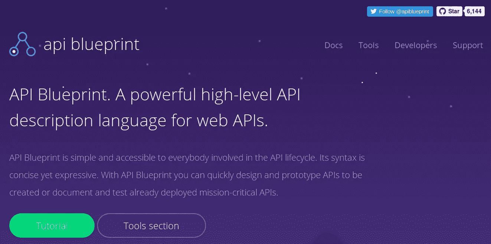
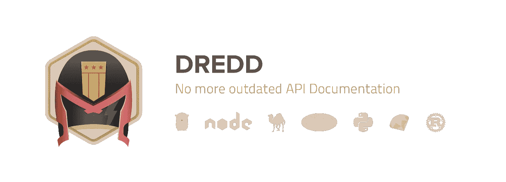
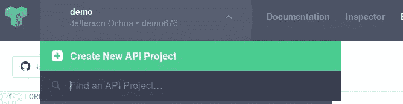
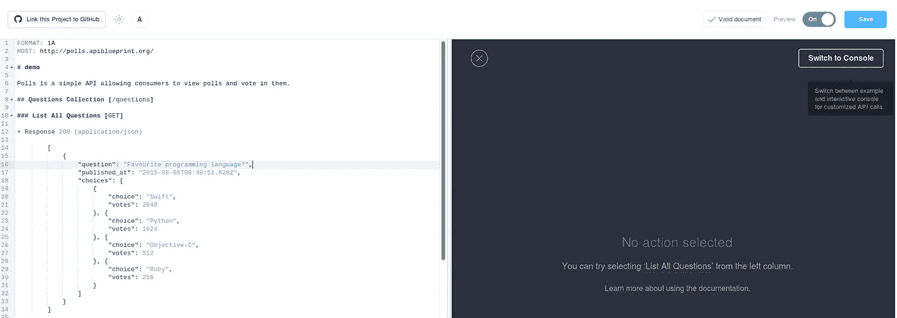
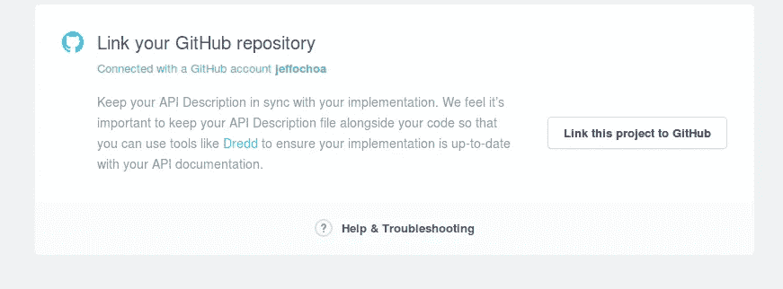
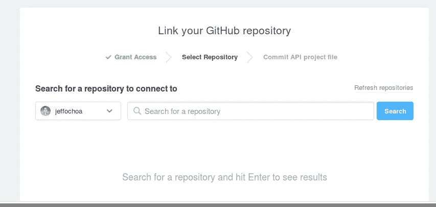
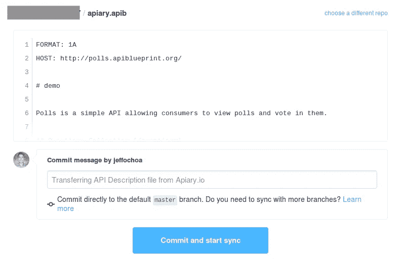
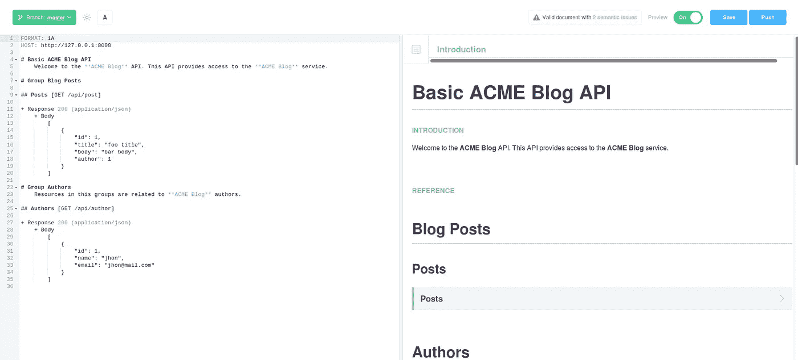
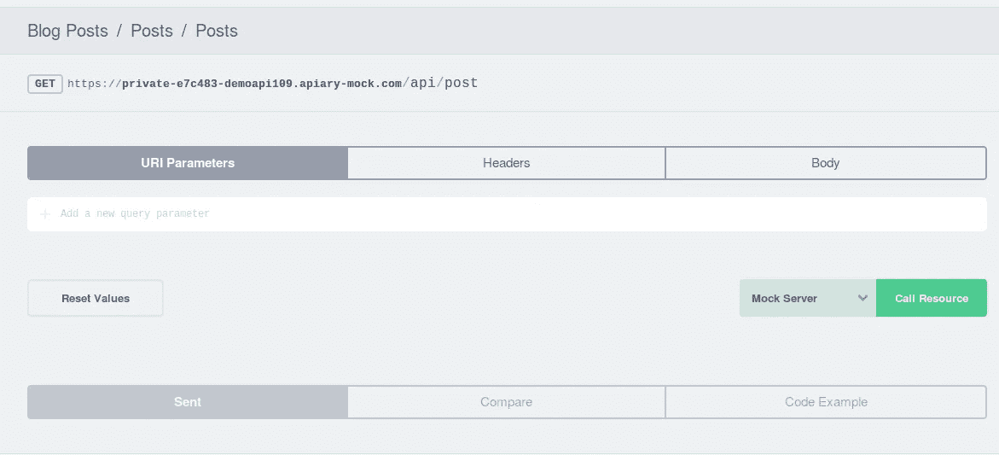
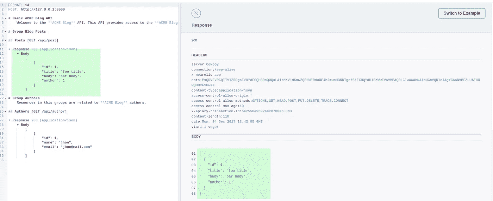

# 用 API 蓝图，Dredd 和 API 来编写和测试 API 规范

> 原文：<https://medium.com/hackernoon/writing-and-testing-api-specifications-with-api-blueprint-dreed-and-apiary-df138accce5a>


Photo by [Jantine Doornbos](https://unsplash.com/photos/HvYy5SEefC8?utm_source=unsplash&utm_medium=referral&utm_content=creditCopyText) on [Unsplash](https://unsplash.com/?utm_source=unsplash&utm_medium=referral&utm_content=creditCopyText)

在本文中，我们将学习如何使用 **API** [**蓝图**](https://hackernoon.com/tagged/blueprint) 创建 **API 的**规范，使用 **Dredd** 对后端实现运行自动化测试，以及如何使用**API**构建一个 [**API**](https://hackernoon.com/tagged/api) 原型，而无需编写一行代码。

> 在听到上一个关于 API 的播客后，我真的受到了启发。感谢丹尼尔·科尔伯恩和凯勒·波尔齐奥 T20 的出色工作。

通常，当我们开发 web 应用程序时，我们是基于一个定义好的视觉设计来做的，这个视觉设计告诉我们客户期望网站最终是什么样子。

与此同时，拥有产品的视觉效果会让客户对最终产品的质量有信心。

当我们开发 **API 的**时会发生什么？

可能是客户，给我们发了同样的设计，所以我们必须弄清楚如何将视觉设计转化成一个明亮、友好和有用的 API 规范，一个可以被其他开发者(网络、移动等)使用的 **API** 。)来构建一个与产品交互的用户界面。

所以，在最后，我们可能会一步一步地构建 API 的每个端点，而不考虑下一个，然后我们可以返回，修复一些东西并重复这个过程。

这种方法的问题是，当我们构建 API 的时候，我们有更高的责任，因为项目的这一部分将是业务的核心。
因此，它需要保持一致，我们必须尊重“契约”(规范)，因为我们在任何端点上所做的每一个更改，都可能意味着我们的 **API** 的每一个前端实现上的更多工作。

# 用 API 蓝图设计 API 规范



[https://apiblueprint.org/](https://apiblueprint.org/)

**API 蓝图**是一种针对 web API 的的高级 API 描述语言，允许我们使用简单的语法来设计我们的 **API** 。

这是一个简单的 **API** 规范的样子:

```
FORMAT: 1A
HOST: [http://127.0.0.1:8000](http://127.0.0.1:8000)# Basic ACME Blog APIWelcome to the **ACME Blog** API. This API provides access to the **ACME Blog** service.# Group Blog Posts## Posts [GET /api/post]+ Response 200 (application/json)

    + Body [
                {
                    "id": 1,
                    "title": "foo title",
                    "body": "bar body",
                    "author": 1
                }
            ]
```

但这不仅仅是一个普通的医生吗？

目前，是的，但是让我们看看如何使用其他工具来增加我们开发过程的价值。

# API 蓝图和 dredd



[https://github.com/apiaryio/dredd](https://github.com/apiaryio/dredd)

> Dredd 是一个语言无关的命令行工具，用于根据 API 的后端实现来验证 API 描述文档。

是的，你读得很好。Blueprint 不仅允许您编写您的 **API** 的文档/规范，而且它还可以作为一组测试来工作，这些测试可以由其他工具来执行，如“ **dredd** ，以检查每个端点是否都按预期工作。

## dredd 入门:

您需要做的第一件事是使用节点安装 dredd:

```
// Globally install
npm install -g dredd// Local install
npm install — save-dev dredd
```

现在我们可以开始创建我们的 **API** 规范，方法是在项目的根目录下创建一个***API-description . apib***文件( **apib** 代表 **API** 蓝图文件)。

```
FORMAT: 1A
HOST: [http://127.0.0.1:8000](http://127.0.0.1:8000)# Basic ACME Blog APIWelcome to the **ACME Blog** API. This API provides access to the **ACME Blog** service.# Group Blog Posts## Posts [GET /api/post]+ Response 200 (application/json)

    + Body [
                {
                    "id": 1,
                    "title": "foo title",
                    "body": "bar body",
                    "author": 1
                }
            ]# Group AuthorsResources in this groups are related to **ACME Blog** authors.## Authors [GET /api/author]+ Response 200 (application/json)

    + Body [
                {
                    "id": 1,
                    "name": "jhon",
                    "email": "[jhon@mail.com](mailto:jhon@mail.com)"
                }
            ]
```

让我们通过运行 ***dredd init*** 从命令行创建一个 dredd 配置文件。

```
$ dredd init
? Location of the API description document api-description.apib
? Command to start API backend server e.g. (bundle exec rails server)
? URL of tested API endpoint [http://127.0.0.1:8000](http://127.0.0.1:8000)
? Programming language of hooks php
? Do you want to use Apiary test inspector? No
? Dredd is best served with Continuous Integration. Create CircleCI config for Dredd? No
Configuration saved to dredd.yml
Install hooks handler and run Dredd test with:$ composer require ddelnano/dredd-hooks-phpdev
$ dredd
```

最后，我们应该有一个类似于下面的 ***dredd.yml*** 文件:

```
dry-run: nullhookfiles: nulllanguage: phpsandbox: falseserver: nullserver-wait: 3init: falsecustom: {}names: falseonly: []reporter: []output: []header: []sorted: falseuser: nullinline-errors: falsedetails: falsemethod: []color: truelevel: infotimestamp: falsesilent: falsepath: []hooks-worker-timeout: 5000hooks-worker-connect-timeout: 1500hooks-worker-connect-retry: 500hooks-worker-after-connect-wait: 100hooks-worker-term-timeout: 5000hooks-worker-term-retry: 500hooks-worker-handler-host: 127.0.0.1hooks-worker-handler-port: 61321config: ./dredd.ymlblueprint: api-description.apibendpoint: 'http://127.0.0.1:8000'
```

## 运行规格测试

记住，使用 **dredd** 和 **API 蓝图**的好处是，你可以将你的文档作为一组测试来检查你的 **API** 的后端实现。

这里有一些基本的东西:你正在测试你的 **API** 规范，这些是高级测试，它们甚至不关心你使用哪种编程语言来编写你的 **API** 。

要运行测试，只需在命令行上键入 ***dredd*** 并按回车键:

```
…
complete: 0 passing, 2 failing, 0 errors, 0 skipped, 2 total
complete: Tests took 96ms
```

当然，我们正在接收一个失败，因为我们还没有编写 **API** 的代码。在这种情况下，我使用的是 **Laravel** 所以，让我们通过编辑***api.php***routes 文件来创建一个快速实现。

```
Route::get('post', function () { *return* response()->json([ [ "id" => 1, "title" => "foo title", "body" => "bar body", "author" => 1 ] ]);});Route::get('author', function () { *return* response()->json([ [ "id" => 1, "name" => "jhon", "email" => "jhon@mail.com" ] ]);});
```

让我们再次执行 **dredd** 。

```
info: Configuration ‘./dredd.yml’ found, ignoring other arguments.
info: Beginning Dredd testing…
pass: GET (200) /api/post duration: 62ms
pass: GET (200) /api/author duration: 36ms
complete: 2 passing, 0 failing, 0 errors, 0 skipped, 2 total
complete: Tests took 103ms
```

现在我们可以看到输出是如何变化的，因为我们的 **API** 正在按预期工作。

# 使用养蜂场构建一个 **API** 原型

Apiary 是一个平台，它使用 API Blueprint 并帮助您生成文档、运行自动化测试、报告错误，甚至为您提供一个在不同环境中测试您的 **API** 的地方，就像您的生产应用程序一样。
此外，它将为您的 **API** 创建一个*模拟*，这样您就可以开始测试事件，而无需编写任何代码。

你需要做的第一件事是在[**【apiary.com】**](http://apiary.com)上创建一个账户，并将你的 [***GitHub***](http://github.com) 个人资料链接到这个账户。

然后，您可以使用 apiary 创建一个新项目。



并通过点击左上角的按钮将该项目链接到您的 GitHub 库之一。



点击“将此项目链接到 GitHub”。



并搜索特定的存储库。



最后，Apiary 将打开一个窗口来创建一个新的提交，该提交将把***apary . apib***文件添加到您的存储库中。



就是这样！

您已经准备好开始创建您的 **API 规范**文档和测试。因为**养蜂场**使用 **API 蓝图**，你也可以使用 **dredd** 运行你的本地测试。

关于**蜂场**的美妙之处在于，它给你一套开箱即用的工具，就像一个漂亮的文档界面。



如果你点击文档的任何标题，你将进入交互式面板。

然后，您可以选择环境来尝试任何端点


如果需要，您甚至可以在请求中添加表单参数或标题。
这是最好的部分，记住这是全新的，我们还没有构建 **API** 。



您可以选择**模拟服务器**选项并发送请求。Apiari 将模拟后端实现，并将返回您在文档中指定的任何内容作为响应。



这不是很好吗？现在你可以设计你的 **API** ，编写文档，多亏了**API**，团队的其他人可以开始使用被模仿的 **API** 编写前端实现，同时，你可以开始开发项目的后端。

当然，两个工具**养蜂场**和 **dredd** 都有更复杂的配置，您可以使用它们来更好地利用它们，并为您的开发过程带来更多价值。

我希望这篇文章能给你足够的背景知识，这样你就可以从基础开始使用这个工具，并继续开发更好的 API。

# 贡献和信用

感谢[凯莱布·波尔齐奥](https://twitter.com/calebporzio)和[杰夫·基尔罗伊](https://twitter.com/kilrizzy)对剪辑的帮助。

# 资源:

*   **API 快照 Testin 播客:**【http://twentypercent.fm/api-snapshot-testing 
*   [**酿酒**](https://twitter.com/driesvints) **—用养蜂场打造你的 API&Dredd—Laracon EU 2017:**[https://www.youtube.com/watch?v=bBxTGmF7kP4](https://www.youtube.com/watch?v=bBxTGmF7kP4)
*   **新增文件:**[https://dredd.readthedocs.io/en/latest/](https://dredd.readthedocs.io/en/latest/)
*   **阿皮亚网站:**[https://apiary.io/](https://apiary.io/)
*   **API 蓝图网址:【https://apiblueprint.org/】T22**

在推特上问好！！

[](https://twitter.com/Jeffer_8a) [## 杰夫(@杰夫 _8a) |推特

### 杰夫的最新推文(@Jeffer_8a)。我确实相信开源。每天努力学习新东西..#网络…

twitter.com](https://twitter.com/Jeffer_8a)