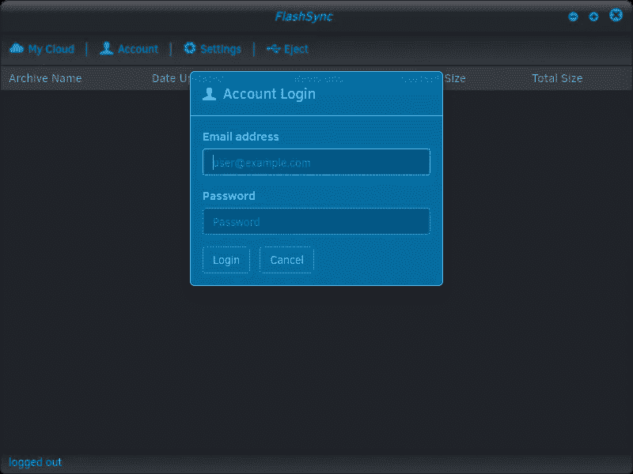

# 在 Node.js 中编写跨平台 C++比在 Node.js 之外更容易

> 原文：<https://medium.com/hackernoon/writing-cross-platform-c-is-easier-in-node-js-than-it-is-outside-of-node-js-a5c214f0cf10>

下次当您试图建立一个想要在 Linux/Windows/OSX 上编译的简单 C++项目时，请考虑一下这个问题。仅仅设置构建环境就是一项巨大的任务。哦，所以你想要一个图形用户界面？你将不得不使用一些疯狂的框架，比如 QT，或者更糟，自己编写 3 个本地 GUI APIs 的抽象。哦，你想在所有 3 个平台上使用相同的构建脚本？哈！

node-gyp 工具处理本机模块、编译、对 visual studio / GCC 的外壳、依赖项、二进制文件、句号。你所要做的就是写一个 bindings.gyp 文件，然后像没有明天一样写你的 C++代码(在任何你想要的 IDE 中)。就是这样。很简单。可以写一个巨大的 C++(或者 C！)为基础的 app，并且简单地使用 Node.js 作为你的跨平台构建工具。你甚至可以用 JavaScript 编写大部分应用程序，只用 C++编写一些关键的数据结构。如果你想要一个 GUI，你可以通过电子使用 HTML 5 / CSS3，并直接与你的 C++代码交互。这种特殊的方法甚至允许透明性和许多其他有趣的特性，这些特性在跨平台开发中很少见到:

An early-development image of FlashSync, a client-side encrypted cloud storage app which uses Electron to achieve cross-platform alpha-translucency and native shell integration on Linux/Windows/OSX. credit: https://durosoft.com

你可能无法设计出像 electronic 一样具有 GUI 功能的框架(你听说过 Chrome 吗，这是一件大事),所以这确实是最好中的最好——用于 GUI 的 HTML 5 / CSS3 / JavaScript，原生 shell 集成，以及通过 Node.js 和 V8 与跨平台 C++代码接口的能力。简而言之，如果你正在开发一个桌面应用，甚至是一个跨平台的 C++命令行实用程序或库，而你在 2017 年没有使用 Node.js 堆栈中的某个东西，那你就做错了。

对于外行来说，Electron 允许你使用 Chrome 和 Node.js 用 JavaScript 构建你的桌面应用，并生成原生二进制文件——这就是流行的 Atom IDE 的工作方式。更多信息见[https://electron.atom.io/](https://electron.atom.io/)。

构建跨平台 Node.js 原生模块的一般信息:
[https://blog . rising stack . com/writing-native-node-js-modules/](https://blog.risingstack.com/writing-native-node-js-modules/)

你会在这里找到一个跨平台 node.js 的列表:
[https://github.com/bcoe/awesome-cross-platform-nodejs](https://github.com/bcoe/awesome-cross-platform-nodejs)

玩得开心！

> [黑客中午](http://bit.ly/Hackernoon)是黑客如何开始他们的下午。我们是 [@AMI](http://bit.ly/atAMIatAMI) 家庭的一员。我们现在[接受投稿](http://bit.ly/hackernoonsubmission)，并乐意[讨论广告&赞助](mailto:partners@amipublications.com)机会。
> 
> 如果你喜欢这个故事，我们推荐你阅读我们的[最新科技故事](http://bit.ly/hackernoonlatestt)和[趋势科技故事](https://hackernoon.com/trending)。直到下一次，不要把世界的现实想当然！

