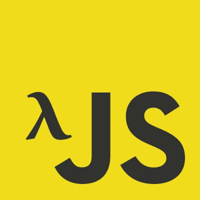

# 在没有第三方库的情况下编写函数式 javascript。

> 原文：<https://medium.com/hackernoon/writing-functional-javascript-without-a-3rd-party-library-b2fd7862d93c>

大约一年前，我和一些同事合作创建我们自己的函数，而不是使用库来减小包的大小。虽然有一个选择是使用[树摇动](https://webpack.js.org/guides/tree-shaking/)，但是我们认为我们可以通过去掉一些随之而来的脚手架和样板文件来进一步减少树摇动，并且我有一个非常想尝试的想法。这是一个关于我如何试验原生 Javascript 并把它翻转成一个更具功能性的范例的故事，我有一个大约 500 字节的功能性迷你库。

故事从一个场景开始，在我开车回家的路上，我想出了很多主意。当我在州际公路上行驶时，我想到了一个想法，*“如果我们创建一个对象，它只是在本质上使用已经存在的数组方法，但是它有 currying，并且可以使用 pipe 和 compose！”*

我的意思是，所有的通用函数都是广泛可用的——像*贴图*、*减少*、*过滤*等等。我真正想做的唯一一件事是以某种方式“借用”他们已经优化的功能，而不是重写它们。

我还发现，我们没有的、我真正想要并使其全部工作的唯一函数是`pipe`和`compose`——这将是我们的工具箱中真正唯一的“非本机”函数。

## 创建“白名单”

因为 Javascript 的`Array`对象有我需要的所有函数，我想我可以把它们取出来。为此，我从数组对象中创建了一个函数“白名单”:

```
*const* **whitelist** = ['concat', 'every', 'filter ', 'find ', 'includes', 'keys', 'map', 'reduce ', 'reduceRight', 'slice', 'some']
```

好吧！所以在仔细阅读了 MDN 文档，并且完全不介意浏览器兼容性*(至少现在还不介意！)*我试图“反转”(这里可能用错了术语)这些函数，这样它们就可以被*取悦*，这样你就可以用像`compose`或`pipe`这样的函数来处理它们

诀窍是创建一个新对象，并将数组的原型方法直接放在它上面。我想到的第一个名字是`Box`,灵感来自于布尔博士的关于理论家的系列文章

它还将使用来自`Array.prototype`的`getOwnPropertyNames`，查看在**原型**上是否有任何匹配白名单的方法，如果有，将它们作为`Box`对象的一部分。

这将允许*不受支持的*方法保持原样:`undefined`——所以如果有人想要使用这个对象，他们并没有得到任何真正新的东西，只是以不同的方式使用他们已经拥有的相同功能。如果你需要一些额外的浏览器支持，你可以添加 **polyfill** 和*，然后*添加`Box`——我认为这是一个很好的主意！

```
const Box = {}
Object
 .getOwnPropertyNames(Array.prototype)
 .filter(s => whitelist.includes(s))
 .forEach(method => {
 Box[method] = fn => a => a[method](fn)
 })
```

所以现在唯一剩下的事情就是添加管道和作曲:

(特别感谢[江武平·罗斯](https://medium.com/u/fd90c0774931?source=post_page-----b2fd7862d93c--------------------------------)写了这些有用的东西)

```
Box.compose = (...fns) => data => fns.reduce((value, fn) => fn(value), data)[0]
Box.pipe = (...fns) => data => fns.reverse().reduce((value, fn) => fn(value), data)module.exports = Box
```

好的，那么把这个功能强大的包放在一起，在一个大约 500 字节的很小的空间里，你有:

```
// Let's pluck these methods off of Array.prototype
const whitelist = ['concat', 'every', 'filter ', 'find ', 'includes', 'keys', 'map', 'reduce ', 'reduceRight', 'slice', 'some'] // We'll put them on a container Object
const Box = {} // So if any of the methods exist, we add them, if not, we just move on.
Object
  .getOwnPropertyNames(Array.prototype)
  .filter(s => whitelist.includes(s))
  .forEach(method => {
    Box[method] = fn => a => a[method](fn)
  }) // We'll create two functions that are our own for making things compositional
Box.compose = (...fns) => data => fns.reduce((value, fn) => fn(value), data)[0]
Box.pipe = (...fns) => data => fns.reverse().reduce((value, fn) => fn(value), data)module.exports = Box
```



Woah! That lambda right there means we are in functional territory!

相当酷！那么，如何使用组合和管道函数呢？

下面是一个使用 compose 的示例

```
compose(
  // 42
  reduce((acc, val) => val + acc),
  // [12, 14, 16]
  map(x => x * 2),
  // [6, 7, 8]
  filter(x => x > 5),
  // [0, 1, 2, 3, 4, 5, 6, 7, 8],
  concat([6, 7, 8])
  // [0, 1, 2, 3, 4, 5]
)([1, 2, 3, 4, 5])
```

这个人为的例子创建了一个函数，我们将一个数组[1，2，3，4，5]传递给它。然后，该函数从右向左传递参数(就像 compose 工作时一样)，结果是 42:)

如果我们想从左向右读，我们可以使用管道:

```
pipe(
  map(x => x + 1),
  // [1]
  map(x => x + 1),
  // [2]
  map(x => x + 1),
  // [3]
)([0])
```

像 compose 方法一样，这个 pipe 方法创建一个函数，它接受参数`[0]`，然后从左到右通过管道传递，传递过程中递增 1。

你可以用这个做一些更好的事情，你不一定需要使用管道和合成，你可以做一个叫做`addTwo`的函数，它基本上是一个 curried 函数，增加两个参数，同样使用我们的函数化数组方法:

```
const arrayOne = [1, 2, 3];
const addTwo = concat([4, 5])
const result = (addTwo(arrayOne))console.log(result)
// [1, 2, 3, 4, 5]
```

我希望有人会觉得这很有用，因为你真的可以不用库用 javascript 进行函数式编程！

也就是说，库给了你额外的功能和向后兼容的支持。你甚至可以使用树抖动来减少 bundlesize，所以我不能说够了，如果你想使用一个库，请这样做。但是，你可能会觉得这很有趣！

[我们最终把这个实验变成了一个库，](https://github.com/trainyard/pico-lambda)并且反复了很多次，修复了错误等等。我们还增加了字符串支持。我们最终得到的库叫做 pico-lambda，看看吧(尤其是它的源代码，它很小！)，它也有大量的单元测试，并且它们也在主流浏览器的 browserstack 中运行。

该说的都说了，该做的都做了，我们解决了边缘情况，修复了错误，添加了字符串，我们最终得到了一个稍微大一点的“盒子”

```
Object
  .getOwnPropertyNames(Array.prototype)
  .reduce((lambda, method) => {
    lambda[method] = (~['concat', 'every', 'filter', 'find', 'findIndex', 'includes', 'join', 'map', 'reduce', 'reduceRight', 'slice', 'some'].indexOf(method))
        ? (fn, ...params) => arr => arr[method](fn, ...params)
        : (~['sort', 'copyWithin', 'fill'].indexOf(method))
            ? (...params) => arr => [...arr][method](...params)
            : (~['toLocaleString', 'indexOf', 'lastIndexOf'].indexOf(method))
              ? (...params) => arr => arr[method](...params)
              : (~['push', 'splice'].indexOf(method))
                ? (...params) => arr => { var t = [...arr]; t[method](...params); return t; }
                : (~['toString', 'entries', 'keys'].indexOf(method))
                  ? arr => arr[method]()
                  : lambda[method];
[...full source here](https://github.com/trainyard/pico-lambda/blob/master/src/index.js)
```

*感谢阅读，如果你喜欢，请鼓掌并跟我来。如果你想分享你的想法或有任何问题，也请留下你的评论！*

❤