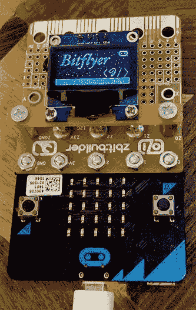

# 为微处理器写第二个视频游戏:生锈的钻头

> 原文：<https://medium.com/hackernoon/writing-the-second-video-game-for-the-micro-bit-in-rust-3cd8b5ab22d3>

我最近发表了一个关于 [bitflyer 的故事，这是 BBC micro:bit](https://hackernoon.com/the-first-video-game-on-the-bbc-micro-bit-probably-4175fab44da8) 的一个简单游戏。

在它的背面， [@ZbitConnect](https://twitter.com/ZbitConnect) 的开发者 Zbit 先生取得了联系，并友好地发来了他的一些电路板让他玩。

这些板使得给 micro:bit 添加不同的附件变得很简单，并且被聪明地[设计成](https://hackernoon.com/tagged/designed)可以链接。

它们的工作原理是将一块(我认为)导电弹性体夹在各种电路板的触点之间。橡胶需要一定的压力来连接，因此所有的螺丝和螺栓。

基本的 zbit:builder 提供了许多标准的通孔连接来焊接东西，但创造者也在开发其他几个做不同事情的板，包括一个[扬声器板](http://www.nevilhunt.com/zbit-connect/zbitspeaker.html)。

我掸掉 [bitflyer](https://hackernoon.com/tagged/bitflyer) 代码，加载进去，第一次就成功了。大约 30 秒。在它耗尽内存，整个系统崩溃之前。经过几个小时的代码层，剥离任何可以去的东西，修剪东西，我放弃了，并决定采用一种更激进的方法:Rust。

## TL；博士；医生

## 为什么[会生锈](https://www.rust-lang.org/)？

在我考虑的语言中，Rust 最有意义。列表大概是这样的:

*   **C** :代码行太多
*   **C++** :太过时了
*   **Python** :太内存
*   走:太基础了——我为语言中缺乏句法糖而挣扎
*   **Java** :太 Java 了
*   …
*   Rust:新的、闪亮的、针对系统级编程的

## 锌

选择了 rust 之后，我必须想办法让 Rust 在嵌入式主板上运行。幸运的是，有一个项目可以做到这一点:锌。

锌的目标是一个项目，生产编译后的 rust 二进制文件，可以直接在计算机上运行，无需操作系统的帮助(裸机)。该项目支持许多 ARM 芯片/嵌入式板，但不支持 micro:bit nrf51822(还没有！).

它提供了一个很好的入门平台，提供了示例，以及一个名为`xargo`的构建工具来处理链接和组织。它们有一个轻量级的 HAL 模块和宏来帮助电路板配置。

## hal/nrf51822

如前所述，zinc 有一些很好的宏来配置对各种东西的安全访问，包括外围设备访问。

这些芯片通常允许访问它们不同的系统(I/O、RNG、时钟等..)通过读取和写入魔术存储器位置。

以下代码片段显示了 micro:bit 的 GPIO 引脚定义:

然后可用于控制 GPIO 引脚:

我花了很长时间研究诸如中断处理之类的东西是如何工作的，以及外围设备控制的微妙之处(结果是 micro:bit 实际上没有 systick 中断，文档也没有完全弄清楚这一点！).但是一旦我理解了细节，以及如何用 zinc 宏来表达它们，实现就非常简单直接了。

## 音乐

Zbit 先生还送来了一块板子，上面有一个微型扬声器和放大器。扬声器连接到一个 gpio 引脚，允许它播放非常基本的方波声音。

中断向量总是让我有点害怕，所以这样做是一个很好的学习练习。ARM 芯片通常有一个函数指针表，保存在内存中的一个已知位置，当中断触发时，芯片保存所有 CPU 状态，并跳转到该表中相应条目所指向的地址。中断函数返回后，状态恢复，一切照常继续。

这个生锈了看起来怎么样？

最困难的部分是计算出中断表的确切顺序/偏移量。一旦完成，我的 isr_rtc0 函数就会每隔几毫秒被调用一次。

剩下的只是将 MIDI 文件转换成一个频率和时间的 rust 数组，并编写一个简单的函数以正确的速度切换 GPIO 1 来制作音符。

## 代码

代码不是很干净，应该被整理/显著重构(因此不会被推到上游)。但可能在这里找到:

[https://github . com/stestagg/zinc/tree/bit flyer/examples/bit flyer](https://github.com/stestagg/zinc/tree/bitflyer/examples/bitflyer)

## 关于铁锈的思考

我真的很喜欢用 Rust 写这个。在裸机上编程意味着我被迫对`unsafe`有点漫不经心(对工作来说，这本来可以减少)，并且所有事情都发生在芯片上，几乎没有反馈(扬声器&显示器都严格地只写)，我不必过多地处理选项。共享全局状态避免了所有权的复杂性(这种芯片永远不会在多任务处理方面做太多)

鉴于我能够避免上面提到的许多痛点，并且每晚运行给宏提供了提供良好抽象的能力，代码变得有趣，使用起来也很愉快。

当然，速度和内存使用比 Python 快得多，并且(有时被迫)查看和遍历生成的程序集，零成本抽象的真正价值变得非常明显。

> [黑客中午](http://bit.ly/Hackernoon)是黑客如何开始他们的下午。我们是 [@AMI](http://bit.ly/atAMIatAMI) 家庭的一员。我们现在[接受投稿](http://bit.ly/hackernoonsubmission)并乐意[讨论广告&赞助](mailto:partners@amipublications.com)机会。
> 
> 如果你喜欢这个故事，我们推荐你阅读我们的[最新科技故事](http://bit.ly/hackernoonlatestt)和[趋势科技故事](https://hackernoon.com/trending)。直到下一次，不要把世界的现实想当然！

