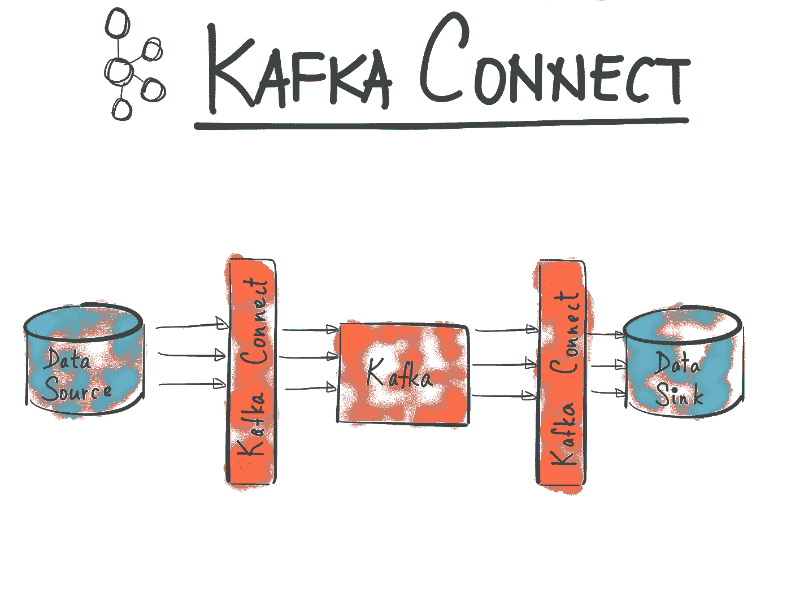
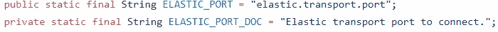
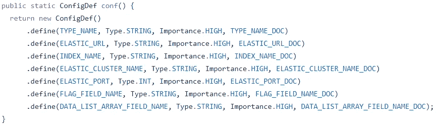
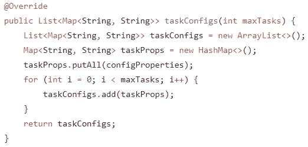
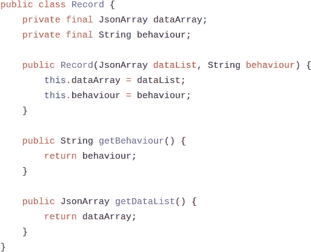
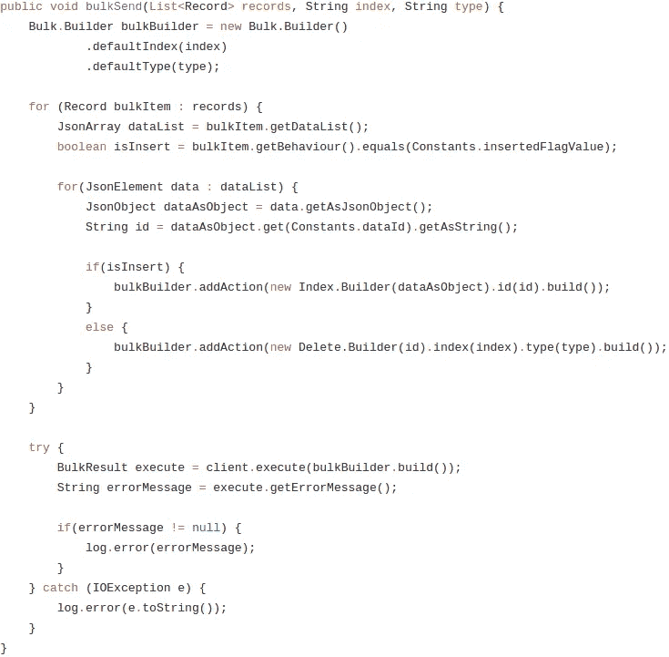

# 为你的 Kafka 栈编写你自己的接收器连接器

> 原文：<https://medium.com/hackernoon/writing-your-own-sink-connector-for-your-kafka-stack-fa7a7bc201ea>

The image from [here.](https://www.confluent.io/blog/announcing-kafka-connect-building-large-scale-low-latency-data-pipelines/)

您的系统可能没有 Kafka 接口，或者现有的接口可能不符合您的要求。在这两种情况下，您都必须编写自己的 Kafka 连接器，并且没有太多关于它的在线资源。我会试着写下我的冒险经历来帮助其他遭受同样痛苦的人。

下面是我的例子:我想从 Kafka 主题中读取数据，如果数据的状态字段中有“insert”标志，则将它们写入弹性索引，如果状态为“delete ”,则将它们删除。我知道我不能使用官方或任何其他开源弹性接收器连接器，因为它们有一个通用的行为选项，不依赖于数据，而是连接器配置。

对于本地开发和测试，我使用了 [Landoop 的快速数据开发项目](https://github.com/Landoop/fast-data-dev)，因为它在一个 docker 容器中包含了 Zookeeper、Kafka、Connect 和足够的 UI 工具。

## 做好准备

如果您想编写自己的源或接收器连接器，您必须使用 Java，因为我们的主要想法是从我们的项目中创建一些 jar，这些 jar 将成为我们本地 Kafka Connect 集群的插件，或独立服务器。所以，确保你有 JDK 在你的本地。我使用 IntelliJ IDEA 是因为我是 JetBrains 的粉丝。

## 使用自定义 Connect Maven 原型创建您的项目

你的项目有一个 [maven 原型](https://maven.apache.org/guides/introduction/introduction-to-archetypes.html)，包括一堆框架类。为了通过 IntelliJ 使用它，您可以在创建新项目时添加它。这里是它的 [Github 库。](https://github.com/jcustenborder/kafka-connect-archtype)

Not forget to use the latest version. [Check it out from its repo.](https://github.com/jcustenborder/kafka-connect-archtype)

## 我们要建造什么？

正如我所说的，我们将创建一个定制的弹性接收器连接器，它将根据主题数据进行操作。我将解释这个项目最重要的部分，请[克隆我的库](https://github.com/skynyrd/kafka-connect-elastic-sink)来捕捉下面的片段。

## ElasticSinkConnectorConfig.java

您将使用这个类来获取配置属性，它是一个非常简单的类。首先，您应该定义您的配置元素，例如:

[Link to source](https://github.com/skynyrd/kafka-connect-elastic-sink/blob/master/src/main/java/com/skynyrd/kafka/ElasticSinkConnectorConfig.java)

是将用于我们的弹性传输客户端的配置属性，或者您可以说是弹性驱动程序。`ELASTIC_PORT_DOC`是被`ConfigDef`静态方法使用的解释属性。

`ConfigDef`是 kafka 公共包中的一个方法，我们在这里绑定了我们所有的属性:

[Link to source](https://github.com/skynyrd/kafka-connect-elastic-sink/blob/master/src/main/java/com/skynyrd/kafka/ElasticSinkConnectorConfig.java)

文件的其余部分包括属性的 getters 和 setters，这里并不复杂。

## ElasticSinkConnector.java

如果您在从一个主题开始消费或停止连接器时有事情要做，这是您应该实现的类。

只是检查一下方法:

*   `version()`返回连接器的版本，
*   `start()`从`connector.properties`获取配置，并将它们传递给我们上面讨论过的`ElasticSinkConnectorConfig`类，
*   `taskClass()`返回执行实际工作的类——从主题和流程中获取数据。(我们马上就要谈到这一点)，
*   `stop()`是你的连接器的一种拆卸功能，
*   `config()`为我们返回配置类— `ElasticSinkConnectorConfig`，

而`taskConfigs()`是给你的任务。我们已经将配置分配给这里的所有任务:(顺便说一下，你应该从 worker 配置中给 *tasks.max* 属性，这里的[是它应该有的值)](https://stackoverflow.com/a/42030617)

By the way, I still could not realized how many task should be set for an optimal configuration.. [Link to source](https://github.com/skynyrd/kafka-connect-elastic-sink/blob/master/src/main/java/com/skynyrd/kafka/ElasticSinkConnector.java)

## ElasticSinkTask.java

这是你从已配置的主题中获取数据的类，在`start()`方法中，我创建了一个`ElasticServiceImpl`的实例，我没有使用任何依赖注入策略，因为测试插件覆盖方法非常困难，并且需要某种[反腐败层](https://softwareengineering.stackexchange.com/questions/184464/what-is-an-anti-corruption-layer-and-how-is-it-used)。出于这个原因，当我在`put()`方法中获得数据时，我在稍加修改后直接将其发送给`ElasticServiceImpl`并测试我的服务，而不是`ElasticSinkTask`类。在弹性服务的构造函数中，我将`null`作为`ElasticClient`传递，因为我将在测试类中传递它。于是，我的主处理类就变成了`ElasticServiceImpl`了。

具有讽刺意味的是，我还没有编写任何测试类，我将实现它们。

这个类最重要的事情是你应该小心使用`put()`方法，因为 Kafka Connect 在这个方法中提交数据偏移。因此，这里应该进行适当的错误处理。

## ElasticServiceImpl.java

在构造函数中，我们在创建`ElasticClient`的实例之前设置了`JsonConverter`和`Gson`序列化器。

在`process()`方法中，我将记录字符串转换为`Record`数据类型，因为它更具可读性和可处理性。

Topic message representation. [Link to source](https://github.com/skynyrd/kafka-connect-elastic-sink/blob/master/src/main/java/com/skynyrd/kafka/Record.java)

玩了一些`Gson`的方法把`string` s 转换成`Record` s 后，就准备送弹性了。

## ElasticClientImpl.java

作为一个弹性客户端，我首先尝试使用[传输客户端](https://www.elastic.co/guide/en/elasticsearch/client/java-api/5.4/transport-client.html)，因为它像另一个节点一样连接到您的弹性集群，并且[批量索引](https://www.elastic.co/blog/benchmarking-rest-client-transport-client)比`http`协议稍微快一点。然而，我遇到了一个错误，却找不到任何解决方法，[甚至我问了 StackOverflow](https://stackoverflow.com/questions/46179241/nosuchmethoderror-when-constructing-prebuilttransportclient-for-elastic) 。我认为这可能与`fast-data-dev` 容器，或者`docker`网络配置等有关。然后我切换到 [Jest 客户端](https://github.com/searchbox-io/Jest)，因为`http`协议性能也与我上面提到的同一篇文章密切相关。

在`bulkSend()`方法中，我们简单地将`dataList`中的每个数据添加到`Bulk`中，如果`Record`的`behavior`为`insert`，则添加索引请求，否则将删除请求附加到`Bulk`。

如果出现任何错误，我们会将其发送给 Elastic 并记录下来:

[Link to source](https://github.com/skynyrd/kafka-connect-elastic-sink/blob/master/src/main/java/com/skynyrd/kafka/client/ElasticClientImpl.java)

## 结论

总之，如果我们的系统没有社区实现，我们必须编写自己的接收器或源连接器。也可以有现成的连接器，但你可能需要改变其行为。

这个过程中最具挑战性的部分是测试您的连接器。你实现的是你的连接集群的某种插件，它不是一个独立的应用程序。编写单元测试很棘手，因为你覆盖了 Kafka Connect 包的方法，并且需要某种反腐败层。调试也相当困难。

您可以使用我编写的`docker-compose`文件并按照[我的库](https://github.com/skynyrd/kafka-connect-elastic-sink)中的步骤来测试连接器。

谢谢，

有时候我会发一些有用的信息: [@_skynyrd](https://twitter.com/_skynyrd)

我用过的有用资源:

*   https://docs.confluent.io/current/connect/devguide.html
*   [夏羽·马瑞克的 Udemy 课程](https://www.udemy.com/kafka-streams/)。