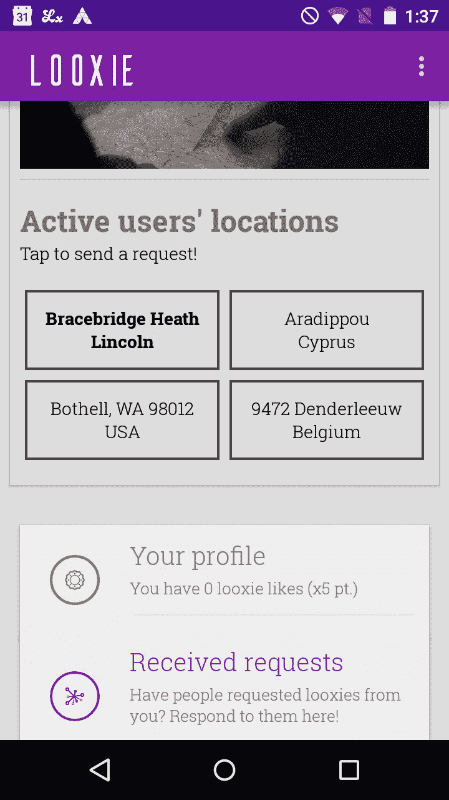
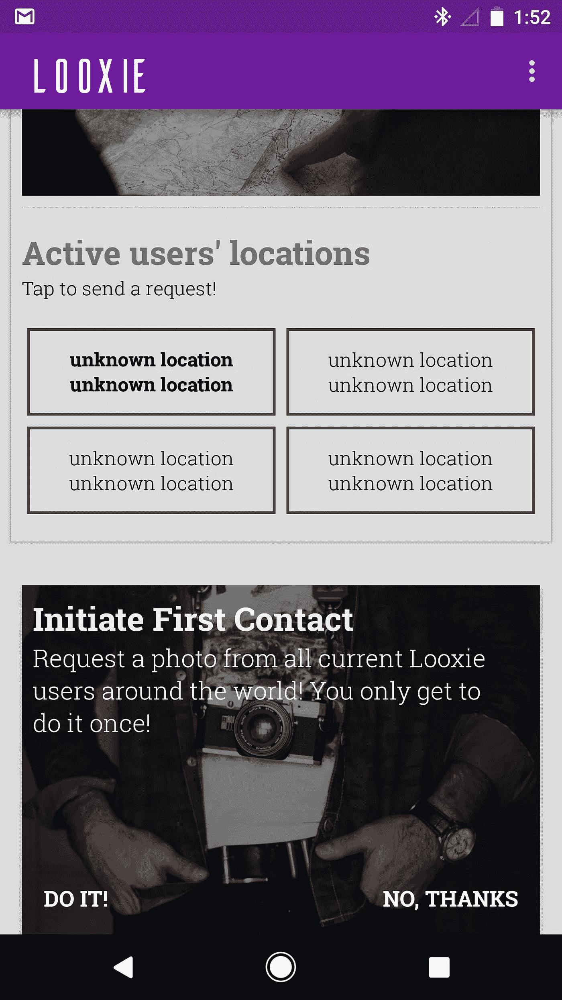

# WTF，安卓 SDK？→第三部分:地理编码器失语症

> 原文：<https://medium.com/hackernoon/wtf-android-sdk-part-iii-geocoder-aphasia-3bb8b9b6016b>


“Oh shit, not again!”

## 或者它是如何停止工作的，你对此无能为力

因此，情况是这样的:您希望获得一组坐标(纬度和经度)的可读地址，这些坐标是您刚刚使用 LocationManager API 或 FusedLocation API 检索的。

Stack Overflow 上的一个好心的陌生人……是啊，不是——Stack Overflow 上的一个彻头彻尾的鸡巴洞让你在编辑、锁定然后删除你的帖子之前应该使用 Android 的 Geocoder API，这是一个惊人的 Neckbeard 能力展示，他妈的是啊。

毫不担心，你谷歌“地理编码器”，并决定使用它来获得你的坐标地址。很快，您发现 Geocoder 有一个名为 **getFromLocation()** 的方法，它返回一组坐标的地址列表。正是医生吩咐的！

```
List<Address> addresses = new ArrayList<Address>(); 
Geocoder geocoder = new Geocoder(this, Locale.getDefault()); try { 
         addresses = geocoder.**getFromLocation**(latitude, longitude, 1); 
   } catch (IOException e) { e.printStackTrace(); }
```

getFromLocation()中传递的第三个参数是您希望获得的最大结果数，在本例中为 1。

你让这个方法完成它的工作(警告:这需要一个互联网连接，它发生在 UI 线程上，你已经被警告过了)，如果你幸运的话，它一返回你就得到一个列表

和一个结果。然后从地址对象中提取地址

```
String city = “unknown location”; 
String country = “unknown location”; 
String address = “unknown address”; try {      city = addresses.get(0).getAddressLine(1); 
     country = addresses.get(0).getAddressLine(2); 
     address = addresses.get(0).getAddressLine(0);     } catch (Exception e) { city = “unknown location”; 
     country = “unknown location”; 
     address = “unknown address”; }
```

有时，当调用 getAddressLine()方法时，您会得到一个空值，因此您必须进行通常的尽职调查。

到目前为止，一切顺利。没有你没见过的。现在，让我引用一下 [Geocoder 的官方文档](https://developer.android.com/reference/android/location/Geocoder.html)

> Geocoder 类需要一个不包含在核心 android 框架中的后端服务。

这很有意义(尽管他们忘了大写“Android ”,这导致我的 IBS 再次爆发),因为查找自然会在线发生。

现在，我挑战你去 Geocoder 的文档页面，找到任何提到的关于你可以调用 Geocoder 后端服务的次数的限制。来吧，我谅你也不敢。

剧透警告:你将一无所获。官方文件中没有提到这个事实。

这不是开玩笑。在对 Geocoder 后端服务进行一定次数的调用后(或者一定的调用频率或其他——这是关键:没有人知道),返回的 Address 对象的每个地址行将包含 null。

在 logcat 中，您不会得到任何有关这方面的警告。你不会收到一封电子邮件告诉你已经超过了某个限度，你肯定也不会有一个谷歌工程师打电话给你，以确保你没事，如果你想喝点茶。

不，你的应用程序会从这个样子



…变成这样



也就是说，如果您已经很好地处理了空值。如果你还没有，祝你好运向你愤怒的用户解释什么是 npe。

眼尖的读者可能已经注意到，这两张截图来自不同的设备:一张来自 2013 款 Moto G，另一张分别来自 Pixel XL。两次通话相隔几分钟，在同一个 Wi-Fi 网络上进行，这似乎表明对地理编码器通话的限制是基于每个设备的。

搜了一下网页，偶然发现了这个[栈溢出问题](https://stackoverflow.com/questions/8218764/android-geocoder-quota-limits)(抱歉之前对你那么凶，所以，是因为我爱你)。在有人就此联系了开发者支持之后，这是谷歌支持对此事的回应

> **这个 API 是为客户端应用程序的合理使用而设计的。它被积极地监控滥用情况(例如，每秒的请求数)，但是您所描述的用例应该没有任何问题。**

我不想听起来像一个爱发牢骚的婴儿，但是谷歌的开发者支持真的认为“合理使用”是一个合理的答案吗？而具体是什么构成了*虐*？

这种事情不应该在类文档中提及吗？

> 这可能会让你的应用瞬间变得一团糟，但你在文档中没有提到限制，没有提到滥用，也没有提到你的通话被监听。相反，在没有任何警告的情况下，您只是被阻止获取任何有用的数据。

WTF，安卓 SDK？