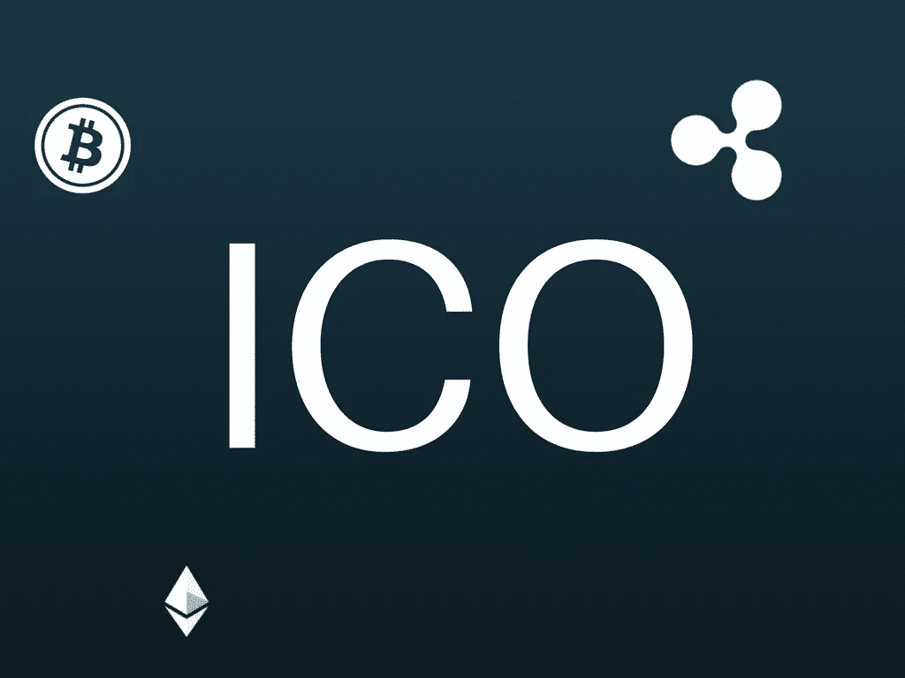

# WTF 是首发币发售(ICO)？

> 原文：<https://medium.com/hackernoon/wtf-is-an-initial-coin-offering-ico-8b03b18b0bd0>

## 另一个不到 700 字的年度流行语

[区块链](https://hackernoon.com/tagged/blockchain)、[比特币](https://hackernoon.com/tagged/bitcoin)、AI、ML、大数据已经成为 Twitter 上使用频率最高的词汇。

最新加入这一潮流的是 ICO，即首次发行硬币。

这是我试图破译这种病毒现象。

这是:—

我们都知道，对于许多企业家来说，融资是一项相当困难的任务。如果你不住在旧金山湾区，那就要困难十倍。

总的来说，

> 筹款就像打扑克。这不是精英主义。

你需要人脉、良好的网络沟通技巧、良好的媒体形象、一些真正的运气，还要参加一堆会议来完成一轮融资，想想看，这是非常低效的。

公司的创始人不得不把所有的事情都放在筹款上。所以，这在某种程度上也伤害了公司。

## 这就是筹款 1.0

然后，像 [Kickstarter](http://Kickstarter.com) 、 [Indiegogo](http://Indiegogo.com) 这样的众筹平台时代到来了，它们有些精英化，但也有一系列缺点。

劣势包括平台获得总资金的 5-10%，初创公司的困难**较少的社交媒体和公关存在**。

## 这就是筹款 2.0

现在是 ico 时代，即首次发行硬币，这是筹款 3.0

我知道你已经阅读了很多关于 ico 的解释文章，所以我在这里尝试采用一种不同的方法。

假设你是一家超级酷的初创公司的首席执行官，该公司开发了一款名为 XYZ 的应用，这款应用是招聘的利器。过去几个月，你的应用在市场上获得了一些真正的吸引力，现在你正在寻求筹集一些资金，以加速你的增长和雇佣更多的劳动力。你可以去找风投、天使投资人，或者在 Kickstarter 上发起一场运动，这可能会很艰难。另一个选择是 ICO。

我并不是说 ico 不好对付。他们是。你需要向世界证明你的可信度，你可以兑现你在白皮书中所说的话。关于白皮书，它就像你的宣传资料，以网页的形式展示你的详细信息，如你的每日活跃用户、收入、用户获取策略、你打算如何使用这些钱等。在所有有兴趣参与你的 ICO 的人面前。

举例来说，你可以看看流行的消息应用 Kik 的白皮书，Kik 正在做其加密货币亲戚[的 ICO。](https://kin.kik.com/papers/Kin_Whitepaper_V1_English.pdf?ver=3)

现在，回到招聘网站 Tinder 的首席执行官。看，ico 字面上的意思是你把一种新的加密货币带入市场。

让我们称我们的加密货币为 TCoin。

现在，你如何设置它？

目前，最流行的方法是通过以太坊建立一个新的硬币/令牌，然后将它分发给你的 ICO 中的人，以换取比特币和以太坊等货币，为你的项目筹集资金。

理想情况下，硬币/代币应该在你的应用程序中有一些价值，但从技术上来说，这是一种选择。当我说你的应用程序内部的一些价值时，我的意思是用户可以使用 Tcoins 来购买你的应用程序内部的高级服务等等。

接下来发生的是，在 ICO 完成后，目标通常是让令牌在尽可能多的大交易所上市，让错过 ICO 的其他人以后可以购买。需求越多，你公司的价格和估值就越高。

## 这就是筹款 3.0。

ICOs 的反应褒贬不一。企业家们对此表示欢迎，但其他方面对这些规定提出了一些担忧。

在最近举行的 Filecoin ICO 展会上，顶级风险投资公司如[红杉资本](https://www.sequoiacap.com/)和[安德里森·霍洛维茨](https://a16z.com/)参与其中，表明了他们一方的积极反应(或者可能是在试水)。ICOs 在中国被禁也有不少坏消息。

但是，在我们能够判断 ICOs 之前，我们还有很长的路要走。

现在，用鼓掌按钮来表达你的爱吧。都是你的:)