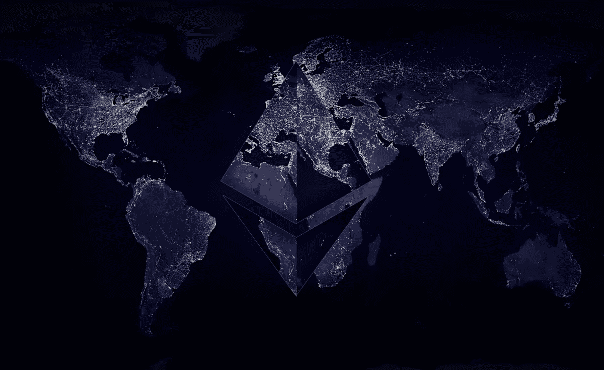
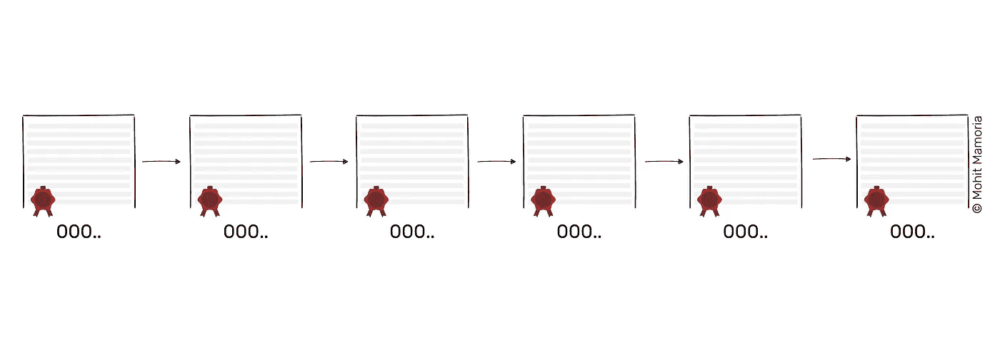
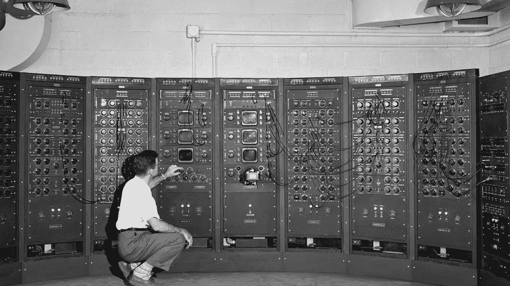
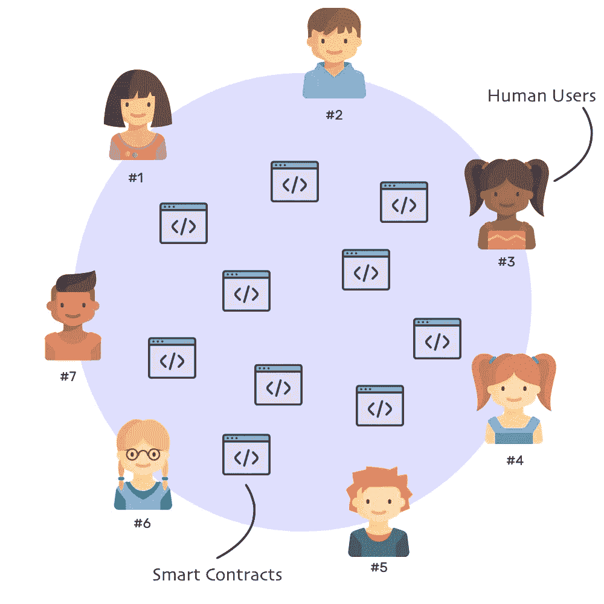
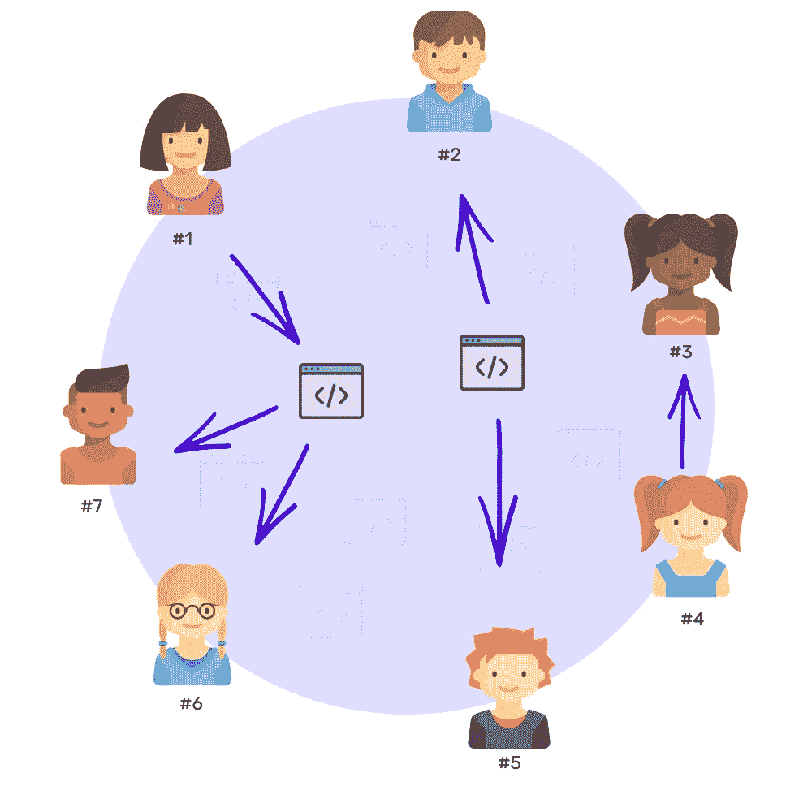
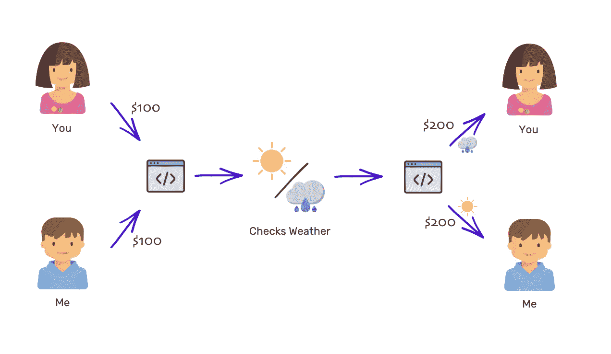
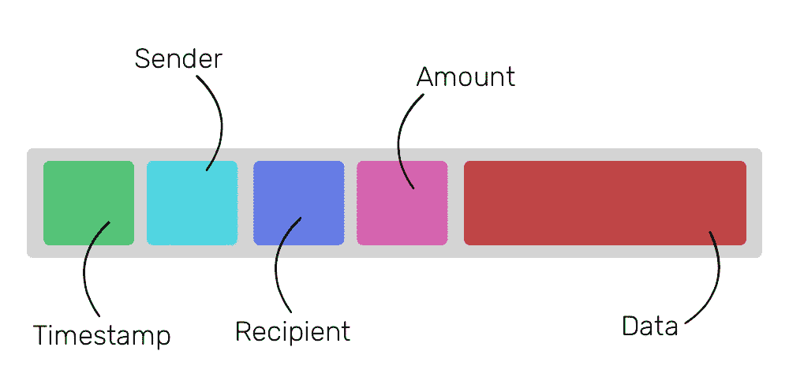
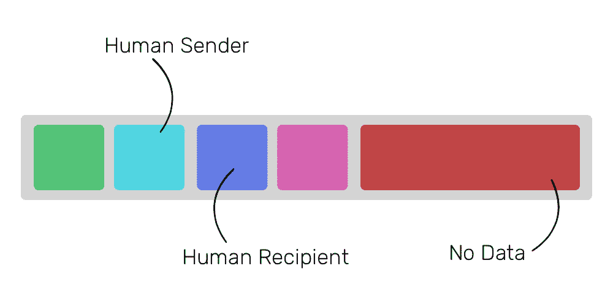
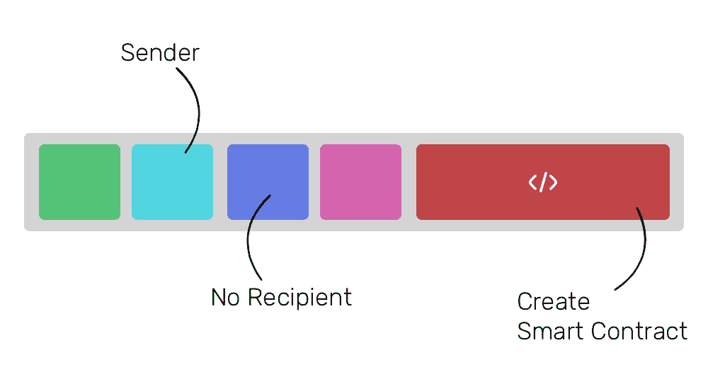
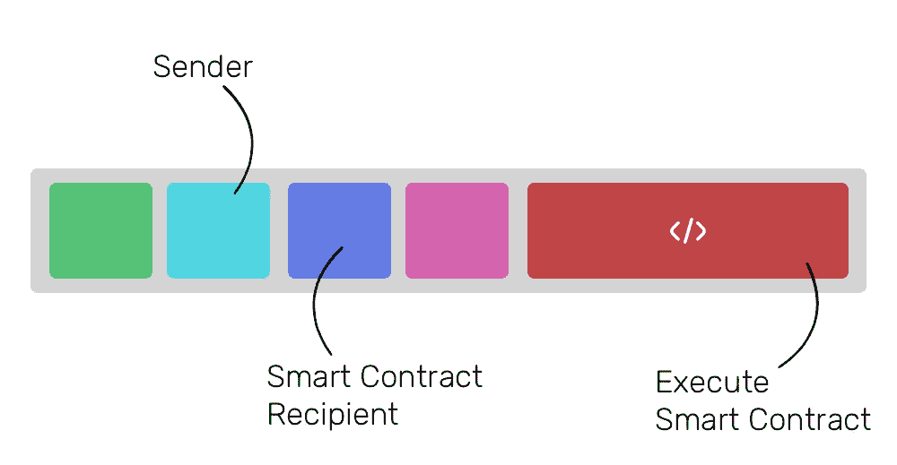

# WTF 是以太坊？

> 原文：<https://medium.com/hackernoon/wtf-is-ethereum-c65e0d67ac09>

## 理解以太坊为何不仅仅是另一种加密货币的终极指南。

A **虽然“比特币”和“以太坊”是经常搭配在一起的术语**，但事实是它们有很大的不同。以太坊与比特币唯一的共同点是，它是一种运行在区块链之上的加密资产。

以太坊不仅仅是一种像比特币一样的加密货币，它还具有一些功能，这些功能有效地使其成为一台巨大的分散式计算机。

为了理解[以太坊](https://www.ethereum.org/)，人们必须了解区块链是如何工作的。如果你已经理解了，或者已经阅读了我的[理解区块链](https://hackernoon.com/wtf-is-the-blockchain-1da89ba19348)的终极指南，请随意直接进入下一部分。

> 顺便说一下，我是每周时事通讯 [Unmade](https://unmade.email) 的负责人，它将一个来自未来的想法发送到你的收件箱。

# 什么是区块链？

**区块链，简单来说，就是一个数据库。**这是一个不断增长的特定类型数据的数据库，具有非常显著的特性:

1.  数据一旦存储在数据库中，就不能被修改或删除。区块链上的每一项记录都是永久的。
2.  没有任何个人或组织维护数据库；几千个人有，每个人都有一份数据库的拷贝。

为了理解几个人如何能够保持他们的数据库副本与其他人同步，假设在一个网络中有十个人。每个人面前都放着一个空文件夹和一页纸。每当任何人在网络中做了重要的事情，比如转账，他们就向网络中的每个人宣布。

每个人都在自己的页面上记下公告，直到页面被填满。当它出现时，每个人都必须通过解决一个数学难题来密封页面的内容。解决这个数学难题可以确保每个人的页面都有相同的内容，并且永远不会被修改。无论谁先做，都会得到一定数量的加密货币作为奖励。

**注:**想知道流程到底是怎么进行的？阅读[了解区块链的终极指南](https://hackernoon.com/wtf-is-the-blockchain-1da89ba19348)。

一旦该页被密封，该页被添加到文件夹中，一个新的一页被带出，这个过程永远继续下去。

Blockchain

久而久之，这些包含重要记录(事务)的页面(块)被添加到文件夹(链)，从而形成数据库(区块链)。

# 区块链商店卖什么？

区块链可以用来存储任何类型的数据，区块链存储的数据类型赋予了它价值。因此，比特币的区块链存储金融交易记录，使其类似于美元或英镑等货币。除了美元的作用，比特币没有其他用途。以太坊不一样。

以太坊不仅仅是一种像美元、英镑或比特币一样的货币。以太坊的目的不仅仅是作为一种货币。以太坊是这样的:

以太坊基本上就是一个巨大的计算机！然而，它非常慢——比现在的普通计算机慢 5 到 100 倍——而且非常昂贵。这台“以太坊电脑”的功率大约相当于一部罕见的 [90 年代智能手机](http://www.businessinsider.in/The-worlds-first-smartphone-Simon-was-created-15-years-before-the-iPhone/articleshow/47665223.cms)；所以除了一些非常琐碎的事情，它真的做不了太多。

这听起来并不令人印象深刻，那么为什么以太坊有这么多的炒作呢？嗯，这真是个好问题。以太坊正在席卷全球，因为它是一台完全分散的计算机，分布在全球各地。理解以太坊的区块链如何工作将揭示它如何像一台世界计算机一样工作。

# 以太坊是如何运作的？

**像任何其他区块链一样，以太坊需要几千人在他们的电脑上运行一个软件来驱动网络。网络中的每个节点(计算机)都运行着一种叫做以太坊虚拟机(EVM)的东西。可以把 EVM 想象成一个操作系统，它理解并执行用以太坊专用编程语言编写的软件。以太坊虚拟机执行的软件/应用程序被称为“智能合约”**

要在这台世界计算机上完成任何事情，你都需要付出代价。然而，你不用美元或英镑等常规货币支付。取而代之的是，所有东西都必须用一种网络固有的加密货币来支付，这种货币叫做以太。以太和比特币完全一样，只是它也可以用来支付在以太坊上执行智能合约。

人类和智能合约都被视为以太坊的用户。无论人类用户能做什么，智能合约也能做，甚至更多。

智能合约的行为与网络中的任何其他人类用户完全一样。它们都可以像其他货币一样发送和接收以太。

但与人类用户不同，智能合约还可以执行预定义的计算机程序，在被触发时执行各种动作。为了理解智能合约的威力，让我们考虑一个例子。

# 智能合同的力量

想象你和我打赌明天的天气。我打赌明天会是晴天，而你打赌会下雨。我们同意输的一方必须给赢的一方 100 美元。我们如何做到这一点，并确保输家将遵守他的承诺？我可以想到三种不同的方式:

## 1.互相信任

做到这一点最简单的方法就是相互信任。如果我们已经是很长时间的朋友了，相信对方是很容易的。我知道你住在哪里，你也知道我所有的糗事。但是如果我们是完全陌生的人，事情会变得更加困难。你没有理由相信我，我也没有理由相信你。

## 2.签署法律协议

另一个看似合理的方法是把我们的赌注制定成一个法律协议。我们双方将签署一份协议，详细定义我们打赌的所有条款——包括如果输家违反协议会发生什么。

该协议将使我们在法律上有义务支付赢家，但它不会服务于任何实际目的，因为通过法律途径迫使协议将比赌注的价值更昂贵。

## 3.从共同的朋友那里获得帮助

我们可以找到一个我们都信任的共同的朋友，我们都给他/她 100 美元保管。第二天，他/她会查看天气，并把总共 200 美元给打赌的赢家。简单而容易，除了它不是:如果信任的朋友带着 200 美元跑了怎么办？

现在我们有三种不同的下注方式，但每种方式都有其缺点。因为我们是陌生人，我们不能信任彼此。强制达成一项法律协议成本高昂，实际上不可行。从一个共同的朋友那里获得帮助再次带来了信任的问题。

以太坊的智能合约可以在这样的情况下化险为夷。智能契约就像是可信的共同朋友，但却是用代码编写的。以太坊允许我们编写一个软件，从我们两个人那里接受价值 100 美元的以太，然后第二天，使用开放的天气 API 来检查天气，并将总价值 200 美元的以太转移给获胜者。

智能合同一旦编写，就不能以任何方式进行编辑或修改。因此，你可以肯定的是，无论合同规定什么，无论如何都要执行。

但是，智能合同是如何执行的呢？它和区块链有什么关系？

# 智能合同与区块链有什么关系？

**每当智能合约被执行时，**它将关于块上的执行的信息记录为交易。在很高的层面上，以太坊区块链的交易看起来是这样的:

除了最后一个字段，其他字段都是自解释的。“数据”领域赋予以太坊独特的力量。“数据”字段用于记录智能合同作为交易的创建和执行。以太坊区块链上的任何给定区块都可以包含三种交易:

## 1.乙醚从一个使用者到一个人类使用者的定期转移

这些都是网络中常规的类似比特币的交易。如果你直接发送以太网给你的朋友，数据字段将会留空。

## 2.乙醚从一个用户转移到任何人

当进行没有接收者的交易时，这意味着交易的目的是使用“数据”字段中存在的内容在网络中创建智能合同。“数据”字段包含软件代码，它将像网络中的任何其他用户一样工作。

## 3.以太网从用户转移到智能合同

每当用户(或智能合约)想要执行智能合约时，他/她/it 需要对智能合约进行交易，并将执行指令放入“数据”字段。

就像在任何其他区块链一样，每当上述三个事件中的任何一个发生时，它就会向整个网络公布，每个人都会记下来。除了记录之外，每个节点还执行指示的智能合同，以使其 EVM 的状态与网络的其余部分同步。

每个节点执行一个软件，这样，整个网络就像一个巨大的(但很慢的)分布式计算机。每一个微小的执行都被存储在区块链上，使其永久化。

# 等等，我听说过一种叫做气体的东西——那是什么？

**我告诉过你，使用**智能合约的用户必须付出一定的代价才能执行它。这个价格被支付给实际花费存储器、存储、计算和电力来执行智能合同的节点。

为了计算智能合约的价格，每个报表都有一个指定的成本。例如，如果您执行一个使用节点内存的语句，这些类型的语句就有特定的开销。如果您执行一个使用节点磁盘存储的语句，这类语句会有特定的开销。定义成本的单位称为天然气。最终，气体利用交换率转化为乙醚。

每当你执行一个智能合同，你必须定义最大的天然气消耗量。当执行完成或达到气体限制时，执行将停止。这样做是为了避免智能合约中的无限循环，防止程序重复执行一组语句而无法继续。

这种情况的发生是因为程序员的粗心。随着每一次重复，一些指定的气体将被使用，从而使任何无限循环成为有限循环。一个节点因为程序员的失误而卡在执行中，这没有任何意义。气体的概念解决了这个问题。

# 女士们先生们，这就是以太坊

**以太坊不仅仅是一种可以交易的加密货币**；它的真正价值在于它的目的。以太坊的目的是允许所有者使用几千个节点供电的分布式世界计算机。

当然，因为每一个微小的语句都必须由网络中的每一个节点执行，这种分散的分布式计算机变得又慢又贵。但是和什么比起来慢呢？速度更快但集中控制的服务器。

为了享受使用中央电脑的低成本，我们给了他们控制我们的权力。如果中央计算机(服务器)停机或遭到黑客攻击，它会带走所有与之相连的客户端。一台分散式计算机只有在每个节点都停机的情况下才会停机，使其成为一台始终可用的计算机。哪里有互联网，哪里就有以太坊。

—

***关于作者***

*莫希特·马莫里亚是*[*godtoken.org*](https://godtoken.org)*的首席执行官，也是一份每周时事通讯*[*un made*](https://unmade.email)*的编辑，将一个来自未来的创业想法送到你的收件箱里。*

*有反馈？我在推特上有空***。**

**故事第一次出现* [*在下网*](https://thenextweb.com/contributors/2017/08/10/ultimate-2000-word-plain-english-guide-ethereum/) *。**

# *感谢阅读！:)如果你喜欢它，请点击下面的心形按钮表示支持。💚*

***你可能也会喜欢—***

* [## WTF 就是区块链？

### 理解区块链的 3500 字简明英语终极指南。

hackernoon.com](https://hackernoon.com/wtf-is-the-blockchain-1da89ba19348)  [## 以物易物到区块链——货币的历史

### 钱到底是什么？

hackernoon.com](https://hackernoon.com/wtf-is-money-2a5d78072128)*