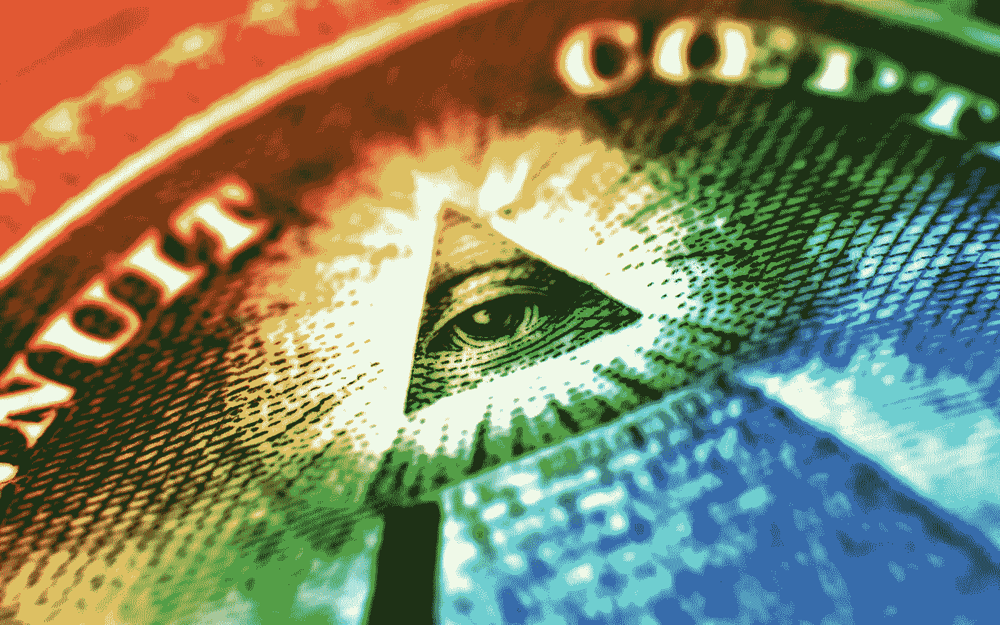
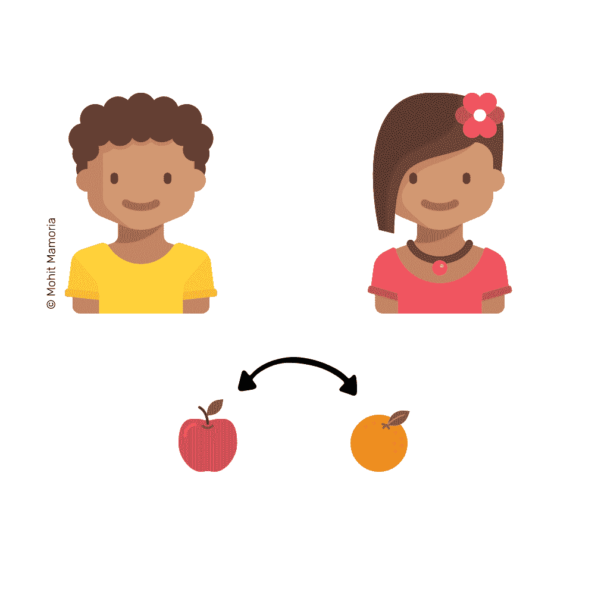
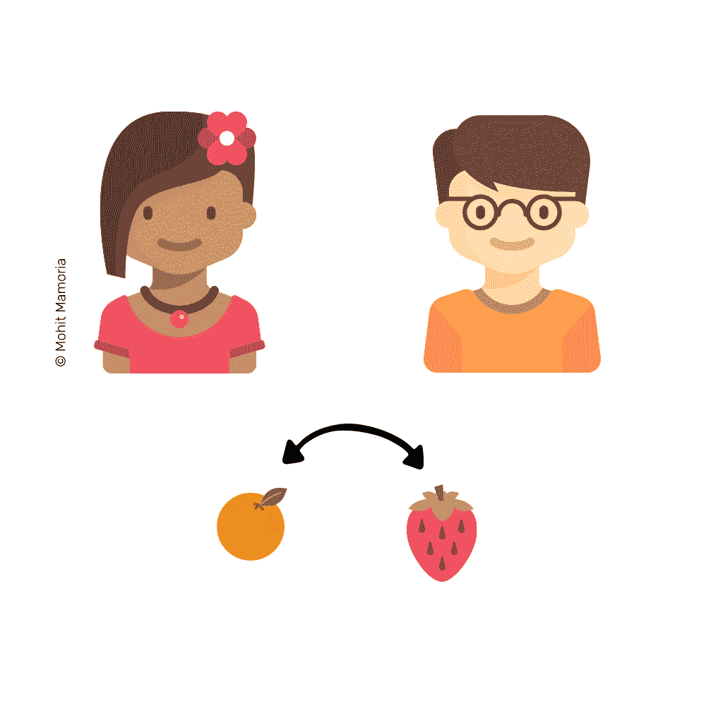
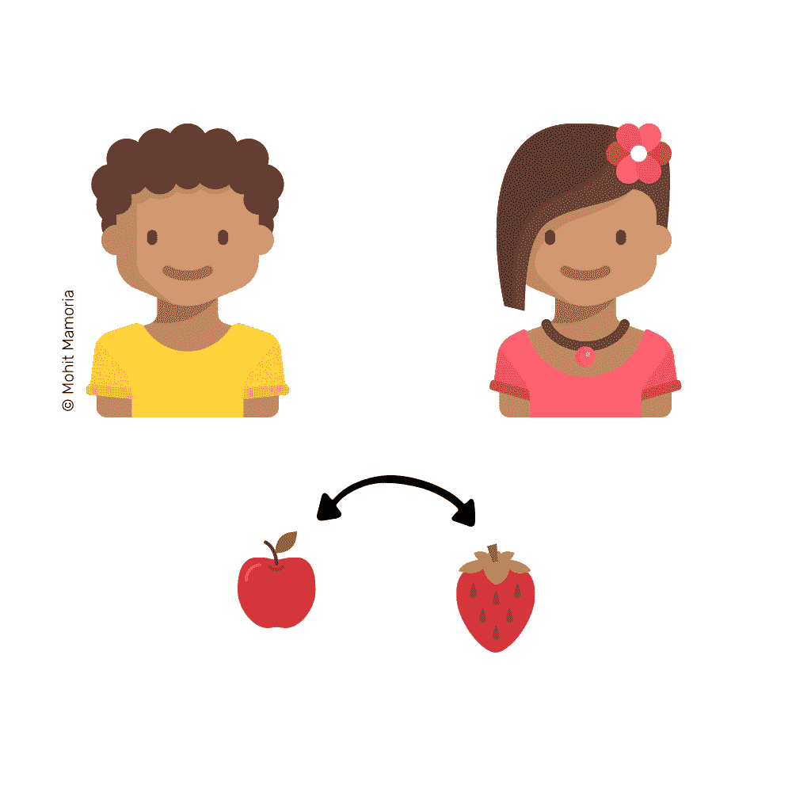
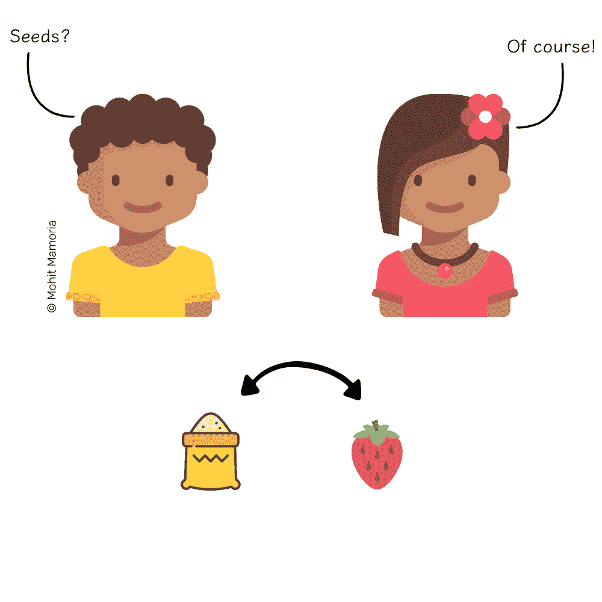
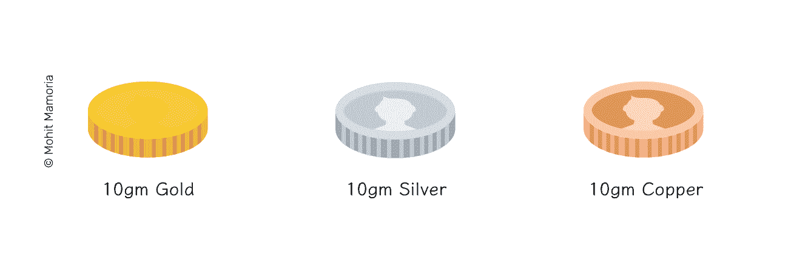
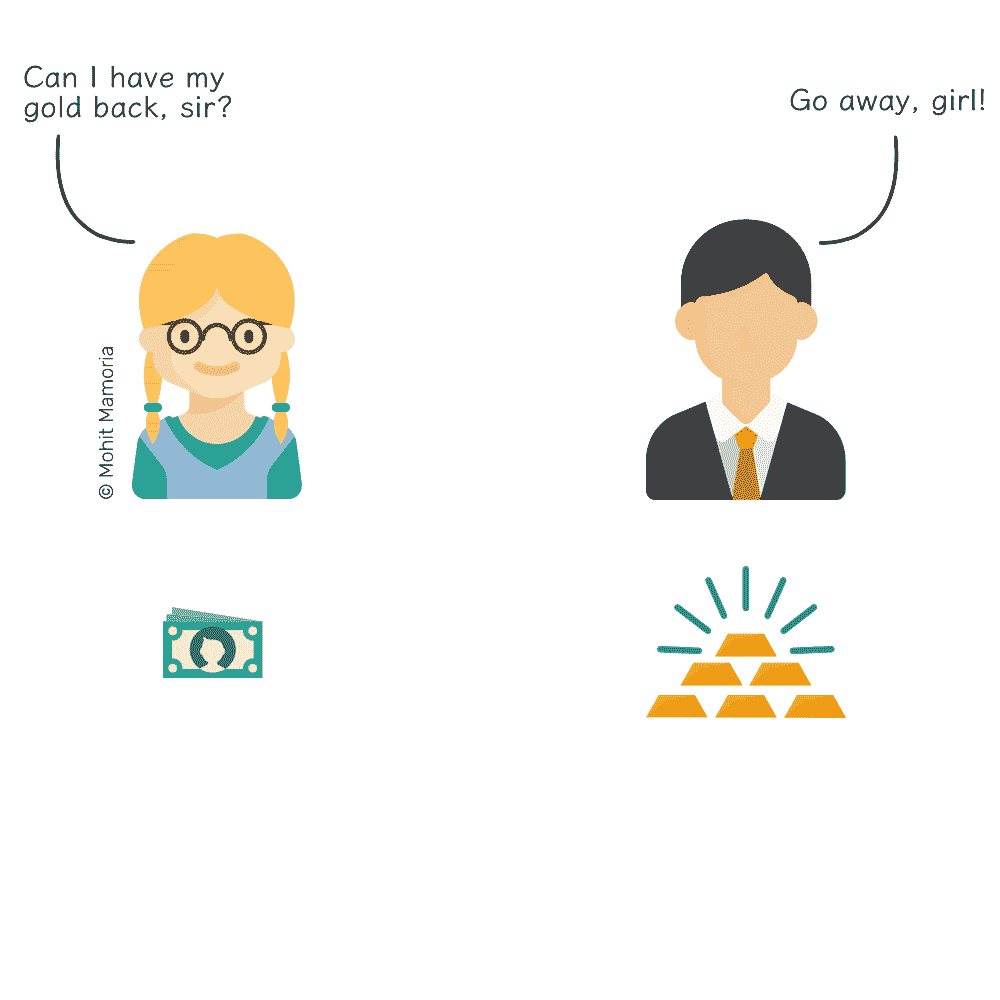
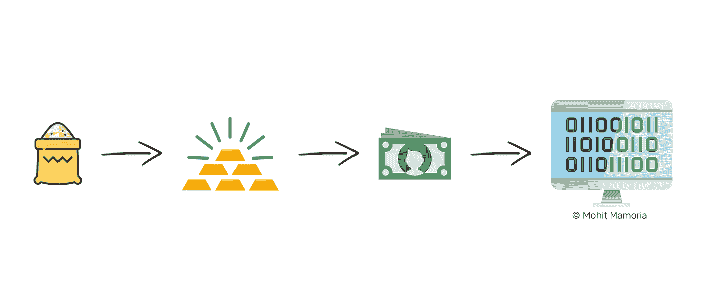

# WTF 是…钱？

> 原文：<https://medium.com/hackernoon/wtf-is-money-2a5d78072128>

## 以下是物物交换如何演变成区块链的。

[http://wallpapercave.com/get-money-wallpaper](http://wallpapercave.com/get-money-wallpaper)

13**17 亿年前，**大爆炸创造了宇宙。38 亿年前，生命首次出现在我们的星球上。190 万年前，地球上首次出现了直立行走的原始人。

7000 年前，货币被发明了。

# 但是首先，人们以物易物。

不是每个人都拥有一切。我们总是有多余的东西，我们总是需要别人有的东西。正如常识所说，我们开始用多余的资产交换我们需要的东西。

想象一下，我有多余的苹果，你有多余的橘子，我们可以简单地互相交换水果。

如果我有多余的苹果，不想要你的橘子，但我想吃点草莓，那该怎么办？

你会去找一个能给你草莓来交换你的橘子的人。幸运的是，你找到了你的朋友乔，与你交换。

然后，你会给我那些草莓，我会给你一些苹果。

乔，你和我都很开心。

但是如果乔有多余的香蕉，但是他也不想要你的橘子呢？那会是个问题。

我们中的聪明人开始问一个深刻的问题，“能有每个人都想要的东西吗？”

> 顺便说一下，我是每周时事通讯**的策展人，它将一个来自未来的想法发送到你的收件箱。**

# ****于是，就有了商品货币。****

**有一些东西几乎每个人都用得上，像盐、种子、羊和牛。它们变成了商品货币。如果我们有这些东西，我们可以用它们来得到我们想要的任何东西。**

****

**我们一直知道，在任何时候，都不会有人拒绝我们提供的商品货币。这些是每个人都使用的资产，所以每个人都重视它们。这个系统刚刚开始工作。**

**然而，商品货币并非没有自身的问题。携带装满种子的袋子到不同的城市是困难的。此外，储存它们是一个巨大的问题。如果储存的时间更长，它们就会腐烂。**

**然后，我们中的聪明人开始问另一个深刻的问题，“有没有更容易携带，储存，并且仍然有价值的东西？”**

# **答案是金属。**

**金属更容易携带、分割、储存，也更稀缺(因此，它们很有价值)。各个国家和王国开始铸造带有他们印章的不同重量的硬币。印章保证了硬币的重量和真实性。**

**每枚硬币的价值都是由制造它的材料来衡量的。基于所用的金属及其重量，硬币得到了它们的价值。**

****

**硬币主要由金和银制成，因为它们很少被开采，也不会被腐蚀，从而确保重量稳定。因为它们便于携带，我们甚至做得有点过火:我们开始以珠宝的形式使用它们——这样它们将永远留在我们手中，其他人可以看到我们是多么富有。**

> **到这个时候，人类已经进化过了他们所做的一切都是为了生存的阶段。**

**但是这会引起一点麻烦——偷窃。**

# ****寺庙前来救援。****

****在金钱进入之前，神早就出现了。他们住在寺庙里，我们的贵金属也在那里找到了它们的家。我们开始把它们存放在寺庙里，因为没有人有勇气从上帝那里偷东西。因此，硬币被认为是安全的。****

**一旦你把你的黄金存放在寺庙，牧师会给你一张收据，上面写着收集的黄金数量。这是牧师的承诺，不会拒绝给收据持有者黄金。**

****

# **在我们意识到之前，银行业已经到来。**

> ***“个人银行业务——向中产阶级家庭出售债务——一直是一座金矿。”—伊丽莎白·沃伦***

****纸质收据代表存放在牧师处的黄金的**价值，因此，转让纸质收据意味着转移黄金本身。金钱的象征进入了我们的社会。我们开始用期票代替黄金，因为它们直接代表黄金，更容易携带和储存。**

**最终，政府和银行取代了寺庙。在整个十九世纪和二十世纪，几乎所有现存的货币都是基于黄金和白银作为回报的承诺。这种票据之所以有价值，是因为它代表了一种稀缺资源，即那些政府和银行持有的贵金属。**

**直到它不再存在。**

# ****法定货币崛起****

**稀缺资源无法支撑我们今天使用的货币。这是因为货币的价值不再取决于黄金的价值；它取决于发行和使用它的政府的稳定性。如今，政府的声誉赋予了金钱价值。**

**我们用来交换商品和服务的纸张实际上就是货币本身。如果你去银行递交一张纸质账单，你就拿不回黄金了。**

****

**因为像银行和政府这样的中央机构控制着这种特殊纸张的价值，为了使系统更有效率，他们用储存在计算机中的有价值的数字来代替那些有价值的纸张。**

# ****货币电子化****

**第一次学的时候觉得很好笑。首先，银行用有代表性的票据代替黄金，然后，他们只给这些票据估价，而不用真金支持它们。同样的循环再次重复，银行宣称，“人们仍然可以偷你的纸币。你的纸币仍然会腐烂。你为什么不把你的纸币存在我们这里，作为交换，我们会在我们的电脑里做一个记录，告诉你我们欠你多少钱？你什么时候来要纸钱，我们都还你。”**

**对我们大众来说，这个提议似乎是合理的。电脑里的那些数字是由我们存入的纸币支持的。**

**直到它不再是了。**

**每当银行发放贷款时，它们就会赚到新的钱。假设你从银行贷款 10 美元。银行不会给你别人的 10 美元。取而代之的是，他们会以银行借据的形式，把 10 美元存入你的账户。你可以花 10 美元的借据，就像你实际花 10 美元一样，因此，创造了货币的替代品。当我们用纸代替黄金时，也发生了同样的事情。**

****

**这就是为什么如果我们每个人都去银行，同时要求现金，无论我们的账户值多少钱，都不会有足够的现金。**

**过去依赖于稀有金属价值的货币现在已经变成了某个人电脑中的一个数字——*某个人的*电脑。**

**在 21 世纪初，我们中的聪明人开始问另一个深刻的问题，“如果金钱在计算机中只能是一些数字，是否有办法仍然用一种稀缺资源来支持它？而且它必须存储在一个集中管理机构的计算机上吗？”**

# ****加密货币的曙光****

****现在世界通过互联网**联系在一起；这是每个人都知道的。电脑让我们比以往任何时候都更有效率。过去需要几天的事情，现在只需要几分钟。我们无法腾出更多的时间，所以我们只能利用我们所拥有的时间。**

**计算能力是我们生活中不可或缺的一部分，它已经变得像黄金对于我们的祖先一样稀缺和珍贵。当聪明人问了一个深刻的问题，“我们能制造一种由计算能力支持的货币吗？答案是加密货币和区块链。**

> **如果你还不明白区块链是如何工作的，我已经用简单的英语写了《终极指南》来理解这个概念。**

# ****WTF 就是钱？****

**早在货币出现之前，人类就已经开始交易了。我们与我们信任的人进行交易。这些人相信和我们一样的故事——关于神和神话生物的故事。**

> ***钱是每个人都相信的故事。***

**我们相信它，因为其他人都相信它。这个故事赋予了金钱它的价值。随着我们技术复杂性的增加，这个故事变得越来越抽象。**

# **加密货币是货币的圣杯吗？**

****目前是这样，直到更好的**出现。加密货币是分散的，但这并不意味着每个人都将拥有相同的份额。这是我一直听到的误解之一。**

**"因为加密货币是完全去中心化的，所以每个人都会得到相同的份额吗？"**

**“没有。”**

**如果一种货币将长期繁荣，它必须得到稀缺资源的支持。稀缺性具有不均匀分布的特性。如果是，一开始就不会稀缺。**

**因此，从设计上来说，货币是这样的:社会中必须有富人和穷人，它才有价值。肯定有人有多余的钱，而其余的人希望有多余的钱。**

**有了加密货币，权力和权威可能会易手，但这不会改变整个社会的运作方式。你越早成为加密货币的一员，你拥有的就越多。**

***君王将会陨落。
王者会崛起。但是钱，
钱能生存。***

**——
***关于作者*****

****

**[Mohit Mamoria](https://medium.com/u/24f7fbc09357?source=post_page-----2a5d78072128--------------------------------)**

***莫希特·马莫里亚是* [***神符***](https://godtoken.org) *的联合创始人，同时也是一份周刊通讯的编辑，*[***un made***](https://unmade.email)*，将一个来自未来的商业理念传递到你的收件箱里。有反馈？我在推特上有空***。****

****这个故事最早出现在 TechCrunch* *上的* [*。编辑校对*](https://techcrunch.com/2017/08/03/from-barter-to-blockchain-a-history-of-money/)[*Doina*](https://twitter.com/doina)*。****

## ***如果你喜欢这个故事，请推荐💚并且分享出来帮别人找！欢迎在下方留言评论。***