# WTF 就是区块链？

> 原文：<https://medium.com/hackernoon/wtf-is-the-blockchain-1da89ba19348>

## 理解区块链的 3500 字简明英语终极指南。

[http://www.forexnewsnow.com/top-stories/bitcoin-2016-summary-2017-forecasts/](http://www.forexnewsnow.com/top-stories/bitcoin-2016-summary-2017-forecasts/)

U **除非你躲在岩石下，**我肯定你听说过比特币和区块链。毕竟，它们是最近的趋势和媒体最喜欢的话题——年度流行语。即使是从未开采过加密货币或不了解其工作原理的人也在谈论它。我的非技术朋友比技术朋友多。他们缠了我几个星期，要我向他们解释这个新词。我想有成千上万的人有同样的感受。当这种情况发生时，就到了写点东西的时候了，每个人都可以指向其他迷失的灵魂——这就是这篇文章的目的——用任何普通互联网用户都能理解的简单英语写。

> 顺便说一下，我是 [**KnowyKnowy**](https://knowyknowy.com) 的编辑，在那里我用简单的英语教授困难的科目(就像这个)。在那里支持我？

# 区块链:为什么我们甚至需要这么复杂的东西？

> "每一个复杂的问题都有一个清晰、简单而错误的答案."门肯

**与互联网上的其他帖子不同，**我们不是先定义区块链，而是先了解它解决的问题。

想象一下，乔是你最好的朋友。他正在海外旅行，在假期的第五天，他打电话给你说:“老兄，我需要一些钱。我已经用完了。”

你回答，“马上发一些”，然后挂断了电话。

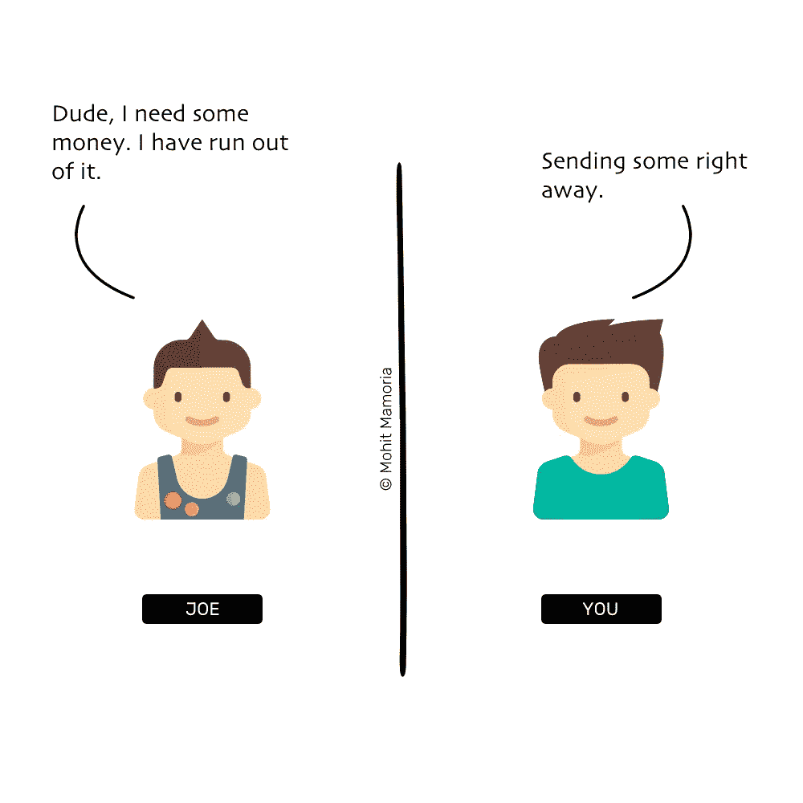

然后你打电话给银行的客户经理，告诉他，“请从我的账户转 1000 美元到乔的账户。”

你的客户经理回答，“是的，先生。”

他打开收银机，检查你的账户余额，看你是否有足够的余额给乔转账 1000 美元。因为你是个有钱人，你有很多；因此，他在登记簿上做了如下记录:

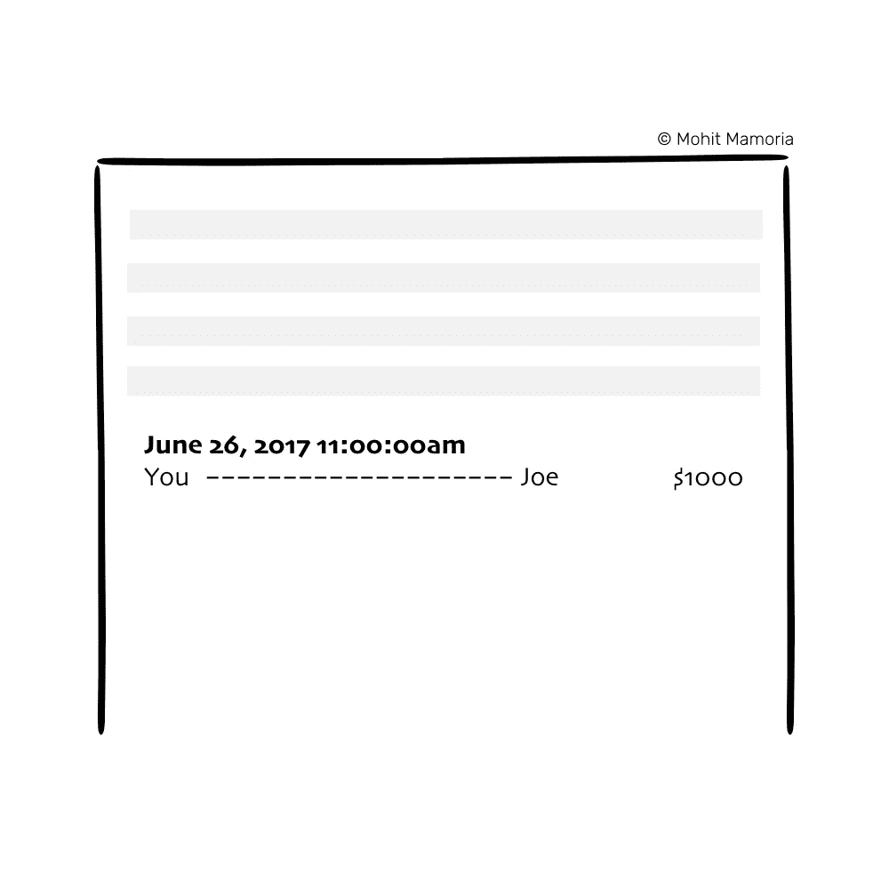

The Transaction Register

> **注意:**我们谈论计算机不仅仅是为了让事情简单。

你打电话给乔，告诉他，“我已经转账了。下一次，你可以去你的银行，提取我刚刚转来的 1000 美元。”

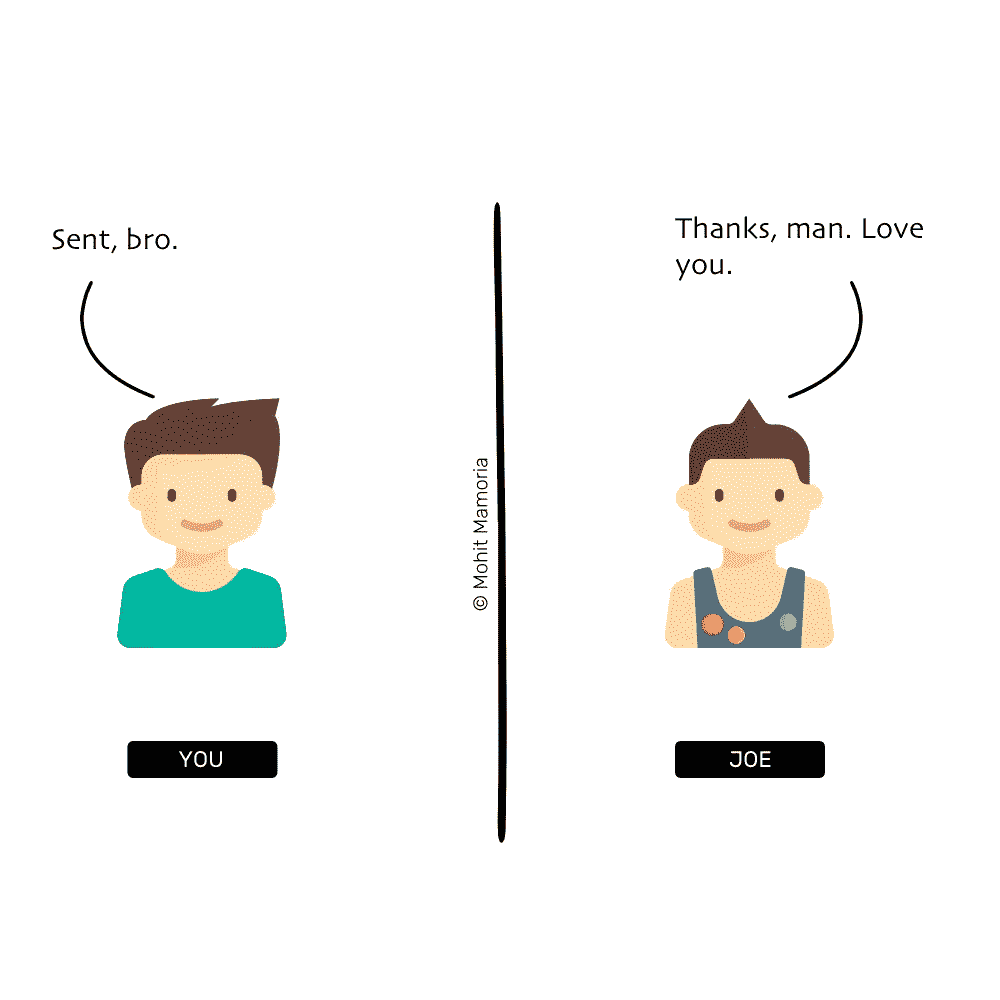

刚刚发生了什么？你和乔都信任银行来管理你的钱。没有实际的纸币流通来转移资金。所需要的只是登记册上的一个条目。或者更准确地说，是你和乔都不控制或拥有的登记簿上的一个条目。

这就是当前系统的问题。

> 为了在我们之间建立信任，我们依赖于单独的第三方。

多年来，我们一直依赖这些中间人相互信任。你可能会问，“依赖于他们的问题是什么？”

问题是它们的数量是单数。如果必须在社会中注入混乱，所需要的只是一个人/组织腐败，有意或无意。

*   如果记录交易的寄存器在火灾中被烧毁了怎么办？
*   如果你的客户经理误写了 1500 美元而不是 1000 美元，该怎么办？
*   如果他是故意的呢？

> 多年来，我们一直把所有的鸡蛋放在一个篮子里，也放在别人的篮子里。

有没有一种系统可以让我们不需要银行就能转账？

要回答这个问题，我们需要进一步深入，问自己一个更好的问题(毕竟，只有更好的问题才能带来更好的答案)。

想一想，转账是什么意思？只是登记簿上的一个条目。更好的问题应该是—

> 有没有一种方法可以在我们之间维护注册表，而不是由别人来替我们维护？

这是一个值得探讨的问题。答案你可能已经猜到了。区块链是这个深奥问题的答案。

这是一种在我们之间保持这种记录的方法，而不是依靠别人来为我们做。

你还和我在一起吗？很好。因为现在，当几个问题开始出现在你的脑海中时，我们将了解这个分布式寄存器是如何工作的。

# 是的，但是告诉我，它是如何工作的？

**这种方法的要求**是必须有足够多的人愿意不依赖第三方。只有这样，该组才能自行维护登记册。

> “如果比特币流行起来，买一些比特币可能是有意义的。如果有足够多的人以同样的方式思考，那就会成为一个自我实现的预言。”—2009 年在中本聪

多少才够？*至少三个*。对于我们的例子，我们将假设十个人想要放弃银行或任何第三方。在双方同意的情况下，他们一直拥有对方账户的详细信息——而不知道对方的身份。

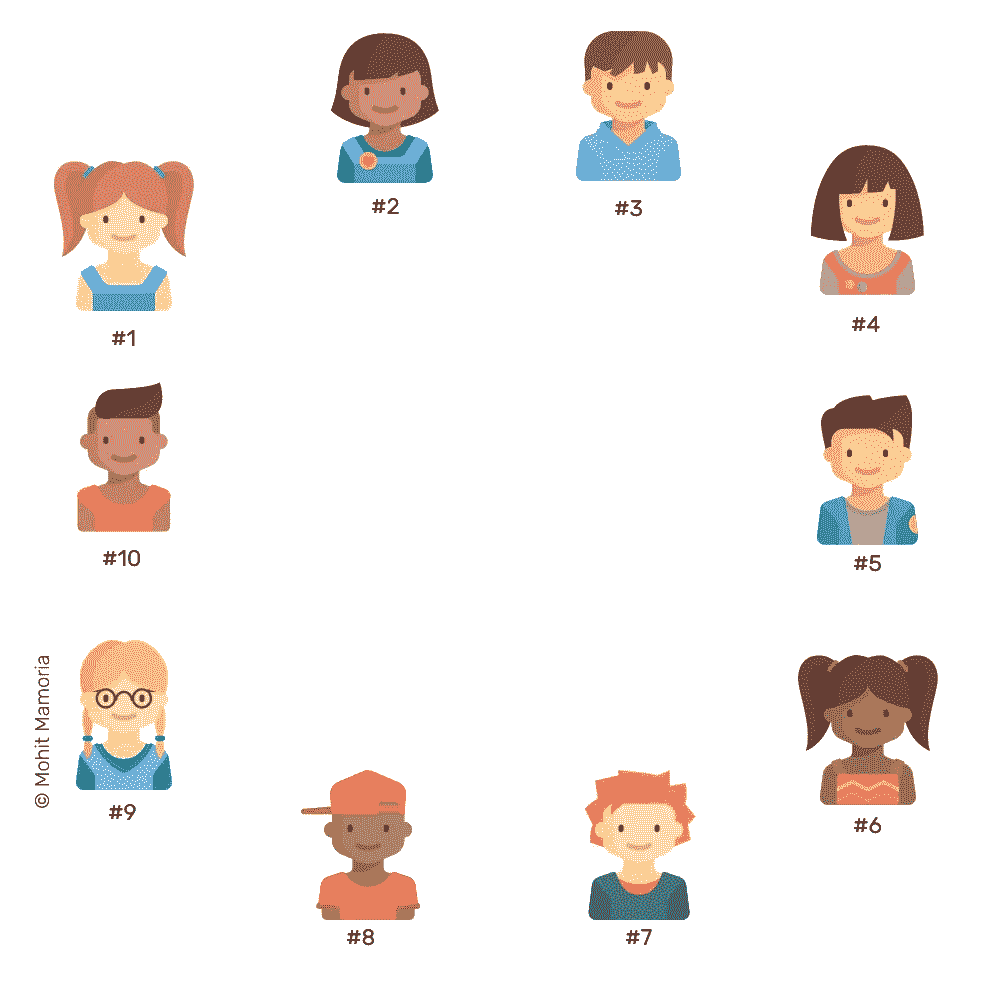

## 1.一个空文件夹

每个人都包含一个空文件夹，从他们自己开始。随着我们的进展，所有这十个人将继续向他们当前空的文件夹添加页面。并且这个页面集合将形成跟踪事务的寄存器。

## 2.当交易发生时

接下来，网络中的每个人都坐着，手里拿着一张白纸和一支笔。每个人都准备好编写系统中发生的任何事务。

现在，如果 2 号想给 9 号寄 10 美元。

为了进行交易，#2 大喊并告诉每个人，“我想把 10 美元转到#9。所以，每个人，请把它记在你们的纸上。”

每个人都检查#2 是否有足够的余额将 10 美元转到#9。如果她有足够的余额，每个人都会在空白页上记下这笔交易。

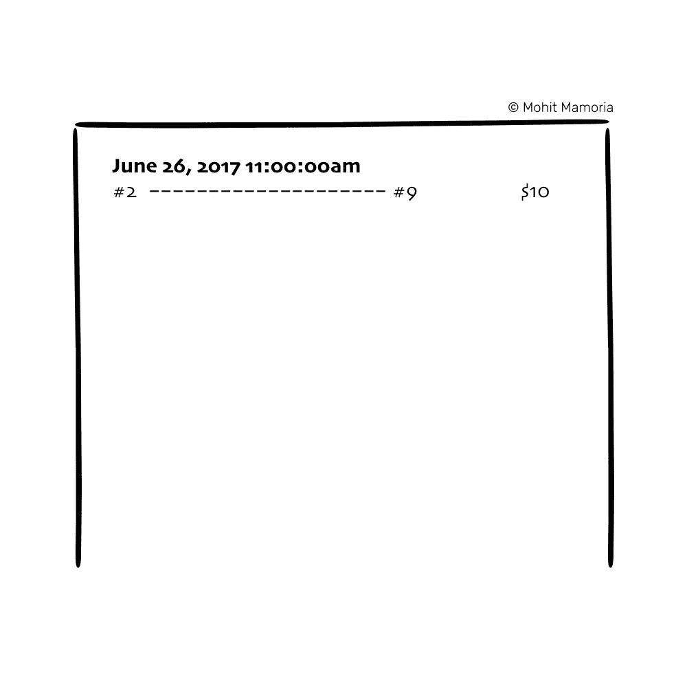

First transaction on the page

然后交易被认为是完成的。

## 3.交易继续发生

久而久之，网络中更多的人觉得有必要给别人转账。每当他们想进行交易时，他们就向其他人宣布。一个人一听到通知，他就把它写在他/她的页面上。

这个练习一直持续到每个人都用完了当前页面上的空间。假设一个页面有空间记录十个事务，一旦第十个事务完成，所有人都会用完空间。

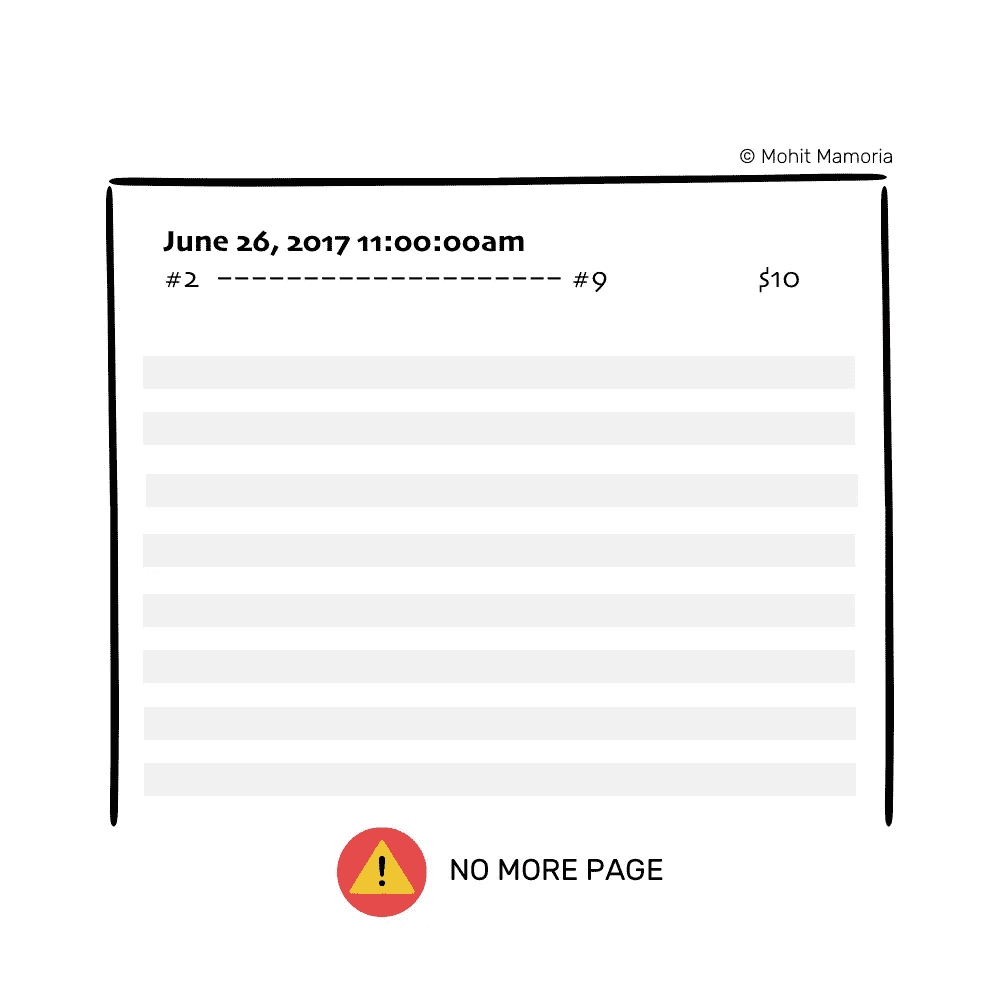

When page gets filled

是时候把这一页放到文件夹里，拿出新的一页，重复上面第二步的过程。

## 4.收起那一页

在我们将页面放入文件夹之前，我们需要用网络中每个人都同意的*唯一密钥*来*密封*。通过密封它，我们将确保一旦它的副本被放入每个人的文件夹中，没有人可以对它进行任何更改——今天不行，明天不行，甚至一年后也不行。一旦进入文件夹，它将永远留在文件夹中——密封。此外，如果每个人都信任印章，每个人都信任页面的内容。而这封页就是这种方法的*症结所在。*

> ***【行话框】*** 它在页面上被称为“挖掘”以保护它，但为了简单起见，我们将继续称它为“密封”

> 早些时候，第三方/中间人给予我们信任，无论他们在登记簿上写了什么，都不会被更改。在像我们这样的分布式和分散式系统中，这个印章将提供信任。

# 有意思！那我们怎么封住这一页？

在我们学习如何密封页面之前，我们将大致了解密封是如何工作的。作为一个先决条件是学习一些我喜欢称之为…

## 神奇的机器

想象一台被厚墙包围的机器。如果你从左边送一个里面有东西的盒子，它会吐出一个里面有别的东西的盒子。

> ***【行话框】*** 这个机器叫‘哈希函数’，但我们没心情太技术化。所以，今天，这些是“神奇的机器”

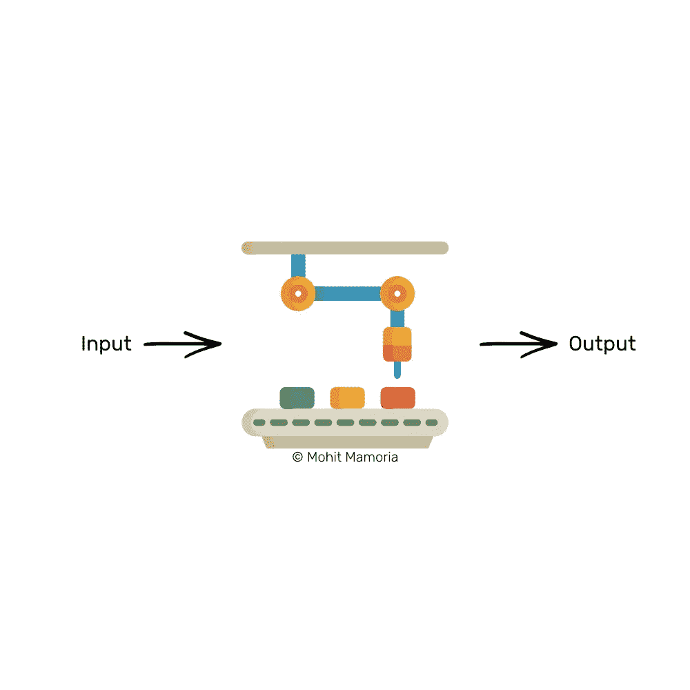

The Magic Machine (aka Hashing Function)

假设你从左边把数字 4 放进去，我们会发现它在右边吐出了下面这个词:“dcbea。”

它是怎么把数字 4 转换成这个单词的？没人知道。此外，这是一个不可逆转的过程。给定单词“dcbea”，就不可能知道左边的机器进的是什么。但每次你把数字 4 输入机器，它都会吐出同一个词“dcbea”

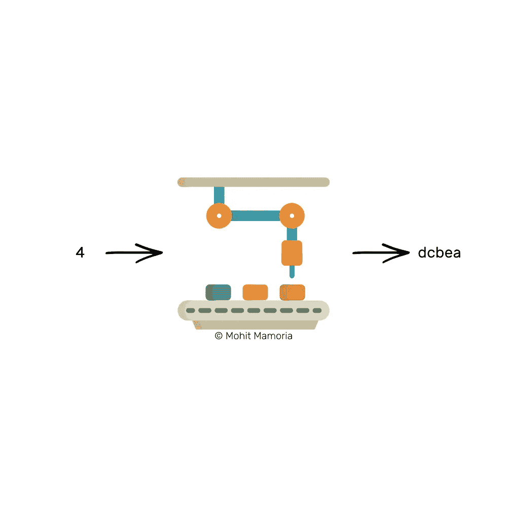

hash(4) == dcbea

给定单词“dcbea”，就不可能知道左边的机器进的是什么。但每次你把数字 4 输入机器，它都会吐出同一个词“dcbea”

让我们尝试发送一个不同的号码。26 怎么样？

hash(26) == 94c8e

这次我们得到了 94c8e。有意思！所以，单词也可以包含数字。

如果我现在问你以下问题会怎么样:

> ***“你能告诉我我应该从机器的左边发送什么，这样我就能从机器的右边得到一个以三个前导零开头的单词吗？例如，000ab 或 00098 或 000fa 或其他任何名称。”***

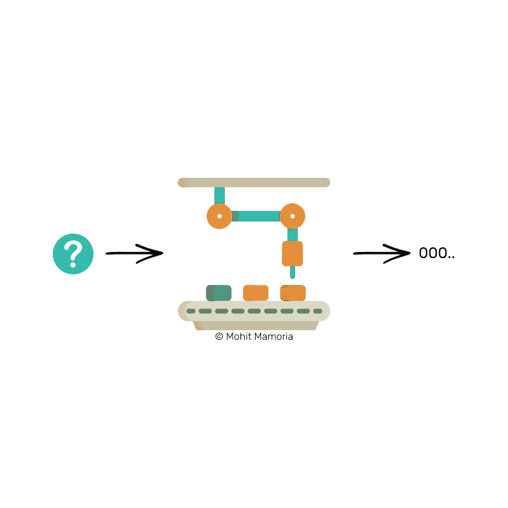

Predicting the input

思考一下这个问题。

我告诉过你，机器有一个特性，我们不能计算出，在右边给出预期输出后，我们必须从左边发送什么。给了我们这样一台机器，我们怎么回答我提出的问题？

我能想到一个方法。为什么不逐一尝试宇宙中的每个数字，直到我们得到一个以三个前导零开头的单词？

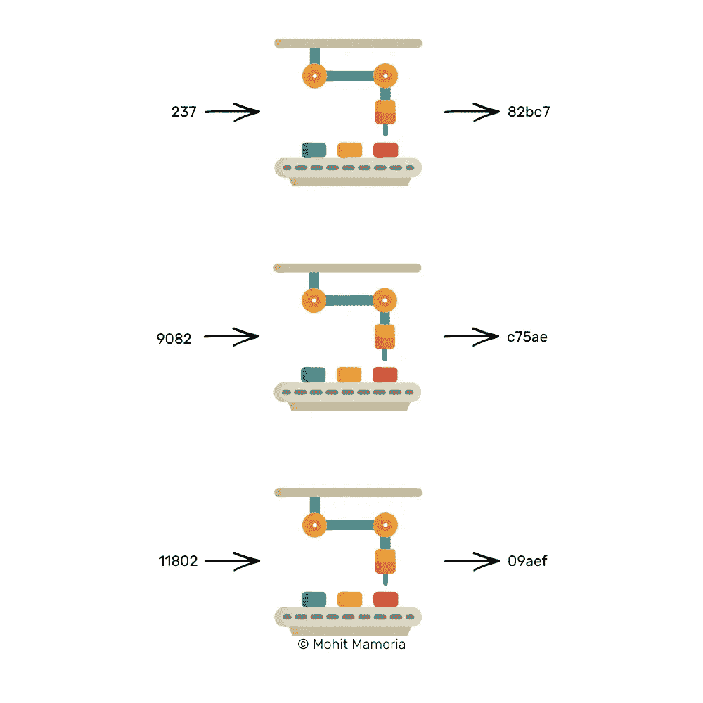

Try everything to calculate the input

乐观地说，经过几千次尝试后，我们最终会得到一个数字，它将产生右侧所需的输出。

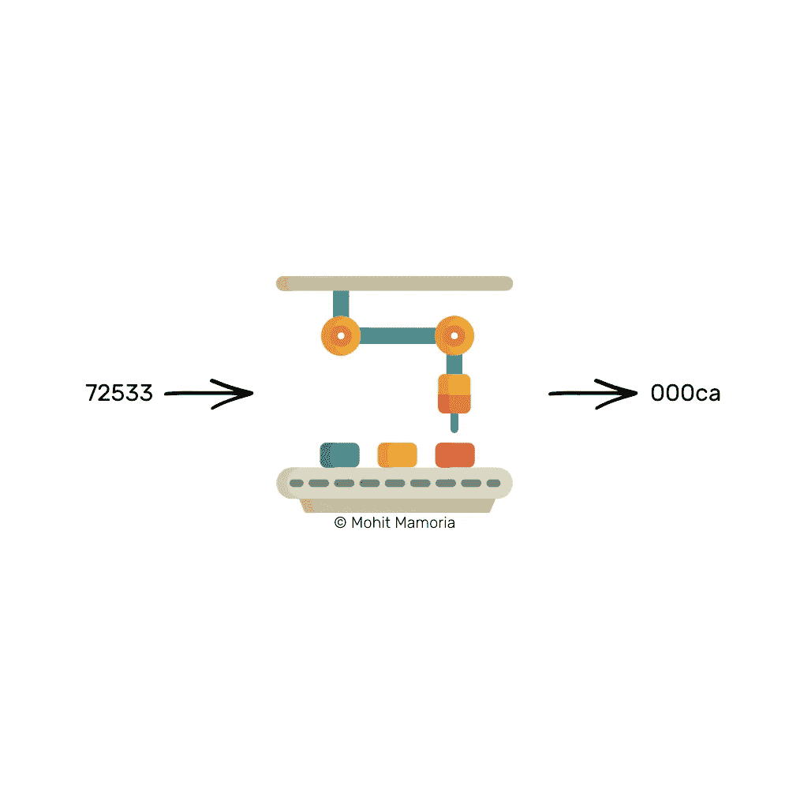

给定产出，很难计算出投入。但与此同时，验证预测的输入是否能产生所需的输出总是非常容易的。记住，机器每次吐出的数字都是同一个单词。

如果我给你一个数字，比如 72533，然后问你这个问题，“这个数字输入机器后，会产生一个以三个前导零开头的单词吗？”

你所要做的就是，把号码扔进机器，看看你在右边得到了什么。就是这样。

这种机器最重要的特性是——“给定一个输出，很难计算出输入，但给定输入和输出，很容易验证输入是否导致输出。”

在这篇文章的其余部分，我们将记住魔术机器(或散列函数)的这一特性:

> 给定一个输出，很难计算输入，但是给定一个输入和输出，很容易验证输入是否导致输出。

## 怎么用这些机器封一页？

我们将使用这台神奇的机器*为我们的页面生成一个印章*。像往常一样，我们将从一个假想的情况开始。

想象一下我给你两个盒子。第一个盒子包含数字 20893。然后，我问你，“你能不能算出一个数字，当它和第一个盒子里的数字相加，然后输入到机器里，会给我们一个以三个零开头的单词？”

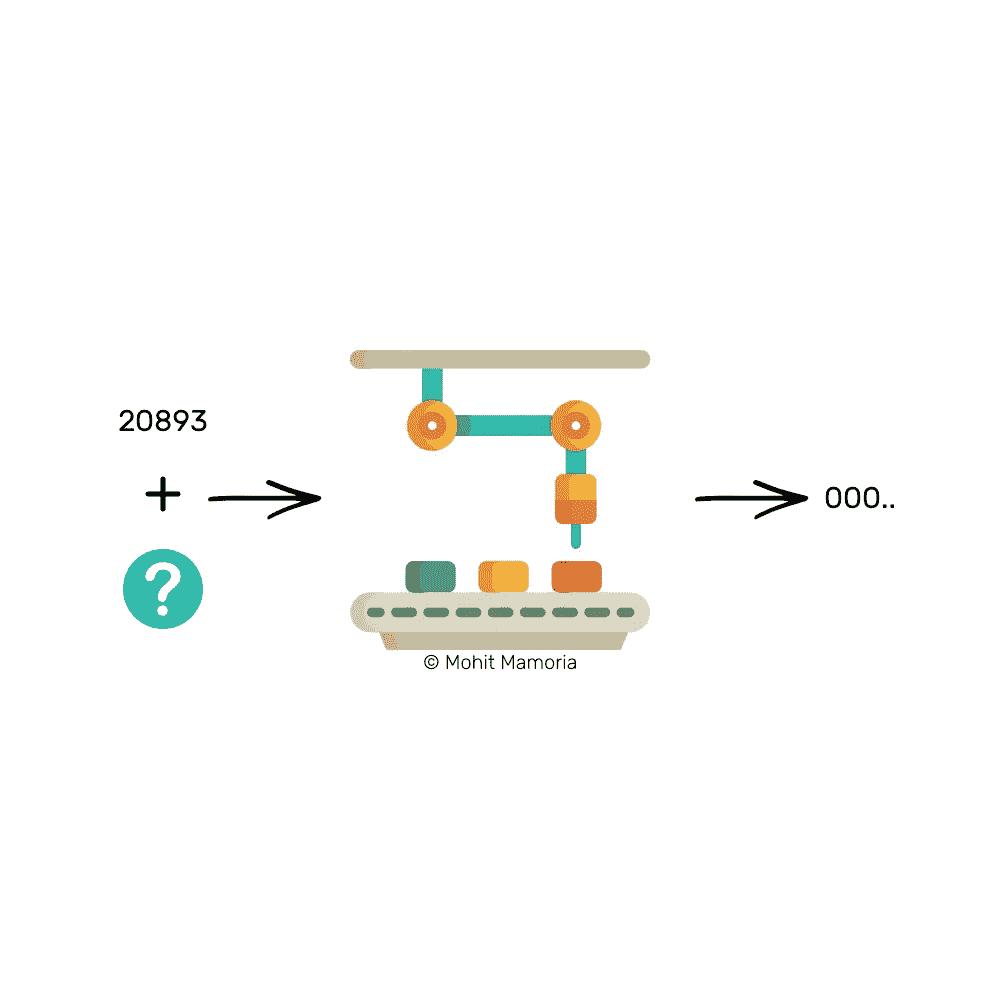

这与我们之前看到的情况类似，我们已经知道计算这样一个数的唯一方法是尝试整个宇宙中所有可用的数。

经过几千次尝试后，我们会偶然发现一个数字，比如说 21191，当它与 20893 相加(即 21191 + 20893 = 42084)并输入机器时，就会产生一个满足我们要求的单词。

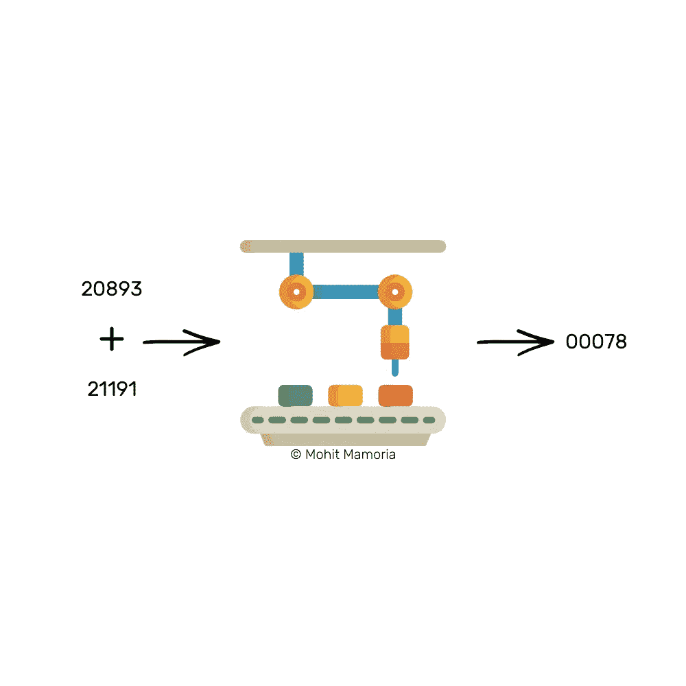

在这种情况下，这个数字 21191 成为数字 20893 的印章。假设有一页上面写着数字 20893。为了密封该页面(即，没有人可以更改它的内容)，我们将在它的顶部放置一个标记为“21191”的徽章。一旦封号(即 21191)贴在页面上，页面即被密封。

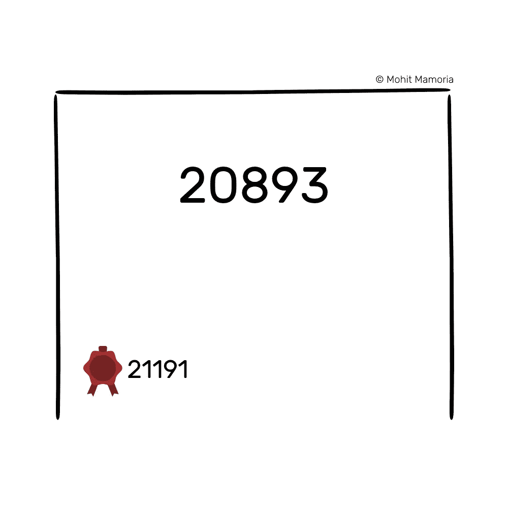

The sealed number

> ***【行话框】*** 封数称为‘功证’，意思是这个数是曾经努力计算过的证明。出于我们的目的，我们习惯称之为“密封号”。

如果有人想验证这一页是否被修改过，他所要做的就是——将这一页的内容加上密封号，然后输入到这台神奇的机器中。如果机器给出一个有三个前导零的单词，内容是不变的。如果出来的单词不符合我们的要求，我们可以扔掉这个页面，因为它的内容被破坏了，没有任何用处。

我们将使用类似的密封机制来密封所有页面，并最终将它们排列在各自的文件夹中。

## 最后，密封我们的页面…

为了封闭包含网络交易的页面，我们需要计算出一个数字，当这个数字被附加到交易列表中并被输入到机器中时，我们得到一个以右边三个前导零开始的单词。

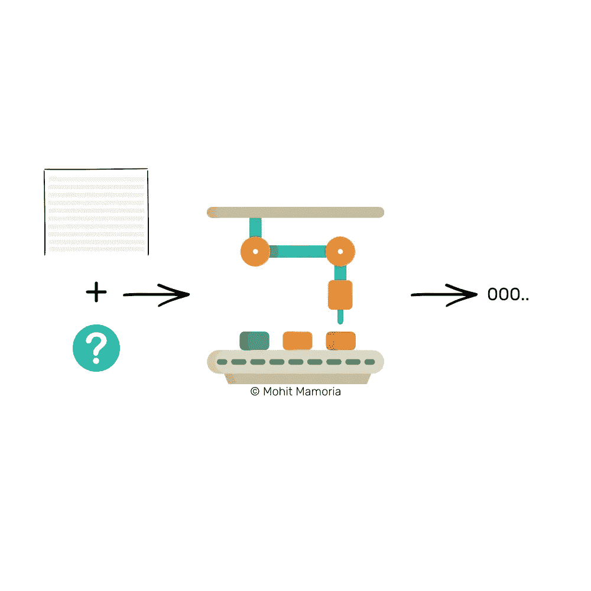

> **注意:**我使用的短语‘以三个前导零开头的单词’只是作为一个例子。它说明了散列函数是如何工作的。真正的挑战要比这复杂得多。

一旦在机器上花费时间和电力后计算出该数字，页面就用该数字密封。如果有人试图改变网页的内容，密封号码将允许任何人验证网页的完整性。

现在我们已经知道了密封页面的方法，我们将回到在页面上写完第十个事务的时候，我们已经没有空间来写更多的内容了。

一旦每个人都写完了下一页的交易，他们就沉迷于计算该页的密封号，以便可以将它藏在文件夹中。网络中的每个人都做计算。网络中第一个算出封号的人向其他所有人公布。

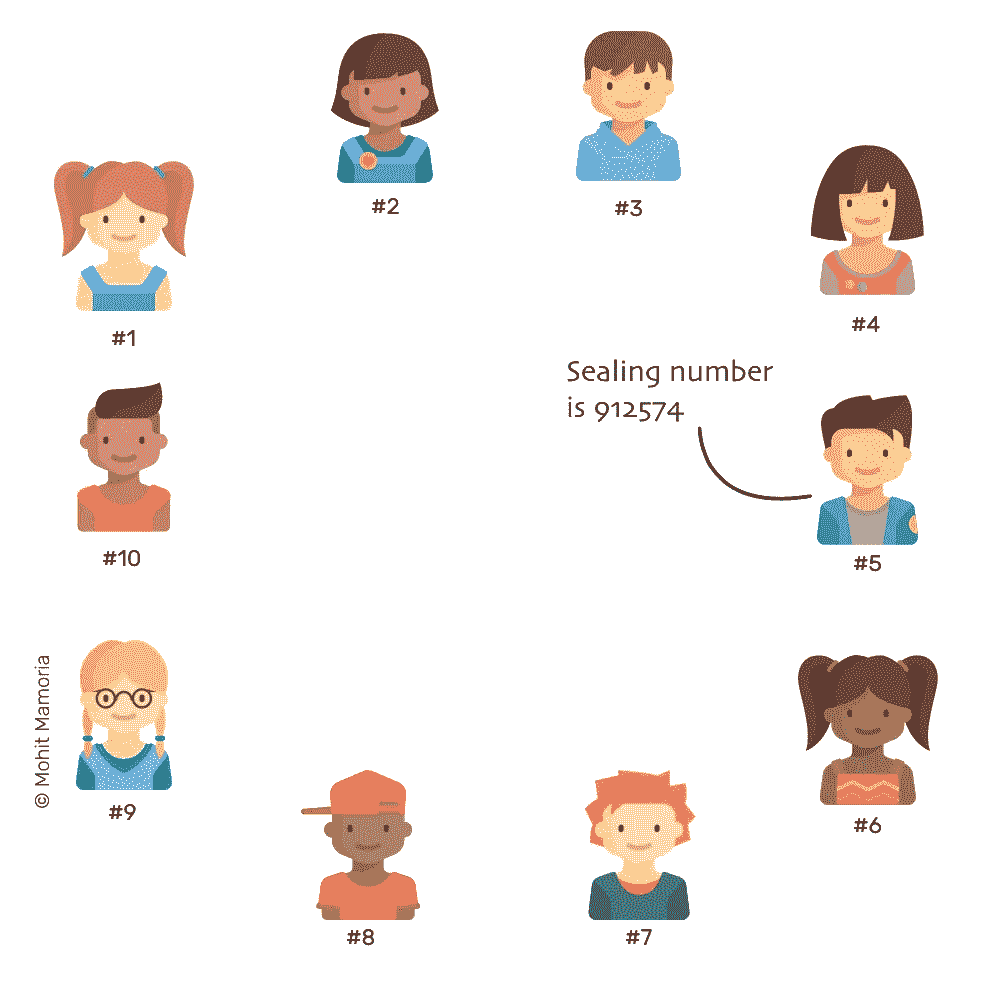

一听到密封数字，每个人都立即验证它是否产生所需的输出。如果是的话，每个人都用这个号码标记他们的页面，并把它放在他们的文件夹里。

**但是，如果有人，比如说#7，**宣布的密封数量没有达到要求的产量，该怎么办？这种情况并不少见。出现这种情况的可能原因是:

*   他可能听错了网络中宣布的交易
*   他可能写错了网络上公布的交易
*   他可能在写交易时试图欺骗或不诚实，或者为了自己或网络中的其他人

不管是什么原因，#7 只有一个选择——放弃他的页面并从其他人那里复制，这样他也可以把它放入文件夹中。除非他不把他的页面放入文件夹，否则他不能继续写进一步的交易，因此，禁止他成为网络的一部分。

> 多数人同意的任何密封数字，成为诚实的密封数字。

**那为什么每个人在知道别人会计算并向他们公布的情况下，还要花费资源去做计算呢？为什么不坐以待毙，等待宣布呢？**

问得好。这就是这幅画的动机所在。参与区块链的每个人都有资格获得奖励。第一个计算密封数的人因其努力(即消耗的 CPU 功率和电力)而获得免费的金钱奖励。

简单地想象一下，如果#5 计算出一页的封号，他会得到一些免费的钱，比如说 1 美元，这些钱是凭空制造出来的。换句话说，5 号的账户余额增加了 1 美元，而其他人的账户余额没有减少。

比特币就是这样产生的。这是第一种在区块链(即分布式寄存器)上交易的货币。作为回报，为了让网络中的努力继续下去，人们被授予比特币。

当足够多的人拥有比特币时，它们就会增值，让其他人想要比特币；让比特币的价值进一步增长；让更多的人想要比特币；使它们的价值进一步增长；诸如此类。

> 奖励使每个人都继续在网络中工作。

一旦每个人都把这一页放进文件夹，他们就会拿出一个新的空白页，重新重复整个过程——永远这样做。

> ***【行话框】*** 把单个页面想象成一个事务块，把文件夹想象成页面链(Blocks)，因此，把它变成一个区块链。

朋友们，这就是区块链的工作方式。

除了一件小事我没告诉你。还没有。

想象一下，文件夹里已经有五页纸了——都用封号封好了。如果我回到第二页，修改一个对我有利的交易，会怎么样？封号会让任何人发现交易中的不一致，对吗？如果我继续为修改后的交易计算一个新的密封数，并用它来标记页面，会怎么样？

为了防止有人回去修改页面(块)和封号的问题，对封号的计算有一点小小的改动。

# 保护对密封号的修改

还记得我告诉过你我给了你两个盒子吗——一个盒子里装着数字 20893，另一个空着让你计算？在现实中，要计算区块链中的密封数，不是两个盒子，而是三个——两个预填充，一个待计算。

当所有这三个盒子的内容相加并输入机器时，从右边出来的答案必须满足要求的条件。

我们已经知道，一个盒子包含交易清单，一个盒子将包含密封号码。第三个框包含上一页的神奇机器的输出。

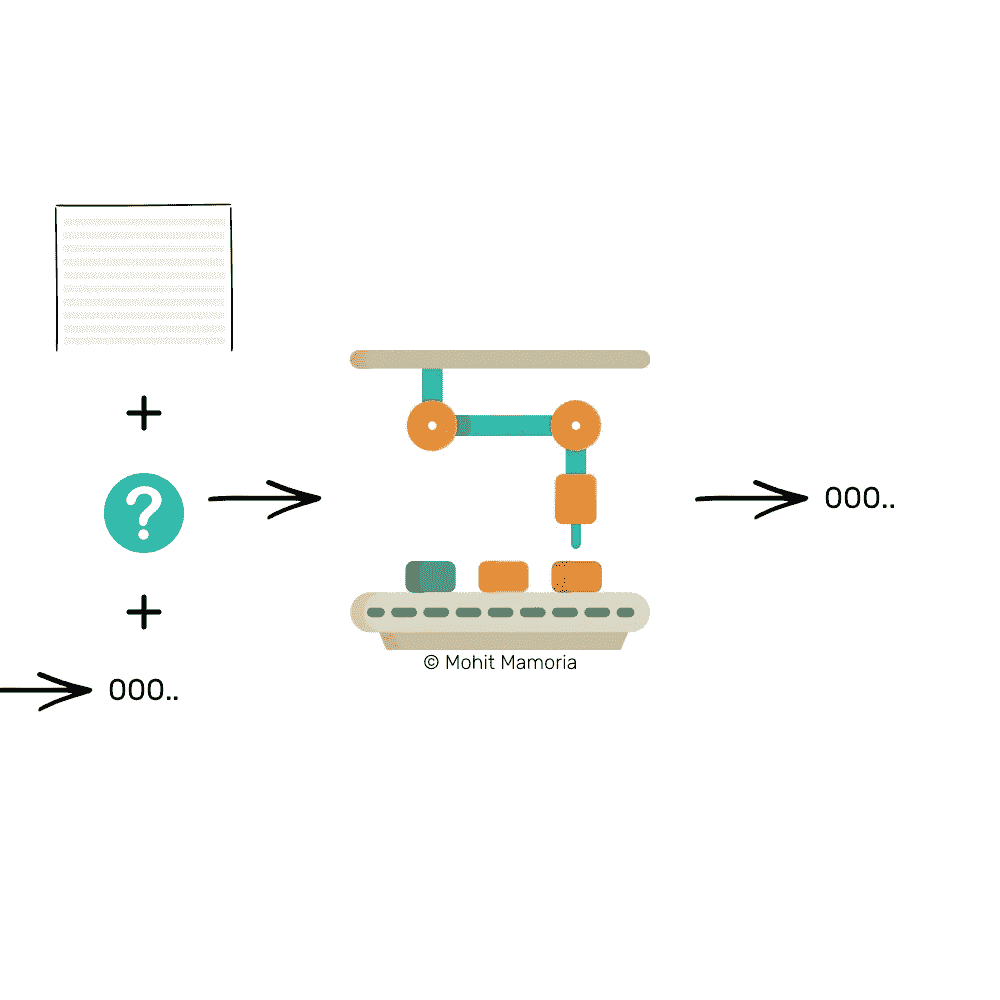

通过这个巧妙的小技巧，我们确保了每一页都依赖于前一页。因此，如果有人必须修改一个历史页面，他还必须更改之后所有页面的内容和密封编号，以保持链的一致性。

如果我们一开始想象的十个人中有一个人试图欺骗和修改区块链(包含交易列表页面的文件夹)的内容，他将不得不调整几个页面，并计算所有这些页面的新密封数。我们知道计算密封数字有多困难。因此，网络中一个不诚实的家伙无法打败九个诚实的家伙。

将会发生的是，从不诚实的家伙试图欺骗的页面，他将在网络中创建另一个链，但该链将永远无法赶上诚实的链——仅仅因为一个人的努力和速度无法击败累积的努力和速度九。因此，保证网络中最长的链是诚实的链。

> 最长的链条是诚实的链条。

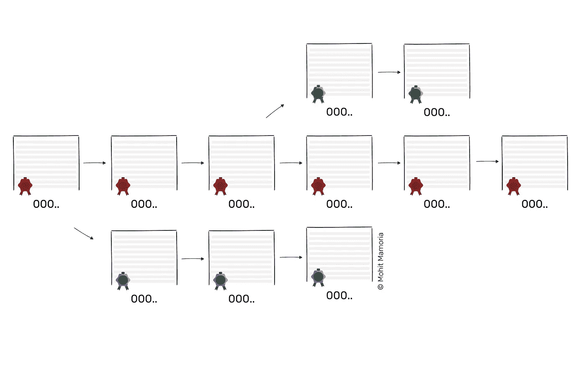

Longest chain is the honest chain.

当我告诉你一个不诚实的人不能打败九个诚实的人时，你有没有想起什么？

# 如果不是一个，而是六个人变得不诚实呢？

在那种情况下，协议将会彻底失败。而且号称“51%攻击”。如果网络中的大多数个体决定变得不诚实并欺骗网络中的其他人，那么该协议将无法实现其目的。

这是区块链可能崩溃的唯一原因，如果他们真的会崩溃的话。要知道，这不太可能发生，但我们都必须知道系统的弱点。它建立在这样一个假设上:人群中的大多数人总是诚实的。

朋友们，这就是区块链的全部。如果你发现有人感觉被落在后面，并想知道，“区块链是什么？”你知道你能把他们带到哪里。将链接加入书签。

我现在能想到谁应该读这本书吗？“分享”按钮是你的了。

—

***关于作者***

莫希特·马莫里亚(Mohit Mamoria)是[***KnowyKnowy***](https://knowyknowy.com)*的编辑，他在那里用简单的英语教授困难的科目。*

> ***你可能也喜欢***

 [## 区块链归谁所有？

### 分权有多民主？

medium.com](/@mohitmamoria/who-owns-the-blockchain-9b3af7a2ab76)  [## 区块链和注意力的伟大游戏

### 你想知道的关于区块链、令牌及其主要用例的一切

keepingstock.net](https://keepingstock.net/blockchain-and-the-great-game-of-attention-2f0a8f775c43) 

# 感谢阅读！:)如果你喜欢它，请点击下面的心形按钮表示支持。💚

> [黑客中午](http://bit.ly/Hackernoon)是黑客如何开始他们的下午。我们是 [@AMI](http://bit.ly/atAMIatAMI) 家庭的一员。我们现在[接受投稿](http://bit.ly/hackernoonsubmission)，并乐意[讨论广告&赞助](mailto:partners@amipublications.com)机会。
> 
> 如果你喜欢这个故事，我们推荐你阅读我们的[最新科技故事](http://bit.ly/hackernoonlatestt)和[趋势科技故事](https://hackernoon.com/trending)。直到下一次，不要把世界的现实想当然！

