# XML vs JSON Shootout:在 SQL Server 中应该用哪个？

> 原文：<https://medium.com/hackernoon/xml-vs-json-shootout-which-should-i-use-in-sql-server-7eefa4dc7553>


“[A duel is a duel](https://www.flickr.com/photos/ehiuomo/8099788695/)” by [Emanuele Rosso](https://www.flickr.com/photos/ehiuomo/) is licensed under [CC BY-NC-ND 2.0](https://creativecommons.org/licenses/by-nc-nd/2.0/)

*在* [*更新帖子*](https://blog.bertwagner.com/5-things-you-need-to-do-when-performance-testing-json-in-sql-and-c-8dfe0ee101a9) *中提供了更多性能对比。*

*来看看我在*[*SQL 7 月 22 日星期六哥伦布*](http://www.sqlsaturday.com/653/EventHome.aspx) *演讲 JSON 和 XML 吧！*

从 2016 版开始，SQL Server 提供了原生 JSON 支持。虽然实现得并不完美，[我](https://blog.bertwagner.com/json-support-is-the-best-new-developer-feature-in-sql-2016-bbb3ced89ce8) [am](https://blog.bertwagner.com/json-support-is-the-best-new-developer-feature-in-sql-2016-bf031f3dc40f) [依然](https://blog.bertwagner.com/json-support-is-the-best-new-developer-feature-in-sql-2016-part-3-updating-adding-and-deleting-24cea5fc0ab5) [一个](https://blog.bertwagner.com/json-support-is-the-best-new-developer-feature-in-sql-2016-part-4-performance-comparisons-bd04dc7635f3) [巨大的](https://blog.bertwagner.com/when-is-it-appropriate-to-store-json-in-sql-server-8ed1eed1520d) [迷](https://blog.bertwagner.com/video-json-usage-and-performance-in-sql-server-2016-524edcc5a610)。

即使像 JSON 支持这样的新特性很棒，我也只有在它实用并且性能优于其他选择的情况下才会使用它。

今天我想将 JSON 与 XML 进行比较，看看哪种格式更适合在 SQL Server 中使用。

# 输入 XML，SQL 的坏小子

完全公开:我不喜欢 XML，也不喜欢 SQL Server 对它的实现。

XML 太罗嗦了(在结束标签上浪费了很多字符)，它有元素和属性(我不喜欢为两种不同的场景编程)，根据你用什么语言编程，有时你需要模式文件，有时不需要。

SQL Server 的 XML 实现确实有一些不错的特性，比如可以减少存储空间和验证语法的专用数据类型，但是我发现 XML 的查询很笨拙。

抛开所有对 XML 的不满，如果 XML 优于 JSON，我仍然愿意使用它。因此，让我们运行一些测试查询！

# JSON SQL Server 的新警长来了吗？

虽然性能是这些比较测试的最终决定因素，但我认为 JSON 在可用性方面比 XML 领先。SQL Server 的 JSON 函数签名更容易记忆，在屏幕上写起来也更清晰。

我使用的测试数据是来自[https://github.com/arthurkao/vehicle-make-model-data](https://github.com/arthurkao/vehicle-make-model-data)的车辆年份/品牌/型号数据。下面是我将它加载到一个名为`dbo.XmlVsJson`的表中后的样子:

```
CREATE TABLE dbo.XmlVsJson
(
  Id INT IDENTITY PRIMARY KEY,
  XmlData XML,
  JsonData NVARCHAR(MAX)
)
```

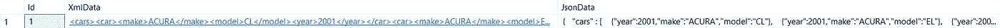

([The full data query is available in this gist](https://gist.github.com/bertwagner/5350454abfc682c358c6ffbe5bf7d8e9) if you want to play along at home)

# 数据量

所以 XML 应该更大，对吗？它有那些重复的结束标签？

```
SELECT
  DATALENGTH(XmlData)/1024.0/1024.0 AS XmlMB,
  DATALENGTH(JsonData)/1024.0/1024.0 AS JsonMB
FROM
  dbo.XmlVsJson
```

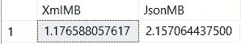

原来 XML 实际上更小！怎么会这样呢？这就是 [SQL Server XML 数据类型](https://docs.microsoft.com/en-us/sql/relational-databases/xml/xml-data-type-and-columns-sql-server)背后的魔力。SQL 不将 XML 存储为一个巨大的字符串；它只存储 [XML 信息集](https://www.w3.org/TR/xml-infoset/)，从而减少了空间。

另一方面，JSON 存储为常规的旧 nvarchar(max ),因此它的完整字符串内容被写入磁盘。在这种情况下，XML 胜出。

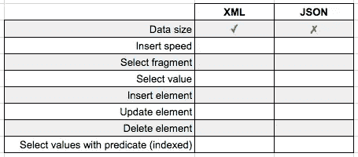

# 插入性能

因此，在 nvarchar(max)数据类型中，使用 XML 数据类型时，XML 实际存储的数据比 JSON 少，这是否意味着它的插入速度也会更快？下面是我们的查询，它尝试插入第一个查询中的 100 个重复行:

```
SET STATISTICS TIME ONINSERT INTO dbo.XmlVsJson (XmlData)
SELECT XmlData FROM dbo.XmlVsJson 
  CROSS APPLY 
  (
    SELECT DISTINCT number 
    FROM master..spt_values 
    WHERE number BETWEEN 1 AND 100
  )t WHERE Id = 1
GOINSERT INTO dbo.XmlVsJson (JsonData)
SELECT JsonData FROM dbo.XmlVsJson 
  CROSS APPLY 
  (
    SELECT DISTINCT number 
    FROM master..spt_values 
    WHERE number BETWEEN 1 AND 100
  )t WHERE Id = 1
GO
```

结果呢？在我的机器上，插入 100 个 XML 行用了 613ms，而插入 100 个 JSON 行用了 1305ms… **XML 又赢了！**

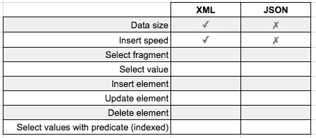

JSON ain’t looking too hot. Wait for it…

我想既然 XML 数据类型物理上存储的数据更少，那么它也可以更快地将数据写到表中。

# CRUD 操作

[与相比，SQL Server 的 JSON 性能给我留下了难以置信的印象。NET](https://blog.bertwagner.com/json-support-is-the-best-new-developer-feature-in-sql-2016-part-4-performance-comparisons-bd04dc7635f3#.qfb67pue8)——但是它与 SQL Server 上的 XML 相比如何呢？

## 阅读

让我们从 XML 和 JSON 中选择第二辆汽车的片段:

```
SELECT t.XmlData.query('/cars/car[2]') 
FROM dbo.XmlVsJson t 
WHERE Id = 1SELECT JSON_QUERY(t.JsonData, '$.cars[1]') 
FROM dbo.XmlVsJson t 
WHERE Id = 1
```

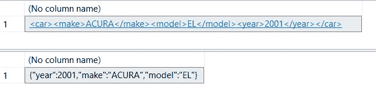

结果？当需要从我们更大的对象字符串中提取一个片段时，JSON 赢了(对于 XML 是 0 毫秒对 63 毫秒)。

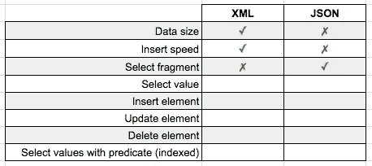

如果我们想抓取一个特定的值而不是一个片段呢？

```
SELECT t.XmlData.value('(/cars/car[2]/model)[1]', 'varchar(100)') FROM dbo.XmlVsJson t 
WHERE Id = 1SELECT JSON_VALUE(t.JsonData, '$.cars[1].model') 
FROM dbo.XmlVsJson t 
WHERE Id = 1
```

JSON 又一次以 0 毫秒对 11 毫秒的成绩赢得了 XML。

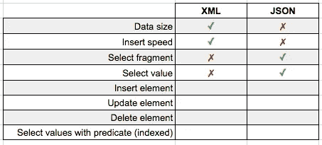

如果您查看最后两个查询的执行计划，很容易发现 XML 在检索数据方面还有很多工作要做:

XML:

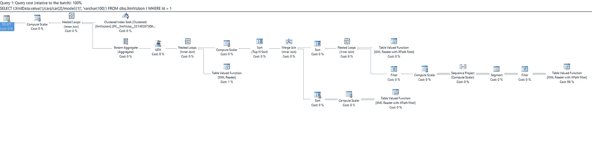

JSON:


## 创造

我们在上面看到，插入 XML 数据行比插入 JSON 数据行更快，但是如果我们想将新数据插入对象字符串本身，该怎么办呢？这里我想将属性“里程”插入到第一个汽车对象中:

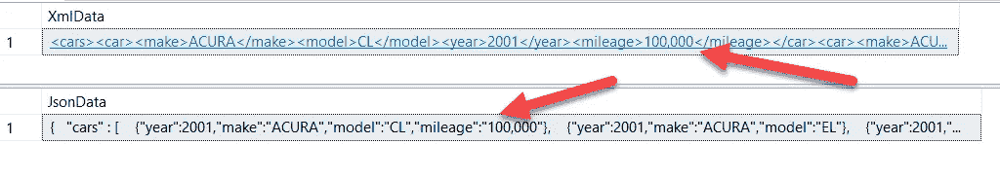

```
UPDATE t SET XmlData.modify('
insert <mileage>100,000</mileage>
into (/cars/car[1])[1]') 
FROM dbo.XmlVsJson t 
WHERE Id = 1UPDATE t SET JsonData = JSON_MODIFY(JsonData,
'$.cars[0].mileage','100,000') 
FROM dbo.XmlVsJson t 
WHERE Id = 1
```

除了更简洁的语法(`JSON_MODIFY()`本质上与`REPLACE()`相同)之外，JSON insert 运行时间为 22 毫秒，而 XML 为 206 毫秒。**又一个 JSON 赢了。**

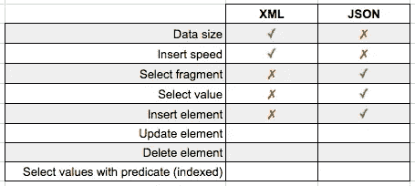

## 更新

让我们更新刚刚添加的里程属性，使其值为 110，000:

```
UPDATE t SET XmlData.modify('
replace value of (/cars/car[1]/mileage/text())[1]
with     "110,000"') 
FROM dbo.XmlVsJson t
WHERE Id = 1UPDATE t SET JsonData = JSON_MODIFY(JsonData, '$.cars[0].mileage','110,000') 
FROM dbo.XmlVsJson t
WHERE Id = 1
```

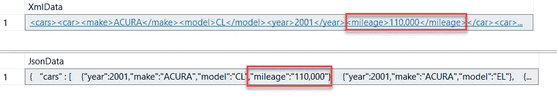

结果？ **JSON 的速度更快**，能够在 54 毫秒内完成这次更新，而 XML 则需要 194 毫秒。

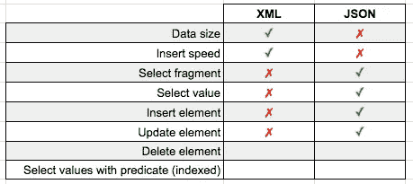

## 删除

删除大型字符串数据，DBA 的梦想。

让我们删除里程属性，撤销我们刚刚做的所有艰苦工作:

```
UPDATE t SET XmlData.modify('
delete /cars/car[1]/mileage[1]') 
FROM dbo.XmlVsJson t 
WHERE Id = 1UPDATE t SET JsonData = JSON_MODIFY(JsonData, '$.cars[0].mileage', null) 
FROM dbo.XmlVsJson t 
WHERE Id = 1
```

**JSON 不需要任何时间来重新加载，并再次战胜 XML**50 毫秒到 159 毫秒。

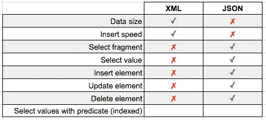

## 阅读第 2 部分:索引

因此，从上面我们可以看到，JSON 在从一行序列化数据中读取片段和属性时比 XML 更快。但是我们的 SQL Server 可能有很多行数据——索引数据解析在我们的匹配中表现如何？

首先，让我们扩展我们的数据——不是将我们所有的汽车对象存储在一个字段中，而是构建一个新表，让每辆汽车各占一行:

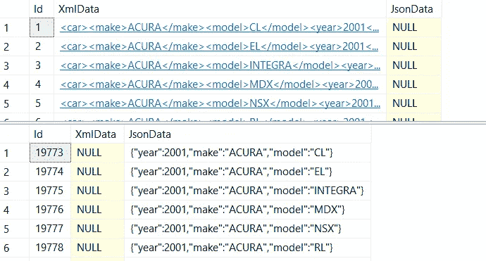

(once again, [full dataset at GitHub](https://gist.github.com/bertwagner/9a11650dce444fc22476f3e2c7e23307) if you are playing along at home)

现在我们的表中有了扩展的数据，让我们添加一些索引。SQL Server 中的 XML 数据类型有自己的索引类型，而 [JSON 只需要一个应用了常规索引的计算列](https://blog.bertwagner.com/one-sql-cheat-code-for-amazingly-fast-json-queries-1c2402b4b0d2)。

```
DROP INDEX IF EXISTS PXML_XmlData ON XmlVsJson2
CREATE PRIMARY XML INDEX PXML_XmlData
ON XmlVsJson2 (XmlData);ALTER TABLE dbo.XmlVsJson2
ADD MakeComputed AS JSON_VALUE(JsonData, '$.make')
CREATE NONCLUSTERED INDEX IX_JsonData ON dbo.XmlVsJson2 (MakeComputed)
```

*(注意:我还尝试添加了一个* [*XML 二级索引*](https://docs.microsoft.com/en-us/sql/relational-databases/xml/xml-indexes-sql-server) *以获得更好的性能，但是我无法让查询引擎在这样一个基本数据集上使用该二级索引)*

如果我们试图找到匹配谓词的所有行:

```
SELECT Id, XmlData 
FROM dbo.XmlVsJson2 t 
WHERE t.XmlData.exist('/car/make[.="ACURA"]') = 1SELECT Id, JsonData 
FROM dbo.XmlVsJson2 t 
WHERE JSON_VALUE(t.JsonData, '$.make') = 'ACURA'
```

XML 能够在 200 毫秒内过滤掉 96 行，JSON 在 9 毫秒内完成同样的任务。JSON 的最后胜利。

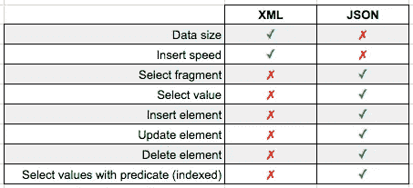

# 结论

如果您需要在 SQL Server 中存储和操作序列化的字符串数据，毫无疑问:JSON 是首选格式。尽管 JSON 的存储大小比它的 XML 前身稍大，但几乎在所有情况下，SQL Server 的 JSON 函数在速度上都优于 XML。

将所有旧的 XML 代码重写为 JSON 是否有足够的性能差异？可能不会，但每个案例都不一样。

有一点很清楚:新的开发应该考虑利用 SQL Server 的新 JSON 功能。

喜欢这篇文章吗？请推荐给它一颗绿色的心💚*下图。*

*在 SQL Server 2016+中，您还打算使用 XML 而不是 JSON 进行新的开发吗？我很想在下面的评论中知道为什么。*