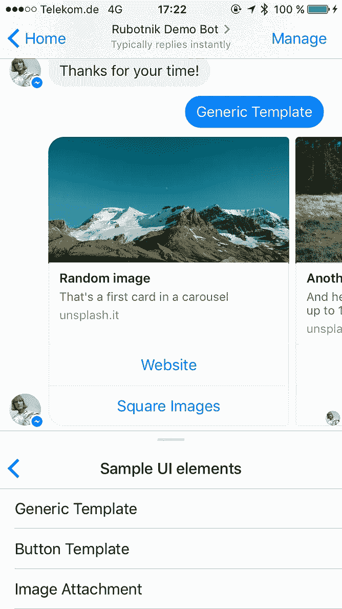
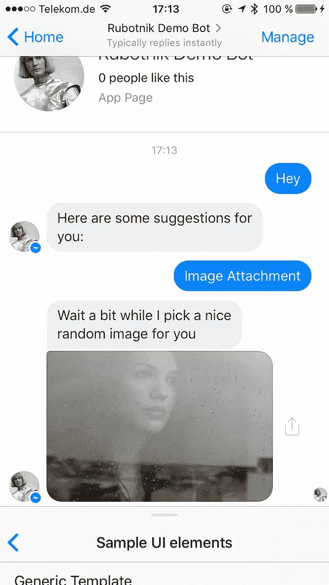
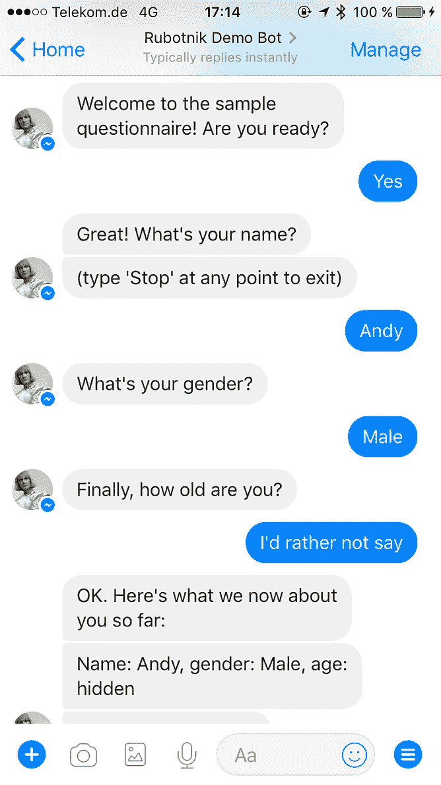

# Ya tvoy Rubotnik*。初学者友好的 Ruby 样板来构建你自己的信使机器人

> 原文：<https://medium.com/hackernoon/ya-tvoy-rubotnik-beginner-friendly-ruby-boilerplate-to-build-your-own-messenger-bot-9e5fc35ee53b>

## *如何快速获得过去无处不在的 echo 机器人教程，并建立一个助手，实际上是***的东西。只是克隆，调整和发射。能成为 bot 端框架吗？**

**

*The boilerplate’s title is inspired by Kraftwerk and, obviously, Ruby*

***参考发电厂乐团的单曲《机器人》(1978)**

# *这是从一个错误开始的*

*我不得不承认:作为一名曾经的记者，我的写作速度仍然比我想象的要快。事实证明，它也适用于代码。**在我的[“用 Ruby 构建你的第一个 Messenget 机器人”](https://hackernoon.com/smooth-coordinator-1427dce17f00)系列中，我彻底搞砸了**。尽管超过 6000 人看到了它，一些读者用它来创建自己的项目，但似乎没有人注意到这个巨大的设计缺陷。我滥用了 Facebook-messenger gem，当几个用户同时试图与教程机器人交谈时，他们的信息会混淆。当一个用户正在进行交互时，bot 会挂起正在进行的任务，来自任何其他用户的任何其他消息都会被视为会话线程中的下一步。那个 **吸**我拼命想弥补。我不得不重新思考架构，以处理来自不同用户的请求，并记住他们在对话中的位置。一个简单的重构导致了更多的重构，更多的重构，更多的重构……结果，我创造了一个简单的工具，它解决了许多关于机器人的设计问题，所以你不必自己去解决它们**。***

*M**eet**[**Rubotnik**](https://github.com/progapandist/rubotnik-boilerplate)——这是你开始使用 Ruby 聊天机器人为[脸书](https://hackernoon.com/tagged/facebook)Messenger——最大的消息平台——聊天的起点。在这个早期阶段，它更多的是一个概念验证，我还没有把它打包成一个独立的 gem，所以当你下载样板文件时，你可以看到它的内部是如何在文件夹中实现的。它还包含一些示例代码，您可以随意调整和替换。*

# *它的作用*

*   *您可以绑定关键字(“help”)，例如在*“help！”*或*“你能帮我一下吗”*你的机器人的功能(我们从现在开始称它们为“命令”)有一个简单的语法:`bind ‘help’, to: :give_help`。忘掉`case`，用一打`when`来解析你的输入。*
*   *你可以在样板文件的`Commands`模块中将所有机器人的逻辑作为单独的方法编写，并且可以将它们链接在一起，以创建与`next_command :method_name`的对话线程*
*   *您可以在便利类的帮助下生成 UI 元素:`UI::ImageAttachment.new(‘http://your.image/url’).send(@user)`(这也使得那些脸书的通用模板更容易生成)*
*   *您可以为您的机器人设置一个嵌套的持久菜单和一个问候屏幕。改变`rubotnik/persistent_menu.rb`和`rubotnik/bot_profile.rb`来创建你自己的。*
*   *它的[自述文件](https://github.com/progapandist/rubotnik-boilerplate)将带你完成所有必要的步骤，在脸书上连接你的机器人，并让它活起来。*
*   *这是一个独立的服务，运行在机架上(它使用 Puma 服务器的默认配置)。如果你有 web 应用程序的话，可以把它想象成 web 应用程序的框架。它默认启用了 [Sinatra](http://www.sinatrarb.com/) ，这样你就可以创建自己的 webhooks 并处理传入的 API 连接。*
*   *它已经准备好和 Heroku 一起使用了。在本地主机上完成测试后，只需执行`heroku create`和`heroku push origin master`即可。*

# *它没有做什么*

*   *它没有持久性，但是可以扩展到任何数据库。默认情况下，Rubotnik 具有简单的内存存储，可以跟踪连接的用户及其状态(参见`rubotnik/user.rb`和`rubotnik/user_store.rb`以了解它是如何实现的)。*
*   *它不能在 Rails 项目内部工作(这是将来可以考虑的特性之一)。另一方面，它可以通过 REST API 与你现有的 Rails app 对话。*

# *它是如何工作的*

*那么如何用 Rubotnik 来构建你的机器人呢？首先，确保你已经安装了 Heroku CLI 和 ngrok——我们将需要它们来进行开发，以及将你的机器人移植到云端。然后按照以下步骤操作:*

```
*git clone [git@github.com](mailto:git@github.com):progapandist/rubotnik-boilerplate.gitmv rubotnik-boilerplate NAME_OF_YOUR_PROJECTcd NAME_OF_YOUR_PROJECT rm -rf .git  # remove boilerplate’s git history git init     # track your own project*
```

*在您最喜欢的编辑器中打开项目，并查看一下`bot.rb`文件。已经写了一堆东西，构成了一个**演示机器人**的逻辑，你可以在这里[玩](https://m.me/455827908083164)。*

******

*The [bot](https://m.me/455827908083164) that demoes boilerplate features*

*它实现了一个简单的 API 调用示例，调用 [Google](https://hackernoon.com/tagged/google) Geocoding 来确定关于您的位置的详细信息，一个示例问卷来演示从用户消息中收集数据，它还呈现了一些脸书的 UI 元素来体验您自己的 bot 在用户体验方面可以提供什么。*

*如果您在这一点上不做任何更改，而只是按照样板文件自述文件中的[说明来安装](https://github.com/progapandist/rubotnik-boilerplate#setup)，您将获得演示机器人的精确副本。它让您了解样板文件中的内容，但是您可能想要构建自己的东西，对吗？然后快速浏览一下示例代码，用您自己的代码替换它。*

*请注意，所有繁重的工作(向 Facebook Messenger 平台发送数据和处理对您的机器人的 webhook 的传入请求)都是由 [facebook-messenger](https://github.com/hyperoslo/facebook-messenger) gem 完成的([那个来自挪威的家伙](https://github.com/jgorset)做得非常好，围绕他的项目的社区正在稳步增长)。Rubotnik 只是借用了它的 API，就像这样:*

*同样的逻辑也适用于回发，这是当用户与你的机器人 UI 中的按钮交互时触发的事件。*

*让我们仔细看看，在这个片段中发生了两件事:*

1.  *`bind ‘string'`是 Rubotnik 的 [DSL](https://en.wikipedia.org/wiki/Domain-specific_language) 的一个例子。*
2.  *`say`是一个助手功能，允许您通过简单的`say "Hello!"`向连接的用户发送文本消息*

*看一看`/commands/questionnaire.rb`,看看命令是如何链接在一起形成线程的。*

*查看[的自述文件](https://github.com/progapandist/rubotnik-boilerplate#working-with-boilerplate)并通读样板代码中的注释，以了解更多关于 DSL、助手函数以及在哪里应用它们的信息。*

# *这是怎么做到的*

*Rubotnik 的主要类叫做`MessageDispatch`和`PostbackDispatch`，它们可以在`/rubotnik`文件夹中找到。下面的片段展示了如何实现消息分派:*

*一个`@message`实例变量可以通过公共的 Rubotnik 名称空间在任何地方访问，并表示任何给定的传入消息。它是 facebook-messenger 的`Facebook::Messenger::Incoming::Message`类的一个实例，拥有它的所有属性(参考 facebook-messenger 的[自述文件](https://github.com/hyperoslo/facebook-messenger)*

```
*@message.id          # => 'mid.1457764197618:41d102a3e1ae206a38'
@message.sender      # => { 'id' => '1008372609250235' }
@message.seq         # => 73
@message.sent_at     # => 2016-04-22 21:30:36 +0200
@message.text        # => 'Hello, bot!'
@message.attachments # => [ { 'type' => 'image', 'payload' => { 'url' => 'https://www.example.com/1.jpg' } } ]*
```

*对于`@postback`也是一样，那是`Facebook::Messenger::Incoming::Postback`的一个实例*

*`@user`引用连接的用户，是`user.rb`中定义的`User`类的实例。这个类的要点是保持用户的 facebook ID，并跟踪将要执行的命令。您可以为 state 添加自定义容器(就像使用`answers`属性的情况一样，用于在`questionnaire.rb`中跟踪用户的回答)。*

*这几乎是所有不那么秘密的酱料，确保所有用户彼此独立地被服务，并且与他们的对话准确地在它停止的地方继续，即使在长时间中断之后。*

# *如何进行现场直播*

*一旦你完成了你的机器人的构建和测试，只要从你的控制台创建一个 heroku 应用并运行`git push heroku master`。然后在脸书开发者控制台更新你的 webhook，就这样！*

**

# *如何说如果你❤️它或👺它*

*目前，Rubotnik 只是一些文件夹中的一堆代码。它是生的。这是一个概念证明。它需要抛光。一些代码与实际的“框架”逻辑有关，而其他代码只是演示示例 bot 的功能。它到处都有`require_relative`语句。有一堆调试语句旨在帮助理解 bot 如何执行。但是不能让他们在那里呆太久。*

*我的一些做法可能会遭到经验丰富的程序员的反对。这可以理解，我去年才发现 Ruby magic。*

*这正是我邀请大家合作的原因。你可以随意叉出样板文件，制作公关，或者只是[给我发邮件](mailto:andy.barnov@gmail.com)，我会把你添加为主要回购的合作者。*

*我还在寻找用一些真实世界的例子来测试 Rubotnik 的方法，所以如果你打算将你的服务与 Messenger 集成，请联系我，我会帮助你。*

# *接下来呢？*

*显然，Rubotnik 应该被变成一颗宝石。但是由于它与 facebook 信使紧密相连，我还不知道从哪里开始。它可能还应该有`rails new`风格的生成器来为新项目创建目录结构。*

*我还在研究 [wit.ai](https://wit.ai/) 和 [api.ai](https://api.ai/) 工具，以实现与 NLU 引擎的轻松交互，这将使你的机器人成为更好的健谈者。*

**推荐💚这篇文章中等，敬请关注！**

# *🤖机器人力量！🤖*

*[](http://bit.ly/HackernoonFB)**[](https://goo.gl/k7XYbx)**[](https://goo.gl/4ofytp)*

> *[黑客中午](http://bit.ly/Hackernoon)是黑客如何开始他们的下午。我们是这个家庭的一员。我们现在[接受投稿](http://bit.ly/hackernoonsubmission)并乐意[讨论广告&赞助](mailto:partners@amipublications.com)机会。*
> 
> *如果你喜欢这个故事，我们推荐你阅读我们的[最新科技故事](http://bit.ly/hackernoonlatestt)和[趋势科技故事](https://hackernoon.com/trending)。直到下一次，不要把世界的现实想当然！*

**