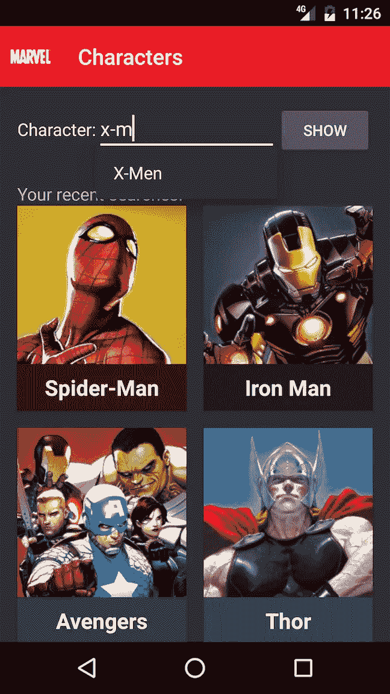
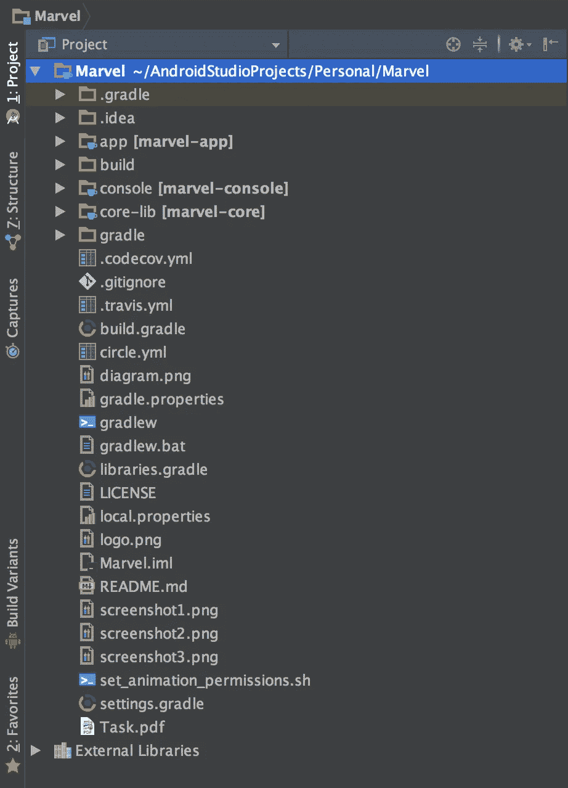
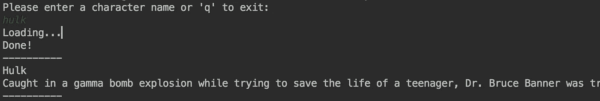
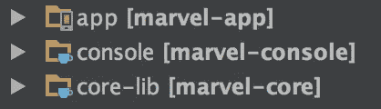
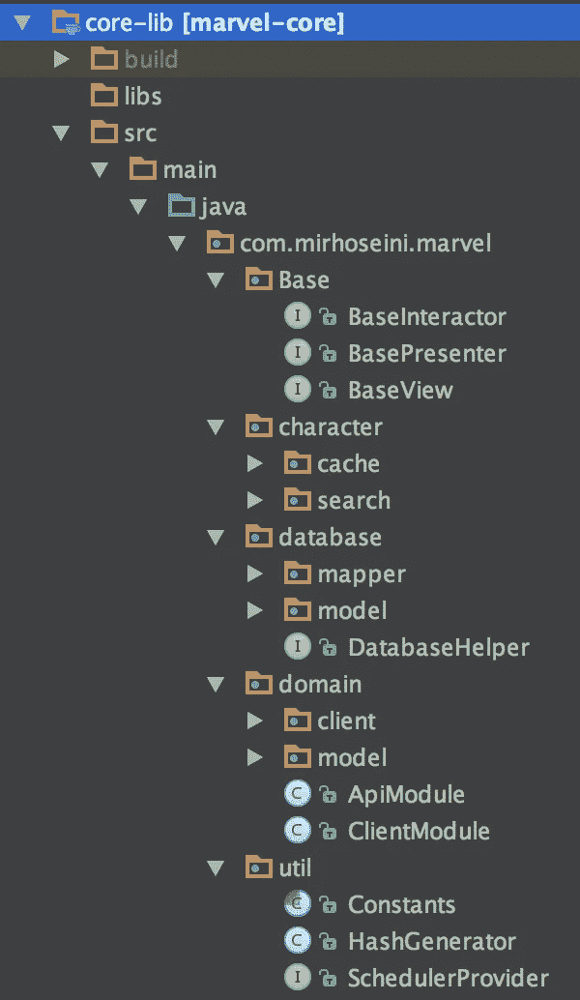
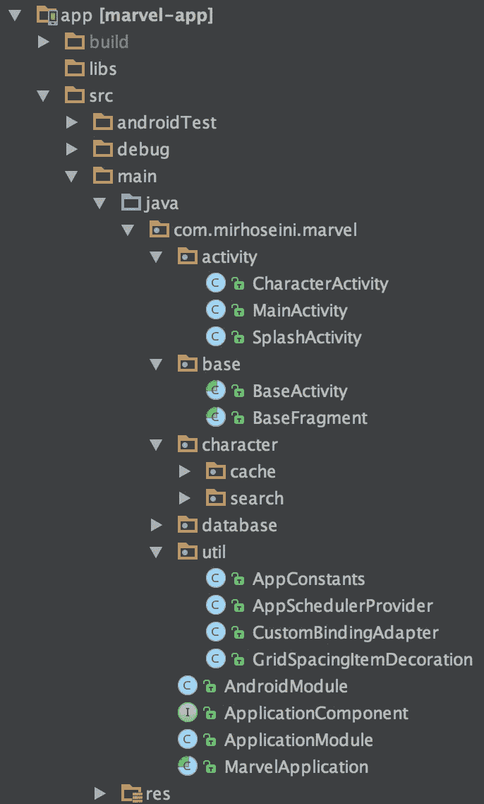

# 另一篇 MVP 文章——第 1 部分:让我们了解这个项目

> 原文：<https://medium.com/hackernoon/yet-another-mvp-article-part-1-lets-get-to-know-the-project-d3fd553b3e21>

*使用* ***MVP*** *，****rx Java****，****Dagger 2****，****retro fit 2****，****Test****，以及所有全新的现代方法和库*

我发现了一些关于在[*stack overflow*](https://stackoverflow.com/questions/tagged/mvp)*上使用 **MVP** 的未解问题，这激发了我写一系列文章的强烈兴趣，提供了一个示例项目(即我自己的实践经验……)*

*去年我熟悉了 **MVP、**tuxedo 开发，并查看了示例和教程。我花了很长时间处理和连接这个未知的大拼图的不同部分。我能提到的最有用的网站是 [caster.io](http://caster.io/) ，它总是充满了新的 [Android](https://hackernoon.com/tagged/android) 视频教程。*

*解释 MVP 本身可能看起来很奇怪！因为有很多文章解释了它是如何工作的，以及如何打破层等等，但很少有例子有足够的意见，这有助于新的方法。*

# *变化是如何开始的…*

**

*一切从 [**开始扎实**](https://en.wikipedia.org/wiki/SOLID_%28object-oriented_design%29) (面向对象设计原则)，感谢亲爱的 [**罗伯特·c·马丁**](https://en.wikipedia.org/wiki/Robert_C._Martin) 。*

*根据[维基百科](https://en.wikipedia.org/wiki/SOLID_%28object-oriented_design%29)上的**固体**文章，它代表:*

> ***- S** (SRP):单一责任原则*
> 
> ***- O** (OCP):开/关原理*
> 
> ***- L** (LSP):利斯科夫替代原理*
> 
> ***- I** (ISP):接口隔离原理*
> 
> ***- D** (DIP):依存倒置原则*

*设法遵循所有五项原则。我会尽力在我的示例项目中逐一指出，使其更加透明。*

*根据这个完美的**MVP**文章，它代表:*

> *-**模型**是将在视图(用户界面)中显示的数据。*
> 
> *-**视图**是一个界面，它显示数据(模型)并将用户命令(事件)发送给演示者，以对该数据进行操作。视图通常会引用其演示者。*
> 
> *—**演示者**是“中间人”(由 MVC 中的控制器扮演)，并且引用了视图和模型。*

## *模特？！！！*

**

> ***请注意“模型”**这个词有误导性！！！*
> 
> *更确切地说，应该是**业务逻辑检索或操作模型**。*
> 
> *例如:如果您有一个在数据库表中存储`User`的数据库，并且您的视图想要显示一个用户列表，那么演示者将有一个对您的数据库业务逻辑(像 DAO)的引用，演示者将从这里查询一个用户列表。*

# *你能多解释一下 MVP 吗？*

*不不。！只要[谷歌](https://www.google.com/#q=android+mvp)你就会找到关于这种新方法的所有理论(或者至少看一下这篇[文章](http://hannesdorfmann.com/mosby/mvp/))。)*

# *这个示例项目是关于什么的？*

*这个应用程序是一个漫威的人物搜索应用程序，是一个简单的安卓客户端，用于 Marvel.com。这个应用程序是由我创建的，作为 [smava GmbH](https://www.smava.de/) 技术团队技术评估的一部分。*

**

*Marvel Android Application screenshot*

*该应用程序必须搜索字符，查看信息和缓存最后的搜索。*

*该项目使用 **MVP** 实现，包含现代 Android 开发概念和库，可以真正改变你的职业生活！*

*我将尽我所能在这篇文章的不同部分解释每件事，即:Dagger、改型、RxJava 和测试。*

*该项目还有使用[Circleci.com](https://circleci.com)&[Travis-ci.org](https://travis-ci.org)的持续集成(CI)和使用 [Codecov.io](https://codecov.io) 的代码覆盖报告，以及使用 [google](https://hackernoon.com/tagged/google) 新的 Firebase 服务，您可以自己学习，这在某种程度上与本文无关。*

*在开始之前，您可以通过阅读 [README](https://github.com/mohsenoid/marvel/blob/master/README.md) 和 [Task](https://github.com/mohsenoid/marvel/blob/master/Task.pdf) 文件来更加熟悉这个项目。*

# *好吧，让我看看你有什么:*

* [## 莫森诺德/漫威

### smava GmbH 指定的漫威-漫威角色 Android 应用程序

github.com](https://github.com/mohsenoid/marvel) 

让我们来看看这个项目的结构。

我个人喜欢从事干净代码的工作，所以我真的很喜欢将一个项目分成一些有意义的部分，这些部分可以帮助我和整个团队更清楚地了解任务。

## 模块:

项目由两个主要和一个 java 控制台示例模块组成:

1.  [**app(漫威-app)**](https://github.com/mohsenoid/marvel/tree/master/app) :安卓应用模块
2.  [**【核心库(漫威核心)**](https://github.com/mohsenoid/marvel/tree/master/core-lib) :核心库模块
3.  [**【控制台(marvel-console)**](https://github.com/mohsenoid/marvel/tree/master/console):Java 控制台示例模块

*app* 模块包含 **MVP** 的 Android **View** 层，而其他层(**Model**&**Presentation**)都放在 *core* 中，core 是纯 java，编译后就是一个 jar 库。

## 把代码分成模块有什么用？！

*   首先，分离 Android 应用模块提醒你不要将**上下文**或者任何 Android 相关对象传递给 **Presenter** 或者 **Model！…所以请停止这样做！！！**
*   其次，你可以确保*核心*部分足够完整，你甚至可以将它与另一个 **UI** (即: [Java 控制台示例](https://github.com/mohsenoid/marvel/tree/master/console)、Web Applet 一起使用，或者作为一个预测，甚至在不久的将来，一个使用 Java 的 iOS 应用程序！！)
*   最后，我和我们的团队真的很喜欢这样开发应用程序！整个团队成员受益于将*核心*分开，甚至我们将*核心*放在一个 git 子模块中，在不同的项目中使用相同的*核心*和不同的 **UI** 。

The result of java console sample module which works the same as Android Application with the core

## 一个小模块的名字清理:

为了让模块看起来更方便和漂亮，你可以编辑 **settings.gradle** 文件，如下所示:

这给了你这个干净的外观:

并为输出 APK 文件产生一个相关名称。

## 如何避免不同模块中的版本冲突和冗余？

使用 Gradle 特性可以方便地生成一个干净的 *build.gradle* 文件，并避免项目模块中的版本冲突和冗余。

首先，将项目的所有依赖项放在一个 Gradle 文件中，比如 [**libraries.gradle**](https://github.com/mohsenoid/marvel/blob/master/libraries.gradle) :

然后将其添加到您的项目*main*[**build . gradle**](https://github.com/mohsenoid/marvel/blob/master/build.gradle)文件中(注意最后一行):

最后，在你的*应用*模块 [**build.gradle**](https://github.com/mohsenoid/marvel/blob/master/app/build.gradle) 文件中使用它(注意依赖部分):

还有你的*核心*模块[T21 文件:](https://github.com/mohsenoid/marvel/blob/master/core-lib/build.gradle)* 

# *核心模块内部发生了什么？*

**

*core module’s files structure*

*   *[**基础包**](https://github.com/mohsenoid/marvel/tree/master/core-lib/src/main/java/com/mirhoseini/marvel/base) **:** 包含所有基础接口，这些接口包含所有*交互器*、*演示者、*和*视图*的通用方法。*
*   *[**角色包**](https://github.com/mohsenoid/marvel/tree/master/core-lib/src/main/java/com/mirhoseini/marvel/character) **:** 保存应用程序的主要功能，即搜索和缓存漫威角色信息。*
*   *[**数据库包**](https://github.com/mohsenoid/marvel/tree/master/core-lib/src/main/java/com/mirhoseini/marvel/database) **:** 缓存字符数据是使用本示例中的 [OrmLite](http://ormlite.com/) 完成的，我不会对此做过多解释，因为这与主题无关，但您可以慢慢查看所有代码！*
*   *[**域包**](https://github.com/mohsenoid/marvel/tree/master/core-lib/src/main/java/com/mirhoseini/marvel/domain) **:** 包含使用 retrofit2 和 RxJava 库连接网络 API 的代码。*
*   *[**util 包**](https://github.com/mohsenoid/marvel/tree/master/core-lib/src/main/java/com/mirhoseini/marvel/util) **:** 充满了项目所需的有用类，即:*常量*保存所有核心常量变量， *HashGenerator* 用于漫威的 API 调用哈希参数， *SchedulerProvider* 是一个调度程序接口，帮助实现 **RxJava** 和 **RxAndroid** 多线程(我将在本文中详细解释*

**

**“You wouldn’t wire a lamp directly to your house”, —* [***Novoda***](https://www.novoda.com/blog/designing-something-solid/)*

*参考 [**依存倒置原则**](https://en.wikipedia.org/wiki/Dependency_inversion_principle) 的**坚实**，*“一个人应该依靠抽象而不依靠具体”或*参考*到* [*这篇荒诞的文章作者* ***诺沃达***](https://www.novoda.com/blog/designing-something-solid/) *“你不会把一盏灯直接连到你家”*！，两个模块之间的所有链接( *app* & *core* )都是用接口实现的，用 dagger 连接起来。*

# *，app 模块内部是怎么回事？*

**

*app module’s files structure*

*   *[**活动包**](https://github.com/mohsenoid/marvel/tree/master/app/src/main/java/com/mirhoseini/marvel/activity) **:** 容纳 3 个活动，是 Android 应用 UI 的脊梁。*
*   *[**基础包**](https://github.com/mohsenoid/marvel/tree/master/app/src/main/java/com/mirhoseini/marvel/base) **:** 拥有 2 个活动和片段的基础抽象类，包含了注入的一般方法，可以用于其他一般方法。*
*   *[**字符包**](https://github.com/mohsenoid/marvel/tree/master/app/src/main/java/com/mirhoseini/marvel/character) **:** 保存了应用程序的主要特性，该应用程序是使用两个*搜索* & *缓存*片段实现的。*
*   *[**数据库包**](https://github.com/mohsenoid/marvel/tree/master/app/src/main/java/com/mirhoseini/marvel/database) **:** 包含使用 [OrmLite](http://ormlite.com) 的 Android 端数据库代码，跑题了！*
*   *[**util 包**](https://github.com/mohsenoid/marvel/tree/master/app/src/main/java/com/mirhoseini/marvel/util) **:** 充满了项目所需的有用的 Android 端类，即: *AppConstants* 扩展了 *core* 的 *Constants* 类并包含应用常量变量， *AppSchedulerProvider* 实现了 *core* 的 *SchedulerProvider* 并提供了 **RxAndroid(这是一个简短的信息，我将在本文的相关部分进行详细解释)。***

# *暂时就这样了…*

**

*请从 GitHub 中克隆[项目 repo，并更加熟悉它，因为在下一部分，我将解释更多关于 dagger 的内容，以及它如何帮助连接模块和层的不同对象。](https://github.com/mohsenoid/marvel)*

*我期待您的评论，并帮助我对这篇文章进行更多的改进。*

*如果你觉得这篇文章有用就分享吧，关注我更多文章 [Mohsen Mirhoseini](https://medium.com/u/6a4ed0c4dd2c?source=post_page-----d3fd553b3e21--------------------------------) 。*

> *未完待续…*

* [## 另一篇 MVP 文章——第 2 部分:Dagger 如何帮助项目

### 使用 MVP、RxJava、Dagger 2、Retrofit2、Test 和所有全新的现代技术实现一个示例 Android 应用程序…

hackernoon.com](https://hackernoon.com/yet-another-mvp-article-part-2-how-dagger-helps-with-the-project-90d049a45e00) 

> [黑客中午](http://bit.ly/Hackernoon)是黑客如何开始他们的下午。我们是 [@AMI](http://bit.ly/atAMIatAMI) 家庭的一员。我们现在[正在接受投稿](http://bit.ly/hackernoonsubmission)并乐意[讨论广告&赞助](mailto:partners@amipublications.com)机会。
> 
> 如果你喜欢这个故事，我们推荐你阅读我们的[最新科技故事](http://bit.ly/hackernoonlatestt)和[趋势科技故事](https://hackernoon.com/trending)。直到下一次，不要把世界的现实想当然！

*