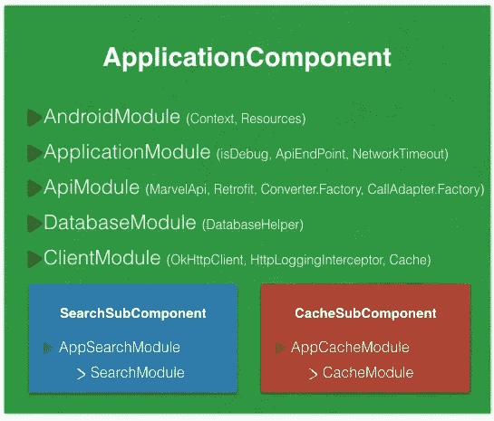

# 另一篇 MVP 文章——第 2 部分:Dagger 如何帮助项目

> 原文：<https://medium.com/hackernoon/yet-another-mvp-article-part-2-how-dagger-helps-with-the-project-90d049a45e00>

*实现示例* [*安卓*](https://hackernoon.com/tagged/android) *应用使用****MVP*******rx Java*******匕首 2*******改装 2*******测试*******

# **本文前情提要…**

** [## 另一篇 MVP 文章——第 1 部分:让我们了解这个项目

### 使用 MVP、RxJava、Dagger 2、Retrofit2、Test 和所有全新的现代技术实现一个示例 Android 应用程序…

hackernoon.com](https://hackernoon.com/yet-another-mvp-article-part-1-lets-get-to-know-the-project-d3fd553b3e21) 

让我们假设你已经学习了 [part1](/@mohsenoid/yet-another-mvp-article-part-1-lets-get-to-know-the-project-d3fd553b3e21) ，这意味着你知道关于[项目](https://github.com/mohsenoid/marvel)的模块和[结构](https://hackernoon.com/tagged/structure)的一切。

现在让我们继续…** 

# **你能解释一下 Dagger 如何在内核中连接模块和 MVP 层吗？**

****

**Dagger diagram**

**[**Dagger2**](https://google.github.io/dagger/) 使用**模块**、**组件、**和**子组件**来了解**注入**依赖项的内容和方式。你可以找到更多的文章来解释 Dagger 内部发生的事情。**

**从匕首图的底部到顶部，我可以提到*缓存模块*和*搜索模块*，它们提供**视图**和**演示者**:**

****

**“Trying new shoes doesn’t require you to saw your feet off”!, — [**Novoda**](https://www.novoda.com/blog/designing-something-solid/)**

**首先，注意提供方法的返回类型，它们都返回接口，而不是接口的实现！这就是我们如何替换实现以进行进一步测试的方法，我还必须提到这是一个混合了 [**【打开/关闭】**](https://en.wikipedia.org/wiki/Open/closed_principle)[**lis kov 替换**](https://en.wikipedia.org/wiki/Liskov_substitution_principle) 和 [**依赖倒置**](https://en.wikipedia.org/wiki/Dependency_inversion_principle) 和 [**稳固**](https://www.novoda.com/blog/designing-something-solid/) 的原则。**

**其次，不要忘记我们仍然在*核心*模块中，我们不知道**视图**将如何使用它。**

**最后，这两个模块被 *CacheSubComponent* 和 *SearchSubComponent* 使用，它们是 *ApplicationComponent* 的子组件，我将在 *app* 模块中解释。**

**我们在*内核*中增加了两个模块来帮助我们提供改进的依赖关系，即 [*ApiModule*](https://github.com/mohsenoid/marvel/blob/master/core-lib/src/main/java/com/mirhoseini/marvel/domain/ApiModule.java) 和[*client module*](https://github.com/mohsenoid/marvel/blob/master/core-lib/src/main/java/com/mirhoseini/marvel/domain/ClientModule.java)*。熟悉[改装 2](https://square.github.io/retrofit/) 将有助于你理解里面的东西，不过，我会在本文接下来的部分解释一切。***

**这两个模块和 DatabaseModule 都被 ApplicationComponent 使用，我将在 *app* 模块中解释。**

# **...还有匕首在 *app* 模块里面是怎么回事？**

****

***app* 模块最重要的匕首部分是 [*应用组件*](https://github.com/mohsenoid/marvel/blob/master/app/src/main/java/com/mirhoseini/marvel/ApplicationComponent.java) ，它使用 [*安卓模块*](https://github.com/mohsenoid/marvel/blob/master/app/src/main/java/com/mirhoseini/marvel/AndroidModule.java) 和 [*应用模块*](https://github.com/mohsenoid/marvel/blob/master/app/src/main/java/com/mirhoseini/marvel/ApplicationModule.java) 提供所有的应用注入。**

# ***里面有什么* [*应用组件*](https://github.com/mohsenoid/marvel/blob/master/app/src/main/java/com/mirhoseini/marvel/ApplicationComponent.java) *:***

## ****1。**[**Android module**](https://github.com/mohsenoid/marvel/blob/master/app/src/main/java/com/mirhoseini/marvel/AndroidModule.java)**:****

**该模块提供了应用**上下文**和应用**资源**，在为 android 开发以访问例如**服务**或不同的**资源**时，这些对于注入总是很方便的。一些开发人员在 ApplicationModule 中实现了这个模块，但是我更喜欢把它分开，以便获得更多的空间。**

**该模块将在[*marvel Application*](https://github.com/mohsenoid/marvel/blob/master/app/src/main/java/com/mirhoseini/marvel/MarvelApplication.java)类中创建，该类扩展了**应用程序**类:**

**正如你可能已经提到的，这个类是抽象的，通过实现 *initApplication()* 方法在 [debug](https://github.com/mohsenoid/marvel/blob/master/app/src/debug/java/com/mirhoseini/marvel/MarvelApplicationImpl.java) 或 [release](https://github.com/mohsenoid/marvel/blob/master/app/src/release/java/com/mirhoseini/marvel/MarvelApplicationImpl.java) buildTypes 中完成，这对于发布版本或调试版本来说非常方便。**

**在这个示例中，我使用了 debug[*MarvelApplicationImpl*](https://github.com/mohsenoid/marvel/blob/master/app/src/debug/java/com/mirhoseini/marvel/MarvelApplicationImpl.java)来种植 [Timber](https://github.com/mohsenoid/marvel/blob/master/app/src/debug/java/com/mirhoseini/marvel/MarvelApplicationImpl.java) 库，以避免发布版本中的木材日志:**

## ***2。* [*应用模块*](https://github.com/mohsenoid/marvel/blob/master/app/src/main/java/com/mirhoseini/marvel/ApplicationModule.java) *:***

**几乎所有的应用程序要求都在本模块中提供，**

*   ****isDebug** :使用 BuildConfig。调试布尔变量，用于检查应用程序的运行实例是否处于调试模式，并使用它在 logcat 中记录网络 API 调用。**
*   ****networkTimeoutInSeconds，cacheSize，cacheMaxAge，cacheMaxStale，cacheDir** :提供创建 OkHttp 客户端进行改造时使用的网络参数。**
*   ****端点**:提供 API 的端点用于改造。**
*   ****appScheduler** :提供 RxAndroid 调度程序，我将在 RxJava 部分解释。**
*   ****isConnect** :提供处理离线情况的网络状态。**

## **3. [ApiModule](https://github.com/mohsenoid/marvel/blob/master/core-lib/src/main/java/com/mirhoseini/marvel/domain/ApiModule.java) ， [ClientModule](https://github.com/mohsenoid/marvel/blob/master/core-lib/src/main/java/com/mirhoseini/marvel/domain/ClientModule.java) 从核心**

## **4.…和 [**数据库模块**](https://github.com/mohsenoid/marvel/blob/master/app/src/main/java/com/mirhoseini/marvel/database/DatabaseModule.java)**

## **5.子组件:**

**关于 **Dagger** 的好处是**子组件**，你可以将子组件添加到你的主*应用组件*中，并使用其中的所有提供者并添加你自己的。**

**在这个例子中，[*search sub component*](https://github.com/mohsenoid/marvel/blob/master/app/src/main/java/com/mirhoseini/marvel/character/search/SearchSubComponent.java)和[*cache sub component*](https://github.com/mohsenoid/marvel/blob/master/app/src/main/java/com/mirhoseini/marvel/character/cache/CacheSubComponent.java)加起来就是 *ApplicationComponent* 并使其更加辉煌。**

****

**让我们来看看…**

# ***搜索子组件和缓存子组件:***

**让我们再来看看应用程序组件:**

**如你所见，我们有 *inject* 方法来帮助注入，但是那些*加*方法是什么？！**

**首先不得不提的是 inject 和 plus 就是这个名字！！你可以把它重新命名为任何你喜欢的名字，并负责方法的输入和输出，以了解它们的用途！但是请不要乱用这个名字，因为你的团队成员稍后必须阅读这个代码…**

**使用*加*方法，你可以要求 Dagger 将一个**子组件**添加到*应用组件*中，并在那个**子组件中执行*注入*方法。****

***加*方法采用一个**模块**并使用那个**模块返回一个**子组件**。****

**让我们仔细看看:**

# **嗯嗯嗯…匕首集成从哪里开始？**

**通过对[清单](https://github.com/mohsenoid/marvel/blob/master/app/src/main/AndroidManifest.xml)稍作修改，我们可以要求 Android 使用 MarvelApplication 实现作为我们应用的起点:**

**并且在 **MarvelApplication** 类中，我们通过扩展 [**BaseActivity**](https://github.com/mohsenoid/marvel/blob/master/app/src/main/java/com/mirhoseini/marvel/base/BaseActivity.java) 和 [**BaseFragment**](https://github.com/mohsenoid/marvel/blob/master/app/src/main/java/com/mirhoseini/marvel/base/BaseFragment.java) 类，一次创建应用组件，并在**活动**和**片段**中使用。它们都是抽象的，并且 *injectDependencies* 方法必须在活动或片段内部实现。**

# **如何把自己淹死在匕首里面？！**

****

**如果你喜欢，你可以做更多的匕首！**

**看看这篇[文章](http://frogermcs.github.io/inject-everything-viewholder-and-dagger-2-example/)，它解释了如何对所有东西进行 Daggerify 我已经在这个示例项目中通过使用 app 模块中的[*AppSearchModule*](https://github.com/mohsenoid/marvel/blob/master/app/src/main/java/com/mirhoseini/marvel/character/search/AppSearchModule.java)和*AppCacheModule**从*核心*模块扩展了 *SearchModule* 和 *CacheModule* 。***

# *这就是魔法是如何发生的，现在就这样…*

**

*请从 GitHub 克隆[项目 repo，并更加熟悉它，因为在下一部分，我将解释更多关于改进以及它如何帮助网络 API 调用和使用它的缓存。](https://github.com/mohsenoid/marvel/)*

*我期待您的评论，并帮助我对这篇文章进行更多的改进。*

*如果你觉得这篇文章有用就分享吧，关注我更多文章 [Mohsen Mirhoseini](https://medium.com/u/6a4ed0c4dd2c?source=post_page-----90d049a45e00--------------------------------) 。*

> *未完待续…*

* [## 另一篇 MVP 文章——第 3 部分:使用改进调用 API

### 使用 MVP、RxJava、Dagger 2、Retrofit2、Test 和所有全新的现代技术实现一个示例 Android 应用程序…

hackernoon.com](https://hackernoon.com/yet-another-mvp-article-part-3-calling-apis-using-retrofit-23757f4eee05) 

> [黑客中午](http://bit.ly/Hackernoon)是黑客如何开始他们的下午。我们是阿美族家庭的一员。我们现在[接受投稿](http://bit.ly/hackernoonsubmission)并乐意[讨论广告&赞助](mailto:partners@amipublications.com)机会。
> 
> 如果你喜欢这个故事，我们推荐你阅读我们的[最新科技故事](http://bit.ly/hackernoonlatestt)和[趋势科技故事](https://hackernoon.com/trending)。直到下一次，不要把世界的现实想当然！

*