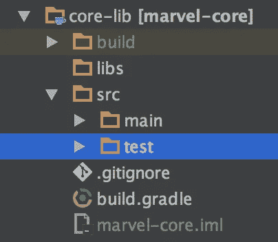
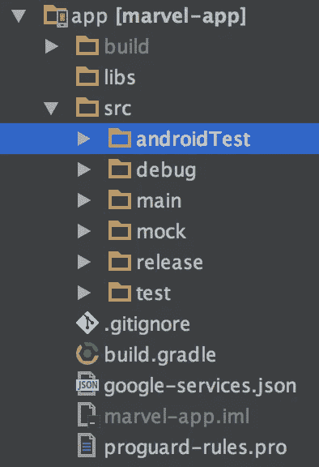

# 另一篇 MVP 文章——第 5 部分:混合使用匕首和浓缩咖啡的写作测试

> 原文：<https://medium.com/hackernoon/yet-another-mvp-article-part-5-writing-test-using-a-mixture-of-dagger-and-espresso-15c638182706>

*实现示例* [*安卓*](https://hackernoon.com/tagged/android) *应用使用****MVP*******rx Java*******匕首 2*******改装 2*******测试*******

# **本文前情提要…**

**[](https://hackernoon.com/yet-another-mvp-article-part-4-rxjava-and-rxandroid-knows-how-to-response-cde42ccc4958) [## 另一篇 MVP 文章——第 4 部分:RxJava 和 RxAndroid 知道如何响应

### 使用 MVP、RxJava、Dagger 2、Retrofit2、Test 和所有全新的现代技术实现一个示例 Android 应用程序…

hackernoon.com](https://hackernoon.com/yet-another-mvp-article-part-4-rxjava-and-rxandroid-knows-how-to-response-cde42ccc4958) 

假设您已经学习了 [part1](/@mohsenoid/yet-another-mvp-article-part-1-lets-get-to-know-the-project-d3fd553b3e21#.6y9ze7e55) 、 [part2](/@mohsenoid/yet-another-mvp-article-part-2-how-dagger-helps-with-the-project-90d049a45e00#.62mdwkqwj) 、 [part3](/@mohsenoid/yet-another-mvp-article-part-3-calling-apis-using-retrofit-23757f4eee05) 和 [part4](/@mohsenoid/yet-another-mvp-article-part-4-rxjava-and-rxandroid-knows-how-to-response-cde42ccc4958#.mzdr2fow8) ，这意味着您了解了关于[示例项目的](https://github.com/mohsenoid/marvel)模块和结构的一切，也更加熟悉了 **Dagger** 在布线 **MVP** 层中的用法，并且知道了**改型**用于连接到[网络](https://hackernoon.com/tagged/network)

现在让我们继续…** 

# **测试，测试，测试…为什么？**

**当你在开发一个应用程序或任何软件项目时，通常产品负责人会带来新的想法和特性，使项目更加光彩夺目！所以你开始开发让每个人都开心的方式，也不要错过最后期限，但是天知道你是如何通过添加新的特性代码和改变其他模块来适应你的新代码，从而破坏了项目的其他部分。**

****

**你完成你的工作，运行应用程序，检查新功能是否工作正常，希望你没有弄坏任何东西。你发布一个版本给 QA 测试，然后尽快离开办公室！！！**

**长话短说…**

## **对口！**

**您已经花了足够的时间编写了一些测试来检查您的应用程序功能的所有部分，在将您的更改推入 repo 后，通过使用 CI(持续集成)服务，您将获得测试通过或失败的完整报告。**

## **加油，写作考试很难…**

**我相信在 2 或 3 个版本发布后发现 bug 比在每次特性开发和代码更改后编写一些简单的测试要困难得多。**

# **让我们开始测试…**

**按'[](https://developer.android.com/studio/test/index.html)**':****

> **Android Studio 旨在简化测试。只需几次点击，您就可以设置在本地 JVM 上运行的 JUnit 测试或在设备上运行的插装测试。当然，您也可以通过集成测试框架来扩展您的测试能力，例如在您的本地单元测试中测试 Android API 调用的 [Mockito](https://github.com/mockito/mockito) ，以及在您的测试中练习用户交互的 [Espresso](https://developer.android.com/topic/libraries/testing-support-library/index.html#Espresso) 或 [UI Automator](https://developer.android.com/topic/libraries/testing-support-library/index.html#UIAutomator) 。您可以使用[浓缩咖啡测试记录器](https://developer.android.com/studio/test/espresso-test-recorder.html)自动生成浓缩咖啡测试。**

**…，所以 IDE 支持测试的一切，别太懒了！**

**Android Studio 支持两种不同类型的测试:**

*   **JUnit 测试:测试 Java 代码，不需要 Android 设备或 SDK。**
*   **仪器测试:大部分时间使用 Android 设备测试应用程序功能(通常是 UI 反应)。**

**运行测试的要点是**断言**每个临界点并检查它是否正确工作。有不同类型的断言，您将在这个示例项目中熟悉其中的一些。**

**回到示例项目，我们有两个不同的模块，*核心*和*应用*。核心模块是纯 java 的，所以每次测试都只使用 JUnit 测试:**

****

**core module test folder**

**不要忘记 JUnit 测试放在 src 的 test 文件夹中，在主文件夹的旁边。包装与主要源代码相同。**

***app* 模块包含 Android 和 Java 代码，所以我们需要 JUnit 和 androidTests:**

****

**app module test & androidTest folders**

# **核心模块 JUnit 测试:**

**我写了一个简单的 JUnit test "[**searchinactortest**](https://github.com/mohsenoid/marvel/blob/master/core-lib/src/test/java/com/mirhoseini/marvel/character/search/SearchInteractorTest.java)" which test "[**SearchInteractor**](https://github.com/mohsenoid/marvel/blob/master/core-lib/src/main/java/com/mirhoseini/marvel/character/search/SearchInteractor.java)"类功能。让我们来看看:**

**首先，请记住，通过将测试类保存在被测试类的同一个包中，您可以访问该类和包中的所有内容，而无需将它们公开，以便从其他包中访问。**

**其次，在这个示例中，我们使用了 mocking，这意味着从一些源代码部分创建一个模型，并以您想要的方式使用它们。在这个示例中，我们模拟了两个主要的类，我们不希望它们以正常的方式运行:**

*   ****MarvelApi** :使用这行代码处理网络 Api 调用:**

```
**api = mock(MarvelApi.class)**
```

*   ****SchedulerProvider** :为使用这行代码运行代码提供线程；**

```
**scheduler = mock(SchedulerProvider.class)**
```

**下一步是创建一个我们希望 API 返回的测试结果，这非常简单，这就是 Mockito 库的神奇之处:**

```
**when(api.getCharacters(any(String.class), any(String.class), any(String.class), any(Long.class))) .thenReturn(Observable.just(expectedResult));**
```

**测试通常非常接近英语，所以我们可以这样理解:**

> **嘿 jUnit，**当**代码调用方法 **getCharacter** 并传递**任何东西**作为任何参数时，**然后返回**一个单独的 **RxJava** **可观察的**包含**预期结果**。**

**你在设置方法的开头提到@Before 注释了吗？JUnit test 会在任何带有@Test 注释的方法之前运行这个方法，然后准备好测试所需的任何东西。**

# **应用模块测试:**

**由于 *app* 模块内部持有 **MVP** 的**视图**层，几乎每次测试都是关于 UI 功能的。**

**在这个示例项目中，我使用了两个不同的 UI 功能测试库:**

****

## **[机器人电力](http://robolectric.org):**

> **[Robolectric](http://robolectric.org/) 是一个单元测试框架，它定义了 Android SDK jar，因此您可以测试驱动您的 Android 应用程序的开发。测试在几秒钟内就可以在工作站上的 JVM 中运行。**

**简单地说，就是扔掉缓慢无用的模拟器！！我将自己运行测试并猜测 UI 的变化。**

****

## **[浓缩咖啡](https://google.github.io/android-testing-support-library/docs/espresso/):**

> **浓缩咖啡测试运行速度最快！当它在应用程序 UI 上操作和断言时，它可以让您将等待、同步、睡眠和轮询留在后面。**

**它使用 Android 设备或模拟器来运行测试，并得到 Google 的支持。**

**所有 Android 开发者都知道 UI 测试总是一个大麻烦，所以 Google 在上次 I/O 中引入了 [Espresso 测试记录器](https://developer.android.com/studio/test/espresso-test-recorder.html)，这使得 UI 测试和断言变得非常容易。**

# **使用 Robolectric 的 UI 测试示例？**

**看一看测试类代码:**

## **这是怎么回事？！**

*   ****@RunWith** 注释:告诉 IDE 哪个类将运行这个测试类**
*   ****@Config** 注释:是 Robolectric 库的一部分，配置测试环境。**
*   **阴影(shadows):帮助类插入 Robolectric，并提供测试新功能，如 Snackbar。**

**之后，正如我之前在设置方法中提到的，我们准备测试需要的东西，然后是我认为非常容易理解的测试方法！**

****

**不要忘记运行这个测试非常简单，不需要仿真器！它也位于测试文件夹中(jUnit 测试位置！)这意味着它不是 androidTest。**

# **使用 espresso 的 UI 测试示例:**

**我相信一个完美的地方，你会得到你所有努力的结果，用 MVP 写你的代码，会出现在用 espresso 的 UI 测试中。**

**在为你的应用程序编写测试时，你不负责测试 API 调用结果，所以没有必要调用网络。使用 Dagger 的一些技巧，你将在任何地方注入被模仿的 API 模块！！！**

## **让我们再解释一下用匕首嘲讽:**

**首先看一下*app***build . gradle**文件，找到这行代码:**

```
**/* replaced with custom MockTestRunner */
testInstrumentationRunner "com.mirhoseini.marvel.MarvelTestRunner"**
```

**这是类“ **AndroidJUnitRunner** ”，它已经被 e 自定义测试运行器所取代。**

****

## **[MarvelTestRunner](https://github.com/mohsenoid/marvel/blob/master/app/src/androidTest/java/com/mirhoseini/marvel/MarvelTestRunner.java) 里面有什么？**

**这个类的要点是用[**MarvelTestApplication**](https://github.com/mohsenoid/marvel/blob/master/app/src/androidTest/java/com/mirhoseini/marvel/MarvelTestApplication.java)替换[**marvel application**](https://github.com/mohsenoid/marvel/blob/master/app/src/main/java/com/mirhoseini/marvel/MarvelApplication.java)类:**

**这个类扩展了 **MarvelApplicationImpl** 类，这意味着它包含内部的任何内容，但替换了 **createComponent** 方法，并使用常规方法的 **ApiTestModule** 。**

**这就是 **Dagger** 在任何需要的地方注入模拟 API 类的方式。**

**这是 [MainActivityTest](https://github.com/mohsenoid/marvel/blob/master/app/src/androidTest/java/com/mirhoseini/marvel/activity/MainActivityTest.java) UI 功能测试:**

# **TL；博士:**

**我们将我们的源代码分离到不同的 MVP 层中，使其易于阅读和维护。像**改进**和 **RxJava** 这样的新库在这方面帮助了我们。我们试图写一个干净的代码，为了一个愉快的结局，当你想写一个测试而不考虑网络连接或 API 调用结果来测试 UI 或代码功能的另一部分时，所有这些努力都出现了。**

**在不久的将来，当你想添加一个新的功能时，你会从所有这些努力中受益，每个人都会很高兴。:)**

# **那是一个包裹**

****

**请从 GitHub 克隆[项目回购，如果你认为我们可以改进这个样本项目，请告诉我。](https://github.com/mohsenoid/marvel)**

**我期待着你的拉请求和意见。**

**如果你觉得这篇文章有用就分享吧，关注我更多文章 [Mohsen Mirhoseini](https://medium.com/u/6a4ed0c4dd2c?source=post_page-----15c638182706--------------------------------) 。**

 **[## Mohsen Mirhoseini -高级 Android 开发人员

### 我是一名资深 Android 开发人员，在计算机软件工程领域有大约九年的经验。我有…

mirhoseini.info](http://mirhoseini.info)** **[](http://bit.ly/HackernoonFB)****[](https://goo.gl/k7XYbx)****[](https://goo.gl/4ofytp)**

> **黑客中午是黑客如何开始他们的下午。我们是这个家庭的一员。我们现在[接受投稿](http://bit.ly/hackernoonsubmission)并乐意[讨论广告&赞助](mailto:partners@amipublications.com)机会。**
> 
> **如果你喜欢这个故事，我们推荐你阅读我们的[最新科技故事](http://bit.ly/hackernoonlatestt)和[趋势科技故事](https://hackernoon.com/trending)。直到下一次，不要把世界的现实想当然！**

****