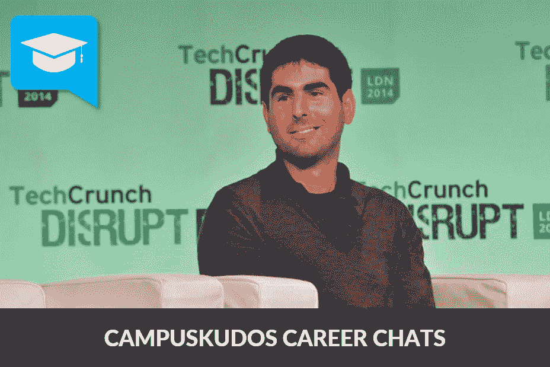
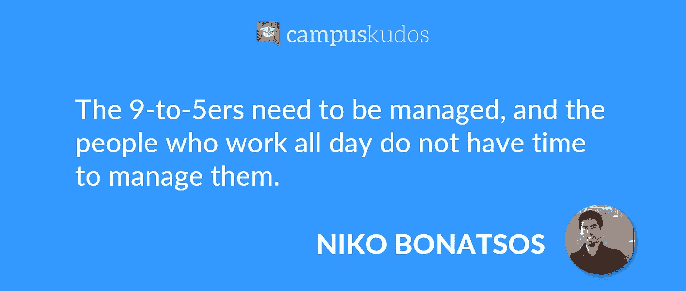
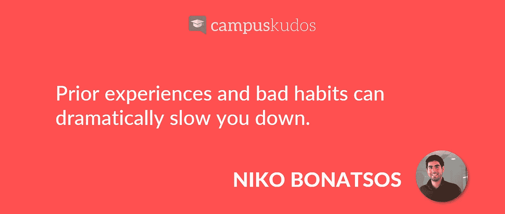
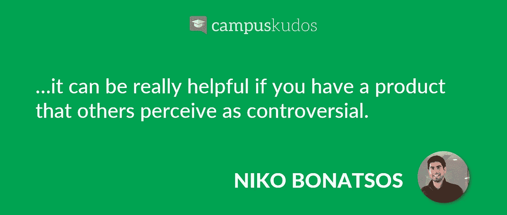
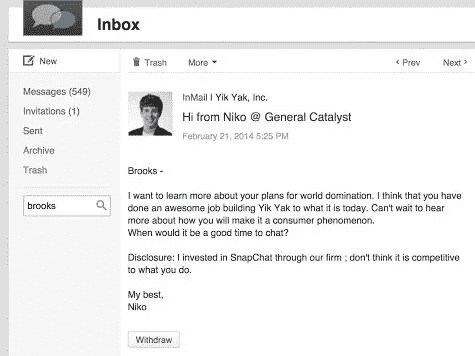
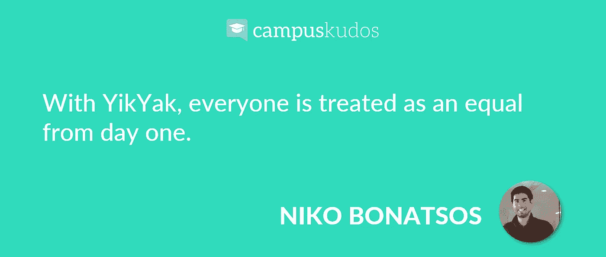
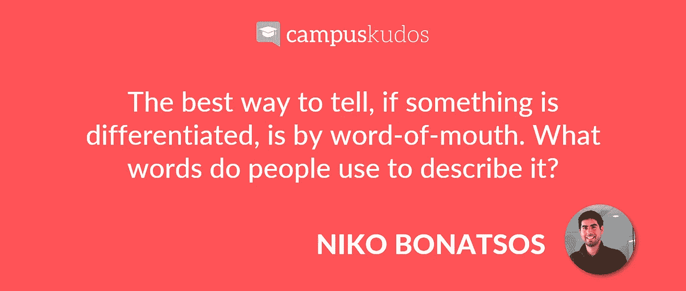
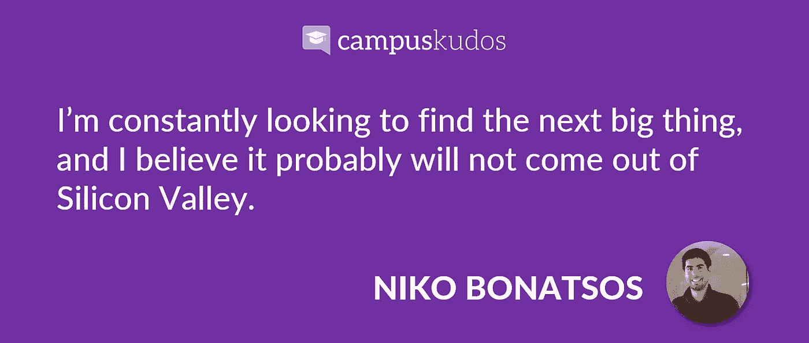

# YikYak 的投资人 Niko Bonatsos 爱死你这种烦人的 App 和缺乏经验

> 原文：<https://medium.com/hackernoon/yikyak-s-investor-niko-bonatsos-loves-your-annoying-app-and-lack-of-experience-7c428cd1e951>

Niko Bonatsos 是硅谷最成功的风险投资家之一。粗略浏览一下他在 LinkedIn 上的个人资料，你会发现他可能不是你所期待的典型投资者。为什么？他喜欢和第一次创业的人一起工作，而不是和那些有着丰富履历的人一起工作，坦率地说，他不在乎你是否上过斯坦福这样的学校。

公平地说，他有识别下一件大事的天赋。他的反向投资理念和对投资“烦人且有争议”的应用的热爱，让他找到了 YikYak 的 Brooks Buffington 和 Snapchat 的埃文·斯皮格尔，当时其他人可能会把他们各自的应用视为时尚。

很难对他的方法提出异议。在与 Niko 的聊天中，你会感觉到他也关心与他一起工作的创始人。这不仅仅是为了赚钱。他一直处于他们的地位。他同情他们的斗争。

Niko 很友好地在 CampusKudos 和我们聊了聊他自己的创业失败，是什么让他投资 YikYak 等等。

# 你可以在这里 听完整场 [**。**](https://www.campuskudos.com/post/463)

以下是我们谈话的一些亮点，为了简洁明了，我们对其进行了编辑和解释。

***能否介绍一下你的第一家创业公司 myLinkPower？为什么没有成功？如果是你的第一次创业，你会有什么不同的做法？***

当时，当 LinkedIn 在 2009 年末发布其 API 时，我们认为我们正在抓住一个千载难逢的机会，成为首批建立在 LinkedIn 平台之上的团队之一。

我们的目标是为 LinkedIn 上的超级用户建立一个网络——帮助他们更容易地联系。

它没有成功。这是一个巨大的失败。没有成功的原因有两个。

1.  在别人的平台上构建是一个巨大的错误。平台风险是毁灭性的。使用 LinkedIn 数据的规则非常严格。如今，LinkedIn 几乎完全禁止其他开发者访问其数据。
2.  我们有一个文化问题。我们雇佣了两种人——拼命工作的人和每周工作 40 小时的人。在早期阶段，你不能拥有后者。朝九晚五的人需要管理，整天工作的人没有时间管理他们。这可能会打击士气。

你提到你喜欢和初次创业者一起工作。我已经习惯于听到风投更喜欢和有着良好记录的创始人合作。你能告诉我们为什么吗？

我喜欢和第一次创业的人一起工作，原因有很多。

他们没有任何遗产或包袱。这在消费者领域尤其重要，因为很难预测下一件大事会是什么。先前的经历和坏习惯会大大降低你的速度。很多时候，你可能缺乏创造力、想象力和自由精神去想象“新的新”你必须疯狂地实验，直到你偶然发现它。

我喜欢和第一次创业的人一起工作，他们正在学习动物，几年后就会成为领域专家。他们热衷于以自己的方式取得成功，并解决特定的问题。我很享受这一点，并尽力与这些类型的年轻创业者合作。

我听说你喜欢投资那些刚推出就被认为愚蠢、可笑、有争议甚至令人讨厌的早期产品。人们不会想到会读到这些话。你能详细说明你的意思吗？

在消费产品领域，很难为新产品创造知名度。如果你必须自己创造意识，这可能会非常昂贵。如果你是第一次创业，你可能缺乏资源和关注你的人。因此，如果你有一个别人认为有争议的产品，这真的很有帮助。

如果有争议，他们会开始谈论它。如果他们开始和朋友谈论这件事，媒体会知道的。如果媒体听说了，他们会写一篇报道。如果真的有争议，头条会更多。标题越多，用户越多。随着更多用户的出现，随着更多主流用例的出现，该产品将变得不那么有争议。

有了这些，公司就有机会筹集资金，并获得资源来推动进一步的采用。

***这是你个人投资 YikYak 的一个很好的开端。你是怎么和伊克亚克的布鲁克斯·巴芬顿联系上的？***

我在 YikYak 团队很早的时候就认识了他们，当时只有几万用户。我只是通过搜索应用程序商店发现了这个应用程序。我偶然发现了 YikYak，并决定给他们的创始人之一 Brooks 发封邮件。

Niko’s first email to Brooks at YikYak

当我们开始交谈时，真正给我留下深刻印象的是，我们第一次聊天时，布鲁克斯正在讲笑话。他一点也不紧张。他非常真实，他分享了令人印象深刻的见解和衡量标准。

所以，我让布鲁克斯和泰勒飞到加利福尼亚来见我。当我们见面时，这款应用已经在一些高中和大学校园里受到了欢迎。

有三件事真正打动了我。

1.  我喜欢泰勒的一些见解。泰勒断言，在社交媒体的历史上，同样的人创造了大多数内容，获得了所有的“喜欢”。每个人都想成为那样的人，如果你不是其中之一，你会觉得分享和创造内容很尴尬。有了 YikYak，每个人从第一天起就被平等对待。这是真的，因为每个用户都是匿名的。
2.  大学生的参与程度令人印象深刻。大学生每周花大量时间使用该产品。学生们实际上是在请求增加 feed 的大小，这样他们就不必熬夜滚动来跟上每篇文章。
3.  布鲁克斯和泰勒是真诚的好人。他们非常认真地阻止不良行为的发生。

尽管高中学生占 YikYak 增长的 80-90 %, Brooks 和 Tyler 决定基本上禁止他们所有的高中用户。大学生对于如何使用该产品显然更加成熟。

# 这是一个非常大胆的举动。

今天，YikYak 在美国的大学生中是一个家喻户晓的名字。这是大学生在校园里了解周围发生的事情的方式。这是一个必不可少的信息来源。

***如何确定哪些 app 是 BS 或者是 Snapchat 这样的下一个大消费产品？当其他人可能认为 Snapchat 是一种时尚时，一般的 Catalyst 团队在 Snapchat 中看到了什么？***

这是几个因素的结合。

首先，如果产品已经发布，我们将深入研究指标。有没有比我们之前在市场上看到的任何东西都好十倍的东西？我们还会花更多的时间在特定的产品和公司上。

其次，我们评估产品是否与众不同。我们不是从风投的角度来看待这个问题，因为我们倾向于成为早期采用者，每周会看到数百种产品，而是从一个典型消费者的角度来看待这个问题。如果某样东西与众不同，那么最好的辨别方式就是通过口口相传。人们用什么词来描述公司或产品？他们会兴奋吗？情感订婚？这些都是产品差异化的信号。

第三，我们寻找特殊的创始人。虽然 Snapchat 的 Evan 无法预见自拍革命，但他展示了一个令人印象深刻的愿景，即打造最快的相机应用。他想建立一个更人性化的交流平台。只需轻轻一拍，你就可以立刻传达你的位置和你的感受。此外，十秒钟后，它就像我们通常的交流方式一样消失了。这与社交媒体中的其他事物不同，在社交媒体中，事情会留下痕迹并继续存在。

***你在你的 LinkedIn 上提到，“天赋是通用的，但机会不是。”我们如何让机会变得普遍？***

在互联网时代，获取知识比以往任何时候都容易。任何有互联网连接的人都可以获得人类的所有知识。

对我来说，我一直在寻找下一个大事件，我相信它可能不会来自硅谷。因此，我总是浏览应用商店，阅读许多不同的文章。我个人每周与来自世界各地的人进行大约十次 Skype 通话。

如果你真的对从事某项工作感到兴奋，并且你做了一点内容创作或有一个在线存在，机会就会来到你的面前。

## 查看[CampusKudos.com](http://www.campuskudos.com)与令人惊叹的专业人士会面，查看其他与[希滕·沙阿](https://www.campuskudos.com/post/446)和更多人的播客。

## 如果这篇文章有趣，请推荐或分享:)