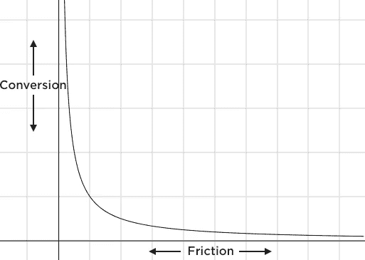
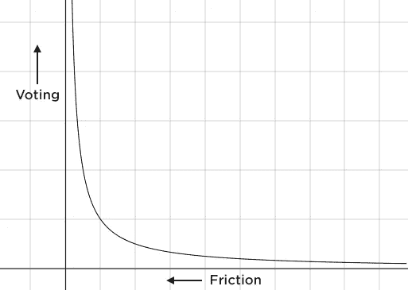
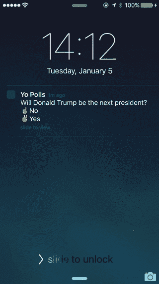
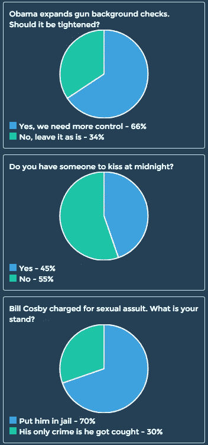

# Yo 民调—实时无摩擦民调

> 原文：<https://medium.com/hackernoon/yo-polls-real-time-frictionless-polls-e790cdb60371>

## 繁琐流程的无摩擦解决方案

Yo 旨在简化沟通。在这个新的实验产品中，我们致力于消除投票中的摩擦。消除摩擦意味着更多的交易:

Lower Friction -> Higher Conversion = More Transactions

民意调查领域确实存在一个问题。回复率正在下降，一方面是因为生活更加繁忙，流动性更大，另一方面是因为科技让人们更容易忽略来自未知电话号码的电话。

正如 Slate 指出的，“[如果这样的民意调查没有触及到民众中有代表性的部分，就很难知道该相信什么。](http://www.slate.com/articles/news_and_politics/politics/2012/05/survey_bias_how_can_we_trust_opinion_polls_when_so_few_people_respond_.html)

但是如果我们减少回复民意调查的障碍会怎么样呢？

Hypothesis

随着技术的进步，我们有更多的方式来执行我们多年来一直在做的事情，如投票。今天，在 iOS 8 发布一年多后，我们提出了第一个允许参与投票的解决方案，甚至不必解锁你的手机。

*iOS 8 introduced* [*Interactive Notifications*](http://techcrunch.com/2014/06/02/actionable-push-notifications/)*. One can swipe the notification and reveal 2 buttons.*

Yo Polls 是一款[隐形应用](http://techcrunch.com/2014/05/15/foursquares-swarm-and-the-rise-of-the-invisible-app/)，使用时无需打开应用，互动是通过互动通知进行的。

参与民意调查的摩擦是最小的。大约需要 4 秒钟。这让我们在 ***实时*** 获得了很高的响应率。

## 某个时间点的民意快照。

“A real time pulse of what is going through the nation’s head” — Jay Z

*   请点击此处查看民调哟:[*http://yopolls.co*](http://polls.justyo.co)
*   业务查询:[polls@justyo.co](mailto:polls@justyo.co)

感谢马特·哈特曼对这篇文章的贡献。

> 黑客中午是黑客如何开始他们的下午。我们是这个家庭的一员。我们现在[接受投稿](http://bit.ly/hackernoonsubmission)并乐意[讨论广告&赞助](mailto:partners@amipublications.com)机会。
> 
> 如果你喜欢这个故事，我们推荐你阅读我们的[最新科技故事](http://bit.ly/hackernoonlatestt)和[趋势科技故事](https://hackernoon.com/trending)。直到下一次，不要把世界的现实想当然！

