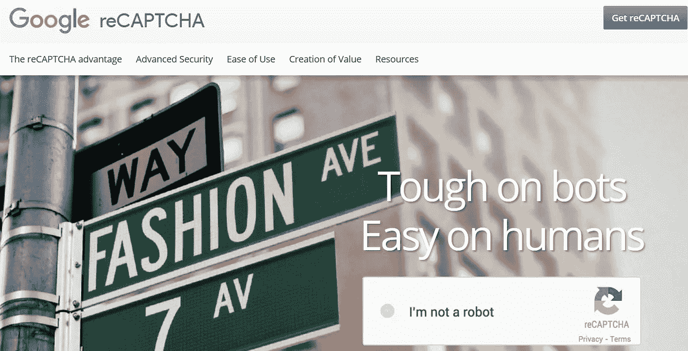
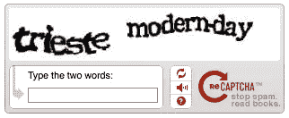
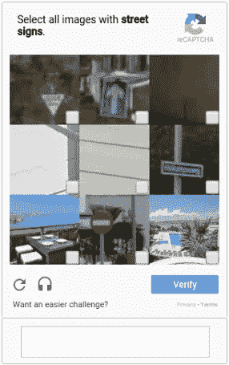

# 你正在建造一个无人驾驶的人工智能，而你对此一无所知

> 原文：<https://medium.com/hackernoon/you-are-building-a-self-driving-ai-without-even-knowing-about-it-62fadbfa5fdf>

我们都熟悉谷歌的 [reCAPTCHA](https://hackernoon.com/tagged/recaptcha) ，这是一个旨在将我们与机器区分开来的小测试。对于我们中的许多人来说，reCAPTCHA 挑战采取了两个乱码的形式，我们被要求破译这两个字，然后才能访问一个网页。[谷歌](https://hackernoon.com/tagged/google)在他们开始探索扫描世界上每一本书的 3 年后发布了它。他们使用了一种复杂的 OCR 技术来完成这一壮举，但是它并不完美。人们可能会怀疑在自动转录过程中有许多小错误，让人们仔细阅读文本来寻找错误是不切实际的。也是在那个时候，机器人开始变得令人讨厌，区分真正的用户和机器人的需要变得很明显。

reCAPTCHA 最初是由卡内基梅隆大学的学生开发的，后来被谷歌收购。这个想法很简单，他们把一个已知单词的图片和一个未知单词的图片分别展示给用户，让他们抄写。一旦许多人解决了这个难题，他们就会接受这个词。

reCAPTCHA v1

这就是他们如何让许多人免费抄写书籍和报纸。当然，不是每个人都高兴，有些人甚至走得更远[起诉谷歌](http://www.bizjournals.com/boston/blog/techflash/2015/01/massachusetts-womans-lawsuit-accuses-google-of.html)，理由是他们使用免费劳动力。这不是唯一的问题，随着 OCR 技术变得更好，机器人能够以 99%的准确率解决 reCAPTCHAs 问题。所以谷歌对它进行了迭代，现在我们有了一个新的 noCAPTCHA reCAPCTHA，它要求用户从 9 张图片中识别特定的图片。

noCAPTCH reCAPTCHA

最初的图像是门牌号，大概是为了帮助谷歌地图在街景中查找地址。然而，最近大多数图像是街道标志(偶尔有店面图像)。这让我相信，我们目前都在教我们未来的司机驾驶的基础知识；街道标志。谁知道接下来会发生什么？也许我们将不得不识别潜在的危险？

> [黑客中午](http://bit.ly/Hackernoon)是黑客如何开始他们的下午。我们是 [@AMI](http://bit.ly/atAMIatAMI) 家庭的一员。我们现在[接受投稿](http://bit.ly/hackernoonsubmission)，并乐意[讨论广告&赞助](mailto:partners@amipublications.com)机会。
> 
> 如果你喜欢这个故事，我们推荐你阅读我们的[最新科技故事](http://bit.ly/hackernoonlatestt)和[趋势科技故事](https://hackernoon.com/trending)。直到下一次，不要把世界的现实想当然！

