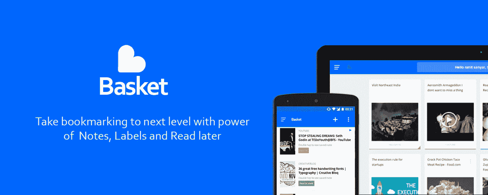

# 您将再次开始添加书签

> 原文：<https://medium.com/hackernoon/you-are-going-to-start-bookmarking-again-23f247173a32>

人们从很久以前就开始标记链接。然后智能手机上出现了一些 Read later 应用程序。但是仍然缺乏的是在你需要的时候正确地访问你的内容，并且消除这样的可能性:尽管你保存了一些东西，但是在一段时间之后仍然要花很大的力气去寻找它。然而，一切都以简单而轻松的方式进行。

[*购物篮*](https://www.basketapp.net) *是让您保存的内容发挥最大生产力的关键。*

在编码、阅读新闻或只是为了打发时间的时候，为你的演示收集资源或学习新技巧，每天我们都会遇到稍后需要的信息。篮子是你保存它们的最佳地方，当你需要的时候就能找到，即使是在*谷歌*里。

# 引入购物篮

## 用你收集的知识做更多的事情

## 添加笔记的力量

稍微调整了一下食谱，需要保留额外的信息吗？或者需要针对您的旅行目的地的文章保存一些规划细节？瞧啊。只需对照篮子里的东西做笔记。

## 适合你工作方式的组织

我们都喜欢保持自己的风格。篮子给你完全的控制权，并在你需要的时候帮你找到它们。在类别中保存项目。添加适合你工作风格的标签。调整标题。*它是你的购物篮，按照你喜欢的方式整理*。

## 在 Google 中查找

当你在谷歌上搜索任何话题时，如果你已经保存了某个内容，它会出现在最上面。[让我们的 chrome 扩展来帮你吧。](https://chrome.google.com/webstore/detail/put-in-basket/eblfjognkmbgmhfnkekoibgmohnhcbel)

*搜索少，查找快，节省时间。*

## 稍后阅读

无论是在你的手机里还是在你的浏览器里，Basket 都可以让你以后阅读你的文章。在旅途中阅读文章，或者晚上躺在沙发上休息，有了这个篮子，你的文章将永远是可用的，甚至是*离线。*

# 告诉我们进展如何？

我们刚刚开始我们的旅程，并在未来几天计划为您提供更多平台的篮子。我们正在努力开发新功能和改进，以提高您的工作效率。

# [在这里为你的篮子报名](https://www.basketapp.net/?utm_source=Medium&utm_medium=social&utm_campaign=StartBookmarking)😊

***点击*向您的朋友介绍我们💚巴顿风箱。**

我们一直在倾听您的反馈。只需[邮件我们](mailto:connect@basketapp.net)或者联系**[*@ Twitter*](https://www.twitter.com/connectbasket)*。***

**[新闻包](https://www.dropbox.com/sh/drztmwg9kk5hewk/AABSIOqL9-fM556n9ZLDuJUDa?dl=0)**

************

> **[黑客中午](http://bit.ly/Hackernoon)是黑客如何开始他们的下午。我们是 AMI 家庭的一员。我们现在[接受投稿](http://bit.ly/hackernoonsubmission)并乐意[讨论广告&赞助](mailto:partners@amipublications.com)机会。**
> 
> **如果你喜欢这个故事，我们推荐你阅读我们的[最新科技故事](http://bit.ly/hackernoonlatestt)和[趋势科技故事](https://hackernoon.com/trending)。直到下一次，不要把世界的现实想当然！**

****