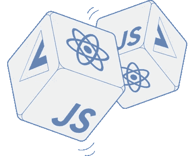

# 你要么掷骰子，要么做出深思熟虑的选择

> 原文：<https://medium.com/hackernoon/you-can-either-roll-the-dice-or-make-a-considered-choice-e2d1145bdb35>


> 在当前的 web 开发环境下，为你的项目选择正确的 JavaScript (JS)框架是一项艰巨的任务。有无限的可能性，每个框架都有自己的哲学来解决现代 web 开发带来的挑战。在本文中，我将通过比较两个框架 [**React**](https://reactjs.org/) **和** [**Vue**](https://vuejs.org/) **来讨论我们认为必不可少的特性。这些基本特性会因项目和个人偏好的不同而有很大差异，所以我建议您分析项目的需求和开发人员的偏好，并在此基础上做出决定。**



# **数据绑定**

数据绑定允许您将应用程序的逻辑连接到用户界面。它允许您在 HTML 模板中设置一个值，并在数据发生变化时自动更新该值。数据可以单向或双向绑定。单向数据绑定是指状态变化应该更新模板中的值。如果模板还应该能够改变状态值，例如，输入字段的值，那么就必须使用双向数据绑定。

## *普通 JavaScript*

在 HTML 元素中显示一个值，并在该值改变时立即更新显示，这在普通 JS 中很麻烦。这通常是使用观察者模式完成的，订阅数据更改并设置元素的值。奥斯汀·海德的这篇文章很好地解释了如何使用一个函数来实现这一点。但是，要将值绑定到您的接口，您需要执行一些额外的工作。您必须获取元素引用*(例如，通过使用 getElementById)* ，并调用函数来初始化绑定。

```
function bindValue(input, observable) {
  var initial = observable();
  input.value = initial;
  observable.subscribe(function(){ input.value = observable(); });var converter = function(v) { return v; };
  if (typeof initial == 'number') {
    converter = function(n){ return isNaN(n = parseFloat(n)) ? 0 : n; };
  }input.addEventListener('input', function() {
    observable(converter(input.value));
  });
}
```

## *做出反应*

在 React 中，数据只能单向流动:从父节点到子节点。这种方法导致母邦成为真理的来源。然而，许多应用程序在某些时候使用某种形式的双向数据绑定。这方面的一个例子是处理表单，在这种情况下，您通常希望用状态来表示输入的值。为了在 React 中实现这一点，您必须监听变更事件并通过回调函数更新状态。这需要您编写额外的代码和逻辑。

## *Vue*

Vue 提供了一组不同的数据绑定语法。最基本的方法是使用双花括号*(小胡子)*语法。默认情况下，这将以双向方式绑定数据，并将值解释为纯文本。在这些胡子里面，基本的 JS 表达式可以用来计算一个特定的值。但是，不能在属性中使用八字胡。为了解决这个问题，Vue 提供了一组所谓的指令。指令是唯一的属性，可用于指定 Vue 数据绑定的行为。例如，您可以添加 v-once 来设置单向数据绑定，v-html 将值解释为 html，或者使用 v-bind: < attr >将值绑定到指定的 HTML 属性。


# **语法**

所有的 JS 框架都必须符合标准的 JS 语法。然而，新版本推出的速度非常低，这意味着您通常无法使用最新的平台功能。为了解决这个问题，开发了像 Babel 这样的构建工具。这些工具允许您使用最新的语法开发应用程序，并将其转换为较旧的语法，以便与较旧的浏览器兼容。它们可以用于几乎所有的现代 web 开发框架，但是每个框架都引入了自己的语法来构建组件，例如，使用插件和模板。

## *反应过来*

最基本的 React 组件由一个带有呈现功能的 ES6 类组成。render 函数返回 JSX *(向 JavaScript 添加 XML 语法的预处理步骤)*，然后以 HTML 的形式呈现在屏幕上。每个组件都可以访问一组生命周期回调，以便能够挂钩到 React 生命周期，并在元素进入生命周期中的特定步骤时执行特定任务。

```
class Welcome extends React.Component {
  constructor(props) {
    super(props);//Set the initial state of the component
    this.state = {
      variable: "Hello World!",
      clicked: false
    }
  }

  //On click handler for the button
  onClick() {
    this.setState({
      clicked: true
    });
  }//The render function containing the template
  render() {
    return (
      <div>
        //Only show the text if the button has been clicked.
        {this.state.clicked &&
          <div>{this.state.variable}</div>
        }

        <button onClick={this.onClick.bind(this)}>Click me!</button>
      </div>
    );
  }
}
```

## *Vue*

创建 Vue 组件的语法非常简单。您可以创建一个. vue 文件，其中包含一个由<template></template>

```
<template>
    <!-- Only show the text if the button has been clicked. -->
    <div v-if="clicked">{{variable}}</div>
    <button v-on:click="onClick">Click me</button>
</template><script>
    //Decorator to be able to use the ES6 class syntax
    [@Component](http://twitter.com/Component)  
    export default class HelloWorld extends Vue {
        //Name of the component
        name = 'HelloWorld';// A variable containing an arbitrary value
        variable = "Hello World!";//True if the button has been clicked
        clicked = false;//On click handler for the button
        onClick() {
          this.clicked = true;
        }
    }
</script>
```

# **到期日**

根据您的用例，框架的成熟度可能是至关重要的。对于个人项目来说，没那么重要。使用您想了解更多或感兴趣的任何内容。然而，对于生产应用程序来说，更重要的是知道一个框架更成熟一点，以减少破坏变更或缺乏开发团队承诺的机会。围绕一个框架的社区通常会随着成熟而增加，从而产生一个包含组件、库、插件和 bug 解决方案的广泛知识库。所有这些都让开发体验变得更加愉快。

# **结论**

根据项目的需求和规范，应该选择什么样的框架可能会有很大的不同。如果您的 web 应用程序需要一个单一的特性(例如，您只需要数据绑定),那么 Vanilla JavaScript 是最好的。它使您的代码库保持较小，并限制了依赖项的数量。这反过来降低了进入 JavaScript 依赖地狱的可能性。然而，如果您想构建一个成熟的渐进式 web 应用程序或单页应用程序，使用普通 Javascript 创建它需要做大量的额外工作。在这种情况下，选择一个已经提供了您可能需要的所有特性的框架是理想的，因为您可以开始构建使您的项目独一无二的功能。

*然而，对于应该使用什么样的框架，并没有单一的答案。如前所述，这很大程度上取决于你的项目，所以这是一个只有你能回答的问题。*


By Rick. Rick is a developer at El Niño who is passionate about Android and always makes considered choices.